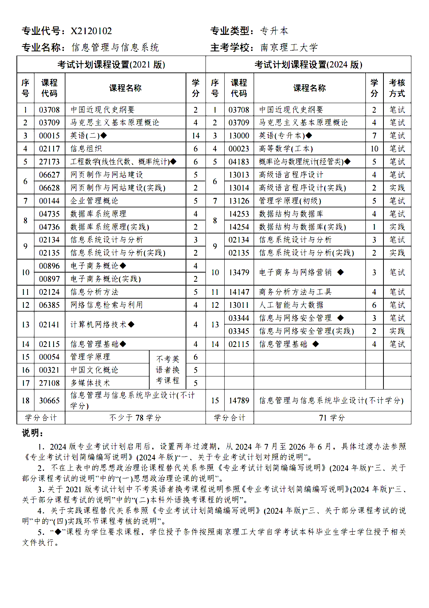

# 自学考试

## X2120102 信息管理与信息系统（2021-2027）

### 一、考试计划表

### 二、成绩绩点对应表

| 百分制成绩 | 成绩等级 | 绩点 |
| :-: | -- | -: |
| 90 ~ 100 | A（优秀） | 4.0 |
| 85 ~ 89.5 | A- | 3.7 |
| 82 ~ 84.5 | B+ | 3.3 |
| 78 ~ 81.5 | B（良好） | 3.0 |
| 75 ~ 77.5 | B- | 2.7 |
| 72 ~ 74.5 | C+ | 2.3 |
| 68 ~ 71.5 | C（中等） | 2.0 |
| 64 ~ 67.5 | C- | 1.5 |
| 60 ~ 63.5 | D（合格） | 1.0 |
| < 60 | F（不合格） | 0 |

### 三、考试记录表

| 序号 | 时间 | 课程 | 报考费 | 成绩 | 绩点 | 学分 | 学分绩点 |
| :-: | -- | -- | -: | -: | -: | -: | -: |
| 01 | 2022-07-02 AM | 06627 网页制作与网站建设 | ￥100 | 99 | 4.0 | 5 | 20.0 |
| 02 | 2022-07-02 PM | 06385 网络信息检索与利用 | ￥100 | 92 | 4.0 | 4 | 16.0 |
| 03 | 2022-10-22 AM | 03709 马克思主义基本原理概论 | ￥43 | 73 | 2.3 | 4 | 9.2 |
| 04 | 2022-10-22 PM | 04735 数据库系统原理 | ￥43 | 69 | 2.0 | 4 | 8.0 |
| 05 | 2022-10-23 AM | 03708 中国近现代史纲要 | ￥43 | 62 | 1.0 | 2 | 2.0 |
| 06 | 2022-10-23 PM | 00144 企业管理概论 | ￥43 | 60 | 1.0 | 5 | 5.0 |
| 07 | 2023-01-07 AM | <s>02134 信息系统设计与分析</s> | ￥100 | <s>弃考</s> | - | - | - |
| 08 | 2023-01-08 PM | <s>02117 信息组织<s> | ￥100 | <s>弃考</s> | - | - | - |
| 09 | 2023-04-16 AM | 02141 计算机网络技术 ◆ | ￥43 | 75 | 2.7 | 4 | 10.8 |
| 10 | 2023-04-16 PM | 00896 电子商务概论 ◆ | ￥43 | 80 | 3.0 | 4 | 12 |
| 11 | 2023-07-02 AM | <s>02115 信息管理基础 ◆</s> | ￥100 | <s>54</s> | - | - | - |
| 12 | 2023-10-28 AM | <s>02134 信息系统设计与分析</s> | ￥43 | <s>弃考</s> | - | - | - |
| 13 | 2023-10-29 AM | <s>02117 信息组织</s> | ￥43 | <s>弃考</s> | - | - | - |
| 14 | 2023-10-29 PM | 00015 英语（二） ◆ | ￥43 | 83 | 3.3 | 10+4 | 13.2 |
| 15 | 2024-01-06 AM | 02134 信息系统设计与分析 | ￥100 | 66 | 1.5 | 3 | 4.5 |
| 16 | 2024-01-07 PM | 02117 信息组织 | ￥100 | 73 | 2.3 | 6 | 13.8 |
| 17 | 2024-04-13 AM | 02124 信息分析方法 | ￥43 | 64 | 1.5 | 5 | 7.5 |
| 18 | 2024-04-14 AM | <s>02115 信息管理基础 ◆</s> | ￥43 | <s>49</s> | - | - | - |
| 19 | 2024-07-07 AM | <s>02115 信息管理基础 ◆</s> | ￥100 | <s>14</s> | - | - | - |
| 20 | 2024-10-26 AM | <s>04183 概率论与数理统计 ◆</s> | ￥43 | <s>26</s> | - | - | - |
| 21 | 2025-04-12 AM | <s>04183 概率论与数理统计 ◆</s> | ￥43 | <s>弃考</s> | - | - | - |
| 22 | 2025-04-13 AM | <s>02115 信息管理基础 ◆</s> | ￥43 | <s>15</s> | - | - | - |
| 23 | 2025-07 | 02115 信息管理基础 ◆ | | | | (4) | |
| 24 | 2025-10 | 04183 概率论与数理统计 ◆ | | | | (6) | |
| 25 | 2025 | 02135 信息系统设计与分析 ★ | | | | | |
| 26 | 2025 | 14254 数据结构与数据库 ★ | | | | | |
| 27 | 2025 | 13014 高级语言程序设计 ★ | | | | | |
| 28 | 2025 | 14789 毕业设计 | | | | | |
| <b>合计</b> | | ◆ | | | | <b>12</b> | <b>36</b> |
| <b>合计</b> | | | <b>￥1,402</b> | | | <b>50</b> | <b>122</b> |

◆ 学位课程&emsp;★ 实践课程

- 平均学分绩点：122 / 50 = **2.44**
- 学位课程平均学分绩点：36 / 12 = **3**

### 四、费用表

| 日期 | 项目 | 渠道 | 数量 | 课程代码 | 金额 |
| -- | -- | -- | -: | -- | -: |
2021-05-17 | 教材 | 某鱼 | 14 | ~ | ￥162.00
2021-05-21 | 试卷 | 某宝 | 3 | 00015, 03708, 03709 | ￥36.30
2021-11-30 | 试卷 | 某宝 | 1 | 02141 | ￥10.70
2022-02-23 | 教材 | 某宝 | 1 | 06627 | ￥42.00
2022-03-01 | 报考 2022.4 | 考试院 | 4 |  <s>00015, 03708, 03709, 02141 (疫情取消)</s> | <s>￥172.00</s>
2022-05-25 | 报考 2022.7 | 考试院 | 2 | 06627, 06385 | ￥200.00
2022-09-01 | 报考 2022.10 | 考试院 | 4 | 03708, 03709, 04735, 00144 | ￥172.00
2022-10-26 | 教材 | 某夫子 | 2 | 02117, 02134 | ￥18.09
2022-11-26 | 教材 | 某夕夕 | 1 | 02115 | ￥17.00
2022-12-01 | 报考 2023.1 | 考试院 | 2 | 02134, 02117 | ￥200.00
2023-03-01 | 报考 2023.4 | 考试院 | 2 | 02141, 00896 | ￥86.00
2023-05-26 | 报考 2023.7 | 考试院 | 1 | 02115 | ￥100.00
2023-07-21 | 试卷 | 某宝 | 2 | 27173 (02197, 02198) | ￥28.60
2023-09-01 | 报考 2023.10 | 考试院 | 3 | 02134, 02117, 00015 | ￥129.00
2023-12-01 | 报考 2024.1 | 考试院 | 2 | 02134, 02117 | ￥200.00
2024-03-01 | 报考 2024.4 | 考试院 | 2 | 02115, 02124 | ￥86.00
2024-04-06 | 计算器 | 某东 | 1 | 02124 | ￥67.80
2024-05-20 | 教材 | 某夕夕 | 1 | 04183 | ￥15.80
2024-05-20 | 试卷 | 某宝 | 1 | 04183 | ￥14.30
2024-05-25 | 报考 2024.7 | 考试院 | 1 | 02115 | ￥100.00
2024-09-01 | 报考 2024.10 | 考试院 | 1 | 04183 | ￥43.00
2025-03-01 | 报考 2025.4 | 考试院 | 2 | 02115, 04183 | ￥86.00
| <b>合计</b> | | | | | <b>￥1,814.59</b>

### 五、剩余计划表

| 计划 |
| -- |
| 信息管理基础
| 概率论与数理统计
| 实践论文报考
| 实践论文报考审核结果
| 实践论文成绩查询，毕业申请
| 领取毕业证书，学位申请
| 领取学位证书
