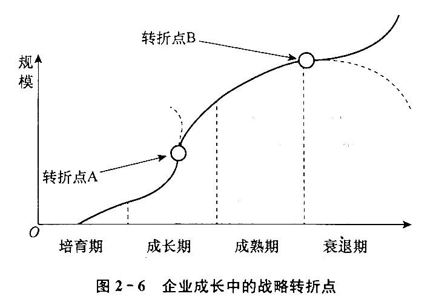
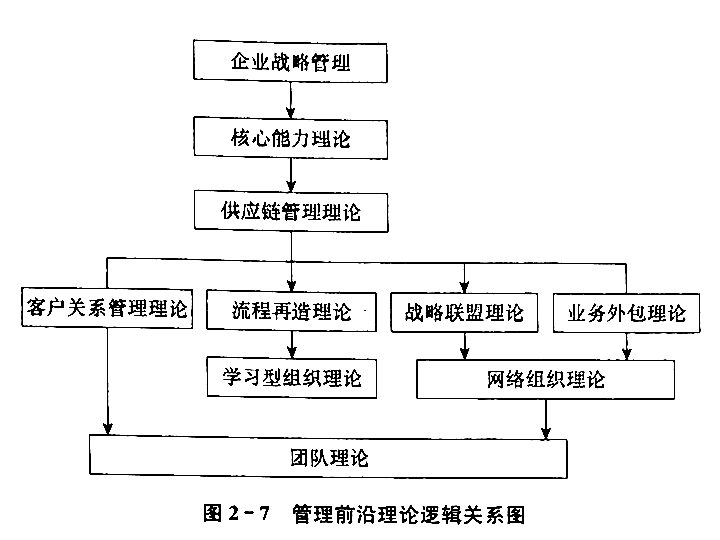

# 第二章 企业管理的基本理论

## 第一节 管理、管理者与管理职能

### 一、管理

管理是管理者通过计划、组织、激励、协调、控制等职能，为集体活动配置资源、建立秩序、营造氛围，以达成预定目标的行为

两个方面

#### 1.管理的目的

- 人们都必须依赖协作才能满足自身需要
- 管理是集体努力产生协作效果的必要条件
- 管理的价值就体现在有助于达成分散个体达不到的目标，满足个人努力无法满足的需要

#### 2.管理的任务

三个基本条件：

1. 资源配置必领是合理、优化的
2. 集体活动必须是有序的，做到分工合作、令行禁止
3. 集体活动的氛围应当是有利于促进合作奋斗和富有激励性的

三项任务：

1. 实现企业的经济利益：降本增效
2. 使企业有活力，员工有成就
3. 履行社会责任：自然、社会

### 二、管理者

组织中行使管理职能，通过协调他人的活动以实现组织目标的人

#### 1.管理者的类型

1. 按管理者所处层次划分
  - 高层管理者：是企业管理体系中最重要的组成部分，处于统帅地位，如董事会主席、首席执行官、总裁或总经理
  - 中层管理者：负责制订具体的计划，对某一部门或某一方面负有责任，如部门主任、科室主管、项目经理、地区经理、产品经理
  - 基层管理者：一线管理者，如工段主管、护士长

2. 按管理者所从事管理工作的领域划分
  - 综合管理者：全能管理者，如公司的,总经理、事业部经理
  - 专业管理者：人力资源管理人员、营销管理人员、财务管理人员

#### 2.管理者的角色

处于组织中某一位置的人所需要做的一系列特定的任务

1. 人际关系方面的角色
  - 首脑：象征性的
  - 领导者：激励员工
  - 联络者：交流沟通

2. 信息传递方面的角色
  - 监听者：获取信息
  - 传播者：传递信息
  - 发言人：向外界发布信息

3. 决策制定方面的角色
  - 企业家：利用外部机会，开发开拓
  - 驾驭者：调解纷争
  - 资源分配者：组织人、物、财、信息各种资源
  - 谈判者：商定谈判

知识经济大潮中：学习者、掌握者、知识资本挖掘者

#### 3.管理者的技能

1. 技术技能：对于基层管理者最重要
2. 人际技能：有效管理者的突出特征之一
3. 概念技能：对于高层管理者最重要

### 三、管理职能

基本的管理职能包括计划、组织、领导和控制

1. 计划：是首要职能
2. 组织：为计划的完成提供组织上的保证
3. 领导：人才是企业最宝贵的资源，是企业兴旺发达之本
3. 控制：是保证目标能按计划实现所必不可少的职能，无效的控制会导致计划无效、组织无效
  - 作业控制
  - 质量控制
  - 成本控制
  - 库存控制
  - 资金控制

## 第二节 企业管理方法

### 一、企业管理的方法论

#### 1.系统论观点

包括自然系统、人造系统

人造系统特征：

1. 螫体性
  - 由两个以上相互区别的要素组成的一个整体，所以它才具有每一个要素在孤立状态下都不具有的功能
  - 整体大于部分之和：1 + 1 > 2

2. 相关性
  - 系统论强调整体与局部、局部与局部、系统本身与外部环境之间互为依存、相互影响和制约的关系
  - 各个组成要素是互相作用、相互依存的，从而形成带有一定层次性的复杂结构

3. 目的性
  - 只要是人造系统，都具有一定的目的

4. 环境适应性
  - 环境是一个系统所从属的更高一级的系统，任何系统均必须适应所处环境的要求和变化，否则便不能生存和发展

#### 2.信息论观点

- 系统正是通过获取、传递、加工与处理信息而实现其有目的的运动的
- 信息用来减少和消除人们对于事物认识的不确定性
- 信息是一切系统保持一定结构、实现其功能的基础
- 信息的价值在于利用

#### 3.控制论观点

控制论主要是通过研究系统的状态、功能、行为方式及变动趋势，调节与控制复杂的系统，使其按照预定的目标稳定运行

控制功能发挥作用，必须具备两个前提条件：

1. 明确的检验标准：明确、全面和具体
2. 做好信息反馈：考察、衡量，并对偏差采取纠正措施

### 二、企业管理的一般方法

1. 行政方法：命令、指示、规定，具有强制性
2. 经济方法：价格、工资、利润、奖金
3. 法律方法：国家法律、部门或地方法规

## 第三节 企业娈革与管理理论的发展

### 一、企业成长中的战略陷阱与转折点

#### 1.战略陷阱

企业周期：

1. 培育期
  - 初创企业要解决的首要问题不是成长而是生存问题
  - 初创期企业的重点是强调研发、重视市场、确保融资
  - 绝大都分项目都死在了 A 轮前，74% 死在 B 轮前

2. 成长期
  - 特点：
    - 企业主要目标是快速成长
    - 做大做强是企业发展的内在动力
    - 管理方式走向半职业化时期，外部职业经理人进入企业
    - 面对的主要问题是市场营销
    - 主要是业务停滞、机制不顺、队伍涣散、人才流失、资金紧张
    - 成功发展的主要因素是转型
  - 投资诱惑、盲目多元：**战略冒进陷阱**

3. 成熟期
  - 特点：
    - 企业走向职业化管理阶段
    - 形成企业核心竞争力是企业走向成熟的主要标志
    - 管理方式采用职业化的管理，企业文化在起着稳定剂作用
    - 面对的主要问题是技术（产品技术、市场技术、管理技术等）
    - 成功立足的主要因素有突破成长瓶颈（完善有效的运营机制），建立员工的激励机制、技术领先、融资渠道拓展
  - 价值误判：**战略保守陷阱**
  - 文化决定战略

4. 衰退期
  - 原因：
    - 某个关键人物 （如创业者等）的离去
    - 产品或服务市场的消亡
    - 技术落后
    - 自然老化
  - 特点：
    - 企业面临抉择，要么成为行业领袖，要么衰亡
    - 企业再造与创新成为企业再创辉煌的主要因素
    - 面对的主要问题是管理创新、把漏洞补好
    - 成功的主要因素有战略、变革、创新

#### 2.战略转折点

企业跳过陷阱的关键时点

### 二、企业变革中的陷阱

企业一般会经过五个典型的 “渐变阶段”，每个渐变阶段之后，都有一个激变的陷阱

1. 创业成长的“领导陷阱”
  - 原因：重视研发，忽略管理，理想化的事必躬亲
  - 办法：任用有才能的职业管理者，引进集权式的职能型组织机构

2. 集权成长的“本位陷阱”
  - 原因：规模扩大，中层、基层互相推诿
  - 办法：过成立事业部组织并给子产品事业部和地域事业部的管理者更多的权限

3. 分权成长的“失控陷阱”
  - 原因：总部缩小，群雄割据
  - 办法：强有力的经营资源配置与调整系统

4. 协调成长的“官僚主义陷阱”
  - 原因：谨言慎行，避开监管
  - 须重视用核心价值观、文化约束和人的自律性取代组织的正规控制系统

5. 互动成长的 “未知陷阱”：
  - 表象：心理饱和、缺乏创造力
  - 提倡：系统思考、创新思考

### 三、企业管理理论的发展

#### 1.管理前沿理论的整合

美国学者安索夫于 1976 年提出了企业战略管理的概念

战略管理理论要回答三个基本问题：

1. 组织竞争优势的源泉是什么？
2. 组织如何保持竞争优势？
3. 组织如何保持对环境的敏感性？

#### 2.流程再造理论

1. 企业流程再造提出的背景
  - 1993 年，美国学者迈克尔• 哈默和詹姆斯 • 钱皮的《企业再造工程》
  - 主要观点：
    - 对生产经营流程进行根本改造，由渐进性改良转变为激进式飞跃
    - 从产品导向转为顾客导向
    - 从职能导向转为流程导向
    - 从控制命令式转为横向协作式
    - 员工队伍从劳动专业化分工较为综合技能型分工

2. 企业流程再造的实施
  - 分析现有流程
  - 分析当前的市场需求
  - 采取综合措施，实施企业再造：局部改良、整体抛弃

#### 3.知识管理理论

1. 知识管理理论的提出与发展
  - 20 世纪 60 年代初，美国管理学教授彼得 • 德鲁克博士首先提出了知识工作者和知识管理的概念
  - 知识类型及其转化，四大类：
    - 事实知识：知道是什么，即知事（显性）
    - 原理知识：知道为什么，即知因（显性）
    - 技能知识：知道怎样做，即知窍（隐性）
    - 人力知识：知道谁有知识，即知人（隐性）

显性知识相对来说易于管理，而隐性知识则较难管理

- 知识共感化：隐性知识 > 隐性知识（知识增值）
  - 方式：观察、模仿和亲身实践
  - 技术：即时消息
  - 是通过语言文字之外的影响力，靠个体与个体的日常接触，潜移默化地形成企业组织的文化，形成企业组织独特的知识平台

- 知识显现化：隐性知识 > 显性知识
  - 方式：对话
  - 技术：专家系统、搜索引擎、全文检索
  - 是个体知识向组织知识转换的预备过程，形成具有传播可能性的新概念

- 知识关联化：显性知识 > 显性知识
  - 方式：培训、学习
  - 技术：知识库联网、内容管理
  - 是个体知识向组织知识转换的实施过程，形成由组织成员共享的系统知识

- 知识内溶化：显性知识 > 隐性知识
  - 方式：在工作中的体验
  - 技术：电子邮件、讨论组
  - 是组织知识向个体知识的转化，通过行为体验使他人的言传知识变为个人的技能知识

隐性知识正是一个人或一个企业组织的核心竞争力所在

只能靠积累、创新，很难从市场上或正式渠道取得

企业所需要的知识必须是能够商业化的知识，三部分：

1. 环境知识，是指市场情报、技术、政治因素、供应商关系、知识信息等方面的知识
2. 公司知识，是指那些像公司声望、品牌形象、广告和促销等内容构成的知识
3. 内部知识，是指公司文化、风气、数据、雇员等方面的知识

#### 4.知识管理的内容与技术

施乐公司知识管理十个方面：

1. 培养员工对知识和最佳业务经验共享的意识
2. 在企业内进行知识交流与共享责任的宣传
3. 积累和利用过去的经验，扩大企业的知识资源
4. 保证企业知识的生产以及知识资源的积累和扩大，并将其充分融人产品或服务及其生产过程和管理过程之中
5. 创造适宜的条件与环境，充分开发和有效利用企业知识资源，进行以创新为目的的知识生产
6. 驱动以创新为目的的知识生产
7. 建立知识网络（专家网络)，促进知识的交流与共享
8. 建立和挖掘客户的知识库
9. 理解并计量知识的价值
10. 利用知识资产

工具：

1. 办公自动化 OA
2. 企业信息门户 EIP
3. 商业智能 BI
4. 竞争情报

### 四、商业模式与创新

#### 1.商业模式及构成要素

回答核心问题：

1. 企业的顾客与市场在哪里？企业为这些顾客与市场提供什么样的产品和服务？
2. 企业如何从提供的产品与服务中取得收人、获得利润？
3. 企业为了提供价值、获收利润，如何构造其内部的各种活动以使其有机地联系起来？
4. 企业如何在资金与产品的生产、推广等方面与外界进行合作，促使企业进一步发展？

构成因素：

1. 产品与性能
2. 目标市场
3. 定价与收益
4. 市场推广
5. 生产方式
6. 外部合作

#### 2.研究商业模式的意义

1. 已经成为一种企业可操作的竞争工具，商业模式设计已经成为一种产权化的知识
2. 是企业管理决策的基本内容，并成为企业竞争实力的重要组成部分
3. 有助于企业更加深刻地认识自身情况，从而推动企业创新

#### 3.商业模式创新

1. 商业模式创新的概念与特点
  - 概念：
    - 商业模式创新是指企业创造价值的基本逻辑发生了根本性的变化
    - 把新的商业模式引入社会的生产体系，并为客户和自身创造价值
  - 特点：
    - 更注重从客户的角度思考设计企业的行为，视角更为外向和开放
    - 体现得更为系统与根本
    - 有可能开创新的产业领域

2. 商业模式创新的方式
  - 顾客需求的商业模式创新：星巴克，产品转服务
  - 产品/服务的商业模式创新：彩铃
  - 收入模式的商业模式创新：售后
  - 生产模式的商业模式创新：李维斯
  - 合作模式的商业模式创新：福特微信
