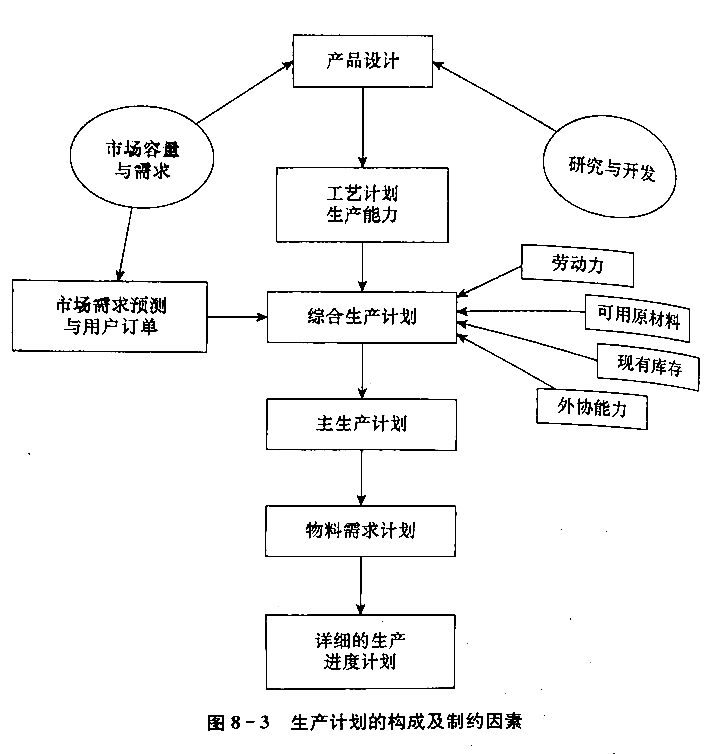
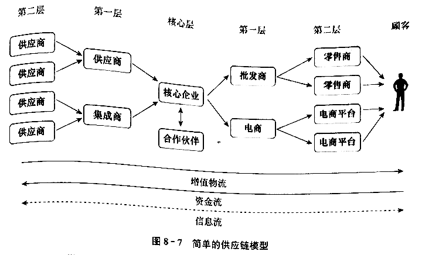

# 第八章 生产运营与供应链管理

## 第一节 生产运营管理的内容、问题与特点

### 一、生产运营管理概述

设计、运行和不断改进生产系统、作业系统及供应链，以创造出具有竞争优势的产品和服务的管理过程

过程：

1. 投入：人力、设备、物料、信息、技术、能源、土地等
2. 转换：物理、化学、空间
3. 产出：有形产品、无形服务

特征：

1. 需要投入一定的资源，经过一定的转换过程，才能得到其使用价值
2. 在转换过程中，需要投入一定的劳动来实现价值增值
3. 能够满定人们的某种需要，即具有一定的使用价值

包括：

1. 生产运营系统的设计管理
  - 产品和服务的选择和设计
  - 地点选择
  - 设施布置
  - 交付设计

2. 生产运营系统的运行管理
  - 计划
  - 组织
  - 控制

从本质上讲，生产运营管理的根本目标就是“在恰当的时候，以适宜的价格向顾客提供符合质量要求的、有价值的产品或服务

### 二、生产运营管理的基本问题

生产运营管理的基本问题包括：产出要素管理（本章主体）、资源要素管理、环境要素管理

1. 质量和可靠性
2. 成本
3. 交货时间
4. 服务
5. 环保

### 三、现代企业生产运营管理的新特点

范围广、客制化、信息化、全球化、联合化、绿色化

1. 现代生产运营管理的涵盖范围越来越广
2. 多品种小批量混合生产方式成为主流
3. 信息技术成为生产运营系统控制与管理的重要手段
4. 全球生产运营成为现代企业的重要课题和新热点
5. 跨企业边界的集成管理成为一种趋势
6. “绿色生产”成为生产运营管理所面临的新课题

## 第二节 生产运营过程的组织与分类

### 一、基本生产过程的组织

组成：

1. 准备过程
2. 基本生产过程（核心）
3. 辅助生产过程
4. 生产服务过程

形式：

1. 工艺专业化
  - 技照生产过程各个工艺阶段的特点设置生产单位的一方法和形式
  - 优点：
    - 专业，适应性强
    - 可靠性高
    - 便于技术管理、指导
    - 设备管理方便
  - 缺点：
    - 运输不便
    - 生产周期长
    - 协调难度

2. 对象专业化
  - 以产品（零件、部件）为对象设置生产单位
  - 优点：
    - 运输方便
    - 周期短
    - 采用专用设备、先进生产组织形式
    - 协调简单
  - 缺点：
    - 适应性差
    - 可靠性差
    - 设备管理复杂

对基本生产过程的运营管理改进是工作重点

- 计算机辅助制造（CAM）
- 柔性制造系统（FMF）
- 计算机辅助质量监控 （CAQC）
- 数控技术（NC）
- 准时制生产（JIT）

### 二、生产运营的分类

#### 1.制造性生产

1. 按加工或处理方式分类
  - 处理转换过程：流程型生产、连续性生产
  - 加工装配过程：离散性生产

| 特征 | 流程型 | 加工装配型 |
| -- | -- | -- |
顾客数量 | 少 | 多
品种 | 少 | 多
标准化 | 高 | 低
自动化 | 较高 | 较低
需求变化 | 稳定 | 不断变化
生产要素密集性 | 资本密集 | 人力、材料密集
物流流动 | 连续 | 断续
原材料品种 | 较少 | 多
能耗 | 高 | 低
产量柔性 | 低 | 高
产品结构柔性 | 低 | 高
设备布置柔性 | 较低 | 较高
设备布置集中度 | 集中 | 分散
生产能力核定 | 准确 | 模糊
周期 | 较长 | 较短
设备故障影响 | 大 | 一般
维修要求 | 极高 | 一般
协作关系 | 简单 | 复杂
在制品库存 | 低 | 高
产成品库存 | 高 | 低
收集信息 | 较容易 | 较难
举例 | 化工、炼油、制药 | 汽车制造

2. 按过程的流动结构或产品专业化程度分类
  - 加工车间
  - 批量流程
  - 流水线生产过程
    - 特点：连续固定生产、专业化程度高、统一节拍、生产力平衡、单向移动
    - 条件：产品稳定、大量需要、产品结构先进、原材料标准化、设备计划预修、随时检验
    - 优点：连续性、平行性、比例性、生产率高、简化管理
    - 缺点：不够灵活、调整难度大、工作单调
  - 连续流程

| 项目 | 大量大批生产 | 成批生产 | 单件小批生产 |
| -- | -- | -- | -- |
品种 | 单一、少 | 较多 | 多
产量 | 高 | 较高 | 低、单件
设备 | 专用、专业 | 专用、通用 | 通用
场地专业化 | 高 | 不高 | 低
工艺规程 | 详细 | 部分详细 | 简单
设备布置 | 对象专业化 | 对象、工艺专业化 | 工艺专业化
劳动分工 | 细 | 有一定分工 | 粗
工人技术要求 | 低 | 一般 | 较高
零件移动方式 | 平行或平行顺序 | 可能平行或平行顺序 | 顺序
效率 | 高 | 较高 | 低
生产计划安排 | 精确 | 较细致 | 粗略
生产过程管理 | 简单 | 较复杂 | 复杂
适应性 | 差 | 较差 | 强
品种更换 | 难 | 一般 | 容易
产品设计 | 标准化 | 标准化、系列化、通用化 | 独特
单位成本 | 低 | 较高 | 高
设备利用率 | 高 | 较高 | 低
追求目标 | 连续性 | 均衡性 | 柔性
周期 | 短 | 长短不一 | 长
效益 | 最好 | 较好 | 低
输入与输出 | 事先控制 | 基本控制 | 无法控制
举例 | 通用产品 | 机床、电机 | 重型机械、汽修

3. 按满足顾客需求的方式分类
  - 备货型生产
  - 订单型生产

| 项目 | 备货型生产 | 订单型生产 |
| -- | -- | -- |
产品 | 标准产品 | 定制产品
产品需求 | 可以预测 | 较难预测
价格 | 事先确定，可随市场调整 | 订货时间确定，一般不得调整
交货期 | 不重要，成品库随时供货 | 很重要，订货时确定
设备 | 专用高效设备 | 通用设备

#### 2.服务性生产

1. 特征
  - 无形性
  - 异质性或易变性
  - 不可分性
  - 时效性
  - 体验性

2. 类型
  - 按是否提供有形产品：
    - 纯劳务：咨询、法庭辩护
    - 一般劳务：零售、邮政、运输
  - 按顾客是否参与：
    - 参与：客运、理发
    - 不参与：洗衣、快递

3. 三种典型的服务系统
  - 流水作业模式
  - 顾客参与模式
  - 面对面的直接接触模式

### 三、企业运营能力与需求的匹配

#### 1.生产能力与需求的匹配

1. 生产能力
  - 企业参与生产的全部固定资产，在计划时间内和既定组织条件下，所能生产的产品数量，或能够处理的原料数量
  - 是反应企业生产规模和企业生产可靠性的一个重要指标
  - 生产系统整体的生产能力取快于生产子系统或各工序的生产能力
  - 应对不平衡：
    - 加班、增加设备、外包
    - 缓冲库存
    - 增设相同部门

2. 生产能力柔性
  - 当生产量改变时，系统也能经济地运行的能力
  - 方式：
    - 柔性工厂：多形式
    - 柔性生产过程：多系统、多设备
    - 柔性操作工人：多技术

#### 2.服务能力与需求的匹配

1. 服务能力
  - 服务系统在特定时间内提供服务的能力程度
  - 问题：
    - 能力缺乏
    - 能力过剩

2. 服务能力与生产能力计划的比较
  - 时间是一种服务供给
  - 必须通过地点、沟通媒介等
  - 必须根据市场需求的波动求调节

3. 服务能力的利用程度与服务质量
  - 到达率：一定时间内，到达服务区顾客的数量
  - 服务率：最高能力运行时，相同时间服务顾客的平均数
  - 最佳运营水平：平均单位成本最低时的能力水平
  - 产能利用率：所有能力/最佳营运水平，反映企业产出与它的最佳营运水平的接近程度

## 第三节 生产计划与方式

### 一、生产计划

1. 综合生产计划
  - 年度生产计划或年度生产大纲
  - 产品：综合系列
  - 时间：月、双月、季度
  - 人员

2. 主生产计划 MPS
  - 是对综合生产计划的细化
  - 将全年生产任务按照每一种具体的产品品种分配到周或月

3. 物料需求计划 MRP
  - 物料生产采购计划
  - 能够最大限度地降低在制品库存，及时反映出物料需求情况，合理安排加工时间，估算生产能力需求
  - 根据总生产进度计划中规定的最终产品的交货期，编制所有构成最終产品的装配件等生产计划
  - 三个部分：
    - MPS
    - BOM 物料清单
    - ISR 库存状态文件
  - 提供结果：
    - 零部件投入产出计划
    - 原材料需求计划
    - 互转零件计划
    - 库存状态记录
    - 工艺裝备需求计划

### 二、MRP II、ERP、JIT 等先进生产方式

1. 制造资源计划 MRP II
  - 实时动态的生产计划和控制系统
  - 组成：
    - 综合生产计划、主生产计划、物料需求计划
    - 生产进度计划
    - 能力需求计划

2. 企业资源计划 ERP
  - 建立在信息技术基础上，以供应链管理为核心，运用系统化的管理思想，从供应链范围来优化企业的资源和业务流程，为企业管理层提供决策运行手段
  - 核心思想：实现对整个供应链和企业内部业务流程的有效管理
  - 体现：
    - 体现对整个供应链进行管理的思想
    - 体现精益生产（纳入合作）、同步工程和敏捷制造（周期短）的思想
    - 体现事先计划和事中控制的思想
  - ERP 的实施，往往伴随着一场以业务流程重组 BPR

3. 适时生产方式 JIT
  - 基本思想：只在需要的时候，按照霭要的数量，生产所需要的产品
  - 要求和条件：
    - 1.看板管理，实行“拉式〞生产方式：取料看板、生产看板
    - 2.均衡化生产
    - 3.设备的快速转换调整
    - 4.合理布置生产设备
    - 5.作业人员多能化
    - 6.标准化作业：标准作业周期、标准作业顺序、标准在制品存量
    - 7.全面质量管理：优质产品是靠生产而非检查、第一次就做好
  - 与 MRP II 区别：
    - MRP II 是美国人提出适用于大批量生产的管理模式和方法
    - JIT 是日本人发明的适用于精益生产的管理技术，追求尽善尽美、零废品率、零库存
  - 以 MRP 为基础，以 JIT 为哲理

## 第四节 供应链与物流管理

### 一、供应链及其管理

#### 1.供应链及其特点

是生产及流通过程中，涉及将产品或服务提供给最终用户活动的上游与下游组织所形成的网链结构

是从扩大生产概念发展來的

是通过计划、获得、存储、分销、服务等系列活动在顾客和供应商之间形成的一种街接

特点：

1. 整合性：供应商、制造商、分销商
2. 战略性：能力互补、资源整合
3. 动态性：动态调整
4. 需求导向的快速响应：以用户需求为出发点和落脚点
5. 复杂性：跨国、跨地区、跨行业
6. 虚拟性：联合起来的虚拟强势企业

#### 2.供应链管理的内容 SCM

是指对供应链涉及的全部活动进行计划、组织、协调与控制

是以同步化、集成化的生产计划为 “龙头”，依托因特网/内联网信息化平台，围绕供应、生产作业、物流和用广需求等业务活动来展开的

主要内容：

1. 供应链网络的设计与调整
2. 供应商和用户（供应链战略联盟伙伴）的选择与管理
3. 供应链的产品需求预测与计划
4. 依托供应链的产品设计与制造管理
5. 企业内部和企业之间的物流配送策略与管理
6. 供应链的分销策略与分销渠道管理
7. 供应链的用户服务和顾客价值管理
8. 基于因特网/内联网的供应链信息管理和决策支持

### 二、物流管理

#### 1.物流概述

1. 物流、供应链与物流管理
  - 物流：物品从供应地向接收地的实体流动过程
  - 物流活动：运输、仓储、库存、信息技术、生产或运营管理

2. 企业物流
  - 企业内部的物品实体流动
  - 活动：供应物流、销售物流、生产物流、回收物流、废弃物物流

3. 物流服务
  - 是物流活动追求的结果
  - 要素：
    - 共享顾客的经营理念
    - 拥有顾客期望的产品
    - 符合顾客所期望的质量
    - 在顾客期望内送达产品

#### 2.典型物流活动的管理

1. 销售物流管理
  - 企业销售物流
  - 环节：
    - 产品包装
    - 产品存储
    - 货物配送
    - 装卸搬运
    - 流通过程中的加工
    - 订单及信息处理
    - 销售物流网络规划与设计
  - 企业不自行组织物流的原因：
    - 分散核心竞争力量
    - 缺乏专业优势
    - 规模受限

2. 逆向物流管理
  - 是在整个产品生命周期中对产品完整的、有效的和高效的利用过程的协调

#### 3.库存管理

1. 仓库管理
  - 是企业物流系統的一个组成部分
  - 弥补了企业生产和消费需求之间的脱节
  - 两种活动：
    - 存储
    - 物料处理：接收、库内物料处理、发货
  - 生命周期成本：
    - 设备购置成本
    - 所需能源成本
    - 操作劳动力成本

2. 库存及其控制
  - 企业存储的各种物品和资源的总和
  - 按状态划分：
    - 原材料库存
    - 在制品库存
    - 零部件库存
    - 成品库存
    - 备件库存
  - 按用途划分：
    - 经常性库存
    - 安全库存
    - 季节性库存

3. 库存控制的基本方法
  - 基本概念：订购点、订购批量、订购周期、进货周期

**定量库存控制法**

连续检查控制法、永续盘点法

每次出库盘点剩余物资，低于规定订购点时发出订购指令

- 优点：
  - 不易缺货
  - 保险储备量少
  - 每次订购量固定
  - 易于管理
- 缺点：
  - 订购时间不定，不易指定订购计划
  - 不能及时调整订货数量
  - 未能突出重点物资的管理

适用于单价低、需用量稳定、缺货损失大的物资

**定期库存控制法**

周期检查控制法、定期盘点法

定期盘点库存，订购批量根据盘点时的实际库存量和下一进货周期的预计需求量而定

- 优点：
  - 订购时间固定
  - 灵话调整订的敏超
  - 有利于区分重点与非重点物资
- 缺点：
  - 每次都要盛点库存物资

**库存重点控制方法- ABC 分析法**

根据库存物资的主要经济特征找出重点管理对象，从而对不同类型的物资来取不同的库存控制方法，以提高库存格制的效率与效果

做法：

- 1.确定分析内容
- 2.按分析内容进行计算，绘制图表，将物资分为 A、B、C三类
  - A: 品种占 10%-15%，资金占 80%
  - B: 品种占 20%-30%，资金占 15%
  - C: 品种占 55%-70%，资金占 5%
- 3.按照管好重点、照顾一般的原则，确定有区别的控制方式
  - A: 品种少，资金大，管理重点，严格控制，缩短周期，压缩储备
  - B: 品种多，资金小，适中控制
  - C: 品种多，资金很小，放宽控制，增加一次订购量，减少采购次数

### 三、第×方物流

1. 第三方物流 3PL
  - 指物流渠道中的专业化物流中间人
  - 流具有明显的优越性：
    - 企业集中精力于核心业务
    - 灵活运用新技术，实现以信息换库存，降低成本
    - 减少固定资产投资，加速资本周转
    - 提供灵活多样的顾客服务，为顾客创造更高的价值
  - 偏重于物流运作和物流资产的外部化来降本
  - 提供具体的物流服务

2. 第四方物流 4PL
  - 一个供应链的集成商，通过拥有的信息技术、整合能力等，提供一整套供应链解决方案，获取利润
  - 集成商是第四方物流的核心
  - 优势：
    - 提供最接近要求的服务
    - 提供综合性方案
    - 打造低成本信息平台
    - 低成本信息技术
  - 偏重于通过整个供应链优化来降本
  - 提供物流供应链技术

4PL 依赖于 3PL 的运作，3PL 迫切的希望得到 4PL 在优化方案上的指导
