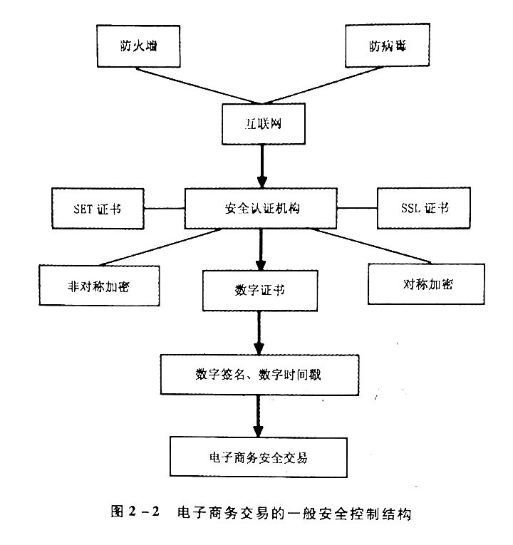

# 第二章 电子商务的基础

## 第一节 Web 技术

### 一、Web 的发展

- Web 1.0: 1991 放宽限制，允许私有化
- Web 2.0: 2004 鼓励最终用户通过分享，使可供分享的资源更加丰富

区别：

- 模式上：从被动获取向主动发布迈进
- 基本构成单元上：从网页向发表记录发展
- 工具上：从浏览器向各类浏览器、RSS 阅读器发展
- 运行机制上：从 C/S 向 Web Service 转变
- 作者上：从程序员专业人士向普通用户发展
- 应用上：初级应用向全面大量应用发展

Web 3.0: 

- 将互联网本身转化为一个泛型数据库
- 跨浏览器、超浏览器的内容投递和请求机制
- 人工智能技术的运用
- 语义网
- 地理映射网
- 运用 3D 技术搭建的网站甚至虛拟世界

本质：

- Web 1.0: 联合
- Web 2.0: 互动
- Web 3.0: 技术整合

### 二、Web 技术

- Web 1.0: HTML
- Web 2.0: RSS、TrackBack、Ajax、Tag
- Web 3.0: 无处不联网、SaaS、开发技术、OpenID、分布式数据库、智能网络、智能应用程序

## 第二节 内联网和外联网

### 一、内联网

1. 内联网的定义
  - Intranet
  - 是基于 Internet 技术建立的可支持企事业内部业务处理和信息交流的综合网络信息系统

2. 内联网的组成
  - 服务器：WWW、数据库、文件、Email
  - 客户机
  - 通信网络：核心和中枢
  - 安全系统：系统安全、通信安全、边界安全

3. 内联网的特点
  - 跨平台性：TCP/IP
  - 通用性：各类信息
  - 简单性
  - 安全性
  - 成本低

除了 WWW、Email、FTP、Gopher，还有远程办公、无纸公文传输、公告发布、专题讨论、视频讨论...

### 二、外联网

1. 外联网概述
  - Extranet
  - 利用 Internet 将企业与供应商、合作伙件、相关企业、客户相连的网络
  - 除了要解决内部资源共享，还要利用 Internet 公用资源，还要处理外部访问
  - 类型：企业与企业间、单个用户与企业间

2. 外联网的应用
  - 信息的维护和传播
  - 提供更有效的信息交换渠道
  - 获取客户和市场信息
  - 客户服务
  - 产品、项目管理和控制

### 三、互联网、内联网、外联网三者的关系

互联网、内联网、外联网三者既有联系又有区别

主要表现在：

- 操作权限上：
  - 互联网提供的服务基本上对用户没有权限控制或很少控制
  - 外联网通常和内联网一样位于防火墙之后，对一些有选择的合作者开放或向公众提供有选择的服务
  - 内联网只为企业内部服务，不对公众公开

- 在连接方式上：
  - 互联网强调各个组织网站之间的连找，无业务往来的企业、消费者都是它的业务范围
  - 外联网强调各个企业间的连接，业务范围包括交易伙伴、合作对象、相关公司、销售商店以及主要客户
  - 内联网强调企业内部各部门的连接，业务范围仅限于企业内部

## 第三节 安全技术

### 一、电子商务的安全要素

体现方面：

1. 有效性：防止延迟、拒绝服务
2. 保密性
3. 完整性
4. 可靠性
5. 不可抵赖性

### 二、电子商务系统的安全技术

1. 加密技术
  - 对称加密：DES、PCR、IDEA、3DES、AES
  - 非对称加密：RSA、ECC

2. 安全认证技术
  - 智能卡
  - 数字签名
  - 数字证书
  - CA 认证
  - 数字信封：使用私有密钥加密技术对要发送的信息进行加密、使用公开密钥加密技术对私钥进行加密的一种加密技术
  - 数字时间戳：
    - 由专门的机构提供
    - 组成部分：
      - 需加时间戳文件的摘要
      - DTS 收到文件的日期和时间
      - DTS 的数字签名

### 三、电子商务交易的一般安全控制结构

## 第四节 支付技术

### 一、电子支付概述

1. 电子支付技术的定义：消费者、商家和金融机构之间使用安全电子手段交换商品或服务
2. 电子支付技术的发展情况：
  - 20 世纪 90 年代各大厂商各自解决方案
  - VISA、MaterCard 合作定制的安全电子交易协议 SET
  - 我国 1998 《电子支付指引》
  - 第三方支付

### 二、电子支付技术的安全性

要求包括保密性、认证性、数据完整性、交互操作性等

1. SSL：握手协议、消息加密协议
2. SET
  - 流程：
    - 持卡人发出购买请求
    - 商家返回同意支付信息
    - 持卡人验证商家身份
    - 商家验证支付网关身份
    - 支付网关验证商家身份
    - 商家返回信息给持卡人，送货
    - 商家定期向文付网关发送要求支付信息、划账
  - 使用的安全技术包括加密技术、数字信封、数字签名、双重数字签名、认证技术

### 三、电子支付工具

1. 电子货币类：电子现金、电子钱包
2. 电子信用卡类：智能卡、借记卡
3. 电子支票类：如电子支票、电子汇款(EFT)、电子划款

### 四、电子商务主流支付方式

1. 第三方支付
  - 定义：指具备一定实力和信誉保障的独立机构，采用与各大银行签约的方式，提供号银行支付结算系统接口的交易支持平台的网络支付模式
  - 特点：
    - 技术中间件
    - 操作更加简单且易于接受
  - 流程：
    - 买房支付给三方看管，卖方发货，买方确认后划款
  - 减少了欺诈行为

2. 移动支付
  - 定义：用移动设备通过无线方式对所消费的商品或服务进行账务支付的方式
  - 分类：手机近端支付（红外、射频、POS）、手机远程支付（短信、上网）
  - 营运模式：
    - 以移动运营商为主体的移动支付运营模式（话费）
    - 以银行为主体的移动文付运营模式（绑定银行卡）
    - 以独立的第三方为主体的移动支付运营模式（连接上面两者的纽带）

## 第五节 移动通信技术

### 一、蓝牙技术

一种无线数据与话音通信的开放性全球规范

一种短距离的无线传输技术

适用范围广、功耗低、成本低、抗干扰能力强

同时可传输话音和数据，可以建立临时性的对等连接、具有开放的接口标准

### 二、WAP 技术

Wireless Application Protocol

公众服务、个人信息服务、商业应用

### 三、Wi-Fi

事实上是一个高频无线电信号

Wi-Fi 是由接人点 AP 和无线网卡组成的无线网络

### 四、WiMAX

全球微波接入互操作性

城域网的一种无线接入技术，50KM

### 五、GPRS 技术

通用分组无线服务技术

GSM 的延续

覆盖广、永远在线、按量计费、速率低

### 六、3G

第三代支持高速数据传输的蜂窝移动通信技术

CDMA：CDMA2000、WCDMA、TD-SCDMA(中国)

- 应用了高频段的频谱资源
- 采用宽带射频信道，支持高速率业务
- 实现多业务、多速率传送
- 快速功率控制
- 采用自适应天线及软件无线电技术

### 七、4G

第四代移动电话行动通信标准，包括 TD-LTE 和 FDD-LTE 两种制式

集 3G 与 WLAN 于一体

- 通信速度快，最高可 以达到高达 100Mbps
- 网络频谱宽 W-CDMA 20 倍
- 通信灵活
- 智能性高
- 兼容性好
- 增值服务
- 通信质量高

## 第六节 云计算技术

### 一、云计算的产生

21 世纪初期，崛起的 Web2.0 让网络迎来了新的发展高峰

由于资源的有限性，电力成本、空间成本、各种设施的维护成本快速上升，直接导致数据中心的成本上升，这就面临着怎样有效地利用这些资源，以及如何利用更少的资源解决更多的问题

同时，随着高速网络连接的衍生，芯片和磁盘驱动器产品在功能增强的同时，价格也在变得日益低廉，拥有成百上千台计算机的数据中心也具各了快速为大量用广处理复杂问题的能力

计算能力和资源利用效率的迫切需求，资源的集中化和技术的进步，推动云计算应运而生

### 二、云计算概述

1. 定义：是一种商业计算模型，将计算任务分布在大量计算机构成的资源池上，使用户能够按需获取计算力、存储空间和信息服务

2. 功能：
  - 提供计算、存储、网络资源
  - 提供动态的数据服务
  - 提供云计算平台：API、环境、工具

3. 特征：
  - 超大规模
  - 虚拟化技术：最强调的特点，资源虚拟化、应用虚拟化，弱化物理关系
  - 高可靠性：动态扩展
  - 通用性
  - 可扩展性
  - 按需服务
  - 成本低

### 三、云计算面临的问题

1. 标准体系尚未形成
2. 云计算的安全性面临重大考验
3. 监管机制亟待健全

## 第七节 物理网

### 一、物联网的产生

- 1991 MIT Kevin Ash-ton 教授提出
- 1995 比尔盖茨《未来之路》提及
- 1999 MIT Auto-ID 万物皆可通过网络互联
- 2005 《ITU 互联网报告2005：物联网》
- 2009 《欧盟物联网行动计划》
- 2009 IBM 智慧地球

### 二、物联网的定义

通过射频技术、传感器技术、全球定位系统、激光扫描器、短距无线网、气体感应器等技术

按约定的协议，把任何物品与互联网连接起来

进行信息交换和通讯，以实现智能化识别、定位、跟踪、监控和管理的一种网络

### 三、物联网技术架构

1. 感知层关键技术：
  - 传感器技术：数据采集和数据短距离传输
  - 射频识别 RFID 技术：
    - 电子标签、读写器、天线
    - 无须接触；自动化程度高；耐用可靠：识别速度快：适应多种工作环螃：多标签同时识别
    - 门禁、自动收费、文档追踪
  - 二维码技术
  - ZigBee：采用分组交换和跳频技术

2. 网络层关键技术：
  - Internet：IPv6 近乎无限
  - 移动通信网：无线接人网、核心网和骨干网，覆盖面广、建设成本低、部害方便、终端具备移动性
  - 无线传感器网络

3. 应用层关键技术：
  - M2M，机器或人 对 机器或人
  - 人工智能：企图了解智能的实质，并生产出一种新的能以与人类智能相似的方式作出反应的智能机器
  - 中间件L：数据的搜索、过滤、整合与传递等特性

### 四、物联网的应用

1. 城市
  - 城市动态
  - 公共场所实施监控

2. 农业
  - 监测温室
  - 农田远程管理

3. 环境监测
  - 土壤治理
  - 森林防火
  - 水资源保护

4. 现代物流
  - 嵌入芯片、环节感知

5. 数字医疗
  - 不间断监控和会诊
  - 共享医疗记录

## 复习与思考

1. 简述 Web1.0 的技术基础与 Web2.0 技术。
2. 简述 Web1.0 和 Web2.0 的区别。
3. 简述 Web3.0 的技术范畴。
4. 简述内联网的特点及组成。
5. 简述内联网与 Internet 网的区别。
6. 简述内联网、外联网和互联网的关系。
7. 简述电子商务的安全要素。
8. 列举电子商务安全技术，并说明其功能。
9. 列举常用的对称加密算法和非对称加密算法。
10. 简述数字信封的实现过程。
11. 简述数字签名的实现过程。
12. 简述 CA 认证中心的功能及特点。
13. 简述数字时间戳的实现过程。
14. 简述电子商务交易的一般安全控制结构。
15. 简述 SSL 协议的功能及构成。
16. 简述 SET 协议的交易流程及共使用的安全技术。
17. 简述电子支付工具的种类并举例。
18. 简述第三方支付的特点和交易流程。
19. 简述移动支付的运营模式。
20. 列举常用的移动通信技术。
21. 简述云计算的功能及特征。
22. 简述云计算面临的问题。
23. 简述物联网技术架构及每层的关键技术。
