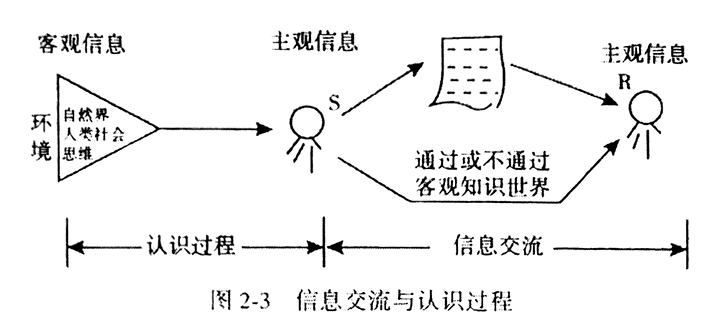
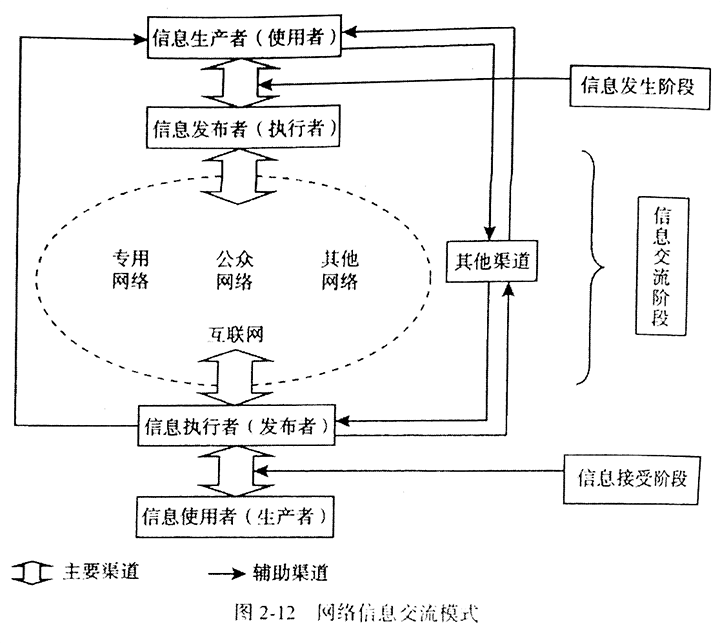

# 第二章 信息交流

## 第一节 信息交流的基本概念

### 一、信息交流的分类

- 信息交流
  - 自然信息交流
    - 非生物 - 非生物
    - 生物 - 非生物
  - 人 - 自然：半自然、半社会
    - 人 - 非生物
    - 人 - 生物
  - 人 - 人：最复杂、最高级的形式

### 二、信息交流的含义与特征

- 信息交流
  - 共时交流：互联网、电话、旗语
  - 历时交流：光盘、录音、文献

任何交流过程都是时间和空间为正的过程

间接交流：信息链（人或文献及其他形式，也可以是混合的）

信息交流实质上是一种单向传递，S -> R (A -> B & B -> A)



Sender 与 Reciever 均为**故意**传递与接受

### 三、信息交流行为

- 人的行为
  - 目的行为
    - 信息行为：听、读...
    - 非信息行为：体力劳动
  - 非目的行为：潜意识

- 信息交流行为
  - 输出：书写、言语、绘画
  - 输入：阅读、收听

### 四、信息交流的条件和要素

1. 信息发送者：信息源
2. 信息接受者：接收者、利用者
3. 交流通道：感官
4. 符号体系：载体，语言、文字、表情
5. 知识信息库：交流的根本来源和最终归宿
6. 支持条件：自然条件（光声电）、技术条件（通信、存储）、社会条件（法律、政策、经济）

## 第二节 信息交流的模式

模式：用简洁的方式揭示本质和规律

### 一、香农-维弗通信模型

通信模型：单向线性过程，五个环节，没有反馈环节

```
                 ↓ 信道
信源 -> 编码器 -> --- -> 解码器 -> 信宿
                 ↑ 噪音
```

### 二、拉斯韦尔 5W 模式

1. 发送者：Who
2. 说了什么：says What
3. 什么渠道：in Which channel
4. 对谁：to Whom
5. 取得什么效果：with What effect

注重信息本身的内容和传播效果

7W

- 什么情况：What circumstance
- 什么目的：What purpose

### 三、施拉姆模型

《传播如何得以有效进行》三个模式

- 第一个与香农-维弗模型相似
- 第二个进行推进：两个试图交流的个人必须积累有相当共同的经验
  - 信源和信宿之间，只有在其共同的经验范围之内才真正有所谓的交流
- 第三个进一步发展：人类交流的两个个体之间有相互作用的模式

注重交流的过程而非交流效果，引进反馈概念

### 四、维克利 S-C-R 模式

- 信息源 Source：人或文献
- 交流渠道 Channel：主要是信息系统
- 信息接收方 Recipient：决策信息需求

强调人本社会传播、双向性

### 五、A.N 米哈依洛夫广义的科学交流系统模式

正式过程、非正式过程交流模式

- 正式：依法组织、正规合法渠道
  - 可靠程度高，大量文献
  - 传递不及时，需要技巧
- 非正式：社会成员之间
  - 信息间隔时间短，选择性、针对性强，反馈迅速，易于理解
  - 准确性难以检验，参与人数少

```
科学信息创造者  <--->  科学信息使用者
      |                  ↑        非正式过程
-----------------------------------------------
      |                  |        正式过程
      → 科学技术文献系统 →  |
             ↓
    科学信息和图书-书目工作 -|
```

## 第三节 信息交流机制

### 一、社会信息流的形成

单向，时间有长有短

### 二、信息交流与传播中的栈

信息栈：信息链中的节点

栈交流：信息栈参与传播过程

- 时间栈：信息的时间传递
  - 档案馆、图书馆、博物馆
- 空间栈：远距离传递
  - 新闻、报纸、互联网、邮政、广播

信息栈的职能：获取信息，加以处理、转换、存储、积累，传递

信息栈会被 R 当作直接信息源，但真正的信息源有可能来源于各个时代、地区的信息生产者

信息栈是信息交流的中介，其中一方既可以接受利用，也可以继续传播

信息栈特点：

1. 将常义上的信息源追溯到信息生产者，利于了解信息机构的功能
2. 有助于突破不同学科的界限，为信息管理提供理论方法

### 三、直接交流与社会代理交流

- 直接交流：零栈交流
  - 媒介纯自然和客观，无社会因素
  - 共时交流
  - 生动、直观、反馈迅速、间隔短
  - 有较大随意性
- 间接交流：栈交流
  - 借助社会系统（图书馆、信息中心）
  - 会受社会因素干预，受监督和评价，严谨
  - 共时、历时都有
  - 传递时间范围、空间范围都比较大
  - 能对 S、R 进行匹配，提高效率

当 S 与 R 无法直接交流时，出现了信息栈社会代理现象 A

Agent 书商、技术交易商等

S - A - R 可以转换成 S - R：

- A(S) - R
- S - A(R)

多级代理的两端可视为一次代理

### 四、信息传递模式

1. 多向主动传递：事先整理，等待传递给未知接收者（二次文献）
  - 时间间隔短、选择性高、针对性强、信息交流迅速、直接、生动、反馈快

2. 单向主动传递：事先了解确定接收者的需求（定题服务）
  - 准确、及时、效率高

3. 多向被动传递：接收者未知（图书馆）
  - 无向

4. 单向被动传递：接收者未知（咨询）
  - 需要继续深入发展

多向主动：最基本、最重要

多向较单向：相对容易

有向传递：信息服务的理想目标

不应片面夸大其中一种，破坏信息交流系统的平衡

## 第四节 网络信息交流

### 一、网络信息交流的兴起

载体发展：

1. 零载体：口头
2. 天然载体
3. 人工载体
4. 纸型载体
5. 微缩载体
6. 音像载体
7. 封装型电子载体
8. 网络载体

发展规律：容量扩大、载入优化、存取加快、便携亲和、成本降低

网络载体优势：

1. 传播更新快
2. 信息量大，内容丰富
3. 检索方便
4. 超文本多媒体结合
5. 交互性强：最独特

网络交流手段：E-mail、论坛、即时通信、博客、维基、社交网络

我国网民主要网络应用：信息获取、交流沟通、网络娱乐、商务交易

### 二、网络信息交流的模式及特点

#### 1.网络信息交流模式



- 粗箭头：主要方式
- 细箭头：传统方式
- 最左边直达箭头：没有经过中介

网络信息四种用户：

1. 生产者
2. 发布者
3. 执行者：处理请求，发送信息
4. 使用者

生产者也可以是使用者，发布者也可以是执行者

网络信息三个阶段：产生、交流、获取

#### 2.网络环境下的正式交流与非正式交流

- 正式：文献系统，正式出版发行，社会性
- 非正式：信息的直接传递（座谈、报告、演示），个体性

主要区别：是否通过文献系统并以文献为媒介进行传递

纸质印刷型文献为主要媒介环境下，二者划分明显，使得非正式交流地位处于低潮时期，但网络技术的兴起和发展，给其带来了复兴的机会

网络环境下，纸质成本高、出版缓慢、不及时、检索不便

二者的划分需要重新分析：

1. 信息源角度：
  - 传统正式信息交流渠道：专门整理（电子期刊、数据库）
  - 网络原创信息：是否有专人加工来划分正式、非正式（新闻、社交发布）

2. 信息交流渠道：
  - Web 发布：仍是按是否有专人管理来划分
  - 网络搜索引擎：正式
  - 电子邮件：非正式
  - BBS：非正式
  - 实时交互：非正式

正式、非正式也并非绝对，互相包含

网络环境下非正式优势：

1. 不受时空限制
2. 


