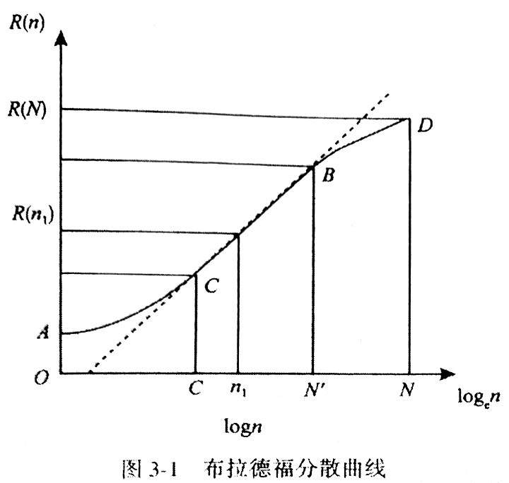
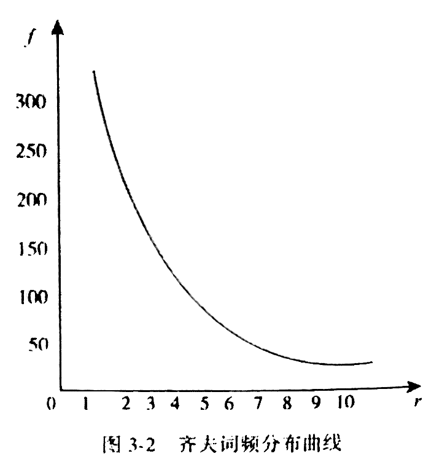
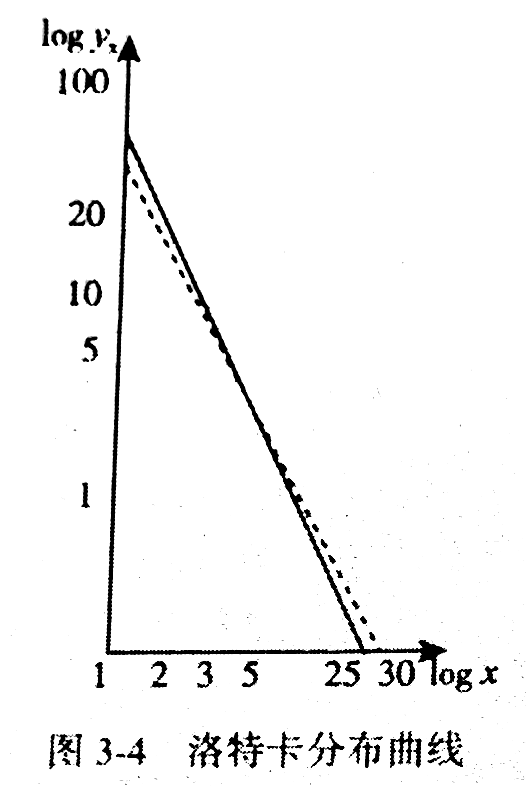
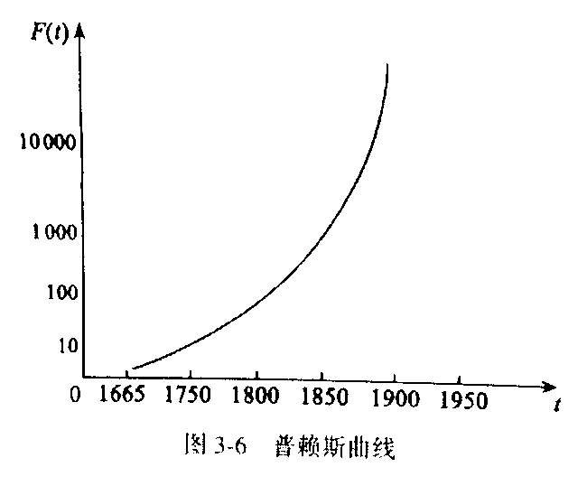
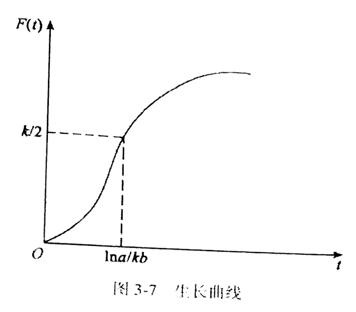
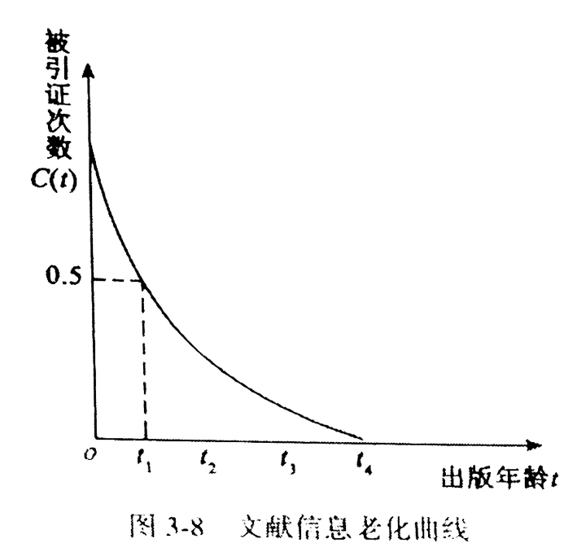
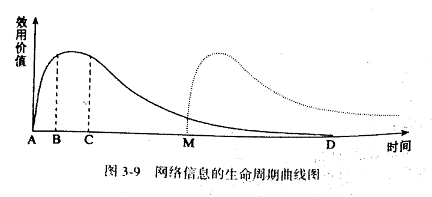

# 第三章 信息分布

## 第一节 信息产生与分布中的马太效应

### 一、马太效应的表现和作用形式

信息流过程中表现出 核心趋势 和 集中取向 ：少数出版社成为某类权威出版机构

“富集”与“贫集”现象：人类社会特有的选择机制支配的结果，强者愈强 🎯

马太效应：优势加强，弱势加剧；天之道，损有余而补不足，人之道则不然，损不足以奉有余 🎯

- 信息生产者在 核心趋势 中占主动地位，而在 集中取向 中呈被动地位
- 前者相乘，自增生；后者相加，大变量分布
- 二者效果是一致的，累积的程度不一样

### 二、马太效应的负面影响

优点：🎯

- 突出重点、摒弃平均、降低成本、提高效益

缺点：🎯

- 选择简单、走入极端、因循守旧、不思进取
- 富集有时是表面的、外在的
- 过分关注核心信息源，忽略其他信息源
- 青睐名人、拒绝新人，不利成长

### 三、马太效应的数学模拟

马太效应描述的是：成功和失败的累积过程及效果

代表性数学模型：

1. 普利亚分布：单缸模型
  - 一缸红黑球，红胜黑败，取出后放回，多次实验，每一次都会增加同色出现概率

2. 塔格分布：多缸模型
  - 对单缸的补充和修正

3. 威布尔分布

## 第二节 信息内容的离散分布规律

离散分布：是信息的重要属性，表现为信息内容以不同方式、不同角度分布各种载体 🎯

### 一、布拉德福定律 🎯

揭示论文在科学期刊中的分布

> 如果将科学期刊按其刊载某个学科主题的论文数量，以递减的顺序排列起来，就可以在所有这些期刊中区分出载文率最高的“核心”部分和包含着与核心部分同等数量的论文的随后几区，这时核心和后继各区中所含的期刊数成 `1 : a : a^2` 的关系（a>1）

统计应用地球物理学，a 约等于 5，`9 : 59 : 258 ~= 1 : 5 : 5^2`



格鲁斯下降：布拉德福曲线进入直线部分后总要下垂

文献为什么会分散：第一批论文寄给合适的期刊发表，伴随发展，堆加效应

基本要点：

1. 频次等级排序，形成主体来源有序目录
2. 确定相关论文在主体来源中的分布规律

布拉德福定律主要揭示宏观层面信息离散分布，而在微观层面则是空白

### 二、齐夫定律 🎯

词汇出现的频次必然影响信息分布

齐夫定律：揭示不同词汇的特点，出现批次的规律

齐夫定律的表述：

如果将一篇较长文章中的每个词按出现频次递减排序，用自然数编上等级序号，出现最高的为 1 级，一直到 D 级

f 表示频次，r 表示等级序号

c 为常数

```
fr = c
```



数学家曼德尔布罗运用信息论原理和概率论方法来研究词频分布，用三参数修正齐夫定律

齐夫定律是通过研究英语词汇得出的结论，最适用拉丁语系，也符合汉语词汇分布

应用：信息系统建设、词表管理、自动标引、信息存储与检索

### 三、网络信息的内容分布

采用布拉德福方法来研究，结果相近

特征：

1. 门户网站搜索引擎信息搜集中，信息资源集中的网站比较集中，信息共享形成一些信息集中的网站群
2. 由于信息检全率有限，非核心网站信息统计数量明显不足，表现出格鲁斯下垂明显
3. 对这些网站平均网页数和最大相关网页数均较小，信息分布更加分散

## 第三节 信息生产者分布规律

### 一、洛特卡定律 🎯

洛特卡取《化学文摘》、《物理学史一览表》为数据源：

论文数 x，作者数 yx，斜率近似 -2，平方反比分布



洛卡特定律是对两组数据统计的推广，是一般理论估计，而不是精确统计分布，因而具有局限性

### 二、普赖斯定律 🎯

受洛卡特启示，普赖斯提出：核心生产者分布的“平方根定律”

> 某一特定领域中，全部论文的半数系由该领域中全部作者的平方根的人（高产者）撰写的

不能将普赖斯定律绝对化，是在洛卡特定律基础上提出的假说

其价值在于：简洁描述了信息按生产者能力的分布

### 三、网络信息的生产者分布

网络信息生产者完全不同于科学生产，数量大、成分复杂、目的多样

网络的复杂性使得无法通过整体来考察规律，因而研究人员选择某一时段特定领域来研究

- BBS 中信息分布不符合普来斯定律，比科学文献生产者更加分散
- 著者的集中程度比传统文献低，分布更加广泛和均衡

推论：网络条件下的信息生产表现出不同的规律，生产者的分布与信息内容的专业化程度密切相关，信息专业户程度高，则生产者集中程度就越明显

## 第四节 信息对时间的分布规律

掌握变化，实施动态管理

### 一、指数增长律 🎯

以文献为计量单位得到的指数增长率

1. 普赖斯曲线
  - 文献增长与时间成指数关系
  - 人们还常常用文献量翻一倍的时间来衡量文献的增长速度
  - 内在原因：社会信息流的传播和影响的结果
  - 文献信息的指数增长规律是对每一年的文献累计数而言的
  - 不是相对于每一年新发表的文献数量
  - 是一个理想模式，没有考虑到许多复杂因素对文献增长的限制



2. 生长曲线
  - 生物生长曲线：一开始很快，逐渐变慢至不增加



### 二、逐渐过时律

文献老化的四种情形：🎯

1. 有用，但被包含
2. 有用，但人们兴趣下降
3. 有用，但被超越
4. 不再有用

引用物理学“半衰期”概念

文献的半衰期：某科学领域现时尚在利用的全部文献中的一半是在多长一段时间内发表的 🎯

普赖斯指数：某一学科领域内，对发表年限不超过 5 年的文献的引用次数与总的引用次数之比值 🎯



老化因素：

1. 文献增长：文献增长越快，半衰期越短
2. 学科差异：动植物学、地理学慢，医学、电子学快
3. 学科发展阶段差异：诞生、发展、相对成熟
4. 信息环境和需求：信息利用者所处的环境

### 三、网络信息的时间分布

#### 1.网络信息的增长规律

1. 单一网站网页数增长规律：二次曲线增长规律
2. 特定学科/主题领域中网页数量的增长规律：三次曲线增长规律

#### 2.网络信息老化规律

1. 增长：增长和老化是一个事物的两个方面
2. 更新
3. 消失：删除
4. 衰减：需求饱和
5. 其他：内在发展，外在科技进步

历时半衰期：研究网络链接的不可访问性，一半链接不可访问所需要的时间

共时半衰期：研究新链接，较新的一半链接是在多长时间内产生的

#### 3.网络信息的生命周期

网络信息从生产到失去效用价值所经历的各个阶段和整个过程

成长期、成熟期、衰退期



## 复习与思考

1. 掌握信息生产和分布中的马太效应。
2. 掌握反映信息内容分布规律的两大定律：布拉德福定律、齐夫定律。
3. 掌握反映信息生产者分布规律的两大定律：洛特卡定律、普赖斯定律。
4. 掌握信息在时间上的分布规律，包括指数增长率和逐渐过时律（半衰期和普赖斯指数）。
5. 了解网络信息分布出现的新特征和新规律，并思考传统的信息分布规律在网络环境下的适用性。
