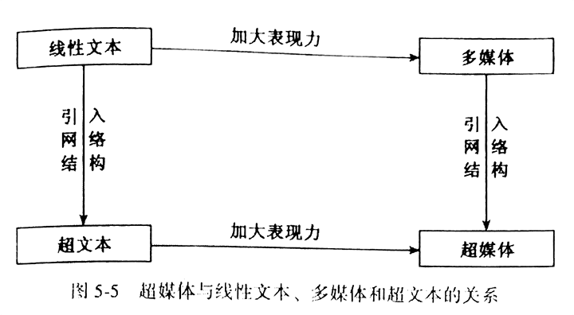
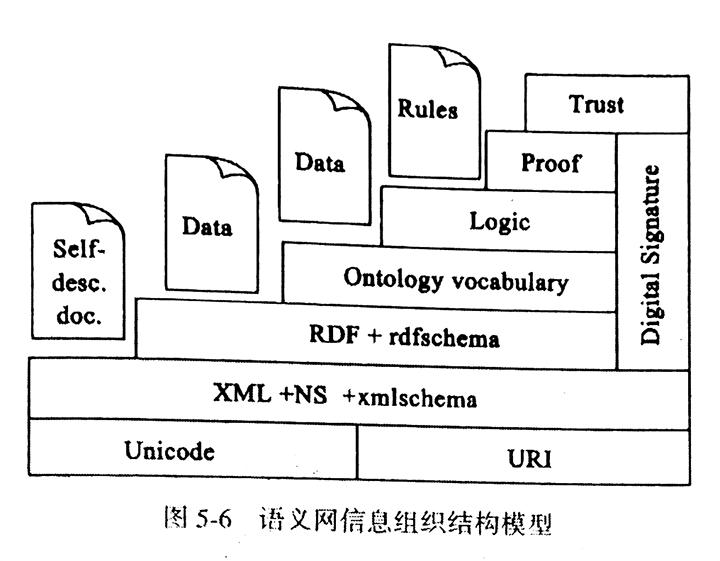

# 第五章 信息组织

## 第一节 信息组织的基本原理

### 一、信息组织的概念与内容

信息组织：信息整序，利用一定的规则、方法和技术对信息外部特征和内容特征进行揭示和描述，按给定的参数和序列公式排列，使信息从无序集合转换为有序集合的过程

信息组织的基本对象：🎯

- 外部特征：物理形态、题名、作者、出版日期
- 内容特征：关键词、主题词、其他知识单元表达

信息组织：

- 是信息检索与传播的准备，是信息收集后的首项工作
- 是一个信息增值过程，粗放型 -> 集约型

信息组织基本内容：🎯

1. 信息选择：从采集到的、无序的信息流中甄别出有用的信息，剔除无用的信息
2. 信息分析：按一定逻辑关系从语义、语用和语法对信息内、外特性进行归类
3. 信息描述与揭示：根据信息组织和检索的需要，对信息资源的主题内容、形式特征、物质形态进行选择、分析与记录的活动
  - 分类：著录（形式）、标引（内容）
4. 信息存储：按一定格式与顺序存储在特定载体中的一种活动
  - 工具书：《全国总书目》《全国报刊索引》《中国专利分类文摘》

### 二、信息组织的类型

1. 按信息表现形式
  - 文字信息组织：字符编码
  - 图像信息组织：GIF JPG PNG
  - 声音信息组织
  - 视频信息组织

2. 按信息加工程度划分
  - 一次信息组织：研究或创造性成果的直接记录 🎯
    - 原始，零散、无序，很难获取
    - 查准率低，逻辑关联性差
  - 二次信息组织：对一次信息的加工、整理 🎯
    - 集中，有序
    - 为查找提供线索
  - 三次信息组织：一、二次的基础上，分析、综合深加工 🎯
    - 经过鉴别、提纯

3. 按信息的传播载体划分
  - 文献信息资源
  - 网络信息资源

### 三、信息组织的原则 🎯

1. 客观性原则：不歪曲、不肢解、不添加 🎯
2. 系统性原则：把握关系
  - 宏观、微观信息组织关系
  - 信息组织部门与其他部门关系
  - 信息组织工作各个环节之间的关系
  - 不同信息处理方法之间的关系

3. 目的性原则：围绕需求 🎯
4. 现代化原则：思想观念、技术手段

### 四、信息组织的理论基础

1. 语言学
  - 最重要的交流符号系统，信息的载体
  - 不仅是交流工具，也是思维工具

2. 逻辑学
  - 是关于思维规律的科学
  - 形象思维 -> 抽象思维，感性 -> 理性
  - 感性：感觉、知觉、表象
  - 理性：概念、判断、推理
  - 信息组织属于抽象思维范式

3. 知识分类学
4. 系统论
  - 系统内各要素不是简单结合，而是相互关联有机结合在一起

5. 耗散结构理论
  - 系统内部非平衡是有序之源
  - 与外界的交换，既采集也输出

6. 协同论
  - 系统内各要素协同作用，从定量的深度决定着开放系统的自组织程度

7. 自组织理论
  - 无需外界指令
  - 任何自组织系统都是通过谐振、反馈、放大来完成信息增强，并保持其有序性
  - 基于多种理论
  - 技术发展使得信息系统具备自组织条件

## 第二节 信息组织的思想方法

### 一、分类法

分类：依据事物的属性或特征进行区分和类聚，将区分的结果按照一定的次序予以组织的活动 🎯

信息的分类组织：构建有序化信息系统的常用方法，根据信息资源的内容属性和其他特征，将资源分门别类地、系统地组织和揭示的方法 🎯

分类法的特征：🎯

1. 按照信息内容特征的相互关系进行组织
2. 从一定角度出发组织和揭示信息资源
3. 采用一定的标记符号作为排序工具

主要分类法：

1. 杜威十进制分类法 DDC
  - 1876,1000 个类目不断更新，2011 年第 23 版
  - 基于哈利斯分类法（基于培根知识分类思想：记忆（历史）、理想（文艺）、理性（哲学））

2. 国际十进制分类法 UDC
  - 扩充自 DDC

3. 中国图书馆分类法
  - 1971 年编制

### 二、主题法

主题：信息资源论述的主题对象 🎯

主题法：直接以表示信息资源主题的词语作标识，提供字顺检索途径，主要使用参照系统揭示词间关系的标引和检索信息的方法 🎯

主题法的特征：🎯

1. 以特定事物、问题、对象，即以主题为中心集中的信息资源
  - 分类法收体系限制，不同学科研究同一对象的信息资源是分散在各知识门类的

2. 直接以语词作为信息的组织和检索标识
  - 分类法是以抽象的符号系统作为标识，而主题直接使用自然语言的语词（更直观）

3. 以字顺作为主要检索途径
  - 直接输入语词

主题法类型：

1. 标题法：以标题作为主题标识，词表预先确定的主题法 🎯
  - 标题：经过词汇控制，用来表达文献主题的标识 🎯
  - 单级标题、多级标题
  - 优点：
    - 标题顺序预先组配，直接使用不易混乱
    - 关联事物中心，易于查全
    - 直观，易掌握，检索快
  - 缺点：
    - 很难查全一门学科或具有某一属性事物的文献
    - 使用不灵活，无法满足多种路径

2. 单元词法：以单元词作为主题标识，通过字面组配的方式表达信息资源的主题 🎯
  - 单元词：标引信息资源主题的、最基本的、字面上不能再分的语词 🎯
  - 是标题的构件，有较大灵活性

3. 叙词法：以自然语言中精选出来的词语作为文献主题标识 🎯
  - 叙词：主题词，经过规范化处理的，以基本概念为基础的表达文献主题的词和词组 🎯
  - 经过规范化处理，以基本概念为基础的表达文献主题的词和词组
  - 从自然语言中精选出来
  - 相比单元词法：使用概念组配而不是字面组配
  - 特点：
    - 直观性
    - 专指性
    - 适应性强
    - 迅速准确
    - 后组式
    - 多维检索
    - 网络结构

4. 关键词法：计算机的出现，不做或少做规范化处理 🎯
  - 关键词：出现在标题、摘要、正文中，有实质意义的语词 🎯
  - 类型：题外关键词、题内关键词、单纯关键词索引
  - 标引容易、保证报道及时性
  - 缺少规范，漏检率、误检率高

### 三、分类-主题一体化

分类法和主题法的比较：🎯

- 分类法系统性强，符合思维和检索习惯
- 主题法比较直观，从特征角度标引，提供面向对象、事实和概念的信息组织方法
- 二者在原理上存在相互渗透现象，为二者的融合奠定基础

分类主题一体化词表：在分类表、叙词表基础上建立起来的，相互配合，相对独立 🎯

- 将主题概念按科学体系或逻辑体系排列和组织的分类法系统
- 将主题概念按字顺排列并用参照系统加以组织的主题法系统

## 第三节 信息描述与揭示

确保信息组织质量，提高信息检索效率

### 一、信息标引

1. 标引的基本概念
  - 分析信息对象的内容属性（特征）及相关外表属性，并用特定语言表达分析出的属性，作为信息存储和检索依据的处理过程 🎯
  - 两个环节：主题分析、转换标识 🎯
  - 用途来讲，又称：检索语言、索引语言
  - 相对自然语言，又称：受控语言、规范语言

2. 标引语言：有着自己的词汇和语法 🎯
  - 表达文献主题概念和检索需求主题概念的简明性、单义性和关联性的概念标识系统
  - 按信息组织思想方法可分为：🎯
    - 分类语言：概念组织，类目体系
    - 主题语言：自然语言，语词字序
  - 按组合时间先后：🎯
    - 先组式语言（标题法）
    - 后组式语言（单元词法、叙词法）
    - 散组式语言
  - 按标识规范和受控程度：
    - 受控语言（标题语言、单元词语言、叙词语言）🎯
    - 自然语言（关键词语言）🎯

3. 信息标引的类型：取决于标引语言的种类 🎯
  - 分类标引：用 特定语言 表达主题，赋予文献 分类检索 标识的过程
  - 主题标引：用 主题语言 表达主题，赋予文献 主题检索 标识的过程

### 二、信息著录规则

1. 机器可读目录 MARC
  - 计算机识别和阅读的一种目录
  - 伸缩性强，适应面广
  - 特点：
    - 001~999 个字段，999 用户自定义
    - 字段内容著录详尽，字段下又设子字段及重复字段
    - 字段作用强化，可检索字段多
    - 每条记录分为：头标区、目次区、数据区
  - 典型：USMARC、UNIMARC、CNMARC

2. 书目记录的功能需求 FRBR
  - 利用 E-R Model 构建
  - 分组：
    - 一、通过智慧和艺术创作的产品（作品、内容表达、载体表现、单件）
    - 二、对智慧和艺术创作产品负责任的个人和团体看，与第一组存在的关系
    - 三、产品的主题内容（概念、事物、事件、地点及一、二组本身）
  - 影响：资源描述与检索、国际标准书目著录、英美编目规则

3. 资源描述与检索 RDA
  - 优点：
    - 为数字世界设计的、新的资源描述和检索标准
    - 基于 FRBR 和 FRAD 概念模型，便于查找
    - 提供灵活数字资源内容描述框架，满足传统资源需要
    - 更适合新兴数据库技术，提高抓取、存储效率
    - 兼容 AACR2
    - 互联网联机，编目效率高

4. 书目框架 BIBFRAME
  - 四个核心：作品、实例、规范、注释
  - 2.0 三个核心：作品（最高层次）、实例、单件

### 三、元数据

1. 元数据的概念 🎯
  - 关于数据的数据，关于信息的信息（描述数据的数据）
  - 专门用来描述数据的特征和属性，也是描述和组织信息资源、发现信息资源的语言和工具
  - 构成：名称、描述、表示、代码、语义、分类
  - 早期主要指网络资源的描述数据，逐步扩大到各种电子形式信息资源的描述数据，也适用于传统书目数据
  - 性质上是一种电子环境中使用的著录数据
  - 一个元数据目录构成一个信息资源的基本数据，是检索系统的构成单元
  - 信息描述的目的：以元数据为中介，对信息资源进行各种操作
  - 作用：描述、定位、搜寻、评价、选择

2. 都柏林核心集
  - 一个包含 13 个数据单元的元素集，扩展至 15 个（可选择、可重复、可扩展）
  - 列表：
    - 01 题名 Title
    - 02 创作者 Creator
    - 03 主题 Subject
    - 04 描述 Description
    - 05 出版者 Publisher
    - 06 其他责任者 Contributors
    - 07 日期 Date
    - 08 类型 Type：集合、数据集、事件、图像、交互式资源、服务、软件、声音、文本
    - 09 格式 Format：
    - 10 资源标识符 Identifier：URI、ISBN
    - 11 来源 Source
    - 12 语种 Language
    - 13 关联 Relation
    - 14 覆盖范围 Coverage
    - 15 权限管理 Rights
  - 分类：
    - 与资源内容有关：题名、主题、描述、来源、语种、关联、覆盖范围
    - 与资源知识产权有关：创作者、出版者、其他责任者、权限管理
    - 与资源外部属性有关：日期、类型、格式、资源标识符
  - 优点：
    - 简单易懂
    - 运用灵活
    - 国际通用
    - 可修饰性
    - 可扩展性

3. 其他元数据规范
  - 机器可读目录 MARC
  - 视觉资料核心类目 VRA
  - 艺术作品著录类目 CDWA
  - PICS
  - Web Collections

### 四、标记语言及相关标准

#### 1.标记语言

20 世纪 60 年代，IBM GML -> ANSI SGML

1986，ISO 发布正式 SGML

HTML -> XML

1. 通用标记语言标准 SGML
  - 一种元语言，标记语言的语言
  - 从结构、内容两个层次来描述文献
  - 核心：文档类型定义 DTD
  - 将来源不同的文档（文本、声音、动画、视频）组装在同一文件中
  - 不依赖任何软件和硬件
  - 庞大复杂，标准包括：HyTime、DSSSL、XSL、XLL
  - 在分类、索引中非常有用，但在 Web 上受阻

2. 超文本标记语言 HTML 🎯
  - 功能：
    - 出版在线文档
    - 通过超链接检索在线信息
    - 为获取远程服务而设计表单
    - 直接包含电子表格、音视频
  - 缺点：
    - 扩展性差：格式固定
    - 交互性差：无法交互
    - 语义性差：主要反映结构

3. 可扩展标记语言 XML 🎯
  - 又一个 SGML 简化子集
  - 结合 SGML 功能与 HTML 的易用性
  - 不同行业有不同的 XML 规范
  - 特点：
    - 纯文本
    - 基于内容的数据标识
    - 可格式化
    - 很强的链接能力
    - 易于处理

HTML、XML 对比：🎯

- HTML 提供了查看数据的通用方法
- XML 提供了直接在数据上工作的通用方法，将界面和结构化数据分离，灵活可扩展，良好的结构和约束，简单易于阅读

#### 2.资源描述框架 RDF

为有效利用信息资源，兼容新旧、不同地区、不同数据对象、不同目录规则、不同格式，允许共存的描述方法

1997.10 W3C 发布 资源描述框架 RDF，采用 XML 语言标准

核心定义：任何一个可被表示的资源都可以被一些可选择的属性描述，每一个属性都有一个值（E-R）

RDF 又定义了标准词表 RDFS，规定了利用 XML 命名空间

具体应用：资源描述与组织、资源发现、站点目录、超链接、数字图书馆、智能代理、数字签名

#### 3.简单知识组织系统 SKOS

RDF 是 Web 资源描述和携带的理想语言，较为初级，无法描述更精确的语义关系

网络本体语言 OWL 虽然扩展了 RDF 语义描述能力，但其逻辑要求过于严苛，SKOS 因此产生

组成：

1. SKOS Core: 表示 Ontology 之外所有其他网络知识组织系统
2. SKOS Mapping: 表示概念框架之间的映射
3. SKOS Extensions: 辅助 SKOS 的特定应用

## 第四节 网络信息组织

### 一、网络信息组织的特点 🎯

1. 海量网络信息机信息产生、传播速度加快，对传统信息加工方式提出了挑战
  - 时效性不允许过多的中间加工环节
  - 自动化要求：分类、标引、索引、文摘
  - 半自动 -> 自动化 -> 智能化

2. 信息种类增多，数据库成分复杂化，过去适用于文本信息组织方式适用性降低
  - 大量非文本信息
  - 非结构化信息

3. 网络信息用户对信息组织有专门需求，要求透明、易用、快捷、实用

4. 网络信息形式上的非线性、交互性、动态性，需要组织方法及时而灵活

### 二、网络信息的分类组织

分类组织是一种比较成熟的信息组织方法

两种主要方式：🎯

1. 沿用 传统文献分类方法（DDC、UDC）：以学术资源为主
  - 学科划分

2. 采用 自编分类系统：常用于门户网站 🎯
  - 重视以事物为中心设置类目：用户视角，体系不严密但具有实用性
  - 类目收录范围宽泛
  - 多重列类、重复反映
  - 直接使用词语作为分类标识
  - 更新迅速

### 三、网络信息的主题组织

1. 采用现有词表（叙词表）：学科专业性数据库
2. 采用关键词法：搜索引擎
  - 网络搜索引擎采用的原因：网络资源数量庞大，规范语言成本高、效率低，关键词可以自动处理 🎯

### 四、网络信息组织方式 🎯

信息组织方式：利用各种信息技术和信息组织方式将信息组织起来的具体形式

1. 文件方式
  - 有序组织的数据的集合，计算机保存处理结果的基本单位
  - 计算机出现早期，信息被按物理地址存储在媒体上，使用时需要了解物理位置和结构
  - 引入文件概念后，实现“按文件名进行存取”
  - 优点：
    - 简单方便
    - 存储非结构化信息的天然单位
  - 缺点：
    - 难以平衡网络负载和文件数量的关系，增大管理复杂度
    - 对结构化信息组织软弱无力
    - 文件本身需要管理

2. 数据库方式
  - 层次式数据库 -> 网络数据库 -> 关系数据库 -> 面向对象数据库
  - 以固定的记录格式存储，通过关键词及组配查询，直接连接到相应的网络信息资源
  - 优点：
    - 大大提高了操作的灵活性
    - 实现了数据管理与应用的分离
    - 降低网络传输负载
  - 缺点：
    - 对非结构化信息处理困难
    - 不能提供数据信息之间的关联
    - 对用户和数据服务端提出较高要求

3. 主题树方式
  - 按事先确定的概念体系结构，分门别类的逐层加以组织，用户通过浏览的方式逐层加以选择
  - 优点：
    - 简单易用
    - 检索具有范畴分类体系
    - 良好的扩充性和系统性
  - 缺点：
    - 事先准备工作、智力负担
    - 保证结构的清晰性和资源利用性

4. 超媒体方式
  - 超文本和多媒体技术的结合
  - 节点 node 间以链路 link 相连成网状结构，在其间自由跳转
  - 优点：
    - 良好的包容性和可扩展性
    - 超越媒体类型对信息组织与检索的限制
    - 实现链接浏览的搜索方式，避免检索语言的复杂性
  - 缺点：
    - 网络过于庞大时，很难迅速而准确的定位
    - 难以保存浏览历史记录：迷航

### 五、基于众包的网络信息组织

众包：一个公司或机构把过去由员工执行的工作任务，以自由自愿的形式外包给非特定的（通常也是大型的）大众网络的做法 🎯

众包的任务通常由个人来承担，涉及多人协作时，也有可能以依靠开源的个体生产的形式出现

众包通过整合计算机和互联网上未知的大众来完成机器单独难以处理的任务

1. Wiki 🎯
  - 一套建议制作、修改 HTML 网页的系统
  - 一套记录和编排所有改变的系统
  - 全体用户共同参与

2. Tag 🎯
  - 一般就是一个自然语言词汇
  - 不必遵从某一分类体系
  - 自发创建、修改
  - 分众分类开始出现

分众分类：一种众多用户参与的分布式分类体系，自发、灵活，模糊、随意 🎯

## 第五节 知识组织

信息易找而知识难寻

知识组织：信息组织的高级形式，是信息组织的发展方向 🎯

### 一、知识组织的含义及特征

狭义：文献的分类、标引、编目、文摘、索引等一系列整序

广义：针对知识的两要素进行的，是知识因子的有序化和知识关联的网络化

总之：知识组织是揭示知识单元（包括显性、隐性知识因子），挖掘知识关联的过程或行为 🎯

目标：不仅在于对知识存储进行整序和提供知识，而且在于融合分析、归纳、推理等方法来实现知识挖掘的知识表示过程

### 二、知识表示

把知识客体中的知识因子和知识关联表示出来，以便人们识别和理解知识 🎯
 
是知识组织的基础与前提，任何知识组织方法都要建立在知识表示的基础上 🎯

1. 主观知识的表示
  - 存储于人脑中，表现为复杂的人脑神经生理与心理过程 🎯
  - 专家系统对专家知识表示的五种方式：🎯
    - 1 逻辑表示法：命题推演、谓词演算
    - 2 产生式规则表示法：条件、结果
    - 3 语义网络表示法：知识概念之间关系的网式图
    - 4 框架表示法：根据背景推理相关知识
    - 5 面向对象的知识表示：类、对象、方法、属性

2. 客观知识的表示
  - 存在于各类文献中 🎯
  - 具有确定的知识因子和知识关联结构
  - 主要方法：分类标引法、主题标引法 🎯

### 三、语义视角下的知识组织

#### 1.语义网

本体是语义网中信息组织的核心概念，认识其作用需要了解语义网的相关内容

万维网之父将万维网演化分为两个阶段：

1. 万维网是一个有利于人们相互合作的强大工具
2. 这种合作将延伸到机器：连接万维网的机器也应该能够分析万维网上的所有数据

语义网就是针对第二阶段的设想，并非是独立的，而是延伸的

是一个用大量机器可理解的数据所构成的一个分布式万维网

语义网中数据之间的关系通过一些术语来表达，术语之间又形成一种复杂的网络联系

计算机能通过这些术语得到数据的含义，并在这种联系上应用逻辑进行推理，从而完成一些原来不能直接完成的工作

模型结构：

- 最底层：统一资源标识符 URI 和统一字符编码 Unicode，解决资源定位和跨地区字符编码标准
- 第二层：可扩展标记语言、域名系统、可扩展标记语言结构表
- 第三层：资源描述框架
  - 二、三层结合，人们可以建立各自语义网，但还需要共同的概念体系
- 第四层：本体语言词汇表
  - 最关键
  - XML + RDF + Ontology 构成计算机相互理解的基础，也是三大核心技术
- 第五层：逻辑
- 第六层：论证
- 第七层：诚信

语义网信息组织机制核心模块：

1. 以 XML 与 RDF 为手段的信息描述模块，管理信息，具备部分语义
2. 以本体为手段的语义注释模块，提供“意义”，实现机器间语义互操作

#### 2.本体

含义：🎯

1. 概念模型：抽象客观世界中一些现象的相关概念得到的模型，表示的含义独立于具体的环境状态
2. 明确：所使用的概念及使用这些概念的约束都具有明确的定义
3. 形式化：本体是计算机可读的
4. 共享：本体中体现的是共同认可的知识，反映的是相关领域中公认的概念集

理论层面五要素：

1. 概念：原始概念（根据必要条件而非充要条件定义）、定义概念（根据充分必要条件定义）
2. 属性：对概念特征或性质的描述
3. 公理：定义在概念和属性上的限定和规则
4. 取值：具体的值
5. 名义：无实例的概念、用在概念定义中的实例

基于本体的网络信息组织的特点：🎯

1. 直接体现语义
2. 分布式共享
3. 多维、网状的信息组织方式
4. 对推理的支持

#### 3.关联数据

蒂姆·博纳斯李提出的万维网上发布数据的方式

一般要求采用 RDF 数据模型，利用统一资源标识符命名数据实体，通过 HTTP 获取

大量图书馆、情报领域、政府机构将数据转换为关联数据

#### 4.知识图谱

一种基于图的数据结构，由节点和节点的边组成 🎯

作用：利用图谱的结构来挖掘、分析、构建、绘制和显示知识及其间关系，更加清晰、动态揭示 🎯

## 复习与思考

1. 掌握信息组织的概念，理解什么是信息的外部特征和内部特征，以及信息组织的目的。
2. 信息组织的两种基本思想方法（分类法和主题法）及其在网络环境下的应用和发展。
3. 了解信息描述的一些主要标准。
4. 掌握知识组织的含义和特征，了解知识组织的技术与方法。
