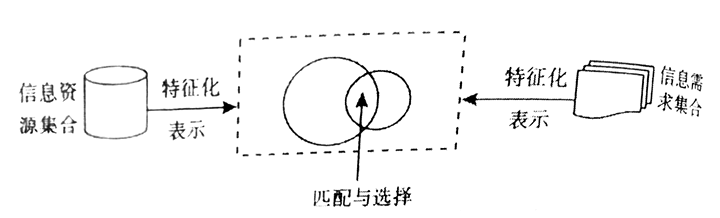

# 第六章 信息检索

信息组织 和 信息检索 是一对互逆过程

## 第一节 信息检索的基本概念与原理

### 一、信息检索的含义

信息检索：🎯

- 广义：包含信息的存储与检索
- 狭义：最后一个过程——检索

信息检索三个基本要素：人、检索工具、信息资料

信息检索系统：为满足用户信息需求而建立的，存储了经过加工的信息集合，拥有特定的存储、检索与传送的技术装备，提供一定存储与检索方法及检索服务功能的一种相对独立的服务实体 🎯

信息检索的本质：用户的信息需求与一定信息集合的匹配，潜在的相关信息是信息检索系统输出的结果 🎯

### 二、信息检索的类型与特征

1. 按存储和检索的内容划分：🎯
  - 文献检索
  - 数据检索
  - 事实检索
  - （新的三分法：文本、数值、音视频）

2. 按检索系统中信息的组织方式划分：
  - 全文检索
  - 多媒体检索
  - 超媒体检索：链接

3. 按检索要求：
  - 强相关（查准率）
  - 弱相关（查全率）

4. 按检索性质：
  - 定题检索：特定主题最新信息
  - 回溯检索：一段时间特定主题信息

检索特性：

1. 信息检索的相关性：符合吻合程度
2. 信息检索的不确定性：检索失败或放弃查找
3. 信息检索的逻辑性：查找步骤的科学安排

### 三、信息检索的基本原理

基本原理：对信息资源集合与信息需求集合的匹配与选择 🎯

1. 信息资源集合：某一领域、经选择性采集和组织加工的信息集合体
2. 信息需求集合：在社会实践活动中产生
3. 匹配与选择

### 四、信息检索的模型

对信息检索任务的数学抽象，避开具体实现细节，主要研究信息检索的两个方面：

1. 确定在模型中如何表示构成检索系统的两个要素：文档、检索条件
2. 确定在模型中如何定义和计算两个要素之间的关系

主要模型：

1. 布尔逻辑检索模型
  - 经典、首个、简单
  - 建立在经典集合论和布尔代数知识基础上
  - 与或非：AND * OR + NOT -
  - 优点：运算符少，逻辑简单
  - 缺点：没有权重，结果没有排序

2. 向量空间检索模型
  - 基于部分匹配、线性代数
  - 将检索文档和检索提问都看成是一组数值向量

3. 概率检索模型
  - 基本思想：给定一个用户提问，则检索系统中存在一个只包含与提问相关的文档的理想结果集合，记为 R，如果能找出 R 的特征及描述，就能找出全部相关文档
  - 多次交互检索
  - 缺点：
    - 各种参数估计难度较大，最初估计标引词没有先验知识时，有可能导致出入较大
    - 需要预设相关、不相关两个集合
    - 权值计算仍是二值，没有考虑词频加权

4. 模糊检索模型
  - 模糊表现：
    - 用户无法准确说明需求
    - 系统中的文献标识是部分的、不准确的
    - 大部分文献只是与用户提问部分相关
    - 用户对检索结果的满意程度具有不确定性
  - 基于隶属函数概念
  - 模糊集合理论处理的是边界不明确的集合的表示
  - 与布尔模型密切相关，保留检索功能，更为灵活

## 第二节 信息检索的发展历程

### 一、手工信息检索阶段

1. 起源与发展
  - 文献的文摘索引工作、图书馆参考咨询工作
  - 成果：
    - 大批高质量文摘性检索工具陆续被编制并投入使用
    - 检索语言的创建和实验活动十分活跃

2. 技术与方法
  - 工具：目录、索引、文摘、年鉴、手册、百科全书
  - 技术：
    - 字顺排检简述（字词顺序）
    - 分类排检技术（学科、性质）
    - 主题排检技术（自然语言）
    - 时序排检技术
    - 地序排检技术
  - 方法：
    - 顺查法：检全率高，费时费力
    - 倒查法：漏检率高，节约时间
    - 抽查法：较少的时间，较多的文献（使用此法的前提是熟悉特点）
    - 追溯法：由近及远，直观，检索效率低，检全率低，漏检率高
    - 循环法：先查出一批，再追溯

### 二、机械信息检索阶段

1. 起源与发展
  - 两种基本类型：
    - 1 机电信息检索系统：打孔机、验孔机、分类机
    - 2 光电信息检索系统：微缩胶卷边缘若干黑白小方块作为检索标志
  - 促进了自动化，但没有发展出检索语言，过分依赖设备，检索复杂

2. 技术与方法
  - 光电比机电更耐磨、存储空间小

### 三、计算机信息检索阶段

1. 起源与发展
  - 较大存储能力，高可靠性，高准确性
  - 阶段：
    - 早期脱机批处理检索：穿孔纸带
    - 联机实时检索：磁盘
    - 联机网络化检索：网络
  - 特点：
    - 以各类机读数据库为检索对象
    - 各类情报所、联机服务中心作为新兴的信息服务部门存在
    - 用户逐渐从专业人员向个人终端用户转移和扩散，普及化程度高

2. 技术与方法
  - 联机信息检索
    - 优点：速度快，范围广，检索途径多，质量高，内容新颖，实时性强，辅助功能完善
    - 缺点：主机负担重，组织方式以线性为主不够灵活，改进连接至 Internet
    - 种类：定题信息提供、专题回溯检索、联机订购原文、电子邮件
  - 光盘信息检索
    - 继纸张、微缩胶片、磁存储器之后，用激光记录和再现数据的载体
    - 优点：免除电讯设备，附带软件，容量大、耐用，动态结合多种文件
    - 缺点：多次购买经费限制，实时性低，

### 四、网络信息检索阶段

1. 起源与发展
  - 系统大多采用分布式网络化管理
  - Web 核心，搜索引擎
  - 难点：自然语言的理解处理，海量规模的处理

2. 技术与方法
  - 特点：
    - 信息量大，处理不同语言，范围更广，时效性要求更高

- 网络信息检索广义：如何组织海量多态信息，如何动态维护索引，如何设计检索算法，如何设计友好交互界面
- 网络信息检索狭义：在现实世界中有效利用网络资源的核心

## 第三节 信息检索的步骤与策略

### 一、信息检索的步骤 🎯

1. 分析研究信息检索课题
  - 明确涉及领域和范围
  - 明确所需信息的内容及其特征
  - 明确所需信息的类型
  - 明确对查新、查准、查全的指标要求

2. 选择信息检索工具
  - 指示线索型信息检索工具（二次文献）
  - 提供具体信息的工具书（三次文献）

3. 确定信息检索方法
4. 掌握获取原始信息的线索
5. 获取原始信息

### 二、信息检索策略

策略：针对检索提问、运用检索方法和技术而设计的信息检索方案 🎯

目的：达到一定的查全率和查准率

- 达到什么目标
- 要求什么限制范围
- 选择什么检索系统
- 通过什么检索途径
- 选择什么检索标识和逻辑组配
- 需要哪些反馈措施

### 三、信息检索语言

含义：根据信息检索需要创造的一种人工语言 🎯

目的：达到信息存储和检索的一致性，提高检索效率

作用：🎯

1. 描述文献及文献信息内容的特征
2. 将文献标引和检索提问、标引人员和检索人员、文献信息的存储与检索联系起来，相互对应

按表述信息内容特征划分：🎯

- 表述文献外部特征的检索语言
- 表述文献内容特征的检索语言（分类、主题）

### 四、信息检索效率的评价

理想检索：查出有关信息，过滤非相关信息

评价指标：

1. 查全率（重要）R：检出相关量 / 系统中相关量 🎯
  - 影响因素：文献库收录不全、词表结构不完整、检索策略简单、检索途径太少 🎯

2. 查准率（重要）P：检出相关量 / 检出总量 🎯
  - 影响因素：组配规则不严密、选词及词间关系不准确、标引过于详尽 🎯

3. 漏检率 O：未检出相关量 / 系统中相关量
4. 误检率 E：检出非相关量 / 检出总量

TREC 特定检索任务三个常用指标：

1. P@N：检出结果前 N 个结果的查准率 🎯
2. R-Precision：检出 R 个相关文档时的查准率
3. MAP：反映系统在全部相关文档上的性能单值指标

查全率与查准率之间的关系：互逆关系（一定程度后此高彼低）🎯

## 第四节 网络信息检索

### 一、网络信息检索的特点 🎯

1. 信息丰富，检索空间拓宽
2. 信息资源的异构式分布
3. 检索趋于简单方便，适合非专业用户
4. 交互性、目的性强

### 二、网络信息检索工具

1. 非 Web 资源检索工具：
  - FTP 类检索工具：实时联机检索
  - Telnet 类检索工具：远程登录
  - 基于菜单式检索工具：分布式信息查询

2. Web 资源检索工具：🎯
  - 关键词检索工具：搜索引擎
  - 目录型检索工具：按分类体系编制的结构式目录
  - 混合型检索工具：远搜索引擎

### 三、搜索引擎及其应用

发展：

- FTP 检索工具 Archie 定期搜集文件名信息
- WWW 上的 Spider 程序
- 再到全文检索
- 垂直型搜索引擎

搜索引擎的基本原理：

1. 独立搜索引擎的工作原理：
  - 功能模块：数据采集、数据分析与标引、数据检索、数据挖掘 🎯

2. 元搜索引擎的工作原理：
  - 并行（主要）：同时发送给多个独立搜索引擎
    - 构成：用户接口、查询代理、结果输出
  - 串行：依次发送调用链上的单个搜索引擎

应用及区别：🎯

1. 综合型独立搜索引擎：发展最早，使用最广，数量最多，通用（Google、百度、必应）🎯
2. 垂直型独立搜索引擎：出现较晚，专业、专用（音乐搜索、地图搜索）🎯
3. 元搜索引擎：自身不收集信息，调用成员引擎（MetaCrawler、Dogpile、Mamma）
4. 移动搜索引擎：基于移动网络（SMS、WAP、语音） 🎯
  - 互联网搜索引擎移动版
  - 专业移动搜索引擎：易查、宜搜
  - 垂直移动搜索引擎：去哪儿、12306
  - 应用内嵌搜索：公众号、小程序

### 四、网络信息检索的重要领域

1. 多媒体信息检索
2. 跨语言信息检索
3. 智能信息检索
4. 信息检索可视化
5. 智能问答系统

## 复习与思考

1. 掌握信息检索的基本原理，分析信息检索流程与信息组织流程之间的关系。
2. 了解信息检索的发展阶段及每个阶段所采用的主要技术手段特征。
3. 什么是检索策略，如何根据检索命题定制优化的检索策略。
4. 信息检索效率评价主要指标有哪些？它们之间是什么关系？
5. 掌握搜索引擎的基本原理，结合不同领域的实例分析不同类型的搜索引擎的应用现状及其功能特性。
