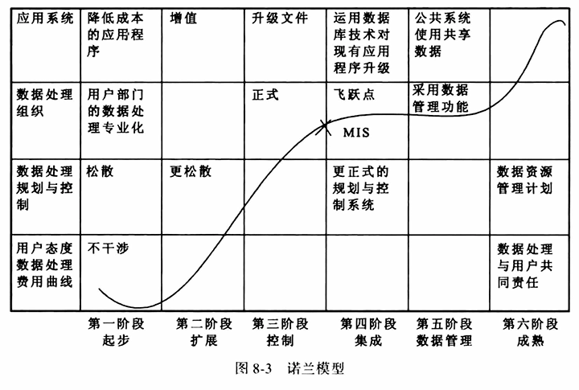
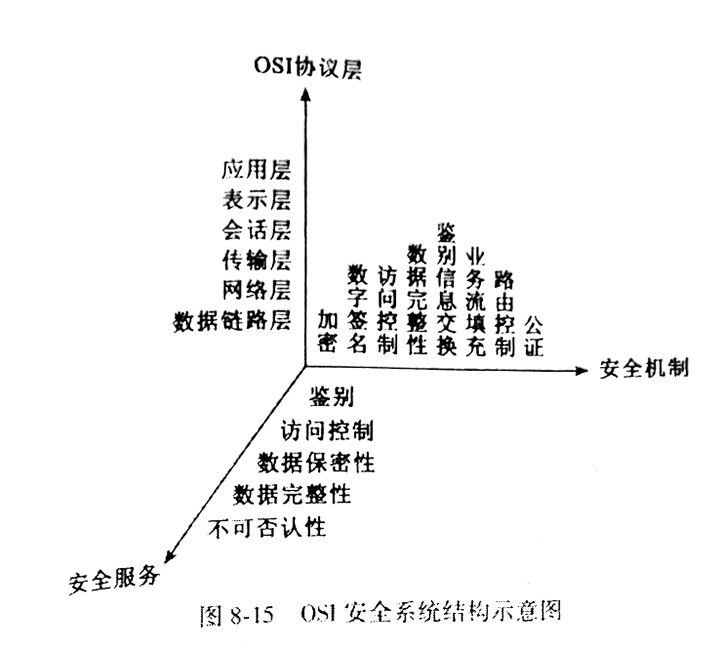

# 第八章 信息系统

## 第一节 信息系统的基本概念

### 一、系统的概念

概念：将由相互作用和相互依存的若干部分组成的具有特定功能的有机整体 🎯

1. 按构成系统的根本内容区分：
  - 物质系统：机械、电力、社会
  - 概念系统：哲学世界观、科学体系

2. 按组成系统的要素性质分：
  - 自然系统：天体、原子、生态
  - 人造系统：产业、通信、管理
  - 复合系统

3. 按系统的构成或环境的关系来分：
  - 封闭系统：系统中的流不与外界交换，只存在于概念系统中
  - 开放系统

4. 从系统的运动状态参数与时间的关系来分：
  - 静态系统：只存在于概念系统中
  - 动态系统

### 二、信息系统的概念与功能

信息系统：由计算机硬件、网络和通信设备、计算机软件、信息资源、信息用户和规章制度组成的以处理信息流为目的的人机一体化系统，目的是及时、正确地收集、加工、存储、传递和提供信息．实现对组织中各项活动的管理、调节和控制 🎯

七大组成部分：

1. 计算机硬件系统：主机、外存储器、输入设备、输出设备 🎯
2. 计算机软件系统：系统软件、应用软件 🎯
3. 数据及其存储介质
4. 通信系统
5. 非计算机系统的信息收集、处理设备：摄影、录音
6. 规章制度
7. 工作人员

五大功能：🎯

1. 输入：信息资源采集、控制指令输入，信息检索条件输入
2. 存储
3. 处理
4. 输出
5. 控制：构成系统的各种信息处理设备，整个信息加工、处理、输入、输出等环节

### 三、信息系统的发展与类型

#### 1.信息系统的发展阶段

- 最初是信息处理系统：图书情报中心基于手工的检索系统
- 各种计算机信息系统

诺兰阶段模型：

1. 起步：一台计算机开始，开始学习使用
2. 扩展：计算机部门级扩散，需要大量投资
3. 控制：成本上涨，计算机为主向数据管理为主转变，发展缓慢
4. 集成：引进数据库
5. 数据管理：共享
6. 成熟：表现在它与组织的目标一致
  - 增长六要素：
    - 1 计算机软硬件资源：磁带到分布式
    - 2 应用方式：批处理到联机
    - 3 计划控制：短期到长期
    - 4 MIS 地位：发展为独立部门
    - 5 领导模式：从底层技术主导到管理部门决策
    - 6 用户意思：作业管理层到中上层管理层

在信息系统规划中的作用：

1. 诊断信息系统当前所处的阶段，有利于选择信息系统开发的时机
2. 对系统的规划做出安排，控制系统的发展方向，对不同阶段提出限制条件和发展战略

智能信息系统是信息系统发展的归宿

#### 2.信息系统的类型 🎯

1. 从组织的管理过程和层次角度
  - 事务处理系统 TPS
  - 管理信息系统 MIS
  - 战略决策系统 DSS

2. 从组织职能的角度
  - 财务管理 FIS
  - 人力资源管理 HRMS
  - 营销管理 MIS
  - 生产管理 MRP、CIM

### 四、信息系统的架构模式 🎯

1. 主机/终端模式
  - 集中模式，大型主机结构
  - 优点：系统稳定、易于维护
  - 缺点：完全依赖主机服务器，性能要求极高，受网络影响极大，不支持大规模应用

2. C/S
  - 在分布式计算机环境中，结合大型主机机构及网络工作组两者优点
  - 以高性能的数据库服务器为中心，集中管理核心资源
  - 向安户机提供应用所需的数据支持
  - 两层结构：“胖客户端”直连数据库
  - 缺点：安装大量程序，开发成本高，管理效率差，工作效率低 🎯

3. B/S Web
  - 三层结构：浏览器/服务器/数据库
  - 重要特征：使所有应用服务都有专门的应用服务器处理 🎯
    - 既减轻了数据服务器的处理负担
    - 也可以通过不同的应用服务器使数括服务器支持不同的应用以及大规模用户的应用
  - 浏览器作为客户端，既避免了系统客户端维护管理与升级的困难，又能同门户网站无缝结合

4. 多层架构模式：浏览器、瘦客户端/Web 服务器/中间件/数据库服务器
  - 特点：
    - 1 提高伸缩性、并发性能
    - 2 中间件完成请求转发或逻辑处理，也可以作为请求代理或服务器
    - 3 增加数据安全性
  - 中间件三个层次：
    - 1 逻辑表达及动态网页服务器
    - 2 应用服务器
    - 3 系统集成服务器

## 第二节 信息系统的开发

信息技术：硬件技术、软件技术、网络技术的总称 🎯

### 一、技术基础与运行环境

1. 计算机硬件技术：
  - 时代：
    - 真空管计算机
    - 晶体管计算机
    - 集成电路电子计算机
    - 大规模集成电路和超大规模集成电路电子计算机
  - 构成：运算器、控制器、存储器、输入设备、输出设备
  - PC 基本配置：主机、显示器、打印机、键鼠

2. 计算机软件技术
  - 系统软件：
    - 各种语言和它们的汇编或解释、编译程序
    - 计算机的监控管理程序、调试程序、故障检查和诊断程序
    - 程序库和数据库管理程序
    - 操作系统：资源调度、用户接口

3. 计算机网络技术
  - 用通信介质把分布在不同地理位置的计算机、计算机系统、网络设备连接起来，以完善网络软件实现信息互通、资源共享的系统
  - 构成：网络介质、协议、节点
  - 拓扑结构：
    - 点对点传输结构：星形、环形、树形、分布式（网状）
    - 广播式传播结构：广播、电视、移动通信
  - 按通信距离：局域网、广域网 🎯

4. 数据库技术 🎯
  - 以一定的组织方式存储在一起的相关数据集合
  - 最佳的组织方式、最少的数据冗余为多种数据服务
  - 组成部分：数据集合、硬件、软件、用户
  - 发展过程：层次模型、网状模型、关系型
  - 步骤：用户需求分析、数据库逻辑设计、数据库物理设计、数据库实施与维护

### 二、信息系统开发的阶段

信息系统的开发与研制：信息系统的分析与设计

系统开发生命周期：开发信息系统的一种结构化方法，描述了从计划到维护的各个阶段 🎯

周期的七个阶段：🎯

1. 计划：定义系统；确定范围；制定计划
2. 分析：收集业务需求；需求排序
3. 设计：设计架构；设计模型
4. 开发：建立架构；建立数据库、程序
5. 测试：编写测试条件；实施测试（单元测试、系统测试、集成测试、用户接受测试）
6. 实施：编写说明书；提供培训（并行、直接、引导、分段）
7. 维护：建立帮助支持用户；提供支持系统变化的环境

### 三、信息系统开发方法

基本思想：抽象思维、形象思维

基本逻辑方法：划分、归纳、演绎

1. 从工程技术角度分析
  - 结构化生命周期法
  - 原型化方法
  - 面向对象方法
  - CASE 方法

2. 基于敏捷开发思想
  - 测试驱动法
  - 行为驱动法

3. 不同开发阶段
  - 系统分析
  - 系统设计
  - 系统实施

综合运用：

1. 结构化生命周期法：瀑布开发法
  - 传统：早期需求不清、步骤混乱、成功率低
  - 基本思想：🎯
    - 系统分析与设计阶段：自顶向下，逐层分解，由顺序、分支、循环基本结构控制
      - 功能独立、接口简明、界面清晰、使用维护方便
    - 系统实现阶段：自底向上，通过模块链接形成完整信息系统
      - 开发过程中严格按照分析、设计、实现流程开发
  - 分析与设计是结构化方法最关键的两个时期
  - 优点：结构化、严格区分阶段、各阶段目标明确、前后相成、避免盲目 🎯
  - 缺点：开发周期漫长、过程繁琐、无法充分预料变化、要求成员具有全面深刻的认识 🎯

2. 原型法：试验品、模型，用于演示 🎯
  - 在强有力的软件支持下，迅速给出具备一定功能的系统原型，通过反复协商修改，最终形成系统
  - 在分析、设计、编程、运行、评价多次循环中演进
  - 思想基础：系统中所有的需求并非都能首先定义，大量反复是必要的，也是系统的适应性所要求的 🎯
  - 四个步骤：🎯
    - 1 识别基本需求
    - 2 建立初始原型
    - 3 系统用户评价
    - 4 修正和提高原型
  - 两个类型：🎯
    - 原型最后成为运行系统
    - 在运作系统蓝图后即废止的原型
  - 优点：开发周期短、费用少、反馈及时、适应性强 🎯
  - 缺点：对开发工具、管理水平要求高、模拟大型系统困难 🎯

3. 面向对象法：对象、类、消息、继承、封装
  - 阶段：
    - 1 系统调查和需求分析
    - 2 面向对象分析
    - 3 面向对象设计
    - 4 面向对象编程
  - 优点：以对象为基础，解决传统结构化开发法中客观世界描述工具与软件结构不一致的问题，缩短开发周期
  - 缺点：需要一定的软件基础支持，对大型系统可能会造成结构不合理

4. 计算机辅助软件工程 CASE
  - 从开发者角度支持信息系统开发的计算机技术
  - “手动作坊” -> “工程化” -> “自动化”
  - 严格意义上讲：是一种环境，而不是一种方法，依赖具体的方法

5. 测试驱动开发方法
  - 开发出更高品质的、经过完整测试的程序
  - 在编写某个功能代码之前，先编写功能的测试代码，然后只编写能通过测试的代码
  - 步骤：循环
    - 1 需求拆分任务单元，编写测试代码
    - 2 实现功能
    - 3 重构优化
  - 优势：
    - 开发人员以需求为导向，而不是技术
    - 保证了代码的简洁性，避免功能冗余
    - 能尽早发现错误，减少后续测试、修复成本
    - 注重代码重构，消除重复设计，提高重用性

## 第三节 信息系统的管理

管理的目的：在预算成本和周期内完成给定需求并能正常运行

### 一、信息系统项目管理

是一项复杂的系统工程，引入工程化项目管理的理论和方法，加快开发的速度和质量，降低成本

#### 1.关于项目管理

步骤：

1. 定义好项目并确定关键点
2. 确定项目中的各方面的角色：项目经理、赞助商、核心成员
3. 确定项目阶段：启动、计划、激励、监督、结束
4. 可行性检查

#### 2.信息系统项目管理的作用

针对信息系统的特点引入项目管理的原因：🎯

1. 信息系统目标不明确、任务边界模糊，质量要求主要由项目团队定义
2. 信息系统用户需求变化，导致项目进度、费用不断更新
3. 信息系统项目开发具有智力密集性、劳动密集性等特点

项目管理的重要性：🎯

1. 可以进行系统的思考，并做出切合安际的全局性安排
2. 可为项目人力资源的需求提供确切的依据
3. 通过合理的计划安排，对项目进行最优化控制
4. 能够提供准确、一致、标准的文档数据
5. 明确职责、时间限制
6. 最小化持续报告需要

#### 3.信息系统项目管理内容

以过程为核心，以度量为基础，以人为本

管理的主要内容：🎯

1. 整体管理：计划的编制、实施、控制
2. 范围管理：只做该做的工作
3. 时间管理：优先级排序
4. 费用管理：评估、预算、分配
5. 质量管理：规划、保证、控制
6. 人力管理：有效发挥
7. 风险管理：识别、分析、制定对策、规避

### 二、信息系统质量管理 🎯

包括开发、运行过程、合作中的质量管理

信息系统的质量特性，是一个相对概念：🎯

- 从系统内部看：
  - 内部结构性能
  - 内部结构可靠性
  - 内部结构连接性

- 从用户角度看：
  - 系统功能可用性
  - 正确性
  - 适应性

主要面临的问题：

1. 信息系统适用性和可用性问题：用户和需求变化及增加
2. 信息系统稳定性问题：功能扩充
3. 信息系统开发周期问题：需求延期
4. 开发商的风险问题：尾款
5. 用户的风险：二次开发

主要思想和方法：

1. 软件质量控制理论：建立软件质量体系、目标问题度量法、风险管理法
2. 软件质量检验理论：多层次、多侧面全面测试
3. 全面质量管理：企业的一切活动都围绕质量来进行

### 三、信息系统运行与维护管理

1. 运行管理 🎯
  - 对信息系统的运行进行实时控制、记录其运行状态，进行必要的修改与功能扩充
  - 两方面的工作：
    - 1 对系统例行的检查和管理
    - 2 对系统运行情况的记录和积累

2. 维护管理 🎯
  - 目的：保证信息系统正常而可靠地运行，并能使系统不断得到改善和提高
  - 分类：
    - 1 系统应用程序维护
    - 2 数据维护
    - 3 代码维护
    - 4 硬件设备维护
    - 5 机构和人员的变动
  - 建立完善正确的标准和系统文件更为重要

### 四、信息系统评价

#### 1.信息系统评价概述

对一个系统的性能进行全面的估计、检查、测试、分析、评审

评价的实践意义四个方面：

1. 判断功能：主要是指企业资源的合理分配，项目成果与否，建设效率和效果
2. 控制功能：企业通过评价将项目的期望值传递给相关人员
3. 学习功能：掌握类似项目建设的知识和提高解决问题的能力
4. 理解功能：员工掌握项目如何支持企业的管理和发展，提高系统使用效率

#### 2.信息系统评价主体及评价内容

四类主体：

1. 系统用户
2. 信息系统项目团队
3. 高层管理人员和企业所有者
4. 外部实体

#### 3.信息系统评价阶段

三个阶段：

1. 计划阶段：事前评价
  - 制定指导原则和相关决策的过程
  - 预测性评价
  - 主要内容：管理可行性、经济可行性、技术可行性、操作可行性

2. 项目阶段：事中评价
  - 主要活动：软件配置、系统集成、测试、数据转换、培训、实施铺展
  - 主要内容：进度、质量、成本

3. 提升阶段：事后评价
  - 主要活动：系统修补、设施升级、修改业务、功能扩展
  - 主要指标：
    - 关键业务绩效达到正常或与其水平所需要的时间
    - 取得的商业利益：降低运作成本，节约库存保管费用后的利益等
    - 系统稳定运行后，实施新版本、新技术，新变革的容易性

#### 4.信息系统评价方法

1. 主观评价法
  - 以评价者或决策者的主观判断为基础
  - 指标权重专家评分法：满意度、分数、序数、评语
  - 以定性分析为主，结合部分定量计算
  - 优点：操作简单，不需要大量指标和数学公式，无法定量的直接定性
  - 缺点：缺乏客观标准，评价结果差异大

2. 客观评价法
  - 以定量计算分析为主
  - 一系列量化指标、数学模型计算得到最终评价
  - 优点：评价标准一致，结果客观，有说服力
  - 缺点：操作复杂，某些指标难以量化

用户角度系统使用效用评价：技术接受模型 TAM 🎯

两个主要因素：感知有用性、感知易用性

TTF：在 TAM 中加入考虑任务对使用的影响等因素而扩展形成的 🎯

## 第四节 信息系统的安全

### 一、信息系统安全的含义

信息系统安全：确保信息系统结构安全．与信息系统相关的元素安全以及与此相关的各项安全技术，安全服务和安全管理的总和 🎯

四层含义：🎯

1. 信息安全：免遭泄露、删改、破坏、处理能力丧失
2. 计算机安全：不被非法访问、获取、修改
3. 网络安全：保密性、认证性、完整性、可访问性、防御性、不可否认性
4. 通信安全：完整性、保密性

主要两种信息危害：🎯

1. 信息泄露：侦听、截获、窃取、破译
2. 信息破坏：人为增删改、伪造、复制

安全的影响因素：

- 数据输入、输出
- 数据存取、备份
- 源程序、应用软件、数据库、操作系统
- 硬件、通信
- 内部人员、黑客、经济间谍
- 软件非法复制、病毒
- 电磁辐射、环境保障系统

### 二、信息系统安全体系结构

主要四种基于不同原理的信息系统安全体系结构：

1. 基于协议
2. 基于实体
3. 基于对象
4. 基于代理

### 三、信息系统安全保护策略

从技术、法律、规范、道德、管理等诸方面着手

实现安全保护包含两个方面：🎯

1. 防止实体和信息遭受破坏而导致系统不能正常运行
2. 防止机密信息被破坏和窃取

主要策略分类：🎯

1. 技术性：系统内部

2. 非技术性：🎯
  - 法制保证：社会规范、技术规范（各种安全标准）
  - 行政管理：各种制度
  - 人员培训：保密、职业道德、法制教育

### 四、信息系统安全技术 🎯

1. 数据加密：对称、非对称
2. 身份认证：一次口令、数字签名
3. 防火墙：隔离
4. 交换式虚拟局域网技术：交换机节点间传送
5. 数据安全存储技术：备份（全量、增量、差异）
6. 漏洞检测技术：扫描
7. 入侵检测技术：IDS 监测

## 复习与思考

1. 诺兰模型中所描述的信息系统发展阶段的划分，及每个阶段的特征。
2. 掌握信息系统的四种主要架构模式及各自的特点。
3. 从系统生命周期角度分析信息系统开发的阶段，及每个阶段的相关活动。
4. 了解信息系统的主要开发方法及各自的特点。
5. 了解信息系统的评价阶段及评价的相关内容。
