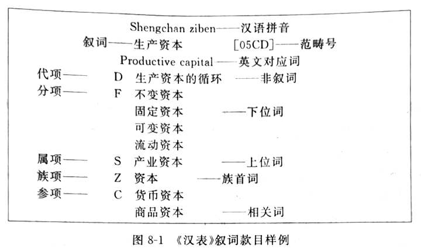
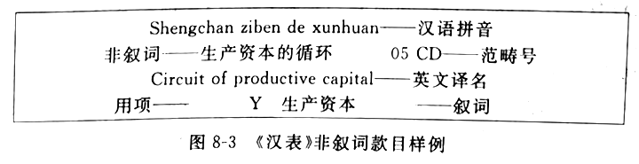

# 第一章 导言

## 第一节 信息组织的必要性 🎯

原始信息并不能产生价值，只有将其有效的组织，按特定的需要集中和展示，才能产生价值 🎯（必要性）

信息组织：对各种信息资源进行分析、选择、处理、序化，并以适当的方式提供 🎯（概念）

信息资源：一切以记录形式存在的信息载体 🎯

信息组织的目的：根据使用需要建立起信息资源收藏系统和检索工具，以便利信息资源的开发利用 🎯

组织和检索的关系：🎯

  - 信息组织：依据内容或特征，将无序变为有序，是信息检索的**基础**
  - 信息检索：根据需要，从系统中检出相应信息资源的过程，是信息组织的**目的** 🎯

## 第二节 信息组织的形式和检索途径

### 一、文献组织排列方式（形式） 🎯

1. 固定排列法：到馆顺序、专利号、标准号
2. 按一定意义次序排列：题名、责任者、分类

### 二、检索工具

按检索工具对象和特点：后面的类型住往是对前一类型的深化或发展 🎯（检索工具类型）

1. 文献目录
2. 索引
3. 机读数据库
4. 网络搜索引擎

按依据的标识特征：🎯（检索途径：资源形式、内容角度）

1. 以信息资源的**外部特征**为依据
2. 以表达信息资源**主题/内容标识**为依据：分类法、主题法

按系统中的标识是否受控制：受控检索系统、自然语言检索系统

按系统中标识组配的特点：先组式、后组式

### 三、组织类型 🎯

1. 按组织对象：信息资源、检索工具
2. 按检索工具类型：文献目录、索引、机读数据库、网络搜索引擎
3. 对检索对象：图书检索系统、论文检索系统、新闻检索系统
4. 按检索途径：题名检索工具、分类检索工具

## 第三节 信息组织的处理方式和研究内容

信息资源处理的基本做法：🎯

1. 特征描述
2. 内容浓缩
3. 提供检索点

信息组织活动包括两个基本的方面：🎯

1. 信息组织的操作
2. 信息资源组织规范
  - 信息描述规范
  - 检索语言：是一种由表达信息资源主题概念及其相互关系的词汇及规则组成的人工语言系统 🎯
  - 知识组织系统：经过组织的知识结构表达的工具 🎯

信息组织研究内容：🎯

1. 基本理论方法
2. 发展及其类型
3. 描述规范
4. 类表、词表
5. 标引理论与技术
6. 信息检索工具
7. 计算机技术在信息整序领域应用

---

# 第二章 信息组织原理

## 第一节 对信息组织的要求

信息组织系统有效检索的重要因素（基本要求）：🎯

1. 检全率：检出相关量 / 系统相关量
2. 检准率：检出相关量 / 检出总量
3. 检索速度和系统及时性
4. 系统易用性
5. 检索成本

## 第二节 信息组织中的控制与规范 🎯

1. 描述控制

2. 词汇控制 🎯（控制范围）
  - 1 同义控制：用代参照
  - 2 词义控制：括号注解
  - 3 词间关系控制：检索调整

3. 句法控制：有助于以统一、规范的方式揭示信息资源的主题或特征 🎯（主要方法）
  - 1 引用次序：即组配次序，复合主题标引和检索时，各个主题因素的组合次序 🎯
  - 2 辅助符号
  - 3 关于句式转换

4. 相关因素控制 🎯
  - 1 引用关系
  - 2 链接关系
  - 3 用户需求

## 第三节 规范控制的依据

### 一、逻辑知识

1. 概念及其内涵和外延
  - 概念是表达事物对象的特有属性或本质属性的思维形式，是检索系统交流的内容
    - 内涵：概念所反映的对象的本质属性的总和
    - 外延：指具有该属性的事物对象

2. 概念之间的关系 🎯
  - 相容：
    - 同一关系
    - 包含关系：上属下种
    - 交叉关系
  - 不相容：
    - 并列关系：拥有上位类的共同属性
    - 反对关系：两者之和 小于 上位概念
    - 矛盾关系：两者之和 等于 上位概念

### 二、知识分类

现有不同层次：🎯（类型）

- 科学 分类体系
- 学科 分类体系
- 事物 分类体系
- 行业 分类体系

信息资源组织对分类的借鉴：🎯

1. 作为信息资源分类的基础
2. 作为基本类目门类的设置依据
3. 作为主题系统中范畴处理的依据
4. 作为专门领域下具体类目的设置依据
5. 作为类目之间关系、词间关系处理的依据

### 三、信息资源组织的特点

1. 文献保证原则 🎯
  - 信息资源组织应根据信息资源类型、数量等因素进行相应控制

2. 用户保证原则 🎯
  - 根据用户需要进行描述控制和词汇控制

3. 与设备条件相适应

---

# 第三章 信息描述

## 第一节 信息描述的意义

信息描述的结果，是描述记录：元数据

元数据：与传统文献编目中的著录款目性质相同，是一种电子环境中使用的著录数据 🎯

信息描述作用：识别、定位、检索、选择 🎯

### 二、信息描述的规范 🎯

便于不同机构之间的信息交换

- 《国际标准书目著录总则》
- 《文献著录总则》（我国）

## 第二节 信息资源描述项目、标识和描述级次

### 一、信息描述项目

信息描述项目：揭示文献内容和特征的记录事项，亦称**著录项目** 🎯（定义）

1. 基本描述项目 🎯
  - 《文献著录总则》
    - 1 题名和责任者项目：重要特征
    - 2 版本项：鉴定差别
    - 3 文献特殊细节项
    - 4 出版发行项
    - 5 载体形态项
    - 6 丛编项
    - 7 附注项
    - 8 文献标准编号及有关记载项
    - 9 提要项
  - 《都柏林核心集》
    - 1 题名
    - 2 创作者
    - 3 主题
    - 4 描述
    - 5 出版者
    - 6 参与者
    - 7 日期
    - 8 资源类型
    - 9 格式
    - 10 资源标识
    - 11 来源
    - 12 语言
    - 13 关联
    - 14 覆盖范围
    - 15 权限管理

2. 描述子项目：准确揭示信息资源的特点

### 三、描述格式和详略级次

1. 描述格式 🎯
  - 著录正文：各项特征
  - 提要：内容介绍

2. 详略级次 🎯
  - 项目划分：主要、选择
  - 级次划分：简要、基本、详细

描述信息源：进行信息资源描述时描述信息的来源和出处 🎯

## 第三节 检索点和规范文档

### 一、检索点

1. 检索点的意义 🎯
  - 指检索信息资源所使用的题名、责任者等各种供检索使用的数据
  - 标目：手检系统中的检索点 🎯
    - 作用：作为排检的依据、决定款目的性质 🎯

2. 题名检索点的选择 🎯
  - 1 正题名一般直接选作标目
  - 2 适当选择副题名、合辑题名作标目
  - 3 并列题名一般不选作标目
  - 4 一般不宜超过两个

3. 个人责任者检索点的选择 🎯
  - 1 第一责任者、两人合著中的第二个责任者名称均可以选作标目
  - 2 文献责任者中记录的其他责任者亦可选择作为标目
  - 3 附注项著录的责任者，以及其他有关责任者，一般不作标目
  - 4 以书名命名的编写组不作检索点
  - 5 丛书综合款目的责任者选择与单书相同
  - 6 文献中责任者检索点的数量一般以不超过 4 个

4. 参照法：指引用户从检索工具中的一个标目查找另一个标目的方法 🎯（含义及类型）
  - 单纯参照、相关参照、一般参照

### 二、名称规范档

含义：根据信息组织的需要，对元数据记录的标目进行控制、跟踪、维护的工具 🎯

范围：人名、机构团体名、著作题名 🎯

作用：🎯

1. 有利于以统一的方式加以记录
2. 以规范、通用的形式加以记录
3. 方便标引和检索
4. 有助于实现国际书目共享

## 第四节 计算机编码

### 一、计算机编码及其作用 🎯

1. 用以显示
2. 提供检索点
3. 数据一体化处理，促进资源共享

### 二、机读编目 MARC 格式

MARC 含义：根据文献特点和文献机构之间信息交换的需要建立的标准化的计算机可读形式 🎯

结构组成：🎯

1. 记录头标区
2. 地址目次区
3. 数据字段区
4. 记录分隔符：表示不同记录之间区分 🎯

---

# 第四章 信息描述工作

## 第一节 信息描述工作概述

元数据在检索系统中的作用：🎯

1. 向用户提供目录学信息，确认信息资源
2. 进行组织和检索的依据，是建立检索工具的基础和前提

信息描述工作：依据描述规则，对信息资源的特征进行分析、选择、记录的操作过程 🎯

信息描述工作要求：🎯

1. 准确：真实反映，客观记录
2. 规范：严格遵守描述规范
3. 完备：通过各种特征检索

### 二、信息描述工作的方式 🎯（划分）

按描述资源对象：

1. 文献 编目
2. 档案 编目
3. 博物馆藏品 编目
4. 网络资源 编目

按描述操作设备条件：

1. 手工 编目
2. 机读 编目
3. 联机 编目

按处理方式：

1. 原始 编目
2. 复制 编目

按编目采用的组织形式：

1. 集中 编目：中心机构编目，向其他机构提供数据
  - 在版 编目：在文献出版的过程中进行编目，使得编目数据和文献一起提供，方便使用 🎯

2. 共享 编目：两个及以上机构联合编目

书目机构：大规模信息资源描述网络，信息资源编目的最新进展 🎯

### 三、信息描述工作程序 🎯

1. 查重
2. 描述
3. 标引：分类标引、主题标引
4. 复核并输入系统

元数据创建方式：🎯
  - 1 已有记录修改完善
  - 2 相关记录，修改创建
  - 3 创建新记录

## 第二节 信息描述方法

### 一、题名的描述方法

题名分类及著录方法：🎯

1. 正题名：文献的主要名称
  - 1 单纯题名
  - 2 交替题名（又名）
  - 3 合订题名（多名）

2. 并列题名
3. 副题名
4. 说明题名的文字

### 二、责任者项

组成：责任者、责任方式

责任者类型：🎯

1. 个人责任者：一人或多人
2. 集体责任者：组织或机构

责任方式：🎯

1. 责任者对文献所做的贡献类型
2. 著、编、译、注、点校

责任者项著录方法：🎯

- 一般保留原貌，清以前作者记录朝代，外国记录国别
- 外国对原责任者名称作颠倒或必要处理，同时著录原文
- 单一责任者按照原文著录
- 合著者为两人时照录，第二责任者前用 “，” 标识
- 合著者为三人以上时只著录第一人

文献特殊细节项：为特殊类型文献的特征所设置 🎯
  - 传统文献地图信息：数学基础项（比例尺、地图投影）
  - 非书资料：数量规格项、系列项

### 四、载体形态项、丛编项、附注项

1. 载体形态项：物质形态特征（数量、图、尺寸或开本、附件）🎯
2. 丛编项
3. 附注项
4. 语种项
5. 类型项
6. 格式项
7. 覆盖范围项
8. 关联项：与其他资源的关联类型 🎯

### 七、检索排检项

传统手工卡片式目录：文献题名、责任者名、主题词、分类号 🎯

### 八、简短讨论

传统文献著录规则 和 《都柏林核心集》

相同之处：🎯

- 都设置了完备的描述项目，比较完整地揭示信息资源的基本特征
- 都对描述的等级、标识以及规范的使用作出相应的规定
- 都具有比较强的扩充性、兼容性

差别：🎯

- 传统文献描述规范 主要是针对传统文献描述和识别的需要设置的
  - 描述项目设置充分，对传统资源特征的描述项目的设置详尽
  - 对网络资源的描述项目相对比较概括
  - 有明确的等级性、次第性
  - 对描述的表达也有严格要求
  - 采用人工标识，适合专业文献单位使用

- 《都柏林核心集》是根据网络资源的特点和需要
  - 简明灵活
  - 选择性、兼容性
  - 语法独立
  - 可重复、可扩展

## 著录识别

```
信息组织①/马张华②.－北京: 清华大学出版社③,2009④

334页⑤:25cm.⑥

ISBN 978-7-302-17155-3⑦:CNY42.00⑧

I. 信... Ⅱ. 马... Ⅲ. 信息管理-高等学校-教材 ⑨Ⅳ. G203⑩

---

① 正题名       ② 责任者       ③ 出版者      ④ 出版日期    ⑤ 页数
⑥ 尺寸         ⑦ 国际标准书号 ⑧ 价格        ⑨ 主题        ⑩ 分类号
```

---

# 第五章 分类法

## 第一节 分类法概述

### 一、分类法的意义

分类：依据事物的属性或特征进行区分、类聚，并将区分的结果按照一定的次序予以组织的活动 🎯（含义）

信息资源分类：一种从主题/内容角度系统组织和揭示信息资源的方法 🎯（含义）

信息资源分类特征：🎯

1. 按照内容特征的相互关系进行组织
2. 从一定角度出发组织和揭示信息资源
3. 采用一定的标记符号作为排序工具
4. 通过类目索引提供字顺查找途径

信息资源分类作用：🎯

1. 进行资源组织
2. 建立分类检索工具
3. 分类统计
4. 兼容工具

### 二、分类法的类型 🎯

分类法：根据类目之间的关系组织起来的，并配有一定标记符号的类分信息资源的工具 🎯

按照其编制方式分：

1. 等级列举式
  - 《杜威十进分类法》、《中国图书馆分类法》
  - 优点：🎯
    - 分类结构显示直观，易于把握、便于使用
    - 类目设置均衡，可根据使用进行适当调整
    - 标记简明，适于分类排架，也可以用于组织分类检索工具
  - 缺点：🎯
    - 揭示专门主题能力差
    - 类表具有一定的凝固性，不便调整检
    - 难以与科学的发展保持同步
    - 大型列举类表篇幅较大，类表管理要求高

2. 分面组配式
  - 《冒号分类法》
  - 优点：🎯
    - 标引专指，可以通过基本概念的组配，充分揭示信息资源中的复合主题
    - 标记表达性强，便于根据不同需要，调整组配次序，进行多元检索
    - 对科学发展的适应性强，组配表达新的复杂主题
    - 类表的篇幅较小，便于管理
  - 缺点：🎯
    - 类目体系是隐含的，直观性不够
    - 类目的分布往往不够均衡
    - 标引难度较高
    - 分面标记成分复杂，号码元长，不宜文献排架，主要用于组织检索工具

3. 列举-组配式：两者的结合
  - 《国际十进分类法》
  - 在详尽类表的基础上，广泛采用各种组配方式的分类法
  - 优点：🎯
    - 以列举式类表为基础，具有一定的直观性
    - 广泛采用组配方法，可以达到分面类表同等标引水平
  - 缺点：🎯
    - 管理修订工作需要较大的工作量
    - 类目之间的组配往往使用多种辅助符号，标记复杂、冗长

按照类目体系展开的维度分：

1. 单维：传统分类法
2. 多维：网络分类法（超文本）

按学科领域分：综合性分类法、专业分类法

按文献类型分：图书分类法、期刊分类法、专利分类法

## 第二节 分类法结构剖析

分类法的结构组成：类目体系、标记符号（分类号）、说明与注释、类目索引 🎯

### 一、类目体系

类目体系：按照类目之间的关系建立起来的类目集合，又称类目表，是分类法的主体，是分类语言进行词汇控制的主要依据 🎯

类目体系构成：基本大类、简表、详表、复分表 🎯

- 主表：
  - 1 基本部类：最概括、最本质的划分，一般不明确或单独列出
  - 2 基本大类：分类法整体框架的体现
  - 3 简表：展开二、三级，承上启下
  - 4 详表：分类法的主体和正文

- 附表：复分表，是分面组配的一种基本使用形式
  - 作用：🎯
    - 缩小类表的篇幅
    - 加强类表的伸缩性
    - 增强类表的规律性
  - 类型：🎯
    - 通用复分表
    - 转类复分表

### 二、标记符号（分类号）

相应的符号系统来表示类目的次序和关系，用来标识类目的代号 🎯

#### 1.分类号的要求 🎯

1. 简明性
2. 表达性
3. 容纳性
4. 助记性

#### 2.号码种类 🎯

1. 单纯号码
2. 复合号码

#### 3.编号制度 🎯

1. 顺序标记制
2. 层累标记制
3. 顺序——层累标记制
4. 分面标记制

#### 4.标记技术 🎯

1. 八分法
2. 双位制
3. 借号法
4. 预留空号法
5. 对应编号法
6. 字母标记法

### 三、说明、注释和索引

1. 说明与注释
2. 类目索引：为了克服类目查找的困难编制的一种辅助工具，不能直接作为分类的依据 🎯
  - 1 直接索引
  - 2 相关索引
  - 3 主题词索引

## 第三节 类目体系的建立

类目体系的建立两种方式：划分（本书采用）、归纳

类目体系建立的步骤：🎯

1. 类目划分
2. 引用次序
3. 同位类排列
4. 横向关系的揭示和处理
5. 类名确定
6. 类目之间的关系及其形式

### 一、类目的划分

类目：依据一定属性对事物区分和类集的结果，同时又是可分的 🎯

类目划分：依据一定的属性或料征对类目的处延进行区分，生成一组子目的过程

### 二、引用次序

指复合主题在标引和检索中，不同主题因素的组配次序

### 三、同位类排列

同位类：从同一个上位类区分出来的一组处于同等地位的子类 🎯

同位类序列方法：🎯

1. 时间先后顺序
2. 事物进化顺序
3. 空间次序
4. 逻辑次序
5. 依存次序
6. 惯用次序
7. 实用顺序
8. 字顺次序

### 四、横向关系的揭示和处理

基本做法：🎯

1. 设置交替类目（主要方法）
2. 建立参照
3. 设置选择类目
4. 设置选择类表
5. 规定类目的归属

### 五、类名的确定 🎯

选择要求：科学、简明、确切、通用

### 六、类目之间的关系及其形式 🎯

1. 从属关系
2. 并列关系
3. 交替关系
4. 相关关系

## 第四节 网络分类法组织特点和揭示形式的变化

### 一、网络分类法与传统文献分类法的不同 🎯

1. 揭示角度
  - 传统文献：以学科为中心
  - 网络分类：以主题为中心或主题结合学科组织体系

2. 类目设置特点
  - 传统文献：根据资源和一定的用户对象进行
  - 网络分类：增加了网络资源的形式类目，根据需求，做较大变动

3. 展开形式
  - 传统文献：基本上采用线性序列
  - 分类引擎：超链接多维结构

4. 同位类排列方式
  - 传统文献：按照类目的关系排列
  - 搜索引擎：字顺、点击频率、类目特征

5. 适用特点
  - 传统文献：重视学术性与通用性的结合
  - 网络分类：重视用户兴趣

### 二、类目组织和揭示形式的变化 🎯

1. 改进主题之间多维关系的揭示
2. 从多个角度组织信息资源
3. 进行轮排
4. 通过设置形式类目，提前设置重点类目
5. 动态组织分类体系
6. 用于联结不同的检索系统
7. 联结说明与规则系统

---

# 第六章 国内外主要分类法介绍

## 第一节《杜威十进分类法》 DDC

### 一、发展概况

DDC: 杜威十进分类法 🎯（简称、全称）

### 二、类表结构 🎯

1. 类目表
  - 主表
  - 附表
  - 索引
  - 使用手册

2. 标记符号 🎯
  - 采用单纯阿拉伯数字，所有数字按小数对待
  - 前三级类目一律用三位数字标示，三级以下用小圆点隔开
  - 基本按层累制方式编号

3. 类目索引

### 四、简短评价

是现代文献分类法发展史上的一个里程碑

特点：🎯

1. 首先使用相关排列法，统一了文献单位的图书排架和目录组织
2. 首先采用数字层累标记制，通用性好，易排易检，易于扩充、组配，具有较强的助记性、等级性
3. 类目体系等级分明，列类详尽 易于理解，便于使用
4. 首先配置详细的相关索引，提供从主题字顺系统的角度查找类目途径，便利分类表的使用
5. 建立稳定管理机构，根据需要进行定期修订，适应发展

不足：🎯

1. 大类体系未能反映学科门类之间的联系
2. 类目的设置已不能适应现代科学发展的需要
3. 小数标记便于扩充，但也造成一些专指主题的号码过长，不利于文献排架
4. 修订中的类目变动和凤凰表的编制，必然会对图书馆和文献单位的重新分类带来实际问题

## 第五节 《中国图书馆分类法》 

中图法：中国图书馆分类法 🎯（简称、全称）

### 二、类目体系

基本大类：🎯

1. 马克思主义、列宁主义、毛泽东思想
2. 哲学
3. 社会科学
4. 自然科学
5. 综合性图书

### 四、标记符号

汉语拼音与阿拉伯数字结合

辅助符号：🎯

1. 推荐号 `a`
2. 总论复分号 `-`
3. 关联符号 `:`
4. 国家区分号 `()`
5. 时代区分号 `=`
6. 民族种族 `“”`
7. 通用时间、地点 `<>`
8. 联合符号 `+`

### 六、简评

特点：🎯

1. 大类体系合理，符合现代文献分类的特点
2. 类目体系的展开系统、适用
3. 重视类表的灵活性
4. 追求编号技术的最佳结合
5. 发理了适合各科规模和对象的文献收藏的配套产品
6. 管理健全

不足：🎯

1. 部分类目体系仍存在进一步完善问题
2. 通用复分表的完善改进
3. 分类法系列中不同类表之间的协调

---

# 第七章 分类标引工作

## 第一节 分类标引概述

### 一、分类标引的意义和要求

分类标引：又称为归类，是指依据一定的分类语言，对信息资源的内容特征进行分析、判断、选择，赋予分类标识的过程 🎯

要求：准确、充分、一致、适用 🎯

### 二、类目辨析 🎯（辨析类目关系）

想要正确归类，必须掌握类目辨析的方法：🎯

1. 根据上、下位类关系
2. 根据同位类之间的关系
3. 根据类目注释
4. 根据类目体系展开的规律

### 三、号码配置方法

中图法号码配置两种情况：🎯

1. 可以通过主表直接获得表达一信息资源的完整分类号码
2. 结合不同成分的号码进行组配标引：🎯
  - 1 复分表
  - 2 仿分
  - 3 类间组配

中图法号码配置注意问题：

1. 删除含义相重的号码
2. 组配次序 🎯
  - 按照类表注释指定的顺序
  - 注明使用复分表配号，应配于该主类号之后
  - 复分超过一次时，各次复分号码均应按注释规定的次序配号
3. 关于复分、仿分中号码加 0
4. 复分组配的依据
5. 复分的注释方式

### 四、标引工作程序 🎯

1. 查重
2. 主题分析
3. 主题概念转换：归类
4. 确定标识：给号
5. 审核

## 第二节 分类标引规则 🎯

### 一、基本分类规则 🎯

是整个分类过程中始终必须遵循的，具有指导作用的规则

1. 信息资源的分类应根据信息资源的性质，接照其各自的特点进行
2. 信息资源的分类必须能体现分类法的逻辑性、等级性、次第性
3. 信息资源必须归入最切合其内容的类
4. 类分的文献必须归入用途最大的类
5. 不能单凭题名、篇名的意义归类
6. 应注意标引的思想性

### 二、一般分类规则 🎯（分类原则）

从著作方式的角度提出来的，适用于各个知识门类的分类规则

  - 单主题信息资源：论述某一特定事物对象的资源 🎯
  - 多主题信息资源：同时论述两个及以上事物对象的资源 🎯

## 第三节 分类排架与分类检索系统 🎯

### 一、分类排架

分类排架：分类标引的目标之一，是对文献本身进行分类组织 🎯

1. 同类书区分的意义 🎯
  - 分类标引通过给信息资源配号，可以将同类资源集中在一起，不同内容特征的资源分开

2. 同类书排列的类型 🎯（方法）
  - 1 按到馆次序顺排
  - 2 按题名字顺排
  - 3 按出版的年代排
  - 4 按分编次序排：按种次号排 🎯
    - 同一种书的不同版本、卷次、复本均使用同一号码
    - 种次号：按照同类书分编先后，按每一种书为计数单位顺序编制的号码
    - 特点：🎯
      - ① 号码简短，不超过 100 种时，两位即可
      - ② 结合标引程序获取种次号，取号方便
      - ③ 可以把同一种文献集中在一起，便于进行藏书清点和分类统计
    - 不足：🎯
      - ① 不能将同类同著者的文献集中
      - ② 号码的确定具有偶然性，各馆种次号无法统一
      - ③ 与特定类目联系，分类法修订后，须同时改变种次号
      - ④ 需进一步区分同一种文献的版本、卷次
  - 5 按著者姓名字顺排
    - 著者号
    - 著者号码表：一种依据著者名称的音或形，按一定取号方式编制的表 🎯
  - 同类书排列作用：实现同类书个别化的目的 🎯

3. 分类索书号的编制 🎯
  - 分类索书号：又称分类排架号，表示一文献在分类收藏中位置的号码 🎯
  - 是文献单位进行文献分类排架、用户检索和藏书清点的依据

### 二、分类检索系统

分类检索系统分类：🎯

- 按照检索的单元：分类目录、分类索引
- 按照其设备条件：手工检索系统、计算机检索系统
- 按照其处理的资源对象：文献检索系统、档案检索系统、专利检索系统、网络资源检索系统等

---

# 第八章 主题法

## 第一节 主题法概述

### 一、主题法的含义

主题法：分类法以外另一种从内容角度标引和检索信息资源的方法 🎯

主题法特征：🎯

1. 直接以语词作为检索标识
2. 以字顺作为主要检索途径
3. 以特定的事物、问题、现象，即主题为中心集中信息资源
4. 往往是通过参照系统等方式揭示主题词之间的关系

### 二、主题法的类型 🎯

1. 标题法
  - 以标题词作为主题标识，以词表预先确定的组配方式标引和检索的主题法
  - 特点：🎯
    - 采用列举式词表，形式直观
    - 定组式标题结构固定，含义明确
    - 按照列举的标题和副标题标引，操作简便
    - 主要通过参照方式对词汇进行控制，并揭示标题之间的相关性
  - 不足：🎯
    - 列举方式，收词量巨大、专指度不足、修订量大
    - 大量定组式标题，手工检索无法从多个因素、角度检索，影响检索效果

2. 元词法
  - 以元词作为主题标识，通过字面组配的方式表达信息资源主题的主题法
  - 元词：用来标引信息资源主题的、最基本的、字面上不能再分的语词
  - 率先探索了后组式检索方法
  - 特点：🎯
    - 词表体积小
    - 标引专指度高
    - 便于从不同主题词角度检索
    - 适合对专指主题进行标引
  - 不足：🎯
    - 直接性差
    - 不宜用来查找论述基本主题的文献
    - 字面组配与语义不一致时容易造成误差
    - 早期元词法不建立参照系统，无法进行相关资料检索

3. 叙词法
  - 叙词：又称主题词，经过规范化处理的，以基本概念为基础的表达文献主题的词和词组 🎯
  - 汲取元词法、标题法及分面组配式分类法等的优点，更加准确
  - 特点：🎯
    - 结构完备，词汇控制严格
    - 组配准确，标引能力强
    - 检索效率高，多途径检索
    - 对检索系统的适应能力强
  - 不足：🎯
    - 词汇控制严格，词表编制和管理的要求高，花费较多人力、物力
    - 须在概念分析的基础上进行，增加标引难度

4. 关键词法：计算机应用

## 第二节 叙词表的结构 🎯

叙词表：主题标引和检索的主要工具，又称为主题词表 🎯

作用和特点：🎯

1. 知识结构：揭示概念之间的关系，帮助理解相应知识领域的主题关系
2. 词汇控制工具：指导标引者和用户使用一致的语词进行标引和检索
3. 术语参照系统：使得用户可以通过它扩大或缩小查找范围
4. 动态的词汇集合：使得任何新的概念可以以能够理解的方式纳入词汇系统中的相应位置

### 一、字顺显示

1. 字顺表：是一种由众多叙词款目和非叙词款目按字顺排列的一览表 🎯

叙词款目：🎯



非叙词款目：🎯



2. 专有叙词表：附表，是将众多专有叙词款目按字顺排列的一览表
  - 作用：🎯
    - 1 缩小主表的篇幅，使字顺表更加紧凑、简明
    - 2 便于用户从范畴出发对专有叙词进行查检
    - 3 便于对有关领域的专有叙词及时进行管理或增补

3. 双语种索引 🎯
  - 将全部叙词、非叙词与相应外语译名相互对应，按外文译名字顺排列的索引系统

### 二、系统显示 🎯

1. 范畴索引
  - 亦称分类索引、范畴表
  - 是一种按照词汇所属学科或专业范畴编制的概略分类系统 🎯
  - 是从**分类角度**查找叙词的辅助工具
  - 作用：🎯
    - 1 提供从内容角度查词的途径，便于从分类角度查找与某一范畴有关的叙词
    - 2 可以作为概略分类的依据，类分信息资源，编制分类检索工具
    - 3 是编表选词、处理词间关系的工具，在词汇分类的基础上处理，有助于提高词汇控制的有效性和可操作性

2. 词族索引
  - 词族：一组具有属分关系的叙词集合
  - 词族索引：一种以词族为款目单元，按照款目词的字顺排列 🎯
  - 是一种从**等级关系**的角度查找叙词的索引
  - 作用：🎯
    - 1 可以从词族出发查词，利用索引对族系关系的完整显示，自由扩大或缩小查找范围，改善标引和检索的效果
    - 2 在计算机检索系统中，可自动进行上位词登录，满足族性检索的要求
    - 3 可通过等级关系限定词义

3. 轮排索引
  - 将词表中的叙间按词素的字顺排列，使含有同一词素的叙词集中显示于一处的词汇表 🎯
  - 是一种从**词素角度**查找叙词的辅助工具
  - 作用：🎯
    - 1 增加检索入口，用户可以从词素角度出发对叙词进行查找
    - 2 根据轮排索引按词素集中叙词的特点，帮助使用者选择最合适的叙词
    - 3 编表时可以利用其字面成族的特点，发现语词之间的联系，进行词间关系处理

4. 分类主题一体化词表 🎯
  - 是一种**分类语言**和**主题语言**兼容互换的系统
  - 类型：分面叙词表、分类主题词表、集成词表 🎯
  - 作用：🎯
    - 1 可作为分类标引和主题标引的工具，同时进行标引，两种标引数据可以相互转换，节省成本
    - 2 用户可以通过它，在一个检索系统中同时进行分类检索和主题检索，充分利用两者的优点，改进检索效果
    - 3 可以通过两者的结合，改进和完善对类表的编制，包括改进选词的全面性和均匀性、构造词间关系的完整性、准确性，改进词表编制的质量和统一管理等
    - 4 可以成为不同检索语言之间兼容互换的工具

## 第三节 叙词语言的词汇控制

控制范围：词汇选择、词形控制、词义控制、词间关系控制 🎯

### 一、词汇选择

1. 词汇选择原则
2. 词汇类型
3. 先组词的选择
  - 先组词：以复合概念的语词形式收入词表的词，即词组 🎯
  - 后组词：以单元概念的语词形式收入词表的词，即单词 🎯

### 二、词形控制与词义控制

1. 词形控制
  - 根据主题标引和检索的需要对语词形式及构成成分作出规定，以保证排列效果，方便检索

2. 同义控制
  - 对一义多词及含义相近或有联系，可以根据需要相互代替的语词之间的控制

3. 词义控制
  - 主要是对一词多义现象进行控制，使其具有明确性和单义性

### 三、词间关系控制 🎯

叙词表中叙词之间主要有三种关系：🎯（词间关系）

<table border>
  <thead>
    <tr>
      <th>关系</th>
      <th>参照符号含义</th>
      <th>汉语用符号 🎯（标记）</th>
      <th>英文用符号</th>
      <th>国际通用符号</th>
    </tr>
  </thead>
  <tbody>
    <tr>
      <td rowspan="3">等同关系</td>
      <td>用 ✅</td>
      <td>Y</td>
      <td>USE</td>
      <td>→</td>
    </tr>
    <tr>
      <td>代 ✅</td>
      <td>D</td>
      <td>UF</td>
      <td>=</td>
    </tr>
    <tr>
      <td>组代</td>
      <td></td>
      <td>UFC</td>
      <td>&</td>
    </tr>
    <tr>
      <td rowspan="5">等级关系</td>
      <td>分 ✅</td>
      <td>F</td>
      <td>NT</td>
      <td>></td>
    </tr>
    <tr>
      <td>属 ✅</td>
      <td>S</td>
      <td>BT</td>
      <td><</td>
    </tr>
    <tr>
      <td>族</td>
      <td>Z</td>
      <td>TT</td>
      <td></td>
    </tr>
    <tr>
      <td>(属种)分<br>(属种)属</td>
      <td></td>
      <td>GNT<br>GBT</td>
      <td></td>
    </tr>
    <tr>
      <td>(整部)分<br>(整部)属</td>
      <td></td>
      <td>NTP<br>BTP</td>
      <td>&gt;P<br>&lt;P</td>
    </tr>
    <tr>
      <td>相关关系</td>
      <td>参 ✅</td>
      <td>C</td>
      <td>RT</td>
      <td>-</td>
    </tr>
  </tbody>
</table>

1. 等同关系
  - 指一叙词与含义相同或相近，可以相互替代的语词之间的关系
  - 可以增加检索入口和根据使用需要对标引、检索的专指度进行控制

```
叙词
  D 非叙词

非叙词
  Y 叙词
```

2. 等级关系
  - 指上位概念叙词和下位概念叙词之间的一种关系，亦称属分关系

```
西欧
  F 爱尔兰
    比利时
    ...
  S 欧洲
```

3. 相关关系
  - 叙词之间除等同关系、等级关系之外语义相关的一种关系

```
查全率
  C 查准率
```

## 第四节 叙词表的编制与维护

叙词表的编制：🎯

1. 总体设计
2. 选词
3. 词汇整理
4. 展开词表
5. 审核和试验
6. 出版

---

# 第九章 国内外主题词表介绍

## 第一节 《美国国会标题表》：《LCSH》

LCSH 是美国国会图书馆在编目实践的基础上编制起来的标题表

世界上使用最广的主题法

## 第三节 《汉语主题词表》：《汉表》

### 一、发展概况 🎯

1994 出版《中图法》类目与《汉表》主题词对应的基础上编制的分类法——《中国分类主题词表》

附表： 🎯

1. 附表一：世界各国政区名称
2. 附表二：自然地理区划名称
3. 附表三：组织机构
4. 附表四：人物

### 四、辅助索引 🎯

通过改变组织方式，提供从不同途径着手查找叙词的工具

1. 范畴索引
2. 词组索引
3. 轮排索引
4. 英汉对照索引

### 五、概要评价

特点：🎯

1. 结构完备
2. 词汇丰富
3. 探索了词表编制方法
4. 探索了叙词表的实际使用方法
5. 国内广泛使用的综合性主题标引工具

不足：🎯

1. 结构上，印刷型词表因篇幅巨大，组成分散，加之编排不紧凑，整体性较差
2. 在词汇上，存在个别专业收词过多，不同专业之间收词数量不平衡的问题
3. 词间关系处理上，等同率低，影响易用性
4. 缺乏健全的管理机制，影响发展和使用
5. 仅自然科学部分的词表实现了机读化

## 第四节 《中国分类主题词表》：《中分表》

### 一、发展概况

将分类法与主题法、先组与后组融为一体的一种文献标引和检索的工具

### 二、《分类号一主题词对应表》结构和特点

结构：以《中图法》的类目体系为基础，把《汉表》题词及主题词组配形式，对应于各级类目之下编制而成的、从分类角度进行分类主题一体化标引的工具 🎯

特点：以分类法为中心，由分类法与对应的主题词及组配标题形式即主题词串结合而成的一体化标引系统 🎯

款目构成要素：分类号、类名、类目注释及对应的主题词、主题词串、对应参见和注释 🎯

### 三、《主题词一分类号对应表》结构和特点

结构：主题词及参照项或主题词串与对应的分类号、各种符号以及对应注释等 🎯

与《汉表》的字顺表相比，《主题词一分类号对应表》的不同包括：🎯

1. 收词范围除《汉表》主题词外，还包括近年来中文图书标引中的新增词和《分类号——主题词对应表》中的新增词，收词较全，能更好的反应学科领域的发展，适应各种文献资料的标引
2. 不仅收入单词和词组，而且包括主题词组配标题形式，同时采用后组和先组结合的方式，便利对复杂标题的标引
3. 不仅显示主题词的相关关系，而且在族首词下对等级关系进行完整显示，相当于将字表与词族索引合并，功能完备，详略得当
4. 对应的标识为《中图法》的分类号，而不是范畴类号，可以直接据此查找《分类号一主题词对应表》，方便分类标引
5. 将所有主题词、主题词串集中于一表，比《汉表》结构紧凑
6. 改进了排检方法，采用音序和字形结合排序，符合人们的查找习惯

### 四、概要评价

特点：🎯

1. 通过将《中图法》类目与《汉表》主题词的对应，建立起了一个分类语言与主题语言结合的一体化工具，可以利用它，同时进行分类主题的标引和检索，简化操作程序，降低标引难度，改进标引和检索的质量
2. 其分类法部分是将《中图法》《资料法》融为一体的类目体系，可以同时供图书资料单位标引使用；在作为图书标引工具时，《资料法》部分类目，可以作为《中图法》对应类目的说明对待
3. 其主题法部分，除收入原有的叙词外，还包括近年来中文图书标引中新增的叙词和对应表编制时的新增词，以及《分类号一主题词对应表》中出现的主题词组配形式，是《汉表》叙词比较完整的版本
4. 改进了字顺表的款目结构，改进了排检方法，采用音序和字形结合排序，符合人们查找习惯，使得编排紧凑，便于查找，易于使用

不足：🎯

1. 本表中的类目和对应的主题词之间只是一种先组语言和后组语言之间的兼容互换关系，很难进行两者之间的精确转换，不少类目下对应主题词的数量往往不充分，不能详尽包括标引类目深层含义或隐含主题
2. 类目的处理由人工按照概念关系的理解转换而成，存在随意性和不一致性，有时过多，有时过少，有时存在着错误，影响对应的质量

---

# 第十章 主题标引和主题检索工具

按是否使用词表分：🎯
- 受控标引：依据词表赋予检索标识
- 自由标引：直接采用自然语言词语进行标引

## 第一节 主题标引概述

主题标引：依据一定的主题词表或主题标引规则，赋予信息资源语词标识的过程 🎯

### 一、主题标引与分类标引的异同

相同之处：🎯

1. 揭示的对象相同
2. 依据的数据来源相同
3. 操作程序相同
4. 基本处理方法相同

不同之处：🎯

1. 主题分析的角度
  - 分类标引：学科、专业
  - 主题标引：对标引对象的确切揭示

2. 转换途径
  - 分类标引：以分类表为工具
  - 主题标引：以字顺系统为主要途径

3. 标识
  - 分类标引：分类号
  - 主题标引：主题词

4. 揭示特点
  - 分类标引：以学科体系作为类目展开的基础，子目的列举受先组式体系的束缚，适合对资源的整体内容进行标引，对主题对象的揭示比较概括
  - 主题标引：通过组配方式表达主题内容，对主题对象的揭示则较为专指，适合对资源包括的主题进行灵活揭示，充分反映信息资源包含的主题成分

### 二、标引方式

主题标引方式分类：🎯

1. 整体标引：浅标引，是一种概括式标引 🎯
2. 全面标引：深标引，是一种充分揭示信息资源论及的所有符合检索系统要求的主题概念的标引 🎯
3. 对口标引：重点标引，是一种只揭示资源中适合本专业需要的主题内容的标引 🎯
4. 综合标引：是一种以集合型信息资源的整体为单位进行的概括性标引 🎯
5. 分析标引：是一种根据资源中部分片段或集合型资源的构成单元进行的标引 🎯

## 第二节 主题标引方法 🎯

主题分析：根据标引和检索的需要，对信息资源的内容、特征进行分析，提炼主题概念的过程 🎯

主题标引过程：主题分析、主题概念的转换、标识的确定 🎯

### 一、主题分析

1. 分析主题类型 🎯
  - 1 单主题、多主题：研究对象数量
    - ① 单主题
    - ② 多主题
    - ③ 联结主题：两个及以上主题对象之间根据一定的联系形成的一种主题类型 🎯
      - 分类：应用关系、比较关系、影响关系、因果关系、倾向关系 🎯
  - 2 单元主题、复合主题：主题概念数量 🎯
  - 3 主要主题、次要主题：重要程度
  - 4 专业主题、非专业主题：专业相关程度
  - 5 显性主题、隐性主题：表达方式 🎯

2. 分析主题结构 🎯
  - 信息资源主题的构成因素以及它们之间的相互关系
  - 具影响力的主题关系结构模式：
    - 1 科茨的显著性引用次序
    - 2 阮冈纳赞的以 5 个基本范畴为基础的引用次序
    - 3 英国分类法研究小组的标准引用次序
    - 4 我国：**主题分面公式**，五种基本主题因素 🎯
      - `主体因素——通用因素——空间因素——时间因素——文献类型因素`

3. 主题分析误差及克服方法 🎯
  - 主题分析常见误差：
    - ① 主题概念提炼不足：影响检全率
    - ② 主题概念提炼过度：影响检准率
    - ③ 主题概念提炼错误：都影响
  - 主题分析误差克服办法：
    - ① 信息资源的客观论述情况：只提炼论述了的内容，揭示有价值的主题
    - ② 检索系统的专业性质：综合还是专业
    - ③ 检索系统的标引深度：概括还是描述
    - ④ 符合检索语言的特点：分类/主题两者在分析角度、引用次序、专指度、主题分析深度方面存在的差异
    - ⑤ 隐含概念的分析：了解专业知识，把握隐含概念

### 二、主题概念的转换

转换：以一定的词表为工具，将析出的主题概念转化为规范化的主题词（叙词），并根据检索系统的要求，对标识作出处理 🎯

转换方法：🎯

1. 直接转换：可以直接用词表上的一个叙词加以表述 🎯
2. 分解转换：没有现成的主题词可供直接标引，分解成简单主题概念，分别以相应的主题词转换 🎯

### 三、标识的确定

分类：

1. 机检词的处理
2. 确定标题
3. 标引词的著录

## 第三节 主题标引规则

### 一、主题标引的基本规则

1. 主题标引的查词规则 🎯
  - 1 采用正式叙词标引
  - 2 采用专指叙词标引
  - 3 组配标引：当词表中没有相应专指叙词时，选用最接近的两个及以上的叙词进行组配标引 🎯
  - 4 上位叙词标引
  - 5 靠词标引
  - 6 增词标引
  - 7 自由词标引
  - 8 对每一文献标引的叙词数量，应视情况而定，注意深度的一致性

2. 主题标引的组配规则 🎯
  - 将两个或两个以上叙词按照一定的逻辑关系结合在一起，表达文献主题
  - 分类：
    - 1 交叉组配：使用若干个具有交叉关系的叙词进行组配，表达一个复合的子概念（冒号）🎯
    - 2 限定组配：表示事物的叙词和表示事物特称、属性或方面的叙词进行组配，表示一个专指的子概念（短横，逗号）🎯
  - 组配规则：🎯
    - 1 叙词组配必须是概念组配
    - 2 优先采用交叉组配
    - 3 组配不能越级进行
    - 4 组配必须选用与文献主题关系最密切、最邻近的叙词进行
    - 5 组配结果应具有单义性
    - 6 对并列多主题文献进行分组标引
    - 7 按照规定的次序确定标题
    - 8 控制好标题的级别和数量

### 二、各种主题、信息资源类型的标引

1. 单主题信息资源的标引 🎯
  - 1 简单单主题资源：直接按资源论述对象，即事物、学科、现象等进行标引
  - 2 复合主题的资源：根据论述的对象和方面作组配标引，必要时可以进行轮排

2. 多主题信息资源的标引 🎯
  - 1 并列关系主题的资源：根据论述的主题对象分组标引，但如并列主题的数量较多（4+），通常应采用上位叙词标引
  - 2 从属关系主题的资源：根据主题论述的情况进行，凡同时论述大主题和小主题的资源，应分别对论述主题分组标引
  - 3 联结主题的资源：根据主题之间的关系类型进行标引，并应依据不同主题对象互为主、副标题，予以轮排

## 第四节 主题检索工具

主题标引的目的：编制检索工具

按设备条件分类：🎯

1. 手检工具（先组）：主题目录、主题索引
2. 机检系统（后组）

### 一、手工主题检索工具

手工检索工具的类型：主题目录、主题索引 🎯

主题检索系统组成：主题款目、指导片、参照片 🎯

1. 主题款目的编制
  - 主题款目：表达信息资源内容的主题标识为标目的款目 🎯

2. 主题检索系统中的参照片的编制
  - 作用：🎯
    - 1 揭示标题之间联系
    - 2 增加检索入口
    - 3 减少款目编制数量，节省编目费用
    - 4 揭示不同检索系统之间的联系
    - 5 便利用户掌握使用
  - 形式：
    - 1 单纯参照：不使用的标题指向使用的标题或其他标识的参照 🎯
    - 2 相关参照：由一个使用的标题指向另一个内容相关的用作主题标目的参照 🎯
    - 3 一般参照：关于查找方法的指示或编制规则的说明 🎯

3. 主题检索工具中的助检标志

4. 主题检索工具的排列 🎯
  - 中文的字顺排序，有按拼音，笔画笔型，四角号码等

### 二、主题机检系统

主题机检系统：以主题词为检索标识的检索系统，是计算机检索系统的重要组成部分 🎯

包括：文献单位以图书为对象的目录系统、以论文为对象的检索系统 🎯

主题机检系统一般采用后组式，通过在检索阶段主题词的组配进行检索 🎯

主题机检系统的结构：输入模块、存储模块、检索模块
  - 中心结构：存储模块的数据集合
    - 顺序文档：文献档，元数据
    - 倒排档：以可检字段的标识为中心，后列文献号 🎯

拼音索引：

```
C
   陈一  005002
   陈二  005006
   陈三  007003
```

倒排档：

```
登录号 标引词
1034 金融体制改革 中国
1035 银行管理体制 金融体制改革 中国

---

金融体制改革 1034 1035
银行管理体制 1035
中国 1034 1035
```

---

# 第十一章 自然语言标引与检索

## 第一节 自然语言概述

类型：🎯

1. 关键词法
2. 文本检索：一种不进行标引，直接利用计算机的功能，通过自然语言中的语词对信息资源的文本数据进行匹配检索的方式 🎯
3. 自由标引
4. 自然语言入口词检索
5. 自动标引

## 第二节 关键词语言

### 一、关键词法概述

编制步骤：🎯

1. 将经过少量人工处理的文献篇名输入计算机
2. 计算机自动进行分词和抽词，并使用禁用词表过滤
3. 通过轮排，使每个关键词都轮流用作标目，同时保留其上下文
4. 拼接索引款目、排序和编辑，最后交付印刷

特点：🎯

1. 在标引阶段只作少量控制或不作控制，基本上属自然语言类型
2. 通常使用禁用词表来淘汰题名中的非关键词：介词、连词、冠词
3. 一般不建立关键词表

### 二、关键词语言的类型

1. 题内关键词索引 KWIC 🎯
  - 特点：🎯
    - 1 结合使用禁用词表选定文献标题中的关键词，将其作为确定关键词索引条目的依据
    - 2 关键词的排检点设于标题的中部，所有索引条目按关键词的字顺竖向排列
    - 3 关键词前后保留文献篇名中的上下文，如文献名称过长，则以轮排的方式移至条目的前后
    - 4 款目后跟随该信息资源地址

2. 题外关键词索引 KWOC 🎯
  - 对 KWIC 的改进：🎯
    - 1 将索引标目的位置从中部移至左端或左上方
    - 2 并在标目下完整列举文献篇名
    - 3 原篇名中的关键词用特定符号代替或予以保留
    - 4 其后显示文献地址

3. 双重关键词索引 🎯
  - 结合 KWIC 和 KWOC

### 三、关键词索引的性能 🎯

优点：🎯

1. 简便易行，无须查看词表，降低对标引人员的要求，节省标引时间
2. 易于使用计算机编制，实现计算机化，保证及时性及高效低本
3. 能够及时更新词汇

不足：🎯

1. 索引质量受文献题名质量影响
2. 用户很难依靠自己查全
3. 题名中的通用概念，没有实际检索意义
4. 计算机进行汉语关键词标引需要解决词汇切分问题

改进方法：🎯

1. 调整禁词表
2. 进行人工干预，增补关键词，删除不符标题
3. 改进关键词表
4. 使用后控词表，利用对同义词、相关词的处理改进检索

## 第三节 文本检索

### 一、文本检索的发展

由三个模块组成：输入、存储、检索 🎯

## 第四节 后控词表

后控词表：一种在检索阶段才进行控制使用的词表 🎯

特点：不像传统的控制词表那样在标引阶段对标识实施控制，而是在检索阶段通过同义控制和相关词推荐等方式提供检索帮助 🎯

实施方式：🎯（控制方式）

1. 在标引与检索阶段均对词汇进行控制，同时在标引和检索阶段使用词表（先控）
2. 标引阶段对词汇进行控制，检索阶段不控制（先控）
3. 标引与检索阶段均不实施控制（单纯自然语言系统）
4. 标引阶段不进行控制，在检索阶段实施控制（后控）

### 二、后控词表的特点 🎯

1. 不承担标引功能，只用于检索控制
2. 词汇控制不如先控词表严格
3. 入口词丰富
4. 动态性强
5. 有较强的灵活性和自由度
6. 具有面向文献和用户的特点
7. 词间关系不同于传统词表

## 第五节 自动标引

### 一、发展概况

自动标引：很据一定算法，由计算机赋予文献检索标识的过程 🎯

自动标引类型：自动主题标引、自动分类标引 🎯

### 二、自动主题标引

自动主题标引：计算机自动赋予**语词标识**，表达信息资源主题内容的过程 🎯

1. 自动抽词标引 🎯
  - 计算机直接从**文本**中抽取词或短语，来表达信息资源主题内容的标引方法
  - 简单词频统计法不足：没有考虑选为标引词的术语对文献的区分性能（局部大量出现）
  - 改进方案：🎯
    - 1 相对频率法
    - 2 反文献频率法
    - 3 位置法

2. 自动赋词标引 🎯
  - 从某种形式的**受控词表**中选取词语来表达文献主题内容
  - 分类：基于关联词表、基于中介词典 🎯

### 三、自动分类标引

自动分类标引：计算机代替人工对文献或信息进行分类，赋予**分类标识**，以描述文献主题内容的活动 🎯

1. 文献自动归类（有指导的分类）🎯
  - 基于预先构建的类表基础上进行的自动分类类型（人工分类的延续）

2. 文献自动聚类（无指导的分类）🎯
  - 从待分类对象中提取特征，对特征进行比较，根据一定的原则将具有相同或相近特征的对象定义为一类，并根据情况对类目进行调整的分类方法
