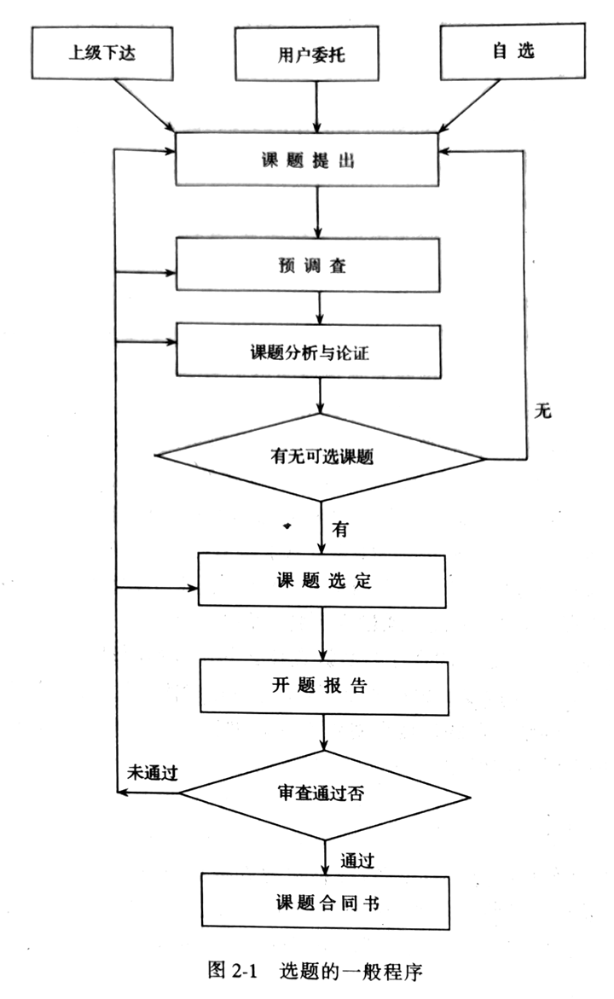

# 第二章 信息分析的流程

## 第一节 课题选择

### 一、课题来源 🎯

1. 上级主管部门下达的课题（被动）：国家各级政府部门、企事业单位
2. 信息用户委托的课题（被动）：信息分析机构课题的主要来源（灵活、开放、竞争、高效）
3. 信息人员自己提出的课题（主动）：长期积累、主动调查（熟悉需求、涉猎广泛、思路开阔、前瞻性、成果丰硕）

### 二、选题原则 🎯

1. 政策性原则：避免假大空，在政策指导和约束下具有方向性和前瞻性，战略性和预测性
2. 必要性原则：与社会发展吻合、与用户需求相一致，而不是重复和可有可无的
3. 可行性原则：根据分析机构自身条件来考虑（人力、财力、物力、时间）
4. 效益性原则：投入产出，相辅相成

### 三、课题类型 🎯

1. 为制定政策进行信息分析：经济发展必须有正确、稳定的政策与计划指导
2. 配合科研项目的课题：利用已有的科研成果，进行新的研究创造，不断推陈出新，如此循环往复，以至无穷
3. 配合大型工程项目的课题：分析技术先进性，经济的合理牲、社会的可行性
4. 配合技术与设备引进的课题：既要考虑技术上的先进性与适用性，又要考虑经济上的合理性
5. 配合产品开发的课题：提高产品质量，改进老产品，开发新产品
6. 配合管理活动的课题：科学管理提高工作效率

### 四、选题程序 🎯

1. 课题提出
  - 上级提出往往目标不太明确具体，需要进行整理、归纳
  - 分析人员自己提出的要注意联系实际

2. 课题分析与论证
  - 明确课题目的、范围、对象、意义、要求、难度、费用、完成期限
  - 对课题实施的政策性、必要性、可行性、效益性等进行初步论证

3. 课题选定并写出开题报告
  - 经过分析论证的课题可能不止一个，需要筛选和确定
  - 重大课题需要写出开题报告：研究意义、研究目标、研究内容、拟解决的问题、技术路线、国内外研究现状、研究基础
  - 上级下达的签订课题合同书

## 第二节 制定课题研究计划 🎯

1. 课题目的：背景、解决问题、服务对象、成果经济效益
2. 调查大纲：调查方式、调查范围、调查步骤、调查广度和深度
3. 研究方法
4. 预计成果形式：资料汇编、综合报告、可行性论证
5. 人员分工：对外联系、翻译、采集、计算机操作、研究解决问题、撰写报告
6. 完成时间与实施步骤：收集摸底阶段、整理分析阶段、制作利用阶段
7. 课题计划表：名称、主要内容、完成期限、进度安排、研究条件、研究方法、技术路线、经费预算、课题负责人

## 第三节 信息收集

信息分类：🎯

1. 文献信息：印刷、微缩、机读、声像
2. 非文献信息：实物、口头

信息收集方法：

1. 文献调查：文献
2. 实际调查：非文献

### 一、文献信息收集方法

收集文献信息主要渠道：手工检索、计算机检索 🎯

文献收集常规方法：

1. 常规法：通过主题、分类检索
2. 顺查法和倒查法：时间顺序，大范围顺查，小范围倒查
3. 追溯法：附录参考文献为线索，不断扩大，难以反映全貌
4. 纵横法：课题中代表性作者为线索，纵横两个方法扩大获取

网络信息资源学科化、专业化、专题化

### 二、非文献信息收集方法

1. 非文献信息收集的渠道 🎯
  - 1 口头：专业研讨会、展览会、商品交易会、技术鉴定会、商品订货会、产品展销会、信息发布会
  - 2 实物：实物本身可以直接消费，满足人们的物质需求

2. 实际调查方法：一切以信息收集为目的的社会实践活动的总称 🎯
  - 原则：客观、全面、深入
  - 特点：
    - 1 针对性强，互动性好
    - 2 直观性强，原始数据多
    - 3 内容新、速度快
    - 4 形式多样，渠道广泛
  - 主要方法：问卷调查
    - 调查表设计：
      - 构成：基本信息、行为信息、态度信息
      - 考虑：方式、顺序、数量（不超过 25 个、半小时）、难易程度、提问语言
      - 方式：自由式、封闭式、事实性、态度测量式
    - 互联网问卷：时效性强、成本低、客观性好、交互性好、抽样丰富、质量控制
    - 网上调查方法：站点法、E-mail 法、随机 IP 法、视讯会议法

## 第四节 信息整理、鉴别与分析

- 整理：从无序变为有序，便于利用
- 鉴别：剔除质量低劣、内容不可靠、偏离主题、重复的资料
- 分析：系统分析，定性定量，提出观点，得出结论，形成新的信息产品

### 一、信息整理

两个层次：🎯

1. 形式整理：是一种粗线条的信息初级组织
  - 按载体分类整理：纸张、磁盘、光盘、缩微品、视听材料、实物
  - 按使用方向分类整理
  - 按内容线索分类整理

2. 内容整理
  - 分类整理
  - 数据整理
  - 观点整理

### 二、信息鉴别（标准）🎯

1. 可靠性：客观、真实地反映科学研究与生产实践活动（真实性、完整性、科学性、典型性）
2. 先进性：时间上的新颖性，空间上的发展水平
3. 适用性：信息对于用户可利用的程度

### 三、信息分析

信息分析是整理和鉴别的延续，是后续阶段报告编写的基础

信息分析的创造性和智能性的特点正是通过该阶段才充分体现出来的

## 第五节 报告编写

### 一、研究报告的结构 🎯

结构是影响报告质量的关键因素，为达到某种目标就会有一定的文章结构与之对应

1. 题目：单标题、主副标题、冒号并列标题
2. 绪言：阐明本课题的基本状况
3. 正文：核心部分
4. 结论：分析研究，简明表达
5. 参考文献
6. 附录

### 二、研究报告的撰写程序 🎯

1. 确定主题：主题是一篇文章所要体现的总的意图或基本观点
2. 选择材料：主题必须通过一定的材料来表现，材料，是为了写作而收集到的用以表现主题的各种事例、数据和观点等
3. 设计结构：结构是文章各组成部分的总体布局和全部材料的具体安排（符合规律，严谨自然；表现主题，完整协调；适应体裁，灵活多样）
4. 拟定提纲：拟写提纲是写好文章的必要条件（结构合理、逻辑正确、层次清晰、结构均衡）
5. 撰写初稿
6. 修改报告

### 三、研究报告的类型 🎯

1. 供领导参考的研究报告：避免专业，简练鲜明，条理清晰，图文并茂
2. 供专业人员参考的研究报告：深度广度，数据详细

两者都有，则分为主件和附件
