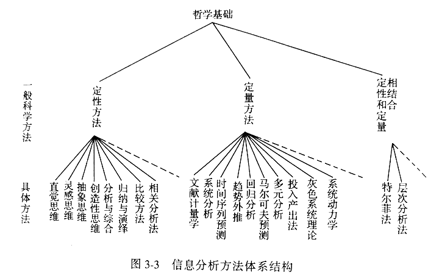

# 第三章 信息分析方法

## 第一节 方法与方法论

### 一、方法的概念 🎯

方法是人类认识世界、适应世界和改造世界的思路、途径、方式和程序

方法的四要素：目的性、工具、对象、合乎规律的活动

方法的四个层次结构：

1. 思路：线索
2. 途径：路径
3. 方式：形式
4. 程序：次序

### 二、方法论的概念 🎯

对方法进行研究的科学，是比方法更高一层次的东西

是有关方法的性能、评价、应用、开发、结构体系以及规律性的知识体系，是系统化的理性认识

具有浓厚的哲学色彩和抽象色彩，通行的方法及方法论的研究统称科学方法或科学方法论

方法论除了阐述单个的方法之外，更重要的是要寻求各种方法之间的联系，发现规律，进而指导方法综合运用

方法论已经成为一切理论和实践的开拓、改革、成功、发展的最基本的前提条件

方法论的层次：

1. 哲学方法论：认识世界
2. 一般科学方法论：具体学科
3. 具体科学方法论：具体领域

## 第二节 信息分析方法的来源

信息分析是一项综合性很强的学科，它与自然科学、社会科学、管理科学、决策学、科学学、系统工程等诸多学科相互联系和交叉

信息分析方法的含义：在综合吸收其他许多学科和领域的有关方法的基础上，逐步形成了信息分析某些基本的、常用的方法 🎯

信息分析方法的六个来源：🎯

1. 逻辑学的方法：逆向思维、综合比较、定性方法
2. 系统分析的方法：起支配、指导作用，关联树法、环境扫描 OSA 法
3. 图书情报学的方法：目录学、文献检索、文献计量、引文分析、内容分析
4. 社会学的方法：研究假设、社会测度
5. 统计学的方法：相关分析、回归分析、聚类分析、确立模型
6. 未来学(预测学)的方法：趋势外推法、特尔菲法

## 第三节 信息分析方法体系

### 一、信息分析方法的历史发展

两个阶段：🎯

1. 20 世纪 60 年代前：与科学研究密不可分，是直接为科研服务的
2. 20 世纪 60 年代后：逐渐形成
  - 第一，随着科学技术和经济的不断发展和相互融合，社会的不断进步，信息分析领域与内容也随之拉大和深化
  - 第二，现代科学学科与方法的创立、发展和移植
  - 第三，电子计算机普及

### 二、信息分析方法的分类 🎯

1. 定性研究方法：
  - 含义：获得关于研究对象的质的规定性方法 🎯
  - 主要逻辑学方法：分析与综合、相关与对比、归纳与演绎 🎯
  - 常用方法：比较法、分析法、综合法、推理法
  - 特点：对研究对象宏观定性分析，而非微观数量关系；直感性强，容易学习掌握；推理严密，有说服性

2. 定量研究方法
  - 含义：获得关于研究对象的量的特征的方法 🎯
  - 过程：🎯
    - 1 用精确的数值代替模糊的印象
    - 2 依据数学公式导出精确的数量结论
    - 3 将结论的数量形成解释为直观性质
  - 具体方法：文献计量分析法、回归分析法、预测分析法、系统分析法 🎯
  - 缺点：无法跟踪瞬间、未来的状态；偏差导致违反常识；分析人员陷入数据圈套

3. 定性与定量相结合的研究方法
  - 冲破了传统信息分析方法多用定性研究方法、很难保证分析结果准确性和重复性的局限
  - 定性是定量的基础，定量是定性的精确和具体化，两者对立统一

### 三、信息分析方法的体系结构 🎯

体系构建原则：

1. 各种方法之间的相互联系性
2. 方法体系的动态性和开放性

信息分析方法体系是在实践中不断积累和发展而形成的，且与研究对象和研究领域的发展变化相一致
