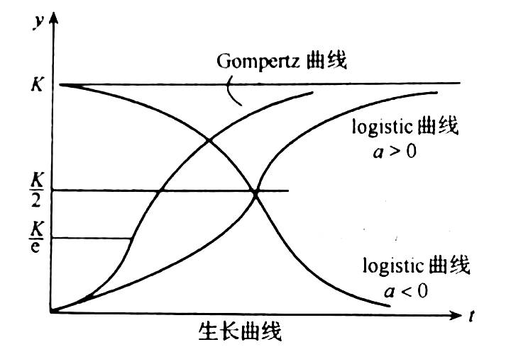
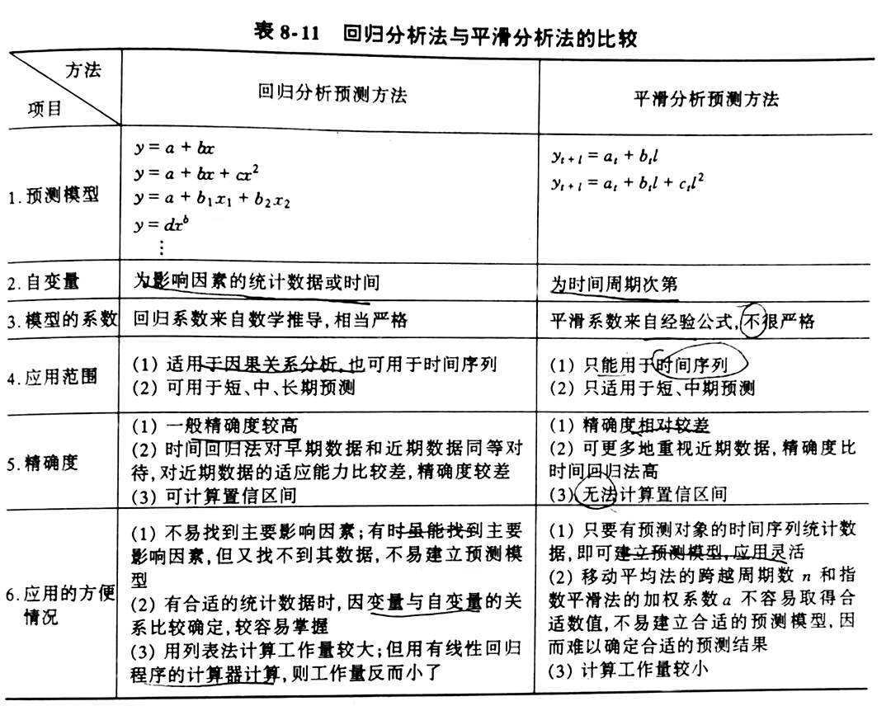

# 第一章 信息分析概论

我国 20 世纪 90 年代末，提出信息化体系六要素：

1. 信息资源（第一要素）
2. 国家信息网络
3. 信息技术应用
4. 信息技术和产业
5. 信息化人才队伍
6. 信息化政策法规与标准规范

信息的收集、存储和组织是信息资源开发利用的前提条件，信息分析则是信息资源开发利用的高级形式

只有通过信息分析，才能实现对信息资源的深层次开发

## 第一节 信息分析的含义

### 一、信息分析的定义

“情报研究”六种观点：重新组合、分析综合、软科学、选择使用、再生情报、竞争情报

信息分析：对信息进行分析

- 信息：内涵是**社会信息**，外延广泛
- 分析：与“综合”对应的科学范畴

含义：🎯

- 成因：以社会用户的特定需求为依托，
- 方法：以定性和定量的研究方法为手段，
- 过程：通过对社会信息的系列化加工过程，
- 成果：形成新的、增值的信息产品，
- 目的：最终为不同层次的科学决策服务的一项具有科研性质的智能活动

### 二、相关概念辨析

1. 美国：信息分析中心
2. 日本：情报分析部会

### 三、相关领域辨析

1. 信息分析与科学研究：
  - 信息分析是科学研究的重要部分，是前提
  - 不同之处：
    - 对象：社会 VS 自然
    - 目的：提供方案 VS 揭示规律
    - 手段：调查 VS 仪器
    - 方法：考察 VS 实验
    - 作用：间接 VS 直接

2. 信息分析与软科学研究
  - 软科学：
    - 研究社会组织和管理的学科总称
    - 用现代科学研究方法和手段，阐明现代社会复杂的政策课题，为决策提供科学依据
  - 信息分析是软科学研究的基础
  - 信息分析是有别于软科学研究的一类研究活动
    
3. 信息分析与咨询服务
  - 咨询业：
    - 以科技、经济、工程等知识或信息转换为基本特征，运用专业特长，解决用户实际需要，促进决策科学化为主要目的的产业
    - 与政府不是隶属关系，而是商业关系
  - 信息分析、软科学、咨询服务的基础活动都是：信息的采集、加工、传递和反馈，为科学决策服务
  - 工作性质上：信息分析属于咨询业范畴
  - 经营方式上：向咨询业转变发展（一部分仍属于政企，另一部分面向社会和市场）
  - 有一体化趋势，但还需长期磨合

4. 信息分析与竞争情报
  - 竞争情报：关于竞争环境、对手、策略的信息研究，是市场竞争激化和社会信息化高度发展的产物，是信息分析工作的新发展
  - 相同点：信息采集、评价、分析、综合的加工过程
  - 不同点：
    - 1 竞争情报以增强企业竞争实力为宗旨，全方位，目的明确
    - 2 竞争情报以市场竞争为内容，以竞争对手为核心，有强烈的对抗性和针对性
    - 3 竞争情报更关注动态信息的把握，强调快速反应性和时效性
    - 4 竞争情报为企业服务，攸关生存发展，明显的决策性和增值性

- 与科学研究、咨询服务、竞争情报是包含与被包含关系
- 与软科学研究是交叉关系

## 第二节 信息分析的类型 🎯

### 一、按领域划分

1. 政治
2. 经济
3. 社会
4. 科学技术
5. 交通通信
6. 人物
7. 军事

### 二、按内容划分

1. 跟踪型：技术跟踪型、政策跟踪型
2. 比较型：定性 + 定量
3. 预测型：定性 + 定量
4. 评价型：层次分析法、模糊综合评价法

### 三、按方法划分

1. 定性分析
2. 定量分析
3. 定性与定量结合

## 第三节 信息分析的特点与作用 🎯

### 一、信息分析的特点

1. 研究课题的针对性与灵活性
2. 研究内容的综合性与系统性
3. 研究成果的智能性与创造性
4. 研究工作的预测性与近似性
5. 研究方法的科学性与特殊性
6. 研究过程的社会性

### 二、信息分析的作用

基本功能：

1. 整理（基础性）（基础）
2. 评价（基础性）（前提）
3. 预测（特征性）（拓展）
4. 反馈（特征性）（延伸）

特征性功能作用点在决策上：决策功能

- 预测：初始决策
- 反馈：修正决策

具体作用：

1. 在科学管理中发挥参谋和智囊作用
2. 在研究开发中担负助手作用
3. 在市场开拓中起保障和导向作用
4. 在动态跟踪与监视中起耳目和预警作用

## 第四节 信息分析的产生与发展 🎯

### 一、信息分析的产生

信息分析是信息工作的重要组成部分，其产生与社会发展紧密相连

- 首先产生于科技领域
- 近代科学技术时期：15 世纪 ~ 19 世纪 70 年代
- 现代科学技术发展前期：19 世纪 70 年代 ~ 二战前夕（文摘刊物，萌芽）
- 二战后大科学时代：独立的科技信息工作机构
- 20 世纪中期以来：迅猛发展，电子电路技术，现代化信息服务业务

### 二、信息分析的发展

渗透到各个领域，要求变高：

1. 信息量激增，提高数量和质量
2. 信息资源生命周期缩短，提高效率
3. 定性以外，提高定量分析的比重

发展方向：

1. 内容领域综合化
2. 服务方式社会化
3. 技术手段现代化：软件 + 网络
4. 业务经营的产业化：商品性
5. 交流合作的国际化

# 第二章 信息分析的流程

## 第一节 课题选择

### 一、课题来源 🎯

1. 上级主管部门下达的课题（被动）：国家各级政府部门、企事业单位
2. 信息用户委托的课题（被动）：信息分析机构课题的主要来源（灵活、开放、竞争、高效）
3. 信息人员自己提出的课题（主动）：长期积累、主动调查（熟悉需求、涉猎广泛、思路开阔、前瞻性、成果丰硕）

### 二、选题原则 🎯

1. 政策性原则：避免假大空，在政策指导和约束下具有方向性和前瞻性，战略性和预测性
2. 必要性原则：与社会发展吻合、与用户需求相一致，而不是重复和可有可无的
3. 可行性原则：根据分析机构自身条件来考虑（人力、财力、物力、时间）
4. 效益性原则：投入产出，相辅相成

### 三、课题类型 🎯

1. 为制定政策进行信息分析
2. 配合科研项目的课题
3. 配合大型工程项目的课题
4. 配合技术与设备引进的课题
5. 配合产品开发的课题
6. 配合管理活动的课题

### 四、选题程序 🎯

1. 课题提出：整理、归纳，联系实际
2. 课题分析与论证：明确指标，初步论证
3. 课题选定并写出开题报告

## 第二节 制定课题研究计划 🎯

1. 课题目的：背景、解决问题、服务对象、成果经济效益
2. 调查大纲：调查方式、调查范围、调查步骤、调查广度和深度
3. 研究方法
4. 预计成果形式：资料汇编、综合报告、可行性论证
5. 人员分工：对外联系、翻译、采集、计算机操作、研究解决问题、撰写报告
6. 完成时间与实施步骤：收集摸底阶段、整理分析阶段、制作利用阶段
7. 课题计划表：名称、主要内容、完成期限、进度安排、研究条件、研究方法、技术路线、经费预算、课题负责人

## 第三节 信息收集

信息分类：🎯

1. 文献信息：印刷、微缩、机读、声像
2. 非文献信息：实物、口头

信息收集方法：

1. 文献调查：文献
2. 实际调查：非文献

### 一、文献信息收集方法

收集文献信息主要渠道：手工检索、计算机检索 🎯

文献收集常规方法：

1. 常规法：通过主题、分类检索
2. 顺查法和倒查法：时间顺序，大范围顺查，小范围倒查
3. 追溯法：附录参考文献为线索，不断扩大，难以反映全貌
4. 纵横法：课题中代表性作者为线索，纵横两个方法扩大获取

网络信息资源学科化、专业化、专题化

### 二、非文献信息收集方法

1. 非文献信息收集的渠道 🎯
  - 1 口头：专业研讨会、展览会、信息发布会
  - 2 实物：实物本身可以直接消费，满足人们的物质需求

2. 实际调查方法：一切以信息收集为目的的社会实践活动的总称 🎯
  - 原则：客观、全面、深入
  - 特点：
    - 1 针对性强，互动性好
    - 2 直观性强，原始数据多
    - 3 内容新、速度快
    - 4 形式多样，渠道广泛
  - 主要方法：问卷调查
    - 调查表设计：
      - 构成：基本信息、行为信息、态度信息
      - 考虑：方式、顺序、数量（不超过 25 个、半小时）、难易程度、提问语言
      - 方式：自由式、封闭式、事实性、态度测量式
    - 互联网问卷：时效性强、成本低、客观性好、交互性好、抽样丰富、质量控制
    - 网上调查方法：站点法、E-mail 法、随机 IP 法、视讯会议法

## 第四节 信息整理、鉴别与分析

- 整理：从无序变为有序，便于利用
- 鉴别：剔除质量低劣、内容不可靠、偏离主题、重复的资料
- 分析：系统分析，定性定量，提出观点，得出结论，形成新的信息产品

### 一、信息整理

两个层次：🎯

1. 形式整理：是一种粗线条的信息初级组织，按载体、使用方向、内容线索分类
2. 内容整理：分类、数据、观点

### 二、信息鉴别（标准）🎯

1. 可靠性：客观、真实地反映科学研究与生产实践活动（真实性、完整性、科学性、典型性）
2. 先进性：时间上的新颖性，空间上的发展水平
3. 适用性：信息对于用户可利用的程度

### 三、信息分析

信息分析是整理和鉴别的延续，是后续阶段报告编写的基础

## 第五节 报告编写

### 一、研究报告的结构 🎯

结构是影响报告质量的关键因素

1. 题目：单标题、主副标题、冒号并列标题
2. 绪言：阐明本课题的基本状况
3. 正文：核心部分
4. 结论：分析研究，简明表达
5. 参考文献
6. 附录

### 二、研究报告的撰写程序 🎯

1. 确定主题
2. 选择材料
3. 设计结构
4. 拟定提纲
5. 撰写初稿
6. 修改报告

### 三、研究报告的类型 🎯

1. 供领导参考的研究报告：避免专业，简练鲜明，条理清晰，图文并茂
2. 供专业人员参考的研究报告：深度广度，数据详细

两者都有，则分为主件和附件

# 第三章 信息分析方法

## 第一节 方法与方法论

### 一、方法的概念 🎯

方法是人类认识世界、适应世界和改造世界的思路、途径、方式和程序

方法的四要素：目的性、工具、对象、合乎规律的活动

方法的四个层次结构：思路、途径、方式、程序

### 二、方法论的概念 🎯

对方法进行研究的科学，是比方法更高一层次的东西

是有关方法的性能、评价、应用、开发、结构体系以及规律性的知识体系，是系统化的理性认识

方法论的层次：

1. 哲学方法论：认识世界
2. 一般科学方法论：具体学科
3. 具体科学方法论：具体领域

## 第二节 信息分析方法的来源

信息分析方法的含义：在综合吸收其他许多学科和领域的有关方法的基础上，逐步形成了信息分析某些基本的、常用的方法 🎯

信息分析方法的六个来源：🎯

1. 逻辑学的方法：逆向思维、综合比较、定性方法
2. 系统分析的方法：起支配、指导作用，关联树法、环境扫描 OSA 法
3. 图书情报学的方法：目录学、文献检索、文献计量、引文分析、内容分析
4. 社会学的方法：研究假设、社会测度
5. 统计学的方法：相关分析、回归分析、聚类分析、确立模型
6. 未来学(预测学)的方法：趋势外推法、特尔菲法

## 第三节 信息分析方法体系

### 一、信息分析方法的历史发展

两个阶段：🎯

1. 20 世纪 60 年代前：与科学研究密不可分，是直接为科研服务的
2. 20 世纪 60 年代后：逐渐形成

### 二、信息分析方法的分类 🎯

1. 定性研究方法：
  - 含义：获得关于研究对象的质的规定性方法 🎯
  - 主要逻辑学方法：分析与综合、相关与对比、归纳与演绎 🎯
  - 常用方法：比较法、分析法、综合法、推理法
  - 特点：对研究对象宏观定性分析，而非微观数量关系；直感性强，容易学习掌握；推理严密，有说服性

2. 定量研究方法
  - 含义：获得关于研究对象的量的特征的方法 🎯
  - 过程：🎯
    - 1 用精确的数值代替模糊的印象
    - 2 依据数学公式导出精确的数量结论
    - 3 将结论的数量形成解释为直观性质
  - 具体方法：文献计量分析法、回归分析法、预测分析法、系统分析法 🎯
  - 缺点：无法跟踪瞬间、未来的状态；偏差导致违反常识；分析人员陷入数据圈套

3. 定性与定量相结合的研究方法
  - 定性是定量的基础，定量是定性的精确和具体化，两者对立统一

### 三、信息分析方法的体结构 🎯


体系构建原则：

1. 各种方法之间的相互联系性
2. 方法体系的动态性和开放性

信息分析方法体系是在实践中不断积累和发展而形成的，且与研究对象和研究领域的发展变化相一致

# 第四章 逻辑思维方法

## 第一节 比较法

### 一、概念

含义：对照各个研究对象，以确定其间差异点和共同点的一种逻辑思维方法 🎯

类型：通常分为时间上的和空间上的比较 🎯

- 同类、异类
- 定性、定量
- 静态、动态
- 纵向、横向
- 全面、局部
- 宏观、微观

### 二、注意点 🎯

1. 注意可比性：包括时间、空间、内容的可比性，完全相同、完全不同均无法比较
2. 注意比较方式的选择
3. 注意比较内容的深度
4. 注意数据和图表的运用

### 三、应用

1. 揭示事物的水平和差距
2. 认识事物发展的过程和规律
3. 评价事物的优劣和真伪

## 第二节 分析与综合

### 一、分析

分析的含义：分析就是把客观事物整体分解为部分或要素，并根据事物之间或事物内部各要素之间的特定关系，通过推理、判断，达到认识事物目的的一种逻辑思维方法 🎯

分析的基本步骤：🎯

1. 明确分析的目的
2. 将事物整体分解为若干个相对的独立的要素
3. 分别考察和研究各个事物以及构成事物整体的各个要素的特点
4. 探明各个事物以及构成事物整体的各个要素之间的相互关系，并进而研究这些关系的性质、表现形式、在事物发展变化中的地位和作用等

分析的类型：🎯

1. 因果分析：找出事物发展变化的原因，认识和把握事物发展的规律和方向
  - 原则：居先原则、共变原则、接触原则
  - 形式：求同法、求异法、共变法 🎯

2. 表象和本质分析：利用事物的表象和本质关系进行分析的方法

3. 相关分析：
  - 分为：因果相关、伴随相关
  - 特点：间接性、层次性、经验性

### 二、综合

综合的含义：从整体的角度把握事物的本质和规律，通观事物发展的全貌和全过程，获得新的知识、新的结论的一种逻辑思维方法 🎯

综合的步骤：🎯

1. 明确综合的目的
2. 把握被分析出来的研究对象的各个要素
3. 确定各个要素的有机联系形式
4. 从事务整体的角度把握事物的本质和规律

综合的类型：🎯

1. 简单综合
2. 分析综合
3. 系统综合

### 三、分析与综合的关系 🎯

分析与综合是对立统一的辩证关系，它们既相互矛盾又相互联系，并在一定条件下相互转化

分析化整为零，综合成为整体；下一层次的整体是上一层次的局部

## 第三节 推理

### 一、概念

推理的含义：判断和判断之间的联系，是从一个或几个已知的判断得出一个新判断的思维过程，得出新结论的逻辑思维方法 🎯

推理包含的三个因素：🎯

1. 前提：判断依据
2. 结论：新判断
3. 推理过程：前提到结论的逻辑关系形式

推理的两种形式：🎯

1. 演绎推理：前提和结论之间的联系是必然的
  - 细分：简单推理（三段论）、复合判断推理（假言推理）、选言推理、二难推理

2. 归纳推理：前提和结论之间的联系不是必然的
  - 细分：古典（枚举归纳推理、消去归纳推理）、现代

演绎推理和归纳推理的根本区别是：根据演绎推理，从真的前提必然地推出真的结论；而归纳推理从真的前提不能必然地推出真的结论

演绎推理适合将一般性的知识应用到特殊的场合，归纳推理适合由特殊的事例概括出一般性的知识

### 二、推理在信息分析中的应用 🎯

1. 常规推理（直言推理），属于演绎推理：三段论（大前提、小前提、结论）
2. 简单枚举归纳推理，属于归纳推理：最常见，有一定程度的可靠性，应尽可能的多和广
3. 假言推理，属于演绎推理：从一个假言判断的结论出发，顺次推出其后件或逆向推出其前件，进而通过肯定它的后件或前件，来论证、检验原先假言判断结论的正确性

### 三、演绎与归纳的关系 🎯

演绎与归纳之间存在着辩证统一的关系

1. 演绎与归纳相互联系：归纳是演绎的基础，演绎则为归纳确定研究的目的和方向
2. 归纳与演绎相互渗透：互相包含，不纯粹存在
3. 演绎与归纳相互转化：不完全归纳法向完全归纳法发展

# 第五章 特尔菲法

是一种专家预测法，最早出现于 20 世纪 50 年代末期，我国从 20 世纪 80 年代开始

专家预测法的特点：简便直观，无需建立繁琐的数学模型，能够比较精确地反映出专家们的主观判断能力

## 第一节 概述

### 一、特尔菲法的由来

含义：在专家个人判断法和专家会议调查法的基础上发展起来的一种直观判断和预测方法 🎯

专家个人判断法：

- 最大限度的利用人的创造能力，不受外界影响，没有心理压力
- 预测易受专家知识面、学派、占有的资料及对预测问题是否感兴趣的影响，容易产生偏见

专家会议调查法：

- 集思广益，互相启发，提供的预测比较详细
- 会议代表性可能不足，入会者易受心理因素影响，易受能言善辩者左右，屈服于权威或大多数人的意见，不愿意公开修正已发表的意见等

特尔菲法：针对这些缺陷做了重大改进，是一种按规定程序向专家进行调查的方法，能够尽可能精确地反映出专家的主观判断能力 🎯

### 二、特尔菲法的特点 🎯

1. 匿名性：保证充分性、可靠性
2. 反馈性（核心）：多轮反馈
3. 统计性：统计学处理，定量表述

### 三、特尔菲法的用途

五个方面的用途：🎯

1. 对达到某一目标的条件、途径、手段及它们的相对重要程度做出估计
2. 对未来事件实现的时间进行概率估计
3. 对某一方案在总体方案中所占的最佳比重做出概率估计
4. 对研究对象的动向和在未来某个时间所能达到的状况、性能等做出估计
5. 对方案、技术、产品等做出评价，或对若干备选方案、技术、产品评价出相对名次，选出最优者

## 第二节 特尔菲法的实施

### 一、特尔菲法的工作程序 🎯

1. 根据要求或委托确定研究课题，制定实施计划
2. 根据课题的性质和内容，确定预测主题，选择和组织应答专家
3. 根据课题的要求和调查的内容、目的，提出若干个问题，并设计调查表
4. 组织答询并实行多次反馈
5. 对最后一轮调查的结果进行必要的分析和数据处理，并得出评价、预测结果或结论

专家的选择、调查表的设计是非常重要的两个方面，是特尔菲法成功与否的关键

### 二、专家的选择

选择专家的注意点： 🎯

1. 专家自身要求：学有专长、学术影响大、知识渊博、具有应答调查的时间和责任感
2. 专家样本结构代表性：技术专家和管理专家、研究人员和实际工作者、不同领域相关领域、不同学派单位地区年龄
3. 专家人数：一般 10~20 人，重大课题 100+

### 三、调查表的设计

结构：提问主体、附件

调查表基本形式：🎯

1. 目标-途径调表
2. 事件实现时间调查表（重要用途）
3. 要求对问题做出一定说明的调查表
4. 技术评价调查表

设计调查表注意的问题：

1. 设计调查表的原则：🎯
  - 陈述清楚、用词准确、避免组合事件、力求简明
  - 尽可能表格化、符号化、数字化
  - 充分的空白，自由表达

2. 问题的数目要恰当：难易程度适当，限制在 25 个

3. 组织者不应在调查表中掺入自己的意见

## 第三节 结果的数据处理和表达 🎯

### 一、对相对重要性指标的数据处理和表达

1. 评分算术平均值
2. 对象的满分频度
3. 对象的评价等级之和

### 二、对事件实现时间预测结果的数据处理与表达

对事件实现时间预测结果的数据处理：

- 中位数代表专家意见的协调程度
- 上下(左右)四分点代表专家意见的分散程度

大小顺序排列中位数，中位数两边再中位数，分成四等分，即左右四分点，左右四分点之间的 50% 称为四分位区间（置信区间）

杨奇公式：根据中位数推算上下四分点的经验公式，左 *2/3，右 *5/3

### 三、对某方案在总体方案中所占最佳比重预测结果的数据处理和表达

评价意见按 0~100% 的顺序排列，一般以直方图表示

### 四、从若干方案中选择最佳方案评价结果的数据处理和表达

柱状图，比重越大越可靠

## 第四节 特尔菲法的应用实例

### 一、特尔菲法在预测中的应用 🎯

航运公司客货运输量

1. 选择相关预测专家：20 名，具备水运知识、水运工作经验、了解宏观经济及公司情况
2. 第一轮预测调查表的设计：预测事件一览表，考察历史，摸清规律，先总后分、先近后远、先易后难、由浅入深
3. 预测调查表的发放及回收统计
4. 第二、三轮公司运量预测：反馈一、二轮预测，淘汰部分，收拢观点
5. 做出预测统计分析结论：中位数上下四分点法

### 二、特尔菲法在评价中的应用 🎯

1. 相对重要性评价：等级排队法
2. 产品质量评价：质量评价表

## 第五节 特尔菲法的发展

特尔菲法缺点：

1. 缺乏严格的论证
2. 缺乏一致的评估尺度
3. 专家知识的局限

### 一、保持特尔菲法基本特点的派生特尔菲法 🎯

仍然保留特尔菲法的匿名性、反馈性、统计性，只做了某些修正

1. 加表特尔菲法：第一轮只提供空白的预测事件表
2. 加测特尔菲法：预先为专家提供预测对象的背景材料
3. 减轮特尔菲法：四轮以内，提高效率
4. 加期特尔菲法：要求提供三个概率不同的事件实现时间
5. 加评特尔菲法：专家自评每一个问题的熟悉程度
6. 加因特尔菲法：只计算肯定的应答的比例
7. 加机特尔菲法：结合计算机

### 二、部分地改变经典特尔菲法基本特点的派生特尔菲法 🎯

1. 变名特尔菲法：公开辩论、秘密“投票”
2. 变馈特尔菲法：部分取消反馈；改变反馈特性

# 第六章 文献计量学法

## 第一节 文献计量学概述

### 一、文献计量学的历史发展 🎯

- 1911 年，俄国化学家瓦尔金用引文分析法研究一些化学家所做的贡献
- 1917 年，文献学家
- 1923 年，统计书目学
- 1926 年，洛特卡，著者与文献数量的关系
- 1927 年，第一次引文分析
- 1934 年，布拉德福，定量描述文献序性结构的经验定律
- 1925 年，齐普夫，词频分布定律
- 1969 年，普里查德，文献计量学

文献计量学定义：把数学和统计学应用于图书和其他交流媒介的一门学科

文献计量学含义：情报传递过程和实现目的的方法，是过程的分析与控制

### 二、文献计量学的特点 🎯

1. 研究内容主要是文献情报流的机理探讨
2. 是用定量化方法对文献特征进行分析处理的现代科学方法，采用了情报学与数学、统计学相结合的研究手段
3. 研究以文献的若干基本定律和规律为基础进行文献分布研究

### 三、文献计量学的发展趋势 🎯

1. 计量单位的深入
2. 研究工具现代化
3. 网络计量学产生并发展

## 第二节 文献计量学方法

### 一、三大定律

#### 1.文献作者分布理论（洛特卡定律）

洛特卡定律的含义：揭示作者频率与文献数量之间的关系，描述科学生产率的频率分布规律 🎯

科学生产率的平方反比律：

> =\frac{C}{x^a})

洛特卡定律的发展：普赖斯定律

洛特卡定律的局限性：

1. 其他学科应用时需要做一定的修正
2. 数据抽取方法有欠科学，只有在数据量大的情况下，才比较客观

洛特卡定律的应用：

1. 情报学图书馆学
2. 预测科学
3. 科学学和人才学

#### 2.文献分散理论（布拉德福定律）

布拉德福定律的含义：定量描述文献分散规律的经验定律 🎯

布拉德福定律的区域分析：a 为布拉德福常数

> 

- 第一区：核心区，数量不多但效率最高
- 第二区：数量较多的中等效率
- 第三区：数量众多但效率最低

布拉德福定律的发展：布鲁克斯数学公式

布拉德福定律的应用：

1. 确定核心期刊，指导读者利用重点文献
2. 科技期刊导购，确定最佳文献收藏
3. 考察检索工具的完整性

#### 3.词频分布理论（齐普夫定律）

最省力法则：自然语言词汇在文献中的分布服从一个简单的定律

齐普夫定律的含义：如果把一篇较长文章中的不同的词按其出现频次的递减顺序排列起来，并用自然数给这些词编上等级序号，出现频次最高的为 1 级，其次为 2 级......一直到 L 级，那么等级值和频次值的乘积是一个常数 🎯

频次 * 等级序号 = 常数

```
f * r = c
```

齐普夫定律的局限性：是一个纯粹的经验定律，有一定的使用范围

齐普夫定律的发展：双参数等级分布律，三参数频率分布规律，低频词的分布规律 

齐普夫定律的应用：

1. 情报标引与词汇控制、情报检索
2. 预测学科和技术的发展趋势
3. 图书情报管理

### 二、文献增长规律

普赖斯指数增长模型：🎯

> =ae^{kt})

普莱斯指数定律：科学文献增长与时间成指数函数关系，是针对累积量而非增加量

普赖斯指数增长模型局限性：是一个理想模型，没有考虑许多复杂的现实因素

逻辑曲线：文献的增长是具有阶段性，一开始符合指数定律，然后开始变小，最后缓慢增加 🎯

> =\frac{K}{1+ae^{-bt}})

逻辑曲线局限性：是在大量统计基础上得到的结论；时间趋向无穷时增长率为零不现实

### 三、文献老化规律

科学文献的老化四种情形：

1. 有用但被其他包含
2. 有用但不再被感兴趣
3. 有用但被超越
4. 无用

文献老化半衰期：某学科或专业现时尚在利用的全部文献中较新的一半是在多长时间内发表的

布鲁克斯负指数模型：把文献被利用的程度与文献“年龄”的关系视为一种负指数函数关系 🎯

> =Ke^{-at})

负指数曲线：表现了文献的使用随时间而衰减的全过程，即文献老化过程

文献的老化从宏观上考察，基本上是遵循负指数分布的

巴-凯老化方程：巴尔顿 & 凯普勒，文献被引率与时间的关系式 🎯

> )

### 四、引文分析

#### 1.文献引用的原因和意义

原因：

1. 对开拓者表示尊重
2. 对有关著作给予荣誉
3. 核对其所用的方法及仪器
4. 提供背景阅读材料

意义：

1. 文献间的关联性，让文献自行组织、前后连贯
2. 展示科学发展进程史各事件之间的联系和发展
3. 说明所含有情报在科学交流中已经被人所利用

#### 2.引文分析的历史与发展

引文：某一篇论文中，援引已知事实时，标记出来构成其来源或出处的文献

引文分析：从引文入手，利用图书馆学、统计学等方法，对科技论文中的引证与被引证现象，进行不同角度的统计、分析与评价

#### 3.引文测度的测度指标概念 🎯

1. 引文率：该刊中参考文献的数量 除以 载文量
2. 期刊载文量：在抽样时间内，某刊登载论文的数量
3. 期刊被引量：在抽样时间内，某刊被别的期刊引用的数量
4. 期刊引用量：某刊引用它刊的次数
5. 影响因子：一种期刊中论文的平均被引率，等于 期刊文被引量 与 可引论文总数 之比
6. 学科影响因子：测度某刊中论文被某一学科的**核心期刊**所引用的平均次数
7. 当年被引指数：测度期刊被利用速度的指标，也是衡量期刊重要性的一种判据
8. 引证系数和被引证系数：各种期刊或各学科文献之间引用关系的测度

#### 4.引文分析的类型和主要内容 🎯

1. 从引文的出发点和内容来看：
  - a 引文数量：评价期刊论文
  - b 引文链状、网状关系：揭示学科的发展及联系
  - c 引文主题相关性：揭示科学结构、学科的相关程度和进行文献检索

2. 从文献引证的相关程度来看：
  - a 自引分析
  - b 互引分析
  - c 三引分析

#### 5.引文的主要指标分析 🎯

1. 引文年代分析
2. 引文语种分析
3. 引文类型分析
4. 引文的国别分析

#### 6.引文分析的应用 🎯

1. 测定学科的影响和重要性
2. 研究科学结构
3. 反映成果的学术值以及期刊的学术地位，确定核心期刊
4. 研究科学交流和情报传递规律，研究文献老化和情报利用规律，指导文献收藏
5. 研究情报用户的需求特点
6. 评估某一组织结构、国家和地区的科学能力和学术水平，评价人才

#### 7.引文分析的局限性

1. 文献被引用并不等于重要，引用动机复杂造成引文重要程度不均衡
2. 著者选用引文会受到各种因素的影响
3. 引用关系上假联系也会影响到引文分析
4. 文献引用方面始终存在着马太效应的影响

## 第三节 网络计量学

### 一、网络计量学产生的过程和特征

网络计量学：应用文献计量学及信息技术，对网上信息的组织、存储、分布、传递、相互引证和开发利用等进行定量描述和统计分析，以揭示其数量特征和内在规律的一门新兴分支学科

网络计量学基本特征：

1. 作为文献计量学的新的发展方向，其研究内容侧重于网络环境下的信息资源和信息媒介及功能
2. 同文献计量学一样，网络计量学使用大量的概率论和统计学
3. 网络计量学的目的是为网络信息资源的优化配置和有效利用、网络资源管理的科学和规范提供定量的依据

### 二、网络计量学研究的对象

研究对象：🎯

1. 站点
2. 主页
3. E-mail：最有研究价值
4. 讨论新闻组

### 三、网络计量学的研究方法 🎯

1. 运用统计方法对数据进行统计分析
2. 链接分析方法
3. 运用聚类分析技术进行数据挖掘研究
4. 运用能解释和模拟网络结构和增长的理论工具进行模型研究

### 四、网络计量学研究的主要工具 🎯

1. 搜索引擎：Google
2. 软件：CheckWeb

### 五、网络计量学的实际应用

1. 指导信息资源的合理组织与管理
2. 指导网站建设，完善搜索引擎功能
3. 指导网络信息检索

# 第七章 回归分析法

回归分析法：通过研究两个或两个以上的变量之间的相关关系对未来进行预测的一种数学方法 🎯

## 第一节 概述

### 一、概念

回归一词最早见于生物学

回归：用来描述多个随机变量之间在统计平均意义上趋向于某种较为确定的相互依赖关系，即统计相关关系

- 自变量：带有“原因”性质
- 因变量：带有“结果”性质

相关关系两种类型：

1. 确定关系：自变量绝对决定因变量（函数关系）
2. 不确定关系：自变量影响因变量但不绝对，只能通过观测数据、数理统计找出规律（回归方程）

回归方程：用一个适当的数学表达式，说明一个或几个变量变动时，其他变量平均变动的情况

回归分析法解决的两个问题：

1. 确定几个变量之间是否存在相关关系，如存在，找出他们之间适当的数学表达式
2. 根据一个或几个变量的值，预测或控制另一个或几个变量的值，估计可达到的精确度

回归分析与相关分析：既有联系又有区别

1. 两者都是研究及度量变量之间关系的统计方法，广义上相关分析包括回归分析
2. 相关分析探讨变量间关系的密切程度，回归分析探求变量间关系究竟为何种形式

### 二、分类 🎯

按回归方程的不同：

1. 线性回归（基本模型）：线性方程
2. 非线性回归：非线性方程

按自变量个数：

1. 单元回归：一个自变量
2. 多元回归：两个及以上自变量

具体分类：

1. 单元线性回归
2. 多元线性回归
3. 非线性回归：数学变换变成线性回归、多项式回归
4. 单元多项式回归

### 三、工作步骤 🎯

1. 设定回归方程
2. 确定回归系数
3. 相关性检验，确定相关系数
4. 计算预测值及其置信区间

常用概念：

1. 实际值：实际观测到的研究对象的特征值 
2. 理论值：根据得到的数学模型计算出的理论值 
3. 预测值：计算出来的未来理论值 

## 第二节 一元线性回归分析法 🎯

### 一、设定回归方程

x 自变量，y 因变量，绘制散点图

如果大致呈线性关系，则设定回归方程 `y = a + bx`

称直线为 y 对 x 的回归直线，a、b 为回归系数

### 二、确定回归系数

采用最小二乘法，在各点处的偏差的平方和达到最小

变差：一个因变量的某次观测值与这个因变量的平均值的差

> 

总变差平方和：各次观测值变差的平方和，由剩余平方和 Q、回归平方和 U 两部分组成

> ^2=Q+U)

最小二乘原则：根据剩余平方和 Q 最小的原则来确定回归系数 a、b

> 

> (y_i-\overline{y})}}{\sum{(x_i-\overline{x})^2}})

或：🎯

> 
> ---
> 
>
> 
>
> 

### 三、相关性检验

相关性检验：对回归模型描述实际数据的近似程度，也即对所得的回归模型的可信程度进行检验

#### 公式一

> (y_i-\overline{y})}}{\sqrt{\sum(x_i-\overline{x})^2\cdot\sum{(y_i-\overline{y})^2}}})

- 公式来源：数理统计，理论性较强
- 应用范围：只适用于一元线性回归相关系数的计算
- 计算所需数据：全是原始数据及其平均值
- 是否可反映正、负相关：
  - r 为正值，表示 y 与 x 正相关，上升趋势
  - r 为负值，表示 y 与 x 负相关，下降趋势

#### 公式二

> ^2}}{\sum{(y_i-\overline{y})^2}}})

- 公式来源：方差分析，比较直观
- 应用范围：可用于一元、二元、多元线性回归相关系数的计算
- 计算所需数据：需求出回归方程及理论值 
- 是否可反映正、负相关：r 全为正值，看不出 y 与 x 的正负相关

1. `0 <= |r| <= 1`，当 `|r|` 越接近 1 时，剩余平方和的值越接近于 0，则回归模型描述 y 与 x 的关系的近似程度越好

2. 当 `|r| = 1` 时，完全线性相关
3. 当 `|r| = 0` 时，无线性相关

相关系数临界值与数据组的个数有关

检验表：f 自由度，α 显著性水平

置信水平计算：`100(1-α)%`

### 四、预测及其置信区间

> ^2}}{n-2}}\cdot{t_{\frac{a}{2}\cdot(n-2)}}\cdot\sqrt{1+\frac{1}{n}+\frac{(x_0-\overline{x})^2}{\sum{(x_i-\overline{x})^2}}})

## 第三节 多元线性回归分析法

找出主要因素，忽略次要因素

基本形式模型：🎯

> 

建立多元线性回归方程的问题也就是求得多个回归系数的问题

## 第四节 非线性回归分析法

可线性化的非线性回归 🎯

经过一定的变量变换之后，可以转化为直线方程：

1. 双曲线
2. 幂函数
3. 指数函数
4. 对数函数

# 第八章 时间序列分析

时间序列分析：对事物本身随时间变化规律的研究

- 时间序列分析法实际上是一种特殊的回归分析法
- 不再考虑事物之间的因果关系或其他相关关系，仅考虑研究对象与时间之间的相关关系
- 将时间作为自变量来看待

## 第一节 概述

### 一、时间序列数据的概念

概念：把研究事物的特征值统计数据按其发生时间的先后顺序排列起来所形成的数列 🎯

能够反映事物发展变化的动态，也称为动态数列

编制原则：🎯

1. 时间序列中的各项数据所代表的时期长短应该一致且连续
2. 时间序列中的各项数据所代表的总体范围应该一致
3. 时间序列中的各项数据所代表的质的内容应该前后一致
4. 统计指标数据的计算方法和计量单位应该一致

### 二、倾向变动分析预测方法的体系

四种类型：

1. 倾向变动/趋势变动：渐增或渐减的总倾向
2. 周期变动：时间间隔为周期，如危机和复苏的交替
3. 季节变动：以一年为周期，如服装行业销售额的季节性波动
4. 不规则变动/随机变动：以上三种以外

倾向变动分析预测的方法体系：🎯

- 时间序列倾向变动分析预测法：两大类
  - 1 倾向线的拟合
    - a 多项式曲线：直线、二次曲线、三次曲线
    - b 指数曲线：指数曲线、二次指数曲线、修正指数曲线
    - c 生长曲线：logistic 曲线、Gompertz 曲线
  - 2 倾向线的逐步修正
    - a 移动平均法：一次移动平均、二次移动平均
    - b 指数平滑法：一次指数平滑、二次指数平滑、三次指数平滑

倾向线的拟合：实质上是一种时间序列回归分析法，它是通过数学模型的建立和求解来进行分析

- 优点：精确度比较高
- 缺点：
  - 1 对于近期数据和早期数据的重要性不加区别
  - 2 新的数据点出现时，回归方程就要重新确定，全部数据都要重新处理，不能自行延续
  - 3 数据运算工作量大且复杂

倾向线的逐步修正：通过时间序列数据的平滑来进行分析

平滑：将原始时间序列数据不规则的、有突变的轨迹大致地修匀，形成平滑的倾向线，以把握事物的发展趋势

## 第二节 多项式曲线法

### 一、一次曲线（直线）

当时间序列数据的散点图可以用直线拟合时，则可用直线回归方程来描述

> 🎯
>
> 

不一致系数 u 值越小，拟合得越好

### 二、二次曲线

在时间序列数据散点图的倾向线大致呈二次多项式曲线时，可以用二次多项式去描述

> 🎯
>
> 

### 三、三次曲线

在时间序列数据散点图的倾向线大致呈三次多项式曲线时，可以用三次多项式去描述

> 🎯
>
> 

## 第三节 指数曲线法

研究对象呈现指数增长是时间序列数据分析中比较常见的一种形式，特别是在研究对象的初期发展阶段

### 一、一次指数曲线法

> 🎯
>
> 

### 二、二次指数曲线法

> 🎯
>
> 

### 三、修正指数曲线法

又称为饱和曲线

研究对象处于发展初期的时间序列数据一般都可以用一次或二次指数曲线模型来分析

但是对处于蓬勃发展、接近稳定(饱和)阶段应采用“修正指数曲线" 来拟合和进行预测

> 🎯
>
> 

在求式的系数 K，a，b 时，先将时间序列数据的项数 N 三等分，作为三个部分时间序列，即 `N=3n`

当 N 不能被完全三等分时，则将余项舍去（早期数据），总可被完全三等分

## 第四节 生长曲线法

### 一、概述

事物的发展过程中都要经历发生、发展、成熟三个阶段

生长曲线分为两种：

1. 对称型：Logistic 曲线，受双重影响
2. 非对称型：Gompertz 曲线



### 二、Logistic 曲线

Logistic 曲线是由比利时数学家 Verhulst 对于人口增长规律的研究得来的

20 世纪初，美国统计学家 Pearl 发现了同样的规律，所以也称为 Pearl 曲线

> 🎯
>
> 

性质：

```
a > 0:
t → -∞, y → 0
t → +∞, y → K

a < 0:
t → -∞, y → K
t → +∞, y → 0
```

### 三、Gompertz 曲线

英国统计学家和数学家 B.Gompertz 于 1825 年提出

> 🎯
>
> 

Gompertz 曲线是双层指数函数，对于参数模型的不同取值，曲线有四种不同的类型

满足 `K > 0, 0 < a < 1, 0 < b < 1` 的 Gompertz 曲线适用于某些技术、经济、社会现象发展过程的模拟

### 四、举例

### 五、两种生长曲线的比较 🎯

两者都属于生长曲线，但却有不同的动态特性

- 当研究对象的发展受已生长量和待生长量的双重影响时选用 Logistic 曲线
- 当研究对象的发展只和已生长量有关时选用 Gompertz 曲线

## 第五节 移动平均法

### 一、概述

- 倾向线的逐步修正方法是与倾向线拟合方法性质完全不同的方法
- 倾向线的逐步修正方法是通过时间序列数据的平滑来进行分析的
- 最简单的平滑方法就是取时间序列数据的算术平均值
- 缺点：
  - 1 只能反映时间序列数据的一般情况
  - 2 等同看待不同时期的数据，缺乏对当前数据变动的适应能力
- 改进：分段平均法

### 二、一次移动平均

移动平均法：分段平均法的再改进

移动平均法的定义：利用平均过程所具有的平滑作用，从时间序列数据中去除局部的不规则性，排除随机影响，找出时间序列数据变动趋势的方法

合理地选择分段时期个数 n 是用好移动平均法的关键，n 较大时平滑作用强，较小时则弱

### 三、二次移动平均

一次移动平均只适用于平滑时间序列数据，而不适用于有线性变动趋势的时间序列数据预测

移动平均法比较适合短期预测，而不宜用于长期预测

时间序列数据的倾向线为线性趋势时，才能用二次移动平均进行预测

## 第六节 指数平滑法

指数平滑法是对移动平均法的进一步改进：

1. 对时间序列的不同时期的数据给以不同权重，更重视近期数据
2. 不损失数据个数，可以充分利用全部数据
3. 运算比较简单

随着时间前移，加权系数按指数规律衰减

对于不同 a 值, 衰减速度不同：

- a 值越大，衰减得越快，对数据的平滑作用越弱
- a 值越小，衰减得越慢，对数据的平滑作用越强

在实际运用中，应根据时间序列数据的特征和对预测的要求确定 a 值：

- 如时间序列数据具有不规则变动，但长期趋势接近某一稳定常数时，可取较小的值(一般为 0.05~0.2)
- 时间序列数据具有迅速且明显的变动趋势时，则可取较大的值 (一般为 0.3~0.5)
- 短期预测时可选择较大的值
- 长期预测则可选择较小的值

当时间序列数据项数较多时(如 N ≥ 50 )，或数据项数虽不多但加权系数 a 较大时(如 N ≥ 15 , a ≥ 0.30)，最早期的数据项对于当前估计值作用不大

如果时间序列数据的倾向线呈非线性，二次指数平滑法就不足以解决预测问题, 而必须使用三次指数平滑

## 第七节 回归分析预测法与平滑分析预测法的比较 🎯

倾向线拟合的方法如多项式曲线法、指数曲线法、生长曲线法等是时间关系回归分析，它们都属于回归分析法的范畴


