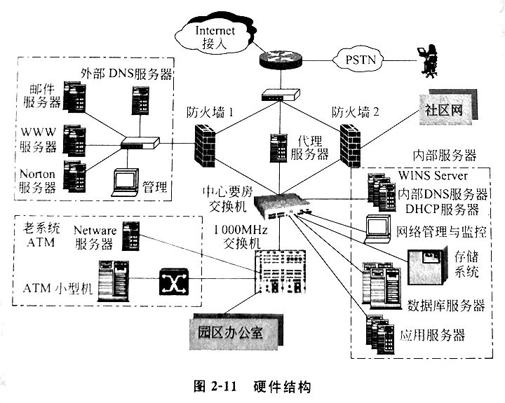
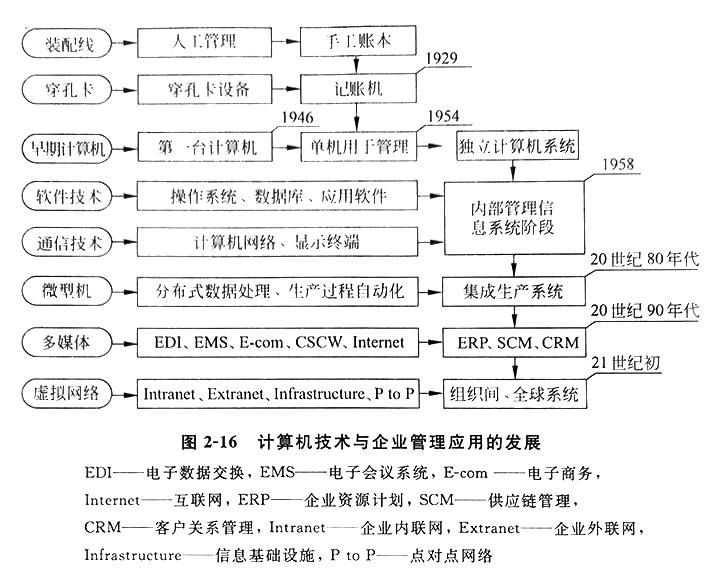
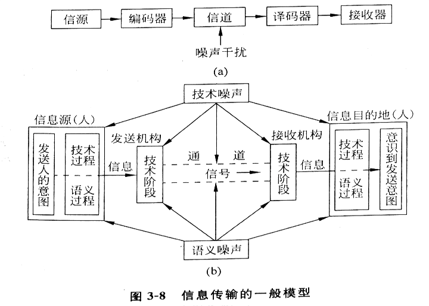
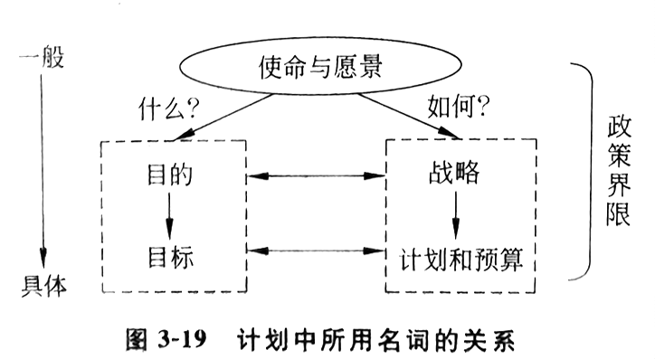

# 第一章 绪论

## 第一节 什么是管理信息系统

管理信息系统：🎯

- 用于管理的处理信息的系统
- 用系统的方式，通过信息媒介控制，达到管理的目的
- 将旧的经济形式转化为新的经济形式的工具，将旧的社会模式建设成新的社会形态的工具
- 是一种先进的生产力，是科学发展观的一个重要的组成部分

组成：

- 管理：沟通和分析
- 信息：经过加工后，能够对决策者的行为产生影响的数据 🎯
- 系统：为了某种目的而相互联系的部件的总体

## 第二节 当代经济和社会发展趋势

经济发展经过了农业经济、工业经济和后工业经济，向着信息经济和知识经济的方向发展

信息产品：

- 应当是信息内容的产品，而不是信息技术的产品
- 包括：书籍、软件、报纸、通信传媒服务、订票服务和第三方物流服务等
- 输入数据，输出有用信息

知识经济：以知识产品为主的经济

知识产品：

- 是信息产品的提升，是由信息中得到的新发现，是创新的东西
- 包括：论文、专利、作品版权、创意设计，以及一些咨询报告、研究报告等

> 胜利者可以随意处置被征服者。先是把他们统统杀掉吃掉。随着生产的发展，他们觉得不合算，不如把他何当成奴隶，强迫他们劳动，占有他们的剩余价值，在对他们的管理上也是采取武力和酷刑。随着经济的进步，掠夺的方式由武力转向经济形式。

随着信息和知识经济的发展，赚钱的方式已由武力掠夺、商品掠夺、资本掠夺转向信息和知识掠夺，要求接受方为信息和知识产品付费

新的信息规则：🎯

1. 信息（知识）产品的研发成本很高，边际成本或销售成本接近于零
2. 信息（知识）产品的产量无限制，生产企业只有第一，没有第二
3. 追求第一，产品无限细化，最终导致个人化
4. 产品的价值不是取决于生产的成本，而是基于顾客的期望
5. 同样的产品可有不同的价格，极端至一人一价
6. 信息产品是经验产品，只有在消费后才知其价值，要想办法让顾客在未消费前了解它。因此要在“给出内容”和“赚到钱”之间作出平衡
7. 信息产品是知识产品，只有学会了才会用。安装和学习付出得越多，锁定得越深，转移成本越高
8. 信息经济是注意力经济。信息无所不在，信息过载，创造了注意力的贫乏
9. 广告是购买顾客的注意力，为了节省顾客的精力，“一对一”的方式是未来的需求

信息在在当代社会中的价值：🎯

1. 微观上能帮助企业提高效率和效益
2. 宏观上信息和知识更是未来社会的产品

发展趋势：人们的需求从物质转向精神，世界的经济将由物质经济转向精神经济 🎯

> 精神经济不只是信息和知识经济，艺术将是精神经济的最高形式。只有艺术的高度才能达到真正的完美，才能满足人们的最高追求。

## 第三节 管理信息系统的重要性及其对企业管理的影响

重要性：管理信息系统能帮助企业提高效益和效率，能帮助企业获得战略优势，从而使国家**经济**繁荣，**社会**稳定 🎯

### 一、管理信息系统对运营管理的影响

影响是自下向上发展的：🎯

1. 生产管理或者运营管理：提高效率（主要体现在减少人力和提高劳动生产率上）
2. MIS 管理：提高效益（处理更快）

企业中常见的信息系统：MRP 材料需求计划, ERP 企业资源计划

减员增效，是先进生产力的代表，推行管理信息系统的建设，就是推行先进生产力

糊涂论点：习惯论、失业论、风险论

### 二、对管理者行为的影响 🎯

1. 主要方向：管理科学化（规范、标准）
2. 另一方面：管理者的决策习惯的改变（科学、系统）

### 三、对组织的影响

组织形式：

1. U 型组织：直线职能制组织结构，内部一元化领导
  - 纯直线制组织：一个领导说了算，每个职工只有一个领导
  - 直线职能制组织：权力的直接隶属，设有职能部门，和车间平级

2. M 型组织：多维组织
  - 组织中职能部门的权力过大和直线组织的分段引起任务的分割
  - 每个功能似乎均有人负责，而无人对整个任务或整个任务的过程负责
  - 直线职能制组织变形
  - 矩阵式组织：事业部

3. H 型组织：外部“头”（投资者）

4. V 型组织：H 的进一步发展，虚拟组织
  - 多个企业组成的临时性的组织
  - 当一项任务来临时，各企业组成联盟
  - 当任务完成时联盟自动解散，但相互沟通仍然保持，以备以后再次联盟
  - 没有组织，胜似组织

对组织形式的影响：🎯

1. 扁平化：减少管理的层次，扩大管理的幅度，从而简化管理
  - 条件：上级放权、下级主动、信息就是命令

2. 虚拟化

学习型组织特点：

1. 组织目标深入基层，深入群众
2. 放权适层，越层沟通，权力下放，信息集中
3. 自我做主，主动出击
4. 横向联系为主
5. 信息就是命令
6. 协同胜于共同
7. 敏捷和智慧的执行过程
8. 良好的信息平台、信息集成和监督
9. 弹性的上班时间和地点

错误的学习型组织理解：学习的时间多、学校

### 四、对企业战略的影响 🎯

影响是关键性的，管理信息系统可以说是企业的战略资源，战略目标的决定性影响因素

现在已是企业的生命线，未来更是企业的生长线

## 第四节 如何学习管理信息系统

管理信息系统专业目标：系统分析员

1. 善于帮助企业领导分析企业环境、确定企业目标、抓住关键因素、改进企业系统
2. 善于提出计算机系统解决方案，选购和运行系统硬件，选购或开发应用软件
3. 善于管理信息资源  

管理信息系统：社会-技术系统，有着不同的学习思路和学习方法，是未来型、革命型专业

IS 学生培养总计划：

1. 全校基础文化课
2. 管理学院核心课程
3. IS 专业课程
4. 设计或论文实践课

系统分析员的能力模型：

1. 变革能力
2. 科学方法
3. 企业知识
4. 信息技术

学习方法：

1. 学知识：知道、知识、技能
2. 长能力：预测、规划计划、设计和实施、评价和管理的能力
3. 炼修养
4. 上水平

## 复习与思考

1. 当今世界的经济趋势是什么？什么是信息经济？什么是知识经济？
2. 管理信息系统在当今的经济和社会环境中的重要性是什么？
3. 为什么说管理信息系统是社会-技术系统？这种系统和一般系统有何不同？
4. 管理信息系统对现代企业管理的影响是什么？对运营、管理行为、组织、战略等有哪些影响？
5. 什么是学习型组织？现在有哪些对学习型组织的错误理解？
6. 学习管理信息系统的态度和方法与学其他技术学科有什么不同？
7. 管理信息系统人才培养的目标是什么？你打算如何学知识、长能力、炼修养？

---

# 第二章 管理信息系统的定义和概念

## 第一节 管理信息系统的定义

管理信息系统的概念：🎯

- 用系统的方式，通过信息媒介控制，达到服务于管理目的的系统
- 是一个以人为主导，利用计算机软件、硬件、网络通信设备及其他办公设备，进行信息收集、传输、加工、储存、更新和维护，以企业战略竞优，提高效率和效益为目的，支持高层决策、中层控制、基层运作的集成化的人机系统 🎯🎯🎯

## 第二节 管理信息系统的性质

性质：技术系统、人机系统、管理系统、社会系统 🎯

和计算机应用的区别：

| 计算机应用 | 管理信息系统 |
| -- | -- |
必须有计算机 | 不一定有计算机
技术系统 | 社会-技术系统
主要内容为软、硬件 | 主要内容为信息
专家队伍建造 | 管理系统队伍建造

管理信息系统是个社会-技术系统： 🎯

- 它也就是属于社会系统，因为它是由人组成，而且有经济和政治活动的系统
- 一方面涉及人和人的群体、组织；另一方面又涉及计算机系统

## 第三节 管理信息系统的概念

管理信息系统是一个人-机系统

管理信息系统成熟的重要标志：具有集中统一规划的数据库

- 它象征：管理信息系统是经过周密设计而建立的
- 它标志：信息已集中成为资源，为各种用户所共享

结构方式：概念结构、功能结构、软件结构、硬件结构

### 一、管理信息系统的概念结构 🎯

1. 信息源：信息产生地
2. 信息处理器：负担信息的传输、加工、保存等任务
3. 信息用户：信息使用者
4. 信息管理者：信息系统的设计实现，实现后负责信息系统的运行和协调

开环结构：

- 又称无反馈结构，系统执行一个决策的过程中不收集外部信息，并且不根据信息情况改变决策，直至产生本次决策的结果，事后的评价只供以后的决策作参考
- 比如：批处理系统

闭环结构：

- 在过程中不断收集信息、不断送给决策者，不断调整决策。事实上最后执行的决策已不是当初设想的决策
- 比如：计算机实时处理的系统

### 二、管理信息系统的功能结构 🎯

从使用者的角度看，一个管理信息系统总是有一个目标，具有多种功能，各种功能之问又有各种信息联系，构成一个有机结合的整体，形成一个功能结构（职能结构）

1. 市场子系统
2. 财会子系统
3. 人事子系统
4. 生产子系统
5. 供应子系统

### 三、管理信息系统的软件结构 🎯

1. 销售市场子系统：销售和推销
2. 生产子系统：产品设计、生产设备计划、生产设备的调度和运行、生产人员的雇用和训练、质量控制和检查等
3. 后勤子系统：采购、收货、库存控制和分发
4. 人事子系统：招聘、雇用、培训、考核、工资和福利、解雇等
5. 财务和会计子系统：降低费用、分析报告
6. 信息处理子系统：保证企业信息需要
7. 高层管理子系统：辅助决策

### 四、管理信息系统的硬件结构 🎯

广义：包括硬件的物理位置安排，如计算中心和办公室的平面安排

微机网结构：星型、环型、母线型

## 第四节 管理信息系统的开发 🎯

系统工程成功三要素：

1. 合理确定系统目标
2. 组织系统性队伍
3. 遵循系统工程的开发步骤

领导注意事项：

1. 具备管理信息系统的基本知识、计算机原理和其功能、主要设备
2. 提高自己企业管理水平的设想和运用现代管理科学的设想
3. 懂得管理信息系统的开发步骤和每步的主要工作
4. 用人和组织队伍

领导推动管理信息系统步骤：

1. 建立信息系统委员会：主要咨询机构，最高决策机构
2. 建立系统规划组或系统分析组：简称系统组，各专家组成
3. 系统规划：
  - 企业目标的确定
  - 达到目标方式的确定
  - 信息系统目标的确定
  - 信息系统主要结构的确定
  - 工程项目的确定及可行性研究
4. 项目开发：
  - 生命周期：🎯
    - 系统分析：数据的收集、数据的分析、系统数据流程图的确定以及系统方案的确定
    - 系统设计：计算机系统流程图和程序流程图的确定、编码、输入输出设计、文件设计、数据库设计以及程序设计
    - 系统实现：机器的购买、安装、程序调试、系统的切换以及系统的运行和维护等
    - 系统评价：建成时的评价和运行后的评价，发现问题并提出系统更新的请求等

系统开发应注意的问题：🎯

1. 高度重视系统分析
2. 根据系统分析决定机器的购买
3. 在系统分析与系统设计完成之后才着手于程序编写
4. 管理信息系统的开发要尽可能与与企业变革同时进行

使能器 enabler

## 第五节 管理信息系统的学科内容及与其他学科的关系 🎯

管理信息系统学科：介于管理学科、数学和计算机学科之间的一个边缘性、综合性、系统性的交叉学科 🎯

管理科学的发展阶段：

1. 20 世纪 20 年代，“泰勒制”为代表的科学管理
2. 20 世纪 30 年代，“行为科学学派”
3. 20 世纪 40 年代，“数学管理学派”
4. 20 世纪 50 年代，“计算机管理学派”
4. 20 世纪 70 年代，“系统工程学派”

计算机科学阶段：

1. 独立计算机
2. 内部管理信息系统
3. 集成生产系统
4. ERP、SCM、CRM
5. 组织间、全球系统

数学学科：

1. 统计学和运筹学
2. 老三论：信息论、控制论、系统论
3. 模糊数学：和概率论相似，都是用确定的数字来表述不确定的现象的，但范围更广
4. 新三论：根本上影响管理信息系统
  - 突变论：研究由于结构不稳定而产生突变现象的数学分支
  - 耗散结构论：研究开放系统的理论，一个远离平衡的非线性系统，通过与外界交换物质、能量和信息，当控制参量越过某一阈值，系统可能失稳，由无序状态变为一种时间、空间或功能有序的新状态
  - 协同论：研究自组织现象，寻找支配自组织过程的一般原理和普遍规律
5. 非线性科学：新三论的基础
  - 分形：曼德波罗研究海岸线的长度时提出的，重要性质在于自相似性
  - 分维
  - 混沌理论：研究非线性科学的核心理论，混沌并不是一团糊涂的无序，而是内在的非线性动力学本身产生的不规则的宏观时空行为
    - 内随机性，产生混沌的根源在内部而不在外部
    - 分维性质，构成分形结构——奇异吸引子
    - 有序的无序，普适性

> 信息分形说明局部包含着整体的主要的信息特征，功能分形则指独立部分和整体的功能相似，或相对独立的部分在适宜的条件下能够发育成整体。

> 系统论强调整体的功能大于部分之和，强调整体的不可分性。而分形理论则揭示了部分构成整体所遵循的原则和规律,强调部分的全息性与整体的统一性，找到了部分过渡到整体的桥梁。

## 复习与思考

1. 管理信息系统是什么？它和一般的计算机应用有什么不同？
2. 管理信息系统有几种分类方法？它是根据什么原则进行分类的？
3. 管理信息系统应包括什么子系统？子系统之间是如何相互联系的？
4. 管理信息系统的结构有几个视图？你是否认为还有另外的视图？如果有，是什么？
5. 管理信息系统的开发特点是什么？有几种开发方式？各有哪些长处和缺点？
6. 生命周期开发方式每阶段的重点是什么？请评述生命周期法开发的问题和困难。
7. 管理信息系统是否一门学科？其性质如何？

---

# 第三章 管理信息系统的三个理论来源

管理、信息、系统

## 第一节 管理理论的回顾

### 一、管理的定义

> 效益要求我们做正确的事情 (doing the right things)；而效率则要求我们正确地做事情(doing things right)。

管理：为了某种目标，应用一切思想、理论和方法去合理地计划、组织、指挥、协调和控制他人，调度各种资源，以求以最小的投入去获得最好或最大的产出目标 🎯

### 二、管理的性质 🎯

既是艺术又是科学，艺术范畴定性，科学范畴定量，是一门综合学科

### 三、主要管理科学家的论点 🎯

1. 泰勒：
  - 理论不系统
  - 1911《科学管理原则》
  - 实际具备“蛋糕做大”思想
  - 不仅是生产力的革命，也是生产关系的一场革命
  - 追随者：甘特、吉尔布雷恩
  - 归纳管理的基本原理：
    - 1 凭科学办事，代替粗浅经验办事
    - 2 集体行动协调，避免不相合拍
    - 3 做到彼此合作，而不是个人主义的混乱
    - 4 追求产出最大，而不让它受到约束
    - 5 尽最大可能培养工人，使他们和公司都取得更大的成就

2. 法约尔
  - 现代经营管理理论的创始人
  - 1916《一般工业管理》
  - 主管人员的品质要求和训练：
    - 1 体质：健康、活力、风度
    - 2 智力：学习、判断、适应、智能活力
    - 3 精神：干劲、负责、坚定、忠诚、机智、尊严、创新精神
    - 4 教育：知识广博
    - 5 技术：熟练
  - 一般管理原则：
    - 1 劳动分工
    - 2 职权、职责，权责相关
    - 3 尊重、协议、服从、尽力、重视声誉
    - 4 命令统一，一个上级
    - 5 计划统一，指导统一
    - 6 个别服从总体利益
    - 7 报酬公平
    - 8 集中程度
    - 9 等级清晰
    - 10 各有其位，各就其位
    - 11 公道、公正
    - 12 使用期稳定
    - 13 首创精神
    - 14 团结精神

3. 迈约
  - 行为科学学派的主要代表人物
  - 霍桑试验：照明加强或减弱，生产率均在提高
  - 工人参加管理

4. 康托纳维奇
  - 利用数学和计算机来进行管理
  - 1940《生产组织与计划中的数学方法》

5. 卡斯特
  - 系统理论用于工程
  - 1970《组织与管理一从系统出发的研究》

6. BPR(Business Process Reengineering): 企业过程再工程
  - 20 世纪 80 年代对管理影响最大的实用技术
  - 使用的方法是工程方法，不是管理艺术法，或管理科学法
  - 最大特点：精确性、可重复性
  - 哈默教授：
    - 完整概念归纳：
      - 以企业过程为对象，从顾客的需求出发，对企业过程进行根本性的再思考和的底的再设计
      - 以信息技术和人员组织为使能器，以求达到企业关键性能指标和业绩的巨大提高或改善，从而保证企业战路日标的实现
    - 关键点：
      - 1 出发点：使顾客满意，企业战略发展
      - 2 途径：改变企业过程
      - 3 手段：以 IT 的应用和人员组织的调整为方法
      - 4 特征：企业性能的巨大提高

## 第二节 信息理论的回顾

### 一、管理信息的定义和性质

> 哲学上的唯物论观点认为，物质、能量和信息是物体存在和运动的三种形式，三者缺一不可。

> 行驶着的汽车中的里程表上的数据不是信息，只有当司机看了里程表，并据其作了加速或减速决策的那个数据才是信息。

#### 1.管理信息的定义 🎯

信息：信息是经过加工后的数据，它对接收者的行为能产生影响，它对接收者的决策具有价值 🎯

数据：是一组表示数量、行动和目标的非随机的可鉴别的符号 🎯

> 辩证关系：数据是原料，而信息是产品，一个系统的产品可能是另一个系统的原料，一个系统的信息可能成为另一个系统的数据 🎯

信息的价值有两种衡量方法：🎯

1. 按所花的社会必要劳动量来计算
2. 按照使用效果来衡量

全情报价值：获得全部情报，对客观环境完全了解，得到最优决策，与不收集情报所得最好收益之差 🎯

值不值得收集信息，或值不值得使用新的信息系统，用全情报价值来衡量

全情报价值给出了一个界限，如果购买情报花费超过这个值，则得不到附加好处

#### 2.信息的性质 🎯

1. 事实性：中心价值
  - 不符合事实的信息没有价值，价值还可能为负

2. 等级性：高中低三层
  - 战略级：长远规划，多来自外部，周期较长，保密程度高
  - 策略级：运营管理，有内有外，周期适中，保密程度低
  - 执行级：业务运作，多来自内部，周期较短，保密零散，方法固定，使用频率高，精度高

3. 可压缩性：
  - 信息可以进行浓缩、集中、概括以及综合，而不至于丢失信息的本质
  - 无用信息：干扰、冗余
  - 压缩不重要的信息：提取和目标相关的信息
  - 压缩无用信息：舍弃其他信息

4. 扩散性：传播
  - 信息的浓度越高，信息源和接受者之间的梯度越大
  - 信息的势态越高，信息的扩散力度越强
  - 一方面它有利于知识的传播，另一方面造成信息的贬值

5. 传输性
  - 传输成本远远低于传输物质和能源
  - 形式多样

6. 分享性
  - 信息只能共享，不能交换
  - 物质交换则是零和的

7. 增值性
  - 用于某种目的的信息，随着时间的推移可能价值耗尽，但对于另一种目的，可能又显示出用途
  - 比如：当天的天气，在往后几日不在有用，但对总结历史天气规律却有用

8. 转换性
  - 信息、物质、能源三位一体，可以互相转化

### 二、信息生命周期的各阶段

阶段：🎯

1. 要求：孕育和构思阶段
  - 根据所发生的问题，根据要达到的目标，设想可能采取的方法，构思所需要的信息类型和结构
  - 过程：收集、加工、传输、储存

2. 获得：得到信息的阶段
  - 信息的收集、传输以及转换成合用的形式，达到使用的要求
  - 过程：收集、传输、加工、储存

3. 服务：利用和发挥作用的阶段
  - 过程：维护、加工

4. 退出：老化阶段
  - 更新或销毁
  - 过程：加工

阶段中的过程：

1. 信息的收集
  - 1 信息的识别：确定信息需求
    - ① 由决策者进行识别：交谈、调差表
    - ② 系统分析员分析和亲自观察识别
    - ③ 两种方法结合
  - 2 信息的采集：
    - ① 自下而上地广泛收集
    - ② 有目的地专项收集
    - ③ 随机积累法
    - 采集三维：阶段维数（一二三）、层次维数（高中低）、来源维数（内外）
  - 3 信息的表达：
    - ① 文字：基本
    - ② 数字：严格
    - ③ 图像：直观

2. 信息的传输
  - 防止出错，往往又加上纠错或检错码
  - 形式：明线、电缆、无线、光缆、微波和卫星
  - 信道：单工、双工、半双工
  - 编解码、变换
  - 好的传输：信道容量大、干扰小、延时短、双工、保密

信息传输的一般模型：🎯

3. 信息的加工
  - 加工过程：
    - 1 数据
    - 2 预信息
    - 3 信息
    - 4 决策
    - 5 结果
  - 特性：滞后性
  - 是否加工：一次信息、二次信息

4. 信息的储存
  - 1 纸：存量大、体积小、便宜、永久保存性好，并有不易涂改性，传送慢，检索不便
  - 2 胶卷：作为纸的补充，存储图像，以后也用来存储文字和数字，存储密度大，昂贵，接口不便
  - 3 计算机存储器：成本不断下降，内存、外存（磁盘、磁带、光盘）

5. 信息的维护
  - 狭义：经常更新存储器中数据，使数据均保持合用状态
  - 广义：系统建成后的全部数据管理工作
  - 保证信息的准确、及时、安全和保密

6. 信息的使用
  - 技术：高速度高质量提供
  - 价值转换：提高效率阶段、及时转化价值阶段、寻找机会阶段

信息系统深发展阶段：：初装、扩展、控制、整体化、数据管理、信息管理

信息管理的方面：人力资源管理、软硬件管理、通信管理、办公室自动化、规划管理

信息管理广义三方面：

1. 面向未来的规划管理
2. 面向信息系统内部的运营管理
3. 面向开发的项目管理

## 第三节 系统理论的回顾

### 一、系统的定义

系统：一些部件为了某种目标而有机地结合的一个整体 🎯

系统五要素：🎯

1. 系统应有一些`主量集合`
2. 系统的主量是随时间变化的，叫主量集合的`活动性`
3. 系统的主量可以表示于笛卡儿坐标上，叫`系统的行为`
4. 元素的行为集合为`论域`
5. 系统的状态和转化结构叫做系统的`程序结构`

系统特点：

1. 系统是由部件组成的，部件处于运动状态
2. 部件之间存在着联系
3. 系统行为的输出也就是对目标的贡献，系统各主量和的贡献大于各主量贡献之和，即系统的观点 1+1>2
4. 系统的状态是可以转换的，在某些情况下系统有输入和输出，系统状态的转换是可以控制的

系统特征：🎯

1. 整体集合性
2. 功能结构性
3. 适应性
4. 层次性
5. 目的性
6. 动态性

### 二、系统的分类 🎯

1. 按系统的复杂程度分类：三类九等
  - 1 物理
    - ① 框架：最简单的系统（桥梁、房屋）
    - ② 钟表：按预定的规律变化，虽动犹静
    - ③ 控制机械：自动调整
  - 2 生物
    - ① 细胞：新陈代谢
    - ② 植物：细胞群体
    - ③ 动物：可动
  - 3 高级群体
    - ① 人类：较大的存储信息的能力
    - ② 社会：人类政治、经济活动等上层建筑的系统
    - ③ 宇宙：包含一切

2. 按系统的抽象程度分类
  - 1 概念系统：最抽象
  - 2 逻辑系统：在概念的基础上构造出可通行的原理
  - 3 实在系统：物理系统

3. 按系统的功能分类
  - 1 社会系统
  - 2 经济系统
  - 3 军事系统
  - 4 企业管理系统

4. 按系统的功能分类
  - 1 封闭系统：和外界分开，外界不影响复现
  - 2 开放系统：不能和外界分开

5. 按系统内部结构分类
  - 1 开环系统
    - ① 一般开环系统
    - ② 前馈开环系统
  - 2 闭环系统
    - ① 单闭环系统
    - ② 多闭环系统

### 三、系统性能的评价 🎯

1. 目标明确：第一指标，均为一个目标而运动，可分为子目标
2. 结构合理：若干子系统构成，可再分，连接清晰，路径通畅
3. 接口清楚：内、外定义清晰
4. 能观能控：输入控制，输出观察

### 四、系統的计划与控制 🎯

计划：一个预定的行动路线，它表示出目标和为达到这些目标所必需的行动

控制：测量实际和计划的偏差，并采取校正行动

有关系統的概念的定义：

| 名词 | 定义 |
| -- | -- |
使命 | 成立该组织的根由
愿景 | 达到目标后的环境描述，想象的未来的情景
目的 | 将要完成什么任务的说明
战略 | 达到目的的总途径
目标 | 要达到的能预测结果的说明
计划和预算 | 达到目标的具体行动和活动的调度进度表和费用
政策 | 伦理道德可接受的行为界限、决策界限和标准

计划的层次：🎯

1. 战略计划（5 年及以上）：企业应当进入什么行业领域？如何筹集资金？如何分配稀有资源？
2. 策略计划（1~5 年）：实现长期计划的投资模型是什么？如何决定设备位置、扩建、停用，以使利润最大？
3. 运行计划（1~12 月）：原料获得、库存水平、分配系统结构、路线和模式，怎样使运行最优？怎样和长期计划衔接？
4. 调度和发放（现时）：当前设备运行的顺序是什么？怎样吻合下一周期的运行要求？

影响计划的因素：

1. 计划是一项很困难的认识活动
2. 计划是一项阐明末来不确定性的工作
3. 计划减少了行动的自由，受约束者不愿要计划
4. 计划是一项很紧张的工作
5. 计划在计算上是冗长乏味的
6. 计划做了，往往是放到一边没有用

根据系统内部结构的特性和反馈信号产生规律，闭环系统的输入、输出间有一定关系，不同的关系给以不同的名字：

1. 比例环节：输入和输出间始终保持比例关系
2. 延迟环节：输出比输入落后一段时间
3. 惯性环节：输出随输入变化
4. 振荡环节：两阶或以上（单调增长、衰减振荡、发散振荡）

控制系统的性能的方法：

- 1 分解（子系统）
- 2 归并（合并）
- 3 解耦（减少物理联系）：缓冲库、松弛资源、应用标准

### 五、系统的集成

#### 1.系统集成的概念

系统集成：为了达到系统目标将可利用的资源有效地组织起来的过程和结果 🎯

将部件或小系统联成大系统，不只是连通，而是有效地组织

#### 2.系统集成的分类

1. 按优化程度分类 🎯
  - 1 连通集成：保证设备能互相联通
  - 2 共享集成：整个系统的信息能为系统中所有用户所共享
  - 3 最优集成：最高水平的集成，理想且困难

2. 按范围分类
  - 1 技术集成：技术上的连通
  - 2 信息集成：数据共享
  - 3 组织人员集成：将系统融合于组织中
  - 4 形象集成：集成于企业形象之中

3. 按具体程度分类
  - 1 概念集成：看不见，摸不着
  - 2 逻辑集成：看得见，摸不着
  - 3 物理集成：看得见，摸得着

集成策略：几个阶段的组合

1. 共同开发：用户介入起动、开发以及集成各个阶段
2. 服务于用户：用户介入起动和集成
3. 推向用户：用户介入开发和集成
4. 卖给用户：用户介入集成
5. 征用用户：用户介入开发

### 六、系统理论的发展

系统理论的学科研究三个层次：

1. 系统思想：系统研究的最高层次，思想、概念
  - 是知向和创意
  - 某种程度上也可以说是系统哲学
  - 是研究科学和工程背后的“科学”

2. 系统科学：利用科学方法来解快系统问题的
  - 科学追究原因，科学建立起一套逻辑推理机制
  - 科学推出的结果是可信的，是真实的
  - 科学主要是明因、明理

3. 系统工程：用当代工程技术的一切成就来解决系统问题的

相关理论：

- 切尔兰德——软系统思想：研究解决的是非结构化的问题，也就是最随意、最无规则的问題
- 钱学森——综合集成法：强调把情报、资料、信息、知识和人的经验一起集成起来

理论发展：🎯

- 20 世纪 80 年代：老三论（系统论、信息论、控制论）
  - 基于 40 年代计算机科学、50 年代信息科学、控制科学、运筹学、管理科学
- 20 世纪末：新三论（耗散结构论、突变论、协同论）
  - 自组织理论：研究开放系统中某一组织通过和外界不断地交换能量、信息和物质后，自身内都的控制参量达到某一阈值时，系统可能由无序转化为有序状态

## 复习与思考

1. 管理的定义是什么？管理和其他学科在性质上的区别是什么？
2. 在管理理论发展的历史中几个主要的关键的论点是什么？其代表人物是谁？当前有什么新的管理论点会对管理产生很大的影响？
3. 根据你自己对管理的理解，可否构思出一幅管理的概念构架？写一篇“论管理”或“管理论”的文章。
4. 什么是数据？什么是信息？试举几个实用的例子加以描述。
5. 信息有哪些基本性质？哪些性质和物质的性质不同？为什么？
6. 信息的价值如何衡量？如何才能正确地实现其价值？
7. 信息是否有生命周期？如何把握生命周期使信息更好地发挥作用？
8. 信息管理有什么内容？试述我国企业在信息管理上的问题。
9. 什么是系统？没有目标的相互联系的事物是否系统？为什么？
10. 用什么指标来衡量系统的好坏？
11. 管理信息系统是什么样的系统？它有哪些系统的特点？
12. 试论计划与控制对系统的重要性，如何才能正确地实施计划与控制。
13. 参考几本系统科学或系统工程的书，对系统的概念进行再思考，论述系统的性质和特点，阐述系统概念的新发展。
14. 什么是系统集成？信息系统的集成和计算机网络的集成有何不同？
15. 信息系统有几种分类方式？每种方式的长处和问题是什么？当前系统集成分类还存在什么问题？
16. 系统集成的策略应当包括什么内容？如何检验系统集成的成功与否？
17. 系统学科正朝什么方向发展？有哪些自然科学的新成就会对系统科学的发展产生重大影响？
18. 管理信息系统的基础理论还有哪些？
