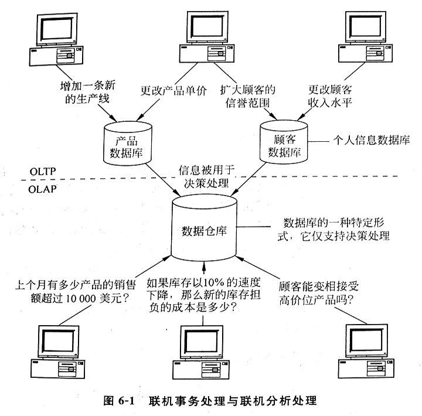

# 第四章 计算机系统和硬件

## 第一节 计算机的发展

### 一、计算机的创始与发展

1. 从原始计数法到机械计算机
  - 古代：手指，石子、贝壳、绳结
  - 1000 多年前：中国算盘
  - 1642 年：法国数学家布莱斯·帕斯卡——手转圆轮机械加法器
  - 1833 年：英国数学家查尔斯·巴贝奇微分分析机设计方案 5 个独立部分：🎯
    - 1 输入部分
    - 2 存储库
    - 3 运算室
    - 4 控制器
    - 5 输出部分
  - 1946 年：美国宾夕法尼亚大学——ENIAC，标志着计算工具随着世界文明的进步飞跃到一个崭新的阶段

2. 电子计算机时代 🎯（划分）
  - 第一代（1951~1958）：真空电子管计算机
    - 基本电子元件是电子管，内存储器、外存储器
    - 二进制码表示的机器语言进行编程，耗电、难维护
  - 第二代（1959~1963）：晶体管电子计算机
    - 晶体管取代电子管
    - 出现了高级程序设计语言，编译成机器语言
    - 体积减小，成本降低
  - 第三代（1964~1979）：集成电路电子计算机
    - 小规模集成电路
  - 第四代（1979 至今）：大规模集成电路电子计算机

### 二、计算机的分类及应用

1. 计算机的分类 🎯
  - 根据用户的需求及技术特征：微型计算机、小型计算机、主干计算机
  - 根据应用的分类：主计算机、网络服务器、工作站

2. 计算机及其应用
  - 1 微型计算机及其应用：
    - ① 个人计算机：字处理、决策支持、数据库管理、绘图、通信、应用开发、工程、个人与家庭使用 🎯
    - ② 移动式计算机：笔记本型、手提便携型、膝上型
    - ③ 网络计算机：通过互联网或企业内联网，从中央主机或服务器下载所需软件与数据资料
    - ④ 超级计算机：军事、航天、气象、武器、石油、工程
  - 2 小型计算机机及其应用：科学研究、建设系统、工程分析和工业过程监控领域
  - 3 主干计算机及其应用：处理大型企业集团的组织信息需求

### 三、计算机的发展趋势 🎯

主体是向着体积更小、速度更快、性能更强更可靠、购买与维护成本更低的方向发展

## 第二节 计算机的运算基础

### 一、计算机系统原理

1. 冯·诺依曼计算机结构的基本思想 🎯
  - 1 存储程序：复杂程序分解成简单指令，按序存放，逐条执行
  - 2 二进制：数据均以二进制形式存储

2. 计算机系统的基本结构 🎯
  - 1 输入：键盘、触摸式大屏落、光笔等
  - 2 数据处理与控制：CPU
  - 3 输出：显示器、各类打印机
  - 4 主存储：一级存储单元（主存储器）、二级存储单元（外存储器或辅助存储器）🎯
  - 5 通信接口：通信网络连接

### 二、计算机中数据表示方法

二进制优越性：🎯

1. 现实世界中很容易找到有两种对立且稳定物理状态的物理器件来表达
2. 二进制运算法则简单，只有加法法则
3. 由于逻辑变量和二进制一样只有“0”和“1”两个取值，采用二进制可使算术运算和逻辑运算共享一个运算器

#### 1.数值型数据的表示 🎯

位（bit）：最小数据单位，存放一个二进制的 0 或 1

字节（byte）：长度固定为 8b 的集合，一般一个字节可以存放一个字符

计算机字（word）：在计算机中作为一个整体被传送和运算的一串二进制数码，它所含有的二进制位数等于宇长

- 目前的徵型计算机绝大多数是 32 位字长，我们称为 32 位机
- 可在运算器中进行 32 位并行运算，并在总线中进行 32 位并行传送

储存数据的长度是统一的，不足的部分用“0”填充

数的最高位表示数字的符号，0 正数，1 负数

为节省存储空间，表示数值型时，小数点是隐含的，但其位置是固定的（定点数），或是可变的（浮点数）

TODO: 进制转换

#### 2.字符型数据的表示 🎯

二进制编码：二进制数码代表是为制数或一个字符

1. ASCII 码：使用最多
  - 用 7 个二进制数据表示一个字符
  - 7 个数据位的最左边添上一个奇偶校验位
  - 128 种基本字符和功能符：
    - A-Z
    - a-z
    - 0-9
    - 可打印符号：< = ? !
    - 实现某个动作的控制符号：NUL ESC CR
  - 基于 ASCII 扩充的罗马字符集：8 个二进制表示一个字符，一共表示 256 个字符

2. BCD 码：二进码十进数
  - 十进制数在键盘输入、打印和显示输出时，往往以 ASCII 码表示，但是数在机器内是以二进制形式进行运算

3. EBCDIC 码：8b 表示任何字符

#### 3.汉字的表示 🎯

1. 汉字交换码（国标码）：
  - GB2312-80，6763 个常用汉字，共 7K+ 符号
  - 每个字符由一个 2 字节代码串组成

2. 汉字机内码：通常将汉字国标码的最高位置 1 来标识机内的某个码值是代表汉字

3. 汉字输入码：通过键盘管理程序的转换，存入计算机中的总是它的机内码，与输入法无关

4. 汉字字形码：显示/打印文字时还要用汉字字形码，因此汉字库占用空间更大

#### 4.所有文字的通用表示 🎯

Unicode 是一种试图容纳全世界所有语言文字的编码方案

给每个字符提供了一个唯一的编码

设计目标：用 16b(2B) 表现全部的文字，但最多只能表现 65536 个字符

现在的 Unicode 是用 4B 来表示的

UTF 规范是将 Unicode 编码方案和计算机的实际编码对应起来的一个规则

#### 5.音频和视频信息在计算机中的表示 🎯

声卡、显卡进行模拟信号/二进制转换交给 CPU 处理

### 三、计算机运行方式

1. 计算机指令的执行 🎯
  - 计算机指令的格式由程序设计语言和计算机的类型决定
  - 指令基本格式：
    - 1 操作码：指定机器执行的操作（加、比较、读）
    - 2 一个或几个操作数：指定数据或指令在内存的存放地址，或指示将使用的 I/O 端口和二级存储设备的地址
  - 执行阶段：
    - 1 指令周期：从主存取指令、控制单元解释指令
    - 2 执行周期：执行经解释后的指令指定的操作

2. 计算机指令系统 🎯
  - 各种指令的总和，几十到几百条
  - 基本指令：
    - 1 数据传送指令：主存与运算器之间传送
    - 2 算术运算指令：加减乘除
    - 3 逻辑运算指令：逻辑加、逻辑乘、求反
    - 4 程序控制指令：控制程序的走向与结构
    - 5 输入/输出指令：启动外部设备
    - 6 其它指令：停机、启动、空操

3. 计算机程序的执行 🎯
  - 重复指令周期和执行周期，直到一个程序的指令全部执行完毕
  - 通常顺序执行，有时引入分支指令

## 第三节 网络计算的模式 🎯

1. C/S 结构
  - 客户端/服务器
  - 客户端一般是一台微型计算机、便携式计算机

2. B/S 结构
  - 浏览器/服务器
  - 简化客户端电脑载荷，减轻维护、升级工作量，降低用户总成本
  - 保护数据平台和管理访问权限
  - 无须额外安装

3. 网格计算
  - 综合利用分散在网络各处的大量独立的计算资源，组成一种分布式系统，共同完成某个计算任务
  - 规模可大可小
  - 一种充分利用分散资源的模式
  - 类型：计算网格、设备网格、数据网格、信息网格、知识网格、服务网格

4. 云计算
  - 通过计算机网络按需提供计算资源的模式，其中计算资源包括计算能力、存储、应用和服务等
  - 用户端一般只作为显示终端
  - Web 浏览器即可
  - 特点：
    - 1 以云计算的服务提供和交付模式来看，所有计算处理都集中在云端，用户可以认为云端的计算能力是没有限制的，计算服务可动态伸缩，用户可以灵活购买
    - 2 从云计算的服务实现方式来看，云计算实现了计算资源的高度整合和优化利用
  - 服务层次：
    - 1 基础设施级服务 IaaS：提供全面的计算机基础设施
    - 2 平台级服务 PaaS：提供完善的应用开发平台
    - 3 软件级服务 SaaS：提供企业应用软件
  - 公有云：向一般企业提供（中小型企业）
  - 私有云：独立构建（大型企业）
  - 社区云：面向一个行业或一个企业联盟提供服务的云计算（中小型企业）

## 第四节 计算机硬件
 
硬件：计算机物理设备的总称

主要组成：CPU、主存储器、IO 设备、总线

反映计算机能力的两个主要指标：是时间（CPU）与容量（主存储器）🎯

### 一、中央处理器：运算器、控制器 🎯

1. 运算器：执行定点或浮点的算术运算操作、移位操作以及逻辑操作、地址的运算和转换
  - 1 逻辑单元：算术或逻辑运算
  - 2 累加器：暂存器，暂存操作数或运算结果
  - 3 状态寄存器：标志寄存器，存放算术逻辑单元运算后产生的状态信息
  - 4 寄存器阵列：通用寄存器、地址寄存器、变址寄存器和堆栈指示器等

2. 控制器：是计算机的神经中枢，按照主频的节拍产生各种控制信息，以指挥整个计算机工作，步骤：
  - 1 将从内存中取到的指令经总线送到 CPU 的指令寄存器内暂存
  - 2 将指令传送到指令译码器，分析指令
  - 3 将分析结果传递给微操作控制电路，由它向各功能部件发出操纵控制命令
  - 4 当各部件执行完毕，“反馈信息”，使程序计数器地址指向下一条指令地址

3. CPU 的发展
  - 影响运行速度的因素：
    - 1 CPU 与总线的一些技术指标：并行处理的计算机字长
    - 2 决定机器时序周期长短的晶片振荡频率
    - 3 数据总线宽度
  - 多处理机多 CPU 特点：
    - 1 辅助处理器：采用辅助微处理器帮助主处理器执行多种功能
    - 2 对偶处理器：采用多 CPU 或多微处理器进行多道并行处理
    - 3 并行处理设计：使用几个或成百上千个指令处理器，能在第五代计算机中提供人类智力的能力
    - 4 双核处理器和多核处理器：基于单个半导体的一个处理器上拥有两个或多个功能一样的处理器核心，功耗和散热问题已成为提升处理器主频的瓶颈

### 二、存储系统

1. 计算机存储系统及发展
  - 分类：一级存储器、二级存储器
  - 超大规模集成电路技术，海量存储

2. 主存储器：一级
  - 存放当前运行的程序及执行程序所需的资料
  - 主要是由半导体存储器组成
  - 分类：🎯
    - 1 只读存储器 ROM：只读不写，存放计算机的启动程序、自检程序及磁盘引导程序
    - 2 随机存取存储器 RAM：任意时刻可以从任意存储单元读写信息，断电数据消失
      - 高速缓冲存储器 cache：少量速度更高的半导体存储器

3. 辅助存储器：二级
  - 位于 CPU 与主存储器之外
  - 不需要电力维持的、可长期储存海量资料的记忆部件
  - 分类：🎯
    - 1 磁介质存储：
      - ① 磁带：顺序存取，从头开始
      - ② 磁盘：随机存取，可以直接存取（软磁盘退出市场、硬磁盘），阵列磁盘技术 RAID 加强磁盘效率
    - 2 光存储：各种光盘
    - 3 闪存：非易失性存储器（NVM）的一种，可擦除

### 三、输入/输出设备 🎯

通过各种 I/O 接口与计算机系统的中央处理机连接并通信，因此外围设备皆属联机设备

1. 计算机键盘与显示终端
2. 点触式设备：电子鼠标器、轨迹球、触碰板、游戏操纵杆、触摸屏
3. 计算机笔
4. 视频输入/输出：TV、录像机、摄像机
5. 打印输出
6. 声音识别
7. 体感设备（物联网）
8. 光和磁识别（物联网）：光扫描、磁性数据输入
9. 无线射频识别（物联网）：近接卡、感应卡、非接触卡、电子标签、电子条码

## 复习与思考

1. 计算机的发展经历了哪几代？
2. 计算机是如何分类的？
3. 开发和应用计算机的领域有哪些方面？结合企业说说计算机在企业中的应用。
4. 简述冯·诺依曼结构的主要思想和结构特征。
5. 计算机中有哪几种类型的数据？它们是如何表示的？
6. 将下列十进制数分別转换成为二进制和十六进制数：125.24，0.42
7. 将下列二进制数分別转换成八进制和十六进制数：11000011，1010101.01011
8. 将下列八进制、十六进制数分別转换成二进制和十进制数：125.17，C25D.3A
9. 解释下列术语：ASCII 码；汉字机内码；汉字揄入码；汉字字形码
10. 在中、西文兼容的计算机中，计算机如何区别西文字符和汉字字符？
11. 用图说明计算机如何完成一条指令的执行。
12. 请说明计算机指令系统与计算机功能的关系。
13. 云计算对企业的应用价值和挑战分別是什么？
14. 简述运算器的组成与工作原理。
15. 根据控制器的结构简述控制器的功能。
16. 结合当前市场状况，谈谈 CPU 的发展趋势。
17. 简述存储系统的分级结构及发展方向。
18. 有哪些输入/输出设备及二级存储设备？它们的基本用途是什么？
19. 开发与使用外部设备的倾向是什么？

---

# 第五章 计算机软件

## 第一节 软件的概念

###  一、软件分类 🎯

1. 系统软件：管理与支持计算机系统资源及操作的程序称为系统软件
2. 应用软件：处理特定应用的程序称为应用软件

系统层次结构图：

```
计算机用户：人-机交互
  用户软件：在系统软件提供的环境中工作
    系统软件：直接对硬件资源
      硬件
```


### 二、软件技术发展趋势

由于计算机硬件的模块化和标准化促进了硬件的飞速发展，现在计算机软件也越来越希望组件化、模块化，强调可复用、可共享，形成了一种从面向对象编程、构件技术，到 Web Service 体系的软件发展趋势 🎯

- 面向对象编程：强调软件的模块化
- 构件技术：强调软件的复用
- Web Service：软件的共享与复用甚至跨越企业，扩展到了整个万维网上

著名开源软件：Linux、MySQL、Apache HTTP Server

## 第二节 系统软件

### 一、系统软件的分类

系统软件：管理和支持计算机资源及其信息处理活动的程序，这些程序是计算机硬件和应用程序之间重要的软件接口

1. 系统管理程序：管理软硬件数据资源（操作系统、操作环境）
2. 系统支持程序：提供各种支持服务（系统服务程序、系统执行管理器、安全管理器）
3. 系统开发程序：帮助用户开发信息系统的应用程序（语言翻译器、程序设计工具、计算机辅助软件工程包 CASE）

### 二、操作系统 OS 🎯

操作系统：一台计算机最基本、最重要的软件包
  - 管理 CPU 的操作，控制计算机系统的输入/输出，存储资源的分配及一切活动
  - 是用户和计算机硬件之间软件层面中最重要的一部分

操作系统目标：向计算机提供最有效的操作方式，最大化计算机的生产效率，最小化操作过程中所需求的人工干预

操作系统的功能：

1. 用户界面：🎯
  - 帮助用户实现与计算机系统的交流
  - 分类：命令驱动、菜单驱动、图形用户界面 GUI（潮流）

2. 资源管理：🎯
  - 管理计算机系统的所有硬件资源
  - CPU、主存储器、二级存储设备以及其他输入/输出设备

3. 文件管理：🎯
  - 控制数据和程序文件的生成、删除和存取

4. 任务管理：🎯
  - 保证终端用户计算任务的完成
  - 给每个任务分配一个时间片，并能对每个任务进行中断，以便转交给另一个任务

5. 实用服务程序管理

操作系统的类型：按处理方式分

1. 批处理操作系统：对用户提交给计算机的作业采用成批处理的方式
2. 分时操作系统：多个用户同时使用一台计算机
3. 实时操作系统：快速响应和即时处理
4. 多处理器操作系统：并行处理任务
5. 网络操作系统：友好高效的程序开发运行环境

图形用户界面 GUI：免除了用户记忆指令的时间

### 三、其他系统管理程序 🎯

1. 数据库管理系统：也是一种系统软件包，这种软件包帮助企业开发、使用、维护组织的数据库
2. 通信管理器：一般装在服务端，数据通信
3. 系统支持程序：执行各类系统的全部例行事务管理和文件转换任务

### 四、常见操作系统简介 🎯

1. Windows 7
2. Windows Phone
3. UNIX
4. Linux
5. Mac OS X
6. iOS
7. Android

## 第三节 程序设计语言

### 一、机器语言 🎯

裸机：早期的计算机不配置任何软件

机器语言程序特点：

1. 采用二进制代码
2. 指令随机器而异

优点：执行速度快

缺点：易于出错、不够直观、编程繁琐

### 二、汇编语言 🎯

用符号（助记符）代替机器语言中的二进制代码的方法，符号语言

仍是一种面向机器的程序设计语言，不能在各种机器上通用，机器语言缺点程度较轻

汇编程序：将汇编语言翻译成机器语言

### 三、高级语言 🎯

三大优点：

1. 更接近于自然语言，一般采用英语表达
2. 语句与机器指令并不一一对应，一对多，编写短小，易于查找错误和修改
3. 与具体计算机无关，通用性强

无法直接执行，需要翻译成机器指令

两种翻译方式：

1. 解释：解释器 interpreter，边翻译边执行，灵活，内存占用少，机器时间占用多
2. 编译：编译器 compiler，先翻译再执行，执行速度快，内存占用多，不灵活

### 四、第四代语言与软件工具 🎯

更加非过程化并且更易于对话

> 第五代语言：人工智能技术实现用户需求的语言定为

让用户和程序员使用非过程化的语言说明他们的要求，而由计算机决定实现这个要求的指令序列，简化程序设计过程

分类：

1. 查询语言：DBMS、Excel、SQL
2. 报表生成器
3. 图形化语言：SAS、Systat
4. 应用程序生成器：FOCUS、Power Builder
5. 非常高阶程式语言：APL、Nomad 2
6. 套装软件
7. 个人计算机工具：Office、浏览器、群组软件

### 五、互联网环境下的编程语言 🎯

1. 超文本标记语言和扩展标记语言：HTML、XML
2. Java 及其开发平台：EE、JSP

## 第四节 软件开发方法和工具

### 一、面向对象程序设计 🎯

将数据与程序封装在一个对象内，作为一个独立的个体

程序设计的基础依赖于类(class)和继承(inheritance)的概念

### 二、UML(unified modeling language) 🎯

突破了以往编程语言在编辑器中逐行写代码的模式，提出了面向接口设计、图形化开发界面的新方法

OOSE 方法：面向用例 use-case，用例的描述中引入了外部角色的概念，适合支持商业工程和需求分析

定义良好、易于表达、功能强大且普遍适用的建模语言

UML 内容：

1. 用例图：用户角度描述系统功能及功能的操作者
2. 静态图：
  - 类图：系统中类的静态结构
  - 对象图：类图的实例
  - 包图：包或类组成
3. 行为图：描述系统的动态模型和组成对象间的交互关系
4. 交互图：
  - 构件图：描述代码部件的物理结构及各部件之间的依赖关系
  - 部件图：分析和理解部件之间的相互影响程度
  - 配置图：系统中软硬件物理体系结构

应用角度面向对象设计步骤：

1. 描述需求
2. 根据需求建立系统的静态模型，构造系统结构
3. 描述系统的行为

标准建模语言分类：静态建模机制、动态建模机制

UML 应用领域：

1. 建立软件系统的模型
2. 系统开发过程中从需求规格描述到系统完成后测试的不同阶段

### 四、MVC 设计模式 🎯

把一个应用的输入、处理、输出流程按照 model、view、controller 的方式进行分层

1. 视图：代表用户交互界面
2. 模型：业务流程/状态的处理以及业务规则的制定，对其他层来说是黑箱
3. 控制：从用户接受请求，将模型与视图匹配在一起，共同完成用户的请求，一个分发器

层的分离使得一个模型可以具有多个显示视图

用户通过某个视图的控制器改变了模型的数据，所有其他依赖于这些数据的视图都应反映这些变化

无论何时发生了何种数据变化，控制器都会将变化通知所有的视图，更新显示

## 复习与思考

1. 用图描述计算机软件的分类。
2. 软件发展的主要趋势是什么？你期望末来的软件包具有哪些功能？
3. 结合企业状况，谈谈你作为终端用户最需要什么样的系统软什和应用软件。它们对你的工作产生什么影响？
4. 你最喜欢什么样的人-机交互接口？命令式、菜单驱动式还是图形窗口界面？请简单解释。
5. 简述语言发展过程和未来发展趋势。
6. 如果你是一个管理人员，是否应掌握一种语言去开发用户程序？请解释你的回答。
7. 什么是程序设计工具？解释程序设计工具对计算机程序员及用户的重要性。
8. 经常进行事务处理的用户掌握使用什么样的软件包最重要？

---

# 第六章 数据库和数据仓库技术

广义的数据资源管理包括三个方面：

1. 文件组织
2. 数据库及数据仓库
3. 数据规划和数据管理

## 第一节 企业数据处理方式



1. 以联机事务处理 OLTP 形式处理信息
2. 以联机分折处理 OLAP 形式处理信息，并利用信息进行决策
3. 在信息应用过程中管理信息

数据仓库：数据库的一种特定形式，仅支持决策处理

管理信息应考虑：

1. 适当的技术去组织信息：使用者能逻辑地使用，而不必了解信息的物理组织形式（最重要）
2. 使用信息的权限
3. 信息的更新与维护

## 第二节 文件组织

### 一、文件一数据库的基础 🎯

按存储介质分：光盘文件、磁盘文件、磁带文件、打印文件

按功能分：主文件、事务文件、报告文件、工作文件、程序文件

以文件为单位，操作数据库中的数据

### 二、数据的物理组织和逻辑组织

物理组织：面向机器、存储设备 🎯

逻辑组织：面向用户的应用需求 🎯

使数据的物理存储与逻辑处理分离是进行数据处理的关键

将逻辑进行信息处理的请求向相应的物理存储形式转换的工作，由系统软件所提供的技术界面实现：数据库、数据库管理系统、数据仓库与数据仓库管理系统

### 三、文件组织方式 🎯

文件是数据库组织的基础，任何对数据库的操作最终要转化为对对数据文件的操作

1. 顺序文件组织：文件中数据记录的物理顺序与逻辑顺序一致
  - 可以存储在顺序介质：磁带
  - 也可以存储在随机介质：磁盘、光盘
2. 索引文件
3. 链表文件
4. 倒排文件


## 复习与思考

1. 一个组织，如果没有大量的内部操作和外部环境数据，能否幸存和成功？请阐述你的观点。
2. 数据是企业重要的资源和财产，必须得到恰当的管理。数据库管理系统与数据管理员在管理数据中各起什么作用？
3. 文件组织的基本形式有哪几种？试将一个有关学生情况的文件组织成以下形式：
  - 以学号为主关键字的索引-顺序文件和索引-非顺序文件
  - 建立“性別”、“专业”指针项，组织成多重键表文件
  - 对辅关键字“专业”建立倒排文件
4. 文件管理方式与数据库管理方式有什么根本不同？举例说明。
5. 什么是 DBMS？它能支持用户和 IS 专家来完成什么数据管理功能？
6. 简述数据库的三级结构和二级映射。
7. 为什么关系型数据库比层次型和网络型数据库实用性更强、更重要？为什么面向对象数据库模型目前更受欢迎？
8. 什么是 E-R 图？如何设计 E-R 图，并根据 E-R 图设计关系数据库的概念模式？
9. 为何开发一个企业的数据库首先要求对数据库进行规划，并将数据规划作为组织战略规划的一部分？结合企业状况谈谈你的看法。
10. 数据仓库和数据库的主要区别是什么？
11. 大数据有什么特点和处理要求？
