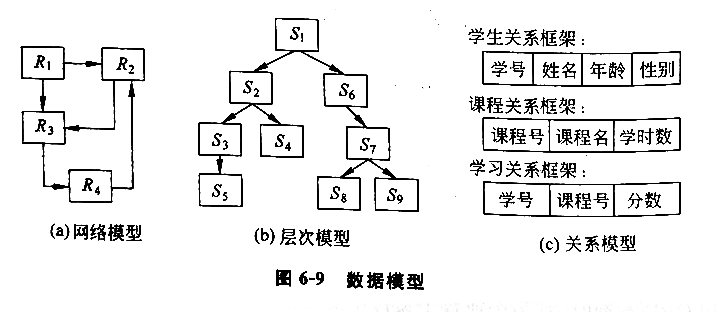

# 第四章 计算机系统和硬件

## 第一节 计算机的发展

### 一、计算机的创始与发展

1. 从原始计数法到机械计算机
  - 古代：手指，石子、贝壳、绳结
  - 1000 多年前：中国算盘
  - 1642 年：法国数学家布莱斯·帕斯卡——手转圆轮机械加法器
  - 1833 年：英国数学家查尔斯·巴贝奇微分分析机设计方案 5 个独立部分：🎯
    - 1 输入部分
    - 2 存储库
    - 3 运算室
    - 4 控制器
    - 5 输出部分
  - 1946 年：美国宾夕法尼亚大学——ENIAC，标志着计算工具随着世界文明的进步飞跃到一个崭新的阶段

2. 电子计算机时代 🎯（划分）
  - 第一代（1951~1958）：真空电子管计算机
    - 基本电子元件是电子管，内存储器、外存储器
    - 二进制码表示的机器语言进行编程，耗电、难维护
  - 第二代（1959~1963）：晶体管电子计算机
    - 晶体管取代电子管
    - 出现了高级程序设计语言，编译成机器语言
    - 体积减小，成本降低
  - 第三代（1964~1979）：集成电路电子计算机
    - 小规模集成电路
  - 第四代（1979 至今）：大规模集成电路电子计算机

### 二、计算机的分类及应用

1. 计算机的分类 🎯
  - 根据用户的需求及技术特征：微型计算机、小型计算机、主干计算机
  - 根据应用的分类：主计算机、网络服务器、工作站

2. 计算机及其应用
  - 1 微型计算机及其应用：
    - ① 个人计算机：字处理、决策支持、数据库管理、绘图、通信、应用开发、工程、个人与家庭使用 🎯
    - ② 移动式计算机：笔记本型、手提便携型、膝上型
    - ③ 网络计算机：通过互联网或企业内联网，从中央主机或服务器下载所需软件与数据资料
    - ④ 超级计算机：军事、航天、气象、武器、石油、工程
  - 2 小型计算机机及其应用：科学研究、建设系统、工程分析和工业过程监控领域
  - 3 主干计算机及其应用：处理大型企业集团的组织信息需求

### 三、计算机的发展趋势 🎯

主体是向着体积更小、速度更快、性能更强更可靠、购买与维护成本更低的方向发展

## 第二节 计算机的运算基础

### 一、计算机系统原理

1. 冯·诺依曼计算机结构的基本思想 🎯
  - 1 存储程序：复杂程序分解成简单指令，按序存放，逐条执行
  - 2 二进制：数据均以二进制形式存储

2. 计算机系统的基本结构 🎯
  - 1 输入：键盘、触摸式大屏落、光笔等
  - 2 数据处理与控制：CPU
  - 3 输出：显示器、各类打印机
  - 4 主存储：一级存储单元（主存储器）、二级存储单元（外存储器或辅助存储器）🎯
  - 5 通信接口：通信网络连接

总线：连接上述功能部件，并在它们之间提供数据资料传送路径、地址信号传送路径、协同操作控制型号传输路径

内部总线：数据总线和逻辑总线

### 二、计算机中数据表示方法

二进制优越性：🎯

1. 现实世界中很容易找到有两种对立且稳定物理状态的物理器件来表达
2. 二进制运算法则简单，只有加法法则
3. 由于逻辑变量和二进制一样只有“0”和“1”两个取值，采用二进制可使算术运算和逻辑运算共享一个运算器

#### 1.数值型数据的表示 🎯

位（bit）：最小数据单位，存放一个二进制的 0 或 1

字节（byte）：长度固定为 8b 的集合，一般一个字节可以存放一个字符

计算机字（word）：在计算机中作为一个整体被传送和运算的一串二进制数码，它所含有的二进制位数等于宇长

- 目前的徵型计算机绝大多数是 32 位字长，我们称为 32 位机
- 可在运算器中进行 32 位并行运算，并在总线中进行 32 位并行传送

储存数据的长度是统一的，不足的部分用“0”填充

数的最高位表示数字的符号，0 正数，1 负数

为节省存储空间，表示数值型时，小数点是隐含的，但其位置是固定的（定点数），或是可变的（浮点数）

进制转换：🎯

- 十转二：除二取余，逆序排列（直除到零）
- 二转十：逆乘二幂，累加结果（幂从零始）

#### 2.字符型数据的表示 🎯

二进制编码：二进制数码代表是为制数或一个字符

1. ASCII 码：使用最多
  - 用 7 个二进制数据表示一个字符
  - 7 个数据位的最左边添上一个奇偶校验位
  - 128 种基本字符和功能符：
    - A-Z
    - a-z
    - 0-9
    - 可打印符号：< = ? !
    - 实现某个动作的控制符号：NUL ESC CR
  - 基于 ASCII 扩充的罗马字符集：8 个二进制表示一个字符，一共表示 256 个字符

2. BCD 码：二进码十进数
  - 十进制数在键盘输入、打印和显示输出时，往往以 ASCII 码表示，但是数在机器内是以二进制形式进行运算

3. EBCDIC 码：8b 表示任何字符

#### 3.汉字的表示 🎯

1. 汉字交换码（国标码）：
  - GB2312-80，6763 个常用汉字，共 7K+ 符号
  - 每个字符由一个 2 字节代码串组成

2. 汉字机内码：通常将汉字国标码的最高位置 1 来标识机内的某个码值是代表汉字

3. 汉字输入码：通过键盘管理程序的转换，存入计算机中的总是它的机内码，与输入法无关

4. 汉字字形码：显示/打印文字时还要用汉字字形码，因此汉字库占用空间更大

#### 4.所有文字的通用表示 🎯

Unicode 是一种试图容纳全世界所有语言文字的编码方案

给每个字符提供了一个唯一的编码

设计目标：用 16b(2B) 表现全部的文字，但最多只能表现 65536 个字符

现在的 Unicode 是用 4B 来表示的

UTF 规范是将 Unicode 编码方案和计算机的实际编码对应起来的一个规则

#### 5.音频和视频信息在计算机中的表示 🎯

声卡、显卡进行模拟信号/二进制转换交给 CPU 处理

### 三、计算机运行方式

1. 计算机指令的执行 🎯
  - 计算机指令的格式由程序设计语言和计算机的类型决定
  - 指令基本格式：
    - 1 操作码：指定机器执行的操作（加、比较、读）
    - 2 一个或几个操作数：指定数据或指令在内存的存放地址，或指示将使用的 I/O 端口和二级存储设备的地址
  - 执行阶段：
    - 1 指令周期：从主存取指令、控制单元解释指令
    - 2 执行周期：执行经解释后的指令指定的操作

2. 计算机指令系统 🎯
  - 各种指令的总和，几十到几百条
  - 基本指令：
    - 1 数据传送指令：主存与运算器之间传送
    - 2 算术运算指令：加减乘除
    - 3 逻辑运算指令：逻辑加、逻辑乘、求反
    - 4 程序控制指令：控制程序的走向与结构
    - 5 输入/输出指令：启动外部设备
    - 6 其它指令：停机、启动、空操

3. 计算机程序的执行 🎯
  - 重复指令周期和执行周期，直到一个程序的指令全部执行完毕
  - 通常顺序执行，有时引入分支指令

## 第三节 网络计算的模式 🎯

1. C/S 结构
  - 客户端/服务器
  - 客户端一般是一台微型计算机、便携式计算机

2. B/S 结构
  - 浏览器/服务器
  - 简化客户端电脑载荷，减轻维护、升级工作量，降低用户总成本
  - 保护数据平台和管理访问权限
  - 无须额外安装

3. 网格计算
  - 综合利用分散在网络各处的大量独立的计算资源，组成一种分布式系统，共同完成某个计算任务
  - 规模可大可小
  - 一种充分利用分散资源的模式
  - 类型：计算网格、设备网格、数据网格、信息网格、知识网格、服务网格

4. 云计算
  - 通过计算机网络按需提供计算资源的模式，其中计算资源包括计算能力、存储、应用和服务等
  - 用户端一般只作为显示终端
  - Web 浏览器即可
  - 特点：
    - 1 以云计算的服务提供和交付模式来看，所有计算处理都集中在云端，用户可以认为云端的计算能力是没有限制的，计算服务可动态伸缩，用户可以灵活购买
    - 2 从云计算的服务实现方式来看，云计算实现了计算资源的高度整合和优化利用
  - 服务层次：
    - 1 基础设施级服务 IaaS：提供全面的计算机基础设施
    - 2 平台级服务 PaaS：提供完善的应用开发平台
    - 3 软件级服务 SaaS：提供企业应用软件
  - 公有云：向一般企业提供（中小型企业）
  - 私有云：独立构建（大型企业）
  - 社区云：面向一个行业或一个企业联盟提供服务的云计算（中小型企业）

## 第四节 计算机硬件
 
硬件：计算机物理设备的总称

主要组成：CPU、主存储器、IO 设备、总线

反映计算机能力的两个主要指标：是时间（CPU）与容量（主存储器）🎯

### 一、中央处理器：运算器、控制器 🎯

1. 运算器：执行定点或浮点的算术运算操作、移位操作以及逻辑操作、地址的运算和转换
  - 1 逻辑单元：算术或逻辑运算
  - 2 累加器：暂存器，暂存操作数或运算结果
  - 3 状态寄存器：标志寄存器，存放算术逻辑单元运算后产生的状态信息
  - 4 寄存器阵列：通用寄存器、地址寄存器、变址寄存器和堆栈指示器等

2. 控制器：是计算机的神经中枢，按照主频的节拍产生各种控制信息，以指挥整个计算机工作，步骤：
  - 1 将从内存中取到的指令经总线送到 CPU 的指令寄存器内暂存
  - 2 将指令传送到指令译码器，分析指令
  - 3 将分析结果传递给微操作控制电路，由它向各功能部件发出操纵控制命令
  - 4 当各部件执行完毕，“反馈信息”，使程序计数器地址指向下一条指令地址

3. CPU 的发展
  - 影响运行速度的因素：
    - 1 CPU 与总线的一些技术指标：并行处理的计算机字长
    - 2 决定机器时序周期长短的晶片振荡频率
    - 3 数据总线宽度
  - 多处理机多 CPU 特点：
    - 1 辅助处理器：采用辅助微处理器帮助主处理器执行多种功能
    - 2 对偶处理器：采用多 CPU 或多微处理器进行多道并行处理
    - 3 并行处理设计：使用几个或成百上千个指令处理器，能在第五代计算机中提供人类智力的能力
    - 4 双核处理器和多核处理器：基于单个半导体的一个处理器上拥有两个或多个功能一样的处理器核心，功耗和散热问题已成为提升处理器主频的瓶颈

### 二、存储系统

1. 计算机存储系统及发展
  - 分类：一级存储器、二级存储器 🎯（分级结构）
  - 发展：超大规模集成电路技术，海量存储 🎯

2. 主存储器：一级
  - 存放当前运行的程序及执行程序所需的资料
  - 主要是由半导体存储器组成
  - 分类：🎯
    - 1 只读存储器 ROM：只读不写，存放计算机的启动程序、自检程序及磁盘引导程序
    - 2 随机存取存储器 RAM：任意时刻可以从任意存储单元读写信息，断电数据消失
      - 高速缓冲存储器 cache：少量速度更高的半导体存储器

3. 辅助存储器：二级
  - 位于 CPU 与主存储器之外
  - 不需要电力维持的、可长期储存海量资料的记忆部件
  - 分类：🎯
    - 1 磁介质存储：
      - ① 磁带：顺序存取，从头开始
      - ② 磁盘：随机存取，可以直接存取（软磁盘退出市场、硬磁盘），阵列磁盘技术 RAID 加强磁盘效率
    - 2 光存储：各种光盘
    - 3 闪存：非易失性存储器（NVM）的一种，可擦除

### 三、输入/输出设备 🎯

通过各种 I/O 接口与计算机系统的中央处理机连接并通信，因此外围设备皆属联机设备

1. 计算机键盘与显示终端
2. 点触式设备：电子鼠标器、轨迹球、触碰板、游戏操纵杆、触摸屏
3. 计算机笔
4. 视频输入/输出：TV、录像机、摄像机
5. 打印输出
6. 声音识别
7. 体感设备（物联网）
8. 光和磁识别（物联网）：光扫描、磁性数据输入
9. 无线射频识别（物联网）：近接卡、感应卡、非接触卡、电子标签、电子条码

## 复习与思考

1. 计算机的发展经历了哪几代？
2. 计算机是如何分类的？
3. 开发和应用计算机的领域有哪些方面？结合企业说说计算机在企业中的应用。
4. 简述冯·诺依曼结构的主要思想和结构特征。
5. 计算机中有哪几种类型的数据？它们是如何表示的？
6. 将下列十进制数分別转换成为二进制和十六进制数：125.24，0.42
7. 将下列二进制数分別转换成八进制和十六进制数：11000011，1010101.01011
8. 将下列八进制、十六进制数分別转换成二进制和十进制数：125.17，C25D.3A
9. 解释下列术语：ASCII 码；汉字机内码；汉字揄入码；汉字字形码
10. 在中、西文兼容的计算机中，计算机如何区别西文字符和汉字字符？
11. 用图说明计算机如何完成一条指令的执行。
12. 请说明计算机指令系统与计算机功能的关系。
13. 云计算对企业的应用价值和挑战分別是什么？
14. 简述运算器的组成与工作原理。
15. 根据控制器的结构简述控制器的功能。
16. 结合当前市场状况，谈谈 CPU 的发展趋势。
17. 简述存储系统的分级结构及发展方向。
18. 有哪些输入/输出设备及二级存储设备？它们的基本用途是什么？
19. 开发与使用外部设备的倾向是什么？

---

# 第五章 计算机软件

## 第一节 软件的概念

###  一、软件分类 🎯

1. 系统软件：管理与支持计算机系统资源及操作的程序称为系统软件
2. 应用软件：处理特定应用的程序称为应用软件

系统层次结构图：

```
计算机用户：人-机交互
  用户软件：在系统软件提供的环境中工作
    系统软件：直接对硬件资源
      硬件
```


### 二、软件技术发展趋势

由于计算机硬件的模块化和标准化促进了硬件的飞速发展，现在计算机软件也越来越希望组件化、模块化，强调可复用、可共享，形成了一种从面向对象编程、构件技术，到 Web Service 体系的软件发展趋势 🎯

- 面向对象编程：强调软件的模块化
- 构件技术：强调软件的复用
- Web Service：软件的共享与复用甚至跨越企业，扩展到了整个万维网上

著名开源软件：Linux、MySQL、Apache HTTP Server

## 第二节 系统软件

### 一、系统软件的分类

系统软件：管理和支持计算机资源及其信息处理活动的程序，这些程序是计算机硬件和应用程序之间重要的软件接口

1. 系统管理程序：管理软硬件数据资源（操作系统、操作环境）
2. 系统支持程序：提供各种支持服务（系统服务程序、系统执行管理器、安全管理器）
3. 系统开发程序：帮助用户开发信息系统的应用程序（语言翻译器、程序设计工具、计算机辅助软件工程包 CASE）

### 二、操作系统 OS 🎯

操作系统：一台计算机最基本、最重要的软件包
  - 管理 CPU 的操作，控制计算机系统的输入/输出，存储资源的分配及一切活动
  - 是用户和计算机硬件之间软件层面中最重要的一部分

操作系统目标：向计算机提供最有效的操作方式，最大化计算机的生产效率，最小化操作过程中所需求的人工干预

操作系统的功能：

1. 用户界面：🎯
  - 帮助用户实现与计算机系统的交流
  - 分类：命令驱动、菜单驱动、图形用户界面 GUI（潮流）

2. 资源管理：🎯
  - 管理计算机系统的所有硬件资源
  - CPU、主存储器、二级存储设备以及其他输入/输出设备

3. 文件管理：🎯
  - 控制数据和程序文件的生成、删除和存取

4. 任务管理：🎯
  - 保证终端用户计算任务的完成
  - 给每个任务分配一个时间片，并能对每个任务进行中断，以便转交给另一个任务

5. 实用服务程序管理

操作系统的类型：按处理方式分

1. 批处理操作系统：对用户提交给计算机的作业采用成批处理的方式
2. 分时操作系统：多个用户同时使用一台计算机
3. 实时操作系统：快速响应和即时处理
4. 多处理器操作系统：并行处理任务
5. 网络操作系统：友好高效的程序开发运行环境

图形用户界面 GUI：免除了用户记忆指令的时间

### 三、其他系统管理程序 🎯

1. 数据库管理系统：也是一种系统软件包，这种软件包帮助企业开发、使用、维护组织的数据库
2. 通信管理器：一般装在服务端，数据通信
3. 系统支持程序：执行各类系统的全部例行事务管理和文件转换任务

### 四、常见操作系统简介 🎯

1. Windows 7
2. Windows Phone
3. UNIX
4. Linux
5. Mac OS X
6. iOS
7. Android

## 第三节 程序设计语言

### 一、机器语言 🎯

裸机：早期的计算机不配置任何软件

机器语言程序特点：

1. 采用二进制代码
2. 指令随机器而异

优点：执行速度快

缺点：易于出错、不够直观、编程繁琐

### 二、汇编语言 🎯

用符号（助记符）代替机器语言中的二进制代码的方法，符号语言

仍是一种面向机器的程序设计语言，不能在各种机器上通用，机器语言缺点程度较轻

汇编程序：将汇编语言翻译成机器语言

### 三、高级语言 🎯

三大优点：

1. 更接近于自然语言，一般采用英语表达
2. 语句与机器指令并不一一对应，一对多，编写短小，易于查找错误和修改
3. 与具体计算机无关，通用性强

无法直接执行，需要翻译成机器指令

两种翻译方式：

1. 解释：解释器 interpreter，边翻译边执行，灵活，内存占用少，机器时间占用多
2. 编译：编译器 compiler，先翻译再执行，执行速度快，内存占用多，不灵活

### 四、第四代语言与软件工具 🎯

更加非过程化并且更易于对话

> 第五代语言：人工智能技术实现用户需求的语言定为

让用户和程序员使用非过程化的语言说明他们的要求，而由计算机决定实现这个要求的指令序列，简化程序设计过程

分类：

1. 查询语言：DBMS、Excel、SQL
2. 报表生成器
3. 图形化语言：SAS、Systat
4. 应用程序生成器：FOCUS、Power Builder
5. 非常高阶程式语言：APL、Nomad 2
6. 套装软件
7. 个人计算机工具：Office、浏览器、群组软件

### 五、互联网环境下的编程语言 🎯

1. 超文本标记语言和扩展标记语言：HTML、XML
2. Java 及其开发平台：EE、JSP

## 第四节 软件开发方法和工具

### 一、面向对象程序设计 🎯

将数据与程序封装在一个对象内，作为一个独立的个体

程序设计的基础依赖于类(class)和继承(inheritance)的概念

### 二、UML(unified modeling language) 🎯

突破了以往编程语言在编辑器中逐行写代码的模式，提出了面向接口设计、图形化开发界面的新方法

OOSE 方法：面向用例 use-case，用例的描述中引入了外部角色的概念，适合支持商业工程和需求分析

定义良好、易于表达、功能强大且普遍适用的建模语言

UML 内容：

1. 用例图：用户角度描述系统功能及功能的操作者
2. 静态图：
  - 类图：系统中类的静态结构
  - 对象图：类图的实例
  - 包图：包或类组成
3. 行为图：描述系统的动态模型和组成对象间的交互关系
4. 交互图：
  - 构件图：描述代码部件的物理结构及各部件之间的依赖关系
  - 部件图：分析和理解部件之间的相互影响程度
  - 配置图：系统中软硬件物理体系结构

应用角度面向对象设计步骤：

1. 描述需求
2. 根据需求建立系统的静态模型，构造系统结构
3. 描述系统的行为

标准建模语言分类：静态建模机制、动态建模机制

UML 应用领域：

1. 建立软件系统的模型
2. 系统开发过程中从需求规格描述到系统完成后测试的不同阶段

### 四、MVC 设计模式 🎯

把一个应用的输入、处理、输出流程按照 model、view、controller 的方式进行分层

1. 视图：代表用户交互界面
2. 模型：业务流程/状态的处理以及业务规则的制定，对其他层来说是黑箱
3. 控制：从用户接受请求，将模型与视图匹配在一起，共同完成用户的请求，一个分发器

层的分离使得一个模型可以具有多个显示视图

用户通过某个视图的控制器改变了模型的数据，所有其他依赖于这些数据的视图都应反映这些变化

无论何时发生了何种数据变化，控制器都会将变化通知所有的视图，更新显示

## 复习与思考

1. 用图描述计算机软件的分类。
2. 软件发展的主要趋势是什么？你期望未来的软件包具有哪些功能？
3. 结合企业状况，谈谈你作为终端用户最需要什么样的系统软什和应用软件。它们对你的工作产生什么影响？
4. 你最喜欢什么样的人-机交互接口？命令式、菜单驱动式还是图形窗口界面？请简单解释。
5. 简述语言发展过程和未来发展趋势。
6. 如果你是一个管理人员，是否应掌握一种语言去开发用户程序？请解释你的回答。
7. 什么是程序设计工具？解释程序设计工具对计算机程序员及用户的重要性。
8. 经常进行事务处理的用户掌握使用什么样的软件包最重要？

---

# 第六章 数据库和数据仓库技术

广义的数据资源管理包括三个方面：

1. 文件组织
2. 数据库及数据仓库
3. 数据规划和数据管理

## 第一节 企业数据处理方式


1. 以联机事务处理 OLTP 形式处理信息
2. 以联机分折处理 OLAP 形式处理信息，并利用信息进行决策
3. 在信息应用过程中管理信息

数据仓库：数据库的一种特定形式，仅支持决策处理

管理信息应考虑：

1. 适当的技术去组织信息：使用者能逻辑地使用，而不必了解信息的物理组织形式（最重要）
2. 使用信息的权限
3. 信息的更新与维护

## 第二节 文件组织

### 一、文件一数据库的基础 🎯

按存储介质分：光盘文件、磁盘文件、磁带文件、打印文件

按功能分：主文件、事务文件、报告文件、工作文件、程序文件

以文件为单位，操作数据库中的数据

### 二、数据的物理组织和逻辑组织

物理组织：面向机器、存储设备 🎯

逻辑组织：面向用户的应用需求 🎯

使数据的物理存储与逻辑处理分离是进行数据处理的关键

将逻辑进行信息处理的请求向相应的物理存储形式转换的工作，由系统软件所提供的技术界面实现：数据库、数据库管理系统、数据仓库与数据仓库管理系统

### 三、文件组织方式 🎯

文件是数据库组织的基础，任何对数据库的操作最终要转化为对对数据文件的操作

1. 顺序文件组织：文件中数据记录的物理顺序与逻辑顺序一致
  - 可以存储在顺序介质：磁带
  - 也可以存储在随机介质：磁盘、光盘

2. 索引文件
  - 具有索引表的文件
  - 构成：索引表、主文件

3. 链表文件
  - 用指针建立许多不同的逻辑联系，以适合多变情况下文件记录的检索
  - 通过指针项将具有某一属性值的数据记录链接在一起，形成一条信息链
  - 构成：链头（指向第一个逻辑记录的入口地址）、链、链尾
  - 链头索引表：所有链的链头建立的索引表
  - 多重链表文件：数据主文件的多个数据项（辅关键字）后面都设置一个指针项组成的文件

4. 倒排文件
  - 对每个辅关键字都设立一个索引，每种关键字值对应一个索引项，将具有相同关键字值记录地址都保存在相应的索引项中
  - 形式：辅关键字 | 指针表
  - 全倒排文件：数据文件的全部关键字都建立辅索引文件，每一个数据项都是检索的依据

## 第三节 数据库系统

组成：数据库 DB、数据库管理系统 DBMS

### 一、数据库处理

信息管理问题：信息文件分布、读写错综复杂，获取按需信息困难

> 数据库系统解决了文件系统的弊病：数据冗余与数据不一致性、数据结构的不一致、缺少数据宇典等，并大大提高了数据信息的共享性，充分发挥了信息的价值。

1. 数据库存储 🎯
  - 在数据库管理方式中要开发共享数据库，首先要有数据字典
  - 数据字典描述数据定义、格式、内容以及数据库的相互关系，以确保所建立的数据库的完整性、一致性和可行性
  - 使组织中各种应用所需的数据连接起来并集中存入一些共享数据库，从而代替存入许多各自独立的数据文件中

2. 数据库处理方式 🎯
  - 主要是通过更新和使用独立的数据文件
  - 三种基本活动：
    - 通过更新和维护共享数据库，对组织的记录，映射新的事务、传送变化的事件
    - 使用能共享公共数据库数据的应用程序，为用户提供所需信息
    - 通过 DBMS 提供的查询/响应及报告功能，使用户能直接地快速访问数据库，得到响应，并产生报告

### 二、数据库管理系统

数据库管理系统：是一组计算机程序，控制组织和用户数据库的生成、维护和使用 🎯

1. 数据库开发 🎯
  - 数据库管理软件允许用户很方便地开发自己的数据库
  - 数据字典：🎯
    - 使用数据定义语言 DDL 开发与说明数据内容、相互关系及每个数据库的结构，分类后存储到专用数据库中
    - 是数据库管理的重要工具
    - 是超越数据的计算机分类与目录，即字典的内容是关于数据的数据
    - 由数据库管理员管理，并经常被用户查询和向用户报告公司在数据方面有无变动

2. 数据库查询 🎯
  - 使用查询语言或报告发生器，询问数据库中的数据
    - 结构化查询语言 SQL
    - 范例查询 QBE

3. 数据库维护 🎯
  - 更新数据以适应新的状况，即对数据库进行修改，保证数据库的准确性
  - 在 DBMS 的支持下，由传送处理程序以及其他用户应用软件实现的

4. 应用与开发 🎯
  - 不必像使用通常的程序设计语言那样，通过编程去开发详细的数据处理过程
  - 使用应用数据操纵语言 DML 执行数据处理活动
  - 使用 DBMS 软件包提供的内部程序设计语言或内置应用生成器

### 三、数据库模型与数据库组织结构



1. 数据库模型 🎯
  - 使数据以记录的形式组织在一起，综合反映企业组织经营活动的各种业务信息
  - 它既能使数据库含有各个用户所需要的信息，又能在综合过程中除去不必要的冗余信息
  - 反映企业组织中各部门业务信息所存在的内在联系，可能是错综复杂的网络状，或有从属联系的层次状
  - 用一定的数据结构，把它们反映出来，使数据能从面向用户的逻辑关系转化为计算机的存储结构
  - 模型重在数据结构，而非数据值，表示的是数据库的框架，即模式
  - 三种：
    - 1 网络模型
    - 2 层次模型
    - 3 关系模型：
      - 以数学中的关系理论为基础，用熟悉的表格形式描述记录数据记录之间的联系
      - Oracle、SQL server、MySQL

2. 数据库组织结构 🎯
  - 三级结构：
    - 外模式：外层，与用户相联系的一层，模式的一个子集，以文件形式展现
    - 模式：中间层，概念，逻辑模型，即数据模型，对数据库组织的全局逻辑观点
    - 内模式：内层，物理存储模式，真正存储数据的
  - 层次间的两种映射：
    - 模式-外模式：联系概念数据库与用户级数据库
    - 模式-内模式：联系概念数据库与物理数据库

### 四、数据库设计

1. 信息的转换：经历三个世界不同的状态

| 现实世界 | 信息世界 | 计算机世界 |
| -- | -- | -- |
组织 | 实体及其联系 | 数据库（模型）
事物类 | 实体集 | 文件
事物 | 实体 | 记录
特征 | 属性 | 数据项

2. 数据库设计步骤 🎯
  - 1 对现实世界进行需求分析
  - 2 建立信息世界中 E-R(概念)模型：建立分图、综合分图、产生总图
  - 3 以 E-R 图导出计算机世界的关系数据模型 🎯
    - 图中每个实体，都相应地转换为一个关系，包括实体的全部属性
    - 图中联系，根据不同的联系方式，或将联系反映在关系中，或将联系转换成一个关系

### 五、数据库技术发展的趋势

趋势：数据管理方式开始从集中式到分布式，数据模型也从关系数据库扩展到多媒体数据库、面向对象数据库 🎯

1. 分布式数据库
  - 存储的物理地址是分散的，但逻辑结构是一个整体
  - 优点：处理快速，使用灵活
  - 缺点：安全性、准确性、及时性方面的挑战

2. 多媒体技术在数据库中的应用
  - 能够存储且管理数值、文字、表格、图像、声音等多种媒体的数据库

3. 面向对象数据库
  - 将多媒体数据以对象的形式存储到数据库中，对象除包含自身数据以外，还包含完成数据库事务处理所需的各种处理过程
  - 将各种媒体的数据连接起来

## 第四节 数据仓库和商业智能

### 一、数据仓库 🎯

数据仓库：是一个面向主题的、集成的、非易失的、随时间变化的数据集合，用于支持管理决策

最终目标：把企业范围内的所有数据集成在一个大仓库，让用户能运行查询、产生报告、执行分析

数据来自不同的业务数据库，并按主题进行组织

数据仓库的数据导入环节：数据抽取、转换、装载工具 ETL

1. 抽取 extract
2. 转换 transform
3. 清洗 cleaning
4. 装载 load

数据仓库的数据几乎没有 update 操作，数据可以冗余，所以数据仓库中的数据都会分层综合

一般包括：

- 原始数据
- 初步综合数据
- 中度综合数据
- 高度综合数据

### 二、联机分析处理 OLAP 🎯

对大量多维数据的动态综合、分析和归纳

多维分析：
  - OLAP 的主要操作
  - 通过对信息的多种可能的观察形式进行快速、稳定、一致和交互性的存取，允许管理决策人员对数据进行深入分析
  - 是在“多维视图”的基础上进行的，多维视图是多维度的立体结构
  - 对多维视图的操作：🎯
    - 1 切片和切块：降维和减少内容
    - 2 钻取：按某个维度上的不同取值层次变换多维视图（向下钻取、向上钻取）
    - 3 旋转/转轴：对多维视图中各个坐标的旋转变化可以得到不同视角的数据

### 三、数据挖掘 🎯

从大量数据中自动发现隐藏的有用信息的过程

OLAP 是展现数据，启发数据分析人员找出规律，而数据挖掘是不用人工参与，主要依靠计算机

发现的信息可能包括：

1. 行为模式
2. 数据关联
3. 变化趋势
4. 异常情况
5. 有意义的结构

挖掘方式：🎯

1. 分类：从大量数据中找出不同类别对象的特征，从而对新加入对象进行自动分类
2. 聚类：根据数据特征对数据对象进行自动归类（分类预先知道类型，聚类预先不知道）
3. 关联规则发现：在大量数据中找出有关联的数据，或者找出同时发生的事件
4. 时序模式发现：寻找事件发生的时序关系

### 四、商业智能 🎯

通过对数据的收集、管理、分析、转化，使数据成为可用的信息，并在企业中共享传递，帮助洞察理解，支持决策

充分利用数据仓库、联机分析处理、数据挖掘等技术

面向终端使用者，强调友好的可视化图形界面，尤其是数字仪表盘 Dashboard

### 五、大数据

大数据：数据量规模巨大、数据类型复杂的数据集

超出了现有硬件环境和软件工具在可接受的时间内为其用户收集、管理和处理数据的能力

如果充分利用，可以发掘出巨大的价值

特点：

1. 数据体量大
2. 数据种类繁多
3. 处理速度快

平台特性：处理要求

1. 高度可扩展
2. 高性能
3. 高度容错性
4. 支持异构环境
5. 较低的分析延迟
6. 易用且开放的接口
7. 较低成本
8. 向下兼容

## 复习与思考

1. 一个组织，如果没有大量的内部操作和外部环境数据，能否幸存和成功？请阐述你的观点。
2. 数据是企业重要的资源和财产，必须得到恰当的管理。数据库管理系统与数据管理员在管理数据中各起什么作用？
3. 文件组织的基本形式有哪几种？试将一个有关学生情况的文件组织成以下形式：
  - 以学号为主关键字的索引-顺序文件和索引-非顺序文件
  - 建立“性別”、“专业”指针项，组织成多重键表文件
  - 对辅关键字“专业”建立倒排文件
4. 文件管理方式与数据库管理方式有什么根本不同？举例说明。
5. 什么是 DBMS？它能支持用户和 IS 专家来完成什么数据管理功能？
6. 简述数据库的三级结构和二级映射。
7. 为什么关系型数据库比层次型和网络型数据库实用性更强、更重要？为什么面向对象数据库模型目前更受欢迎？
8. 什么是 E-R 图？如何设计 E-R 图，并根据 E-R 图设计关系数据库的概念模式？
9. 为何开发一个企业的数据库首先要求对数据库进行规划，并将数据规划作为组织战略规划的一部分？结合企业状况谈谈你的看法。
10. 数据仓库和数据库的主要区别是什么？
11. 大数据有什么特点和处理要求？

---

# 第七章 通信与网络

## 第一节 计算机通信网络系统

### 一、计算机通信网络系统的定义

定义：利用通信设备和线路将地理位置不同、功能独立的多个算机系统互联起来，以功能完善的网络软件，实现网络中资源共享和信息传递的系统 🎯

两个含义：

1. 计算机网络：两个及以上的 IT 部件组成的连接，提供用户共享功能，尤其是共享处理能力
2. 远程通信：信息从一个地点向另一个地点的电子化传输

### 二、计算机通信网络的演变和发展 🎯

1. 第一代
  - 实际上是以单个计算机为中心的远程联机系统：面向终端
  - 预订飞机票系统：SABRE I
  - 终端增多，主干计算机任务加重，专用通信线路利用率低

2. 第二代：以通信子网为中心
  - 多个主计算机通过通信线路互连起来，提供服务
  - 阿帕网，仍在运行之中
  - 主机、接口报文处理机 IMP，存储转发
  - 两级子网结构：通信子网、资源子网（硬件资源）
  - 公用网：面向公众开放服务
  - 分组：存储转发的基本单位
  - 协议：信息传输约定
  - 分组交换网：以存储转发方式传输分组信息的通信子网
  - 体系结构：如何分层，以及分层中具体采用的协议的总和（抽象概念）

3. 第三代
  - 国际标准化的网络，具有统一的网络体系结构、遵循国际标准化的协议
  - ISO 7498，开放系统互连基本参考模型 OSI
  - 世界上最大的计算机网 Internet，国际互联网

计算机网络正朝着无线、移动网络的方向发展 🎯

无线技术：
  - 自由接入
  - 传输媒体：无线电波、红外线
  - 调制方式：
    - 扩展频谱：直接扩频（质量较好）、调频扩频
    - 窄带调制

移动 Internet 计算平台：
  - 以 TCP/IP 为基础
  - 散步：在同一 IP 子网蜂窝小区间的切换
  - 漫游：不同 IP 子网间的移动

## 第二节 计算机通信网络的概念与实现技术

数据通信：远程通信以及计算机为基础的信息处理技术的整体

广义上，远程通信与计算机通信同义

五类基本元素：🎯（远程通信的基本组成）

1. 终端：显示器或工作站等

2. 远程通信处理器：
  - 支持终端与计算机之间的数据传送与接收
  - 调制解调器、多路复用器、路由器及前端处理器

3. 远程通信通道和介质：双绞线、同轴电缆、光纤电缆、微波系统区通信卫星

4. 计算机：不同的计算机经远程通信通道连接在一起完成指定的信息处理

5. 网络通信控制软件：通信管理程序、网络操作系统

### 一、计算机通信网络的类型 🎯

1. 按地理覆盖距离
  - 广域网 WAN：省级以上
  - 城域网 MAN：
    - 作用范围在广域网和局域网之间，城市、街区
  - 局域网 LAN：
    - 有限的区域内连接信息处理设备，校园网、企业网
    - 通常带有一台高性能主机
    - 经由通信处理器——网关的接口连接到 WAN

2. 按物理拓扑结构
  - 点到点式：存储转发通信子网，每个中间节点，IMP 需要接收整个报文
    - 星型：简单、线长
    - 环形：单向、公用、单点故障
    - 树形：复杂、中心故障
  - 广播式：只有一个由所有结点共享的通信线路
    - 总线式：瞬间只有一台机器是主机
    - 卫星和无线电式：每个结点收发，适用于地理广阔时的通信

### 二、通信介质

定义：通信网络中发送方和接收方之间的路径和物理通路 🎯

分类：

1. 有线：较短路径
  - 双绞线：对扭减少电磁干扰，数字、模拟皆可
  - 同轴电缆：有屏蔽层
  - 光纤：光导纤维，多模（可见光），单模（激光），分光复用技术，低耗高传

2. 无线：空间传输，需要视线通路
  - 红外通信
  - 激光通信
  - 微波通信：卫星通信

### 三、网络通信处理器

定义：连接整个网络中各种通信介质、计算机和通信线路的硬件设备 🎯

1. 调制解调器：脉冲数字——模拟信号转换
2. 多路复用器：多个信号组合为一个信号传输，接收端分解（频分、时分）
3. 前端处理机：专门为大型主干计算机处理数据通信控制功能（缓冲存储、数据编码和译码、错误测试等）
4. 交换机：终端大量分布
5. 网络互连单元：把一个网络上的某一主机连到另一网络上的一台主机，可使不同网络上的用户相互通信、交换信息和共享资源
  - 1 中继器：扩展了网络电缆的长度
  - 2 桥接器：反映了链路层一级的转换
  - 3 路由器：连接相同协议网络
  - 4 网关或网间连接器：连接异构（不同协议）系统

### 四、网络通信的标准、协议与软件

1. OSI 网络通信协议
  - 协议：两台计算机之间进行通信必须遵循的一组规则
  - OSI 七层模型：是一种理想概念 🎯
    - 1 物理层：物理介质传收发原始的数据流
    - 2 数据链路层：以帧打包
    - 3 网络层：连接和路由的选择
    - 4 传输层：端到端通信
    - 5 会话层：建立、管理、拆除“进层”之间的连接
    - 6 表示层：不同数据表示上的差异处理和相互转换
    - 7 应用层：直接和用户进行交互

2. 局域网的主要标准与协议
  - 1 以太网和令牌环型网
    - 以太网：连接局域网的一种通信标准，共享通信介质
    - 令牌环网：总线线路首尾相接
  - 2 FDDI：光纤分布式数据接口，高速局域网
  - 3 802.11：无线局域网
    - 有固定基础设施：接入点
    - 无固定基础设施：自组网络
  - 4 蓝牙：爱立信、诺基亚、Intel、IBM 和东芝共同开发
  - 5 近场通信：NFC，高频无线通信技术
    - 由免接触式射频识别(RFID)演变而来

3. X.25公用网：采用分组交换技术

4. 互联网与 TCP/IP 🎯
  - 传输控制协议、网际协议
  - Internet 入网设备都分配一个 IP 地址

5. 光纤接入网 FTTx：主要用于接入网络光纤化

6. 移动电话通信网络：1~5G

7. SDN 软件定义网络

8. 通信软件
  - 广域网：通信管理器、远程处理管理器
  - 局域网：网络操作系统
  - 功能：存取、传送控制、网络管理、出错控制、安全管理

## 第三节 通信网络的应用

### 一、通信网络在管理中的应用 🎯

声音通信、数据通信、文本和消息通信、信息查询、影像传送、监控和控制

流行应用：

1. 数据传输
2. 查询系统
3. 远程处理：联机业务处理系统、电子资金交付
4. 分布与协同处理：利用网络连接的计算机实现，取代以往主干计算机独立计算
5. 办公自动化与终端用户计算：共享设备、数据分析
6. 公用信息服务：电子邮件、金融市场信息

### 二、通信网络的 Web 应用

万维网，URL，HTTP，HTML，Web 123

### 三、通信网络的应用策略

1. 通信网络发展的趋向：🎯
  - 1 行业趋向：通信、计算机分立到相互渗透融合
  - 2 技术趋向：从模拟向数字网络技术转化，传输介质的速度、质量、容量大大提高
  - 3 应用趋势：增加企业的生产、管理、实现战略目标上可行性

2. 通信网络产生的附加值：
  - 1 操作效率：缩短完成事务活动的时间
  - 2 事务效益：降低由于地理距离原因对公司事务活动的局限性
  - 3 组织改革：重新构造公司与顾客、供应商及其他组织的传统关系

3. 开发通信网络的决策
  - 管理上的全面规划
  - 组织内信息、技术能力进行定位

## 第四节 电子商务用的网络技术

### 一、电子商务用通信网络 🎯

1. 公用网：
  - 多个不同企业与不同人群共同使用的网络
  - 电话系统、互联网

2. 专用网：
  - 由企业组织自行建设和维护的企业内联网
  - 企业组织向提供通信服务的供应商租用通信线路，即垄断通信线路的使用权，而没有通信线路的所有权

3. 增值网
  - 在公用网与专用网基础上发展而成的一种半公用网
  - 通信服务供应商拥有，并经营、提供给不同的企业与人群使用
  - 提供了比公用网更高的传输速度与安全性

4. 虚拟专用网：VPN
  - 本质上还是一种公用网络
  - 并不单独向用户提供专线或通信介质，但保障所有用户使用网络
  - 为每个用户提供加密

### 二、电子商务安全技术 🎯

电子商务的安全策路必须考虑信息的保密性、完整性、即需性和知识产权

1. 秘钥技术：对称加密
2. 公钥和私钥系统：非对称加密，RSA
3. 散列编码和消息摘要
4. 数字签名：发送者要用自己的私钥对消息摘要加密，加密后的消息摘要，保证完整性
5. 数字证书：WWW 商务服务器对访问者的身份认证、访问内容和时间控制的主要手段
6. 电子商务安全交易标准：S-HTTP、SLL、S-MIME、SET

### 三、电子结算技术

1. 电子现金：小额支付

2. 电子信用卡：购买者认证，安全传输
  - 无安全措施的信用卡支付
  - 通过第三方代理人的信用卡支付
  - 简单加密的信用卡支付
  - SE工 信用卡支付

3. 智能卡

4. 电子支票

## 复习与思考

1. 简述通信系统的定义及其基本模型。
2. 简述通信系统各个发展阶段的特点。
3. 局域网的应用已相当普遍，请介绍企业如何应用局域网解决管理上的问题，并探讨进一步发展网络的规划。
4. 简述各种通信通道、传输媒体及通信处理机的基本特征。
5. 简述通信软件的功能。
6. 简述网络通信协议的层次结构
7. 通信网络的分类及其发展趋势是什么？
8. 管理信息系统专家认为：一个企业一定要有战略目标，其中之一将采用远程通信网，以便在任何地点向任何人提供集成的信息资料。你是否同恋这个观点？请解释。
9. 有人认为：远程通信并不产生附加值，仅仅加快了远程通信的速度。你的观点呢？请回答并解释。
10. 联机传送处理、电子数据交换、电子金融系统有什么共性与差异？
11. 下列通信技术各有什么利弊？ 光纤、通信卫星、无线 WLAN、ISDN
12. 根据企业的实际讨论：什么是开放式系统？远程通信在开放式系统环境下的作用是什么？
