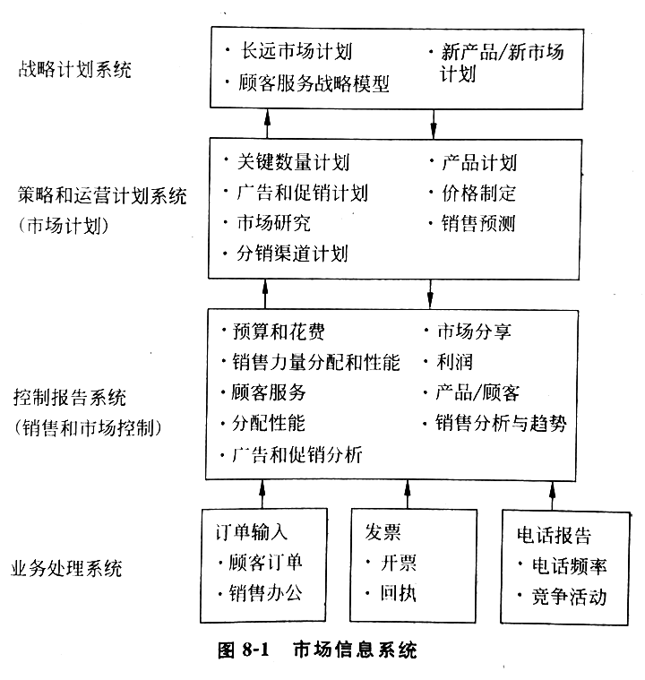
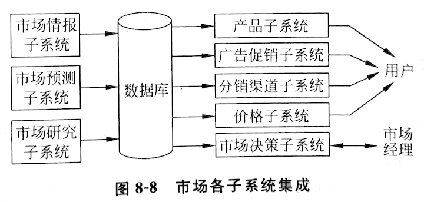
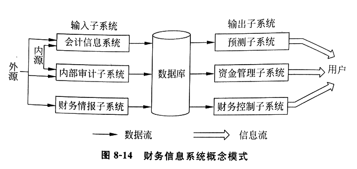
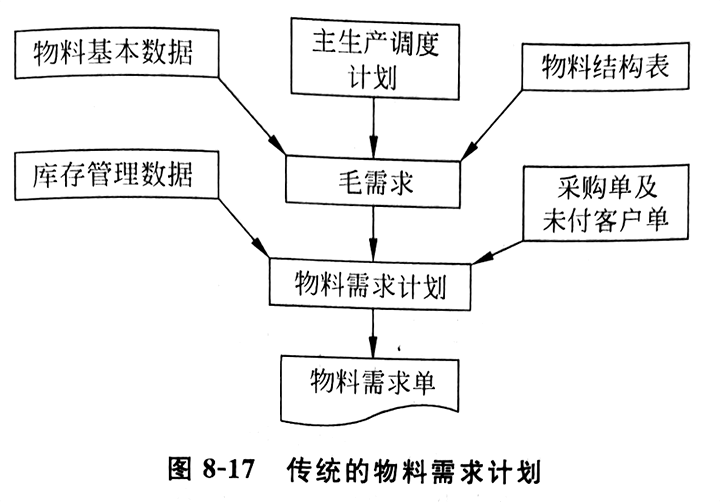
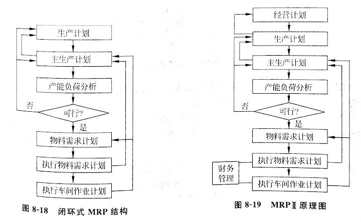
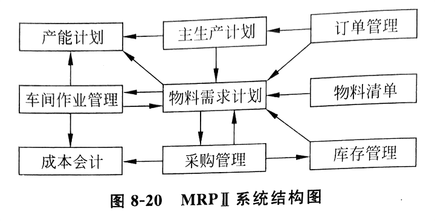
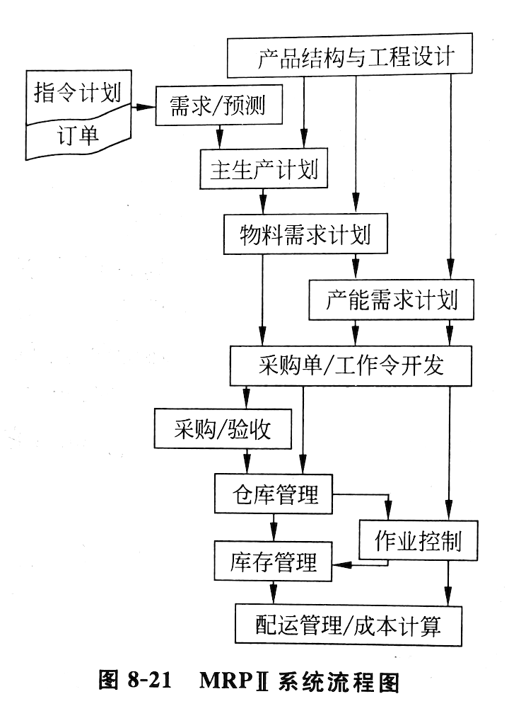

# 系统的发展过程

1. 信息系统角色的演变：
  - 1950~1960 数据处理系统
  - 1960~1970 管理报告系统
  - 1970~1980 决策支持系统
  - 1980~1990 战略和终端用户支持系统

2. 管理信息系统的概念空间 5 维：
  - 1 职能
  - 2 流程
  - 3 行业
  - 4 层次
  - 5 智能

# 第八章 职能信息系统

职能信息系统：按系统的职能划分的系统

企业中四大职能：市场、财务、生产、人力

## 第一节 市场信息系统

市场的主要内容包括：广告、促销、产品管理、定价、销售预测、销售自动化以及销售业务管理等

市场信息系统层面：战略层、策略层、控制层、业务处理层 🎯（系统及其功能）



### 一、销售预测

分类：

1. 短期预测（一天至一年）
  - 移动平均数法、指数平滑法模型

2. 中长期预测（两年到十几年）
  - 拟合模型、回归模型、系统动力学模型

预测方法：🎯（预测处理）

1. 经验综合法：
  - 根据管理人员的估计综合起来
  - 优点：简单、快速
  - 缺点：耗费领导层时间

2. 内因直接预测法
  - 用自己过去的历史数据预测自己的未来
  - 首先要考虑收集整理数据
  - 一般统计数据越多越好
  - 不太重要找 7 点，重要情况找 12 点
  - 季节性需求至少要两年的数据，跨度越长，季节性波动会被掩盖
  - 库存问题要考虑吸收需求的波动，时间跨度要短

3. 外因间接预测法
  - 首先要确定与需求真正相关的外部因素，即指示因素
  - 对每一个预测指示因素应不少于 30 个观察点
  - 要求有更多、更广泛的数据來源
  - 需求往往是不止一个指示因素的函数，数学上一般用多元回归的方法来处理

> 计算机预测系统是一个自维护系统。它不仅建立初始预测模型，而且当得到一个新的数据以后能自动调整模型，使之适应新的情况。具体来说，就是重配回归线，或者用指数平滑，或者重新建立新的预测模型。

预测子系统的基本功能：🎯

1. 收集和整理数据，滤除不合理的历史数据
2. 选择好的预测模型，以准确表达需求行为，从而改善预测精度
3. 用产品的寿命曲线修正长期预测，增加长期预测和新产品预测的精度
4. 管理人员可以根据预先知道的外界影响，调整模型
5. 使用模型维护技术，减少历史数据的存储量
6. 使用监控手段，保证现行预测模型延续使用，减少人工干预
7. 根据企业外部的经济因素不断发展预测模型

### 二、广告和促销 🎯

信息系统帮助广告和促销的方面：

1. 选择好的媒体和促销方法
2. 分配财务资源
3. 评价和控制各种广告和促销手段的结果

广告是一种投资，它把资金转化为无形资产，以后又把无形资产转化为价值

广告是促销的一种重要手段

广告是很非结构化的，因而它更多的是艺术，而不是科学，所以用计算机对它的文持是很有限的，更多的是制作方面

计算机对促销的支持：询价、下单、报告、提供信息

### 三、产品管理

产品是市场的第一成分，没有产品也就没有市场可言

产品的生命周期阶段：引入、成长、成熟、衰退 🎯

信息系统应当支持这些阶段的转移及其决策

新产品的评价可用 O'Meara 模型

### 四、定价子系統 🎯

定价子系统和促销子系统有密切的关系

定价子系统要协助决策者确定定价策略：

1. 以成本为基础的定价策略：附加值（固定值或百分比）
2. 以需求为基础的定价策略：要求正确地估计需求，需求旺，价就高；需求弱，价就低

报价系统：

- 一种价格计划系统，它能事先根据产品的性能，估计出它的各种费用，然后给出价格
- 不一定要那么详细，可又要求最后和实际价格不能相差大大，因而是个很难建造的系统
- 能提高投标的竞争力，又不会因为估计错误而使自己受损

信息产品的复制成本趋于零，成本定价已无意义，一人一价靠人工是无法完成的，报价系统成为行业之必需

### 五、销售渠道管理 🎯

销售渠道：指产品由生产厂家到用户的路径

```
            ← 资金流
供应者 > 制造者 > 批发者 > 零售者 > 顾客
              物质流 →
            ← 信息流 →
```

过长的渠道将增加成本，增加顾客的负担，也减少厂家的竞争力

销售管理：产品系列、产品分析、顾客类型、销售员业绩、销售领域

- 销售点系统 POS：面对顾客，得到大量销售数据
- EDI：支持整个销售过程的电子传输系统，捆绑环节，加固联盟，提高竞争优势

国际贸易的三大关键先进技术：条形码、集装箱、EDI

### 六、市场情报和市场研究子系统

1. 市场情报子系统：🎯
  - 公司和环境（顾客和竞争者）的接口
  - 要收集竞争者行为的信息，甚至不择手段
  - 主要活动：
    - 1 收集数据：一次数据、二次数据
    - 2 评价数据
    - 3 分析数据
    - 4 存储情报
    - 5 分发情报

2. 市场研究子系统：🎯
  - 利用市场情报子系统收集的数据进行研究
  - 往往这种数据不足，还要进行一些有目的的专项收集或调查
  - 调查方式：抽查、访谈、观察、控制实验

市场信息系统各子系统集成：🎯



1. 输入子系统：
  - 市场预测子系统
  - 市场情报子系统
  - 市场研究子系统

2. 输出子系统（用户）：
  - 产品子系统
  - 广告促销子系统
  - 分销渠道子系统
  - 价格子系统

3. 输出子系统（市场经理）：
  - 市场决策子系统

市场主要职能 4P：产品、促销、渠道、价格

## 第二节 财务信息系统

两大部分：

1. 会计：记账，使资金的运作不发生差错
2. 财务：如何运作好资金，使其产生效益

### 一、会计信息系统

防止差错：疏忽、破坏、贪污、作弊

有效方法：复式记账

面向历史数据，综合数据报表：收入表、平衡表

现代的会计己开始向财务延伸，涉及未来的数据，如获利能力计算、责任会计

会计的问题：

1. 产品中信息成本的计价问题
2. 有形资产和无形资产的计价问题
3. 商标权(商誉)价值问题
4. 人力资源以及研究与开发投入的计价问题
5. 事后、事中、事前反映经济事项问题
6. 财务信息和非财务信息反映的问题

会计系统：🎯

- 记账部分：最成熟、最固定的部分
- 子系统：🎯
  - 1 订货处理：接受和处理顾客的订单，并产生给顾客的发票和进行销售分析的数据
  - 2 会计应收应支系统：
    - 加入新的应收项目，它由开票后的订单触发，一般每日一次批处理
    - 删除已付的项目，从而真实地反映对顾客的业务
    - 准备报表，一般发货后给顾客 30 天时间付清货款，如 30 天已过则算拖欠货款
  - 3 库存系统：包括采购、库存处理系统
  - 4 总账系统：
    - 综合各子系统的数据提供一个企业运营的全貌
    - 总账更新系统、报告准备系统

### 二、财务信息系统概述

总目标：最好地利用资金和剩余资金的最优投资

财务信息系统：为协助主管达到以上目标的计算机系统

财务信息系统概念模式：🎯



输入子系统：

1. 会计信息系统：如前所述

2. 内部审计子系统：实际上也是会计功能
  - 1 财务审计：主要查公司的财务记录是否正确
  - 2 运营审计：审计财务手续是否完备、高效

3. 财务情报子系统：
  - 向股票持有者(股东)、财务社团以及政府机构提供信息，帮助了解公司经济环境

财务输出子系统：财务系统的主要系统，它们能帮助公司进行财务决策

1. 财务预测子系统：与市场预测类似

2. 财务资金管理子系统：财务系统的最重要的子系统
  - 两个目标：
    - 1 保证收入流大于消耗支出流
    - 2 保证这个条件在全年是稳定的
  - 现金和证券管理：也是财务管理的重要内容，它应使现金较快流动而不要呆滞
  - 用计算机模拟寻求最佳的现金来源，并处理多余现金的投资问题，确定合理的证券组合、资金组合 🎯

3. 财务控制系统：
  - 控制的支出：销售、电话、租金、办公用品等
  - 控制一些企业性能的参数：🎯
    - 1 `现金比例 = 当前资产 / 当前负债`
    - 2 `库存周转率 = 售货总费用 / 平均库存值 * 100%`

## 第三节 生产信息系统

制造信息系统两大类：

1. 通过技术实现产品生产的系统：
  - 计算机辅助设计 CAD
  - 计算机辅助制造 CAM
  - 计算机数字控制 CNC
  - 机器人 robot

2. 通过管理实现生产的系统
  - 材料需求计划 MRP
  - 制造资源计划 MRP II
  - 计算机辅助质量控制 CAQ

将技术系统和管理系统结合：

1. 计算集成制造系统 CIMS
2. 企业资源计划 ERP

### 一、MRP 系统 🎯

现代化的大生产给机械制造业带来的困难：

1. 生产上所需的原材料不能准时供应或供应不足
2. 零部件生产不配套，且积压严重
3. 产品生产周期过长，劳动生产率下降
4. 资金积压严重，周转期长
5. 市场和客户要求多变和快速，使企业的经营计划系统难以适应

长期以来的研究方法：

1. 订货点法
2. 材料需求计划 MRP
3. 准时法 JIT
4. 最优化法 OPT

MRP 发展三个阶段：

1. 20 世纪 60 年代：传统物料需求计划，主生产调度 MPS + 物料用量清单 BOM + 库存等
2. 20 世纪 70 年代：闭环式 MRP，能适应主生产计划的改变，又能适应现场情况的变化
3. 20 世纪 80 年代：MRP II，制造资源计划，设备和时间也被看成企业资源，并加以控制

传统的物料需求计划：🎯



闭环式 MRP 结构及 MRP 原理图：🎯




MRP 系统流程图：🎯



### 二、主生产计划子系统

包括两部分：

1. 总量计划子系统：宏观
  - 关于总体水平的计划，它不是细的要求
  - 目标：充分利用人力资源和设备
  - 平衡产量的方法：
    - 1 在需求低时生产较多产品，但库存较高
    - 2 增减人员，库存少，但增减和培训均有花费（加班也是一种方法，但能力有限）
    - 3 外包，额外花费
    - 4 让顾客接受推迟
    - 5 维持最高需求所需的人力、物力
  - 总量计划方法：🎯
    - 1 经验图表法：
      - 虛线：累计的预测需求
      - 点画线：累计的生产计划
      - 实线：可提供的正班和加班的产量
      - 只要点画线位于实线以下，且在终点和虚线相会，就是一个可行的总量计划方案
    - 2 管理系数法：
      - 根据经验确定一些主要因素，再直观地列出模型
      - 由历史数据拟合求得系数，再检验其相关性看是否漏掉主要变化
      - 最后用模型 6~12 个月，以便模型与管理情况协调
    - 3 最优化法：
      - 由线性规划模型求得
      - 理论上似乎很完善，但由于实际情况与理论数据的偏差，求得的最优解偏离很远

2. 主生产计划子系统：微观
  - 主生产计划：安排具体的产品的生产计划
  - 为了制定主生产计划，考虑的原则和总量计划相似
  - 但它核算能力要比总量计划细得多
  - 是企业高层管理与整个系统的主要界面，辅助决策

### 三、库存控制子系统：物料需求计划（MRP）子系统

根据主生产计划、物料清单、采购、生产等订货资料计算出相关需求的状况

主要功能：🎯

1. 计算各种原材料和零部件的需求时间、需求数量和需求地区
2. 配合作业控制，使仓库和车间管理人员对物料运送、设备和工具需求等事宜及早安排淮备
3. 及时采购原材料，避免库存积压
4. 计划和控制产品加工全过程，使其准时交货

库存控制两种基本方法：两种方法可以结合使用 🎯

1. 订货点技术法（统计库存控制）：前提是消耗平稳，每次消耗量小，而且适用于独立需求
2. 物料需求计划（MRP）法：要求处理大量数据，一般制造厂大约需要几万个记录，只有借助计算机才能解快

库存计划是通过一个循环机制实现的，循环步骤：

1. 库存计划首先确定各个周期的产品总需求：初始根据是主生产计划确定的产品需求量和备品备件需求、试验用需求等
2. 根据历史统计资料和生产上的要求，确定安全存储量
3. 根据安全库存的要求和当前可用的库存量求得净需求量
4. 考虑经济批量
5. 确定订货的开发日期
6. 产品按产品结构用 MRP 的方法展开（逐级进行）

抑制变化：节流

- 系统的实时性，对计划的变化十分敏感，但过于敏感会降低运行效率
- 库存管理系统应及时准确的记录每一微小变化，但不是一有变化就做出全面反映
- 积累到一定程度一次性处理

限定需求：即某项的需求可通过计算机搜索，追溯到需要它的上一级需求项 🎯

库存管理子系统输出类型：

1. 指示库存管理人员做出行动的命令
2. 向“生产制造活动计划”子系统提供机内输出信息，指示每个项的开发初步计划
3. 库存系统执行主生产调度计划情况报告
4. 库存会计与库存控制的执行情况报表

### 四、成本计划与控制子系统

成本系统与生产信息系统共享数据，生产系统及工厂监控系统可以向成本管理系统直接提供数据

1. 直接劳动成本的计划与控制
  - 1 计划直接劳动成本：
    - 一个项的计划直接劳动成本：🎯
      - ① 估算
      - ② 从直接劳动标准推导而得：用劳动标准和操作时间数来求得
    - 每个项记录中都存放该项的计划直接劳动成本
  - 2 标准直接劳动成本：
    - 信息系统的一次运行，根据产品结构对一个组件各部分的标准直接劳动成本累加
    - 随着生产方法和费用的变化，直接劳动成本的标准要经常改变，每过一定时间在作利润预测时要进行一次复核
    - 标准直接劳动成本的变化情况，可用来分析成本的偏差
  - 实际直接劳动成本：基本来自工厂监控子系统（工作号令、机器标识）
  - 成本控制：系统分析**实际直接劳动成本**与**标准劳动成本**之间的偏差，通知有关成本中心，督促管理人员调整不合理偏差 🎯

2. 材料成本计划与控制
  - 标准材料成本：按标准材料消耗和标准材料单价来计算的
  - 实际材料成本偏差：来自采购价格波动、工艺过程变更、加工废品和额外消耗等方面 🎯
  - 材料使用的情况：来自仓库控制系统

3. 管理费的处理
  - 对成本管理有很大影响
  - 应做到：
    - 1 对每类开支项目都赋予会计编码，计算机系统可以对会计编码制定得很细
    - 2 划分成本中心，其目的是使开支按职能区域汇总
      - 成本中心常与部门划分一致，且会划分很细
  - 处理过程中最大困难：分摊

4. 计划和控制资产消耗
  - 系统自动执行计算：
    - 1 固定资产一旦设置，就有相应记录，定期折旧
    - 2 在一个项目开发的过程中，系统不断重复计算项目投资对将来产品成本的影响

MRP 系统一般还包括：采购管理、指令发放、仓库管理、工厂维护等子系统

## 第四节 人力资源信息系统

人事部门职能：🎯

1. 招聘、选拔和雇佣
2. 岗位设置
3. 绩效评价
4. 薪酬管理
5. 人才培养和发展
6. 健康、保安和保密

人力资源信息系统 HRIS：支持人力资源管理的系统 🎯

1. 输入子系统 🎯
  - 1 记账子系统：个人数据，个人会计数据（小时工资率、总收入、收入税）
  - 2 人力资源研究子系统：晋升提拔的研究、岗位分析和评价、牢骚研究等
  - 3 人力资源情报子系统：包括政府人事情报、人才供应单位、保险公司、人才市场、学校等的信息

2. 输出子系统 🎯
  - 1 人力计划子系统：估计未来的岗位、人力，给出总要求
  - 2 招聘子系统：包括接受外来的申请、跟踪申请者、内部寻找等
  - 3 人力管理子系统：这是个大子系统，包括绩效评价、培训、职位控制、任免、技术/胜任、晋升等
  - 4 薪酬子系统：包括工资、功绩考核、行政酬劳、奖金等
  - 6 环境报告子系统：向政府报告企业的人事政策和实情，也有时向工会报告

## 复习与思考

1. 为什么每个职能信息系统都不是独立的？每个职能信息系统和其他系统有什么密切关系？
2. 什么输入系统为市场系统收集顾客和竟争者的数据？
3. 市场信息系统的主要功能是什么？试评述现有市场系统软件满足这些要求的情況。
4. 新产品开发有什么管理需要？新产品开发有什么系统功能要求？
5. 财务信息系统和会计信息系统的区别是什么？
6. 财务系统的主要目标是管好现金流吗？最适合于财务系统的软件是什么？电子报表决策支持系统
7. 材料需求计划的几个主要子系统是什么？
8. CAD、CAM 和 MRP 有哪些信息共享和信息交换？
9. 人力资源管理系统哪些部分容易用计算机管理，哪些不容易？不容易部分可否用计算机做某些支持？

---

# 第九章 层次信息系统

## 第一节 基层信息系统

基层使用的信息系统主要是业务员信息系统，又叫业务处理系统 TPS

业务：某种工作的手续的集合

业务处理周期：

1. 数据输入 🎯
  - 从拿到数据，记录、编码和编辑，到转换成实用的形式的整个过程
  - 是数据处理的一个瓶颈，如何快速准确地输入
  - 输入方法：
    - 1 传统手工：依赖终端用户由源文件获取数据
    - 2 源数据自动化
      - 希望：
        - ① 获取数据越早越好
        - ② 获取数据越近数据源越好
        - ③ 用机械读出介质获取代替源文件
        - ④ 预计于机器可读介质上的数据很少变化
        - ⑤ 不用介质，直接获取数据
      - 设别：POS 业务终端、光字符识别器 OCR

2. 业务处理
  - 1 批处理：🎯
    - 定期地、周期性收集源文件，然后进行成批的处理
    - 活动包括：🎯
      - ① 收集源文件
      - ② 把源文件录入到输入媒体
      - ③ 关键词排序
      - ④ 合并源文件和主文件，建立一个新主文件
      - ⑤ 定期将业务文件异地中央计算机保存处理
    - 主文件：永久存储的文件
    - 业务文件：中间存储文件，暂存性质，合并到主文件后消失
    - 优点：🎯
      - ① 适合处理大量的数据
      - ② 可以错开时间
      - ③ 对机器速度要求不高
    - 缺点：🎯
      - ① 主文件经常过时
      - ② 及时性不足
    - 批处理会保留多个副本，三个异地
  - 2 实时处理：🎯
    - 及时处理业务后，主文件已更新，数据反映真实
    - 亦称联机处理或在线处理
    - 只要一输入，记录、转换、更新主文件一气呵成，响应顾客的查询也是即时的
    - 也需要保留副本，不过它是在每笔业务后及时留副本
    - 容错系统：具有多处理器而且能支持实时恢复数据的处理叫做容错数据处理
    - 优点：及时处理、及时更新和及时响应
    - 缺点：由于联机、直接存取，必须采取特殊的措施保护数据库以及防止病毒和闯入者

3. 数据库维护 🎯
  - 维护数据库保证它能准确地反映企业现状

4. 文件和报告生成
  - 业务文件：数据处理系统所产生
  - 业务文件分类：🎯
    - 1 行动文件：来启动接受者行动的文件（采购单、支票）
    - 2 信息文件：确认业务已发生（销售收据、发票）
    - 3 周转文件：转回发送者（有些发票的签付/退回）

5. 查询处理 🎯
  - 批处理、实时处理均可提供查询功能
  - 现在越来越多使用实时、远距离查询∫

业务处理系统粗框图：🎯


## 第二节 中层信息系统

中层管理人员使用的多为终端用户系统：具有一台完整的终端机，该机可以和一个企业的中央计算机联网，自己也有一个小的数据库以及一些软件工具 🎯

终端用户系统的发展有两个原因：

1. 集中的信息中心无法满足中层人员的信息需求，需求拉动
2. 现代信息技术的发展使他们有可能这样获取和处理信息，技术驱动


终端用户运算的资源包括：硬件、软件、人员、数据、网络资源

终端用户得到的服务：🎯

1. 帮助控制实现网络连接，包括实现 gateway 的功能
2. 分享软件包和数据库
3. 执行分时处理服务，即当需要主干机的高速处理能力的时候

终端用户运算的软件资源：

1. 应用软件包：字符处理、电子报表、数据库、数据通信等
2. 办公室自动化的软件：电子邮件、桌面印刷等
3. 群件：支持协同工作
4. 应用开发软件：SQL、Visual Basic

终端用户的数据资源主要表现为多数据库：

1. 个人数据库
2. 群组和公司的数据库
3. 外部数据库

终端用户的网络资源：局域网（最多）、广域网、Internet

用户顾问组：系统分析员、程序员和技术员

终端用户系统优缺点：🎯

- 优点：可以节约大量时间和成本
- 缺点：没有集中的指导，终端用户系统的发展可能失去控制，导致重复建设、质量标准不一，造成混乱以及投资的失控

瘦终端：移动设备

## 第三节 高层信息系统

高层经理主要使用的系统是主管信息系统 EIS：利用信息系统支持主管高效率的工作 🎯

实现 EIS 的困难：

1. 经理信息的松散定义使得经理的信息需求确定变得十分困难
2. 经理和员工面对面的交流十分必要
3. 经理的决策是非结构化的
4. 一般来说经理驾取计算机的能力是较弱的
5. 经理的思想和行为又是千变万化的，很难统一通用结构

EIS 与 ESS 的对比：🎯

1. 经理信息系统 EIS
  - 1 是对经理个人的剪裁
  - 2 抽取、过滤、压缩和跟踪关键数据
  - 3 提供在线状态存取、趋势分析、例外报告和深入挖掘数据的能力
  - 4 取存和集成广泛的内源和外源数据
  - 5 用户友好
  - 6 主管经理直接使用，不要中间人

2. 经理支持系统 ESS：是加入附加能力的 EIS
  - 1 支持电子通信：电子邮件、传真
  - 2 提供数据分析能力：电子报表
  - 3 包括提高个人工作效率的工具：日历、备忘录

EIS 功能：🎯

1. EIS 的工作站是连到公司的主干机或部门的中型机或局城网，可以由局域网上取软件
2. EIS 通过数据库管理软件去存取内部运行库、外部数据库以及特殊管理库中的数据
3. 根据现实的状态预测末来的趋势，它具有模型分析能力

EIS 重要特点：能根据主管的需要和习惯去裁剪已有的系统

开发好 EIS 的关键因素：

1. 高层经理亲自参加开发
2. 了解数据源
3. 集中于重要问题
4. 时间响应
5. 主管经理要有信息意识和适当的计算机水平
6. 开发队伍不断学习
7. 要有灵活性，跟踪经理需求变化
8. 持续改善

完善的 EIS：

1. 具有原来的 EIS 的信息查询和模型处理的能力
2. 具有原来 EIS 一样的使用简单的界面
3. 具有更强的通信能力
4. 具有更强的多媒体信息处理能力
5. 体积更小，便携
6. 不仅能支持经理决策提高效率，而且能支持经理日常办公提高效率，甚至支持一些休闲活动

## 复习与思考

1. 业务处理信息系统和业务员处理系统是否一回事？为什么？
2. 终端用户系统和业务员处理系统有何不同？
3. 主管信息系统和主管支持系统有何不同？目前主管信息系统的需求前景如何？什么因素妨碍主管信息系统的发展？

---

# 第十章 流程信息系统

## 


## 复习与思考

1. 什么是企业系统？企业系统是怎样工作的？
2. 什么是供应键？它由哪些实体组成？什么是供应链管理？
3. 列出和描述 5 个主要的供应链过程。
4. 互联网和互联网技术如何使供应链管理简易化？
5. 供应链管理系统如何给企业提供价值？
6. 什么是企业资源系统(ERP)？ERP 一般包括几个模块？
7. ERP 是企业应用的核心，你同意吗？为什么？
8. 什么是顾客关系管理？为什么顾客关系管理今天如此重要？
9. 伙伴关系管理(PRM)和顾客关系管理(CRM)有何区别？相互关系如何？
10. 描述对销售、市场和顾客服务的顾客关系管理软件工具及其能力。
11. 顾客关系管理系统如何给企业提供价值？
12. 什么是服务平台？它们怎么和企业应用系统一起应用以提供跨功能的过程集成？
