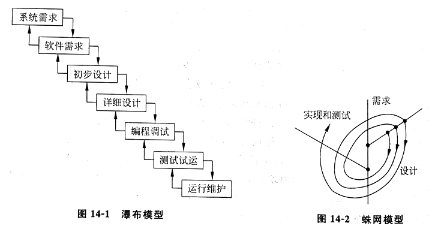
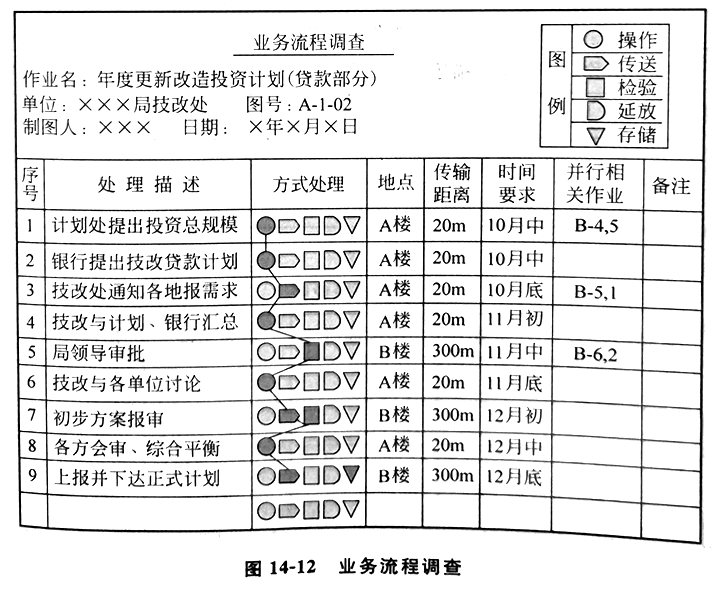
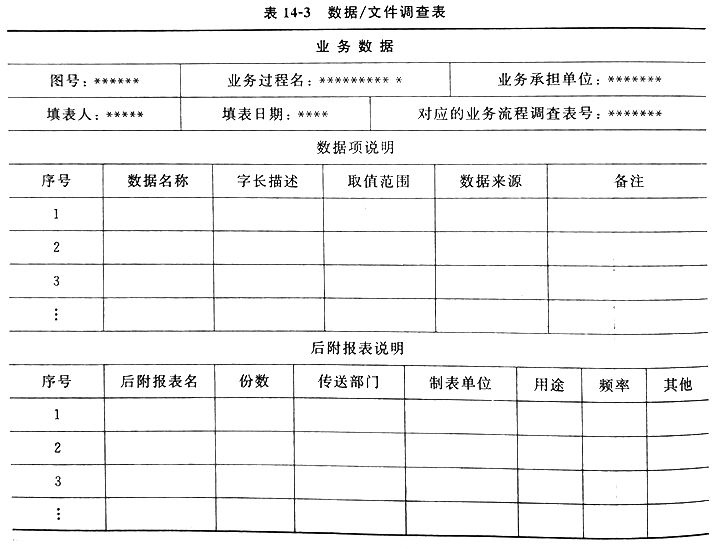
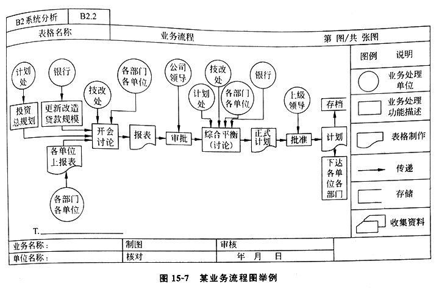
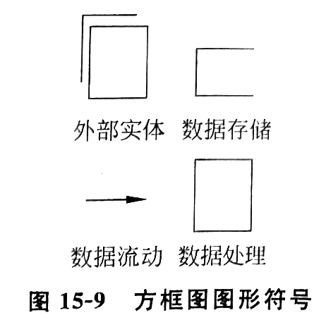
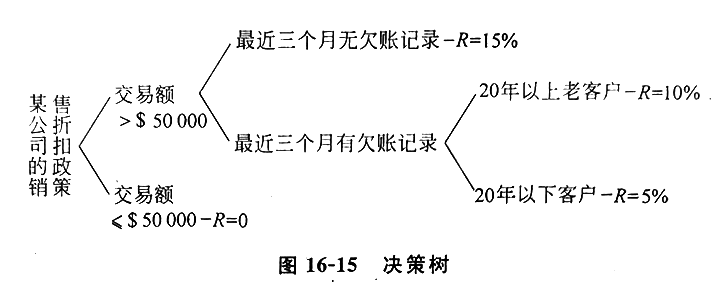

# 第十三章 信息系统规划

## 第一节 什么是战略规划

战略：基于组织使命制定的组织长远的计划，至少 3~5 年，一般 10 年，长至 50 年

战略规划：它是一种“安排未来”性质的工作，描述企业领导者关于企业发展的一些概念的集合 🎯

战略规划概念集合：

1. 组织环境、竞争对手和自身环境的分析，SWOT 分析
2. 组织的方向：使命、愿景、目的
3. 组织的目标和达到目标的战略

### 一、企业的使命和愿景

使命：说明该企业存在的缘由

进行企业规划和它的信息系统规划时，一定要牢牢地把握使命，不要背离使命

愿景：是企业对未来的期望的描绘

### 二、战略规划的目的和目标 🎯

目的：指向未来的目的地
目标：在不久的将来可以达到的可测量的东西

区分方面：🎯

1. 时间区段：目的是持久的，目标是有时限的
2. 特殊性：目的较为广泛，目标较专
3. 聚焦点：目的根据外部环境叙述，目标是内向的
4. 度量：都可以量化，目的是相关叙述项，目标是可以绝对叙述的

### 三、战路规划的特点 🎯

1. 方向目标明确
2. 可执行性良好
3. 组织人事落实
4. 灵活性好

### 四、战略规划的内容 🎯

1. 方向和目标：
  - 方向的导出来自对自己企业的使命和环境的分析
  - 使命是指企业的宗旨

2. 约束和政策：
  - 找到环境和机会与自己组织资源之间的平衡

3. 计划与指标：
  - 近期的任务，计划的责任在于进行机会和资源的匹配

战略规划内容的制定需要考虑的问题：

1. 我们要求做什么
2. 我们可以做什么
3. 我们能做什么
4. 我们应当做什么

### 五、战略规划的实现

期望战略的三个结果：期望结果、未实现的战略、实现了修改后的战略

战略规划实现和操作的两个先天性困难：🎯（信息系统规划中应注意的问题）

1. 这种规划一般均是一次性的决策过程，它是不能预先进行实验的
2. 参加规划的专家多为企业人员，他们对以后实现规划负有责任，规划的结果和他们的自身利益有关

执行好战略规划的要求：

1. 做好思想动员：造势，势在必行
2. 激励新战略思想：🎯
  - 1 明确战略思想的重要性，改变职工的压抑心情，改变企业的精神面貌，上下级应进行思想沟通
  - 2 要奖励创造性的战略思想，克服言者有罪的现象
3. 采用科学的步骤
  - 1 明确系统的目标
  - 2 组成系统的队伍：确定系统的领导
  - 3 采用系统工程

4. 把规划活动当成一个连续的过程
  - 战略管理：🎯
    - 1 建立运营原则
    - 2 确定企业定位
    - 3 设立战略目标
    - 4 进行评价和控制

## 第二节 什么是管理信息系统的战略规划

管理信息系统的战略规划：关于管理信息系统的长远发展的计划，是企业战略规划的一个重要部分 🎯

内容：🎯

1. 组织的战略目标、政策和约束、计划和指标的分析
2. 管理信息系统的目标、约束以及计划指标的分析
3. 应用系统或系统的功能结构、信息系统的组织、人员、管理和运行的分析
4. 信息系统的效益分析和实施计划

管理信息系统战略规划步骤：🎯

1. 规划基本问题的确定
2. 收集初始信息
3. 现存状态的评价和识别计划约束
4. 设置目标
5. 准备性能评价矩阵
6. 提出解决方案
7. 对每一个方案做出较详细的说明
8. 选择最好的方案
9. 写出规划报告
10. 总经理批准

说明企业规划和 IS/IT 规划关系：三明治法 🎯

- 将规划分为企业规划、IS 规划、IT 规划三层
- 三者紧密联系，相互交互，多次循环，多重反馈
  - 1 企业规划 BP：
    - 最上层的，根据外部环境，分析确定使命
    - 是企业规划的主要思路，也考虑了 IT 的潜力
    - 给出初步战略，指导 ISP
  - 2 信息系统规划 ISP：
    - 要说明的是要求什么，也就是 IT 的需求是什么，需要什么样的系统
    - 基于企业业务，面向需求，针对应用
    - 作为 IT 规划的输入
  - 3 信息技术规划 ITP：
    - 解决需求如何给以供应
    - 基于活动，面向供应，针对技术

完整的信息系统规划还包括：🎯

1. IT 应用构架
2. IT 数据构架
3. IT 基础实施
4. IT 管理制度和组织结构

## 第三节 早期管理信息系统规划的主要方法

职能需求法：最早，管理信息系统的规划没有成为单独划出的一个阶段，只是把它当成系统开发前的需求调查

管理信息系统主要规划方法：🎯

1. 关键成功因素法 CSF
2. 战略目标转移化法 SST
3. 企业系统计划法 BSP 

### 一、关键成功因素法 CSF

实施步骤：🎯

1. 定位企业目标
2. 识别关键成功因素
3. 识别性能的指标和标准
4. 识别测量性能的数据

关键成功因素法：源自企业目标，通过目标分解和识别、关键成功因素识别、性能指标识别，一直到产生数据宇典

关键成功因素：识别联系于系统目标的主要数据类及其关系

关键成功因素识别工具：树枝因果图 🎯

CSF 方法能抓住主要矛盾，使目标的识别突出了重点，但它只是在确定管理目标上较有效，在以后的目标细化和实现上作用很小

### 二、战略目标集转化法 SST

把整个战略目标看成一个“信息集合”：由使命、目标、战略和其他战略变量（管理的复杂性、改革习惯以及重要的环境约束）等组成

把组织的战略目标转变为 MIS 战略目标的过程：

1. 识别组织的战略集
  - 战略集识别步骤：🎯
    - 1 描绘出组织各类人员结构
    - 2 识别每类人员的目标
    - 3 对于每类人员识别其使命及战略

2. 将组织战略集转化成 MIS 战略
  - MIS 战略包括：系统目标、约束以及设计原则等 🎯

SST 方法反映了各种人的要求，给出按要求的分层，转化为信息系统目标，是一种结构化方法。保证目标比较全面，疏漏较少，但在突出重点方面不如 CSF

### 三、企业系统计划法 BSP

基于信息支持企业运行的思想，强调有系统角度的思考 🎯

BSP 方法步骤：🎯

- 先自下而上识别系统目标、识别企业过程、识别数据
- 然后自下而上设计系统以支持目标

```
企业目标          企业目标
   ↘              ↗
  企业过程      企业过程
     ↘          ↗
    数据分析  信息结构
       ↘     ↗
         数据
```

BSP 主要活动：🎯

1. 开始的动员会：说清工作的期望和期望输出，简介企业的现状
2. 定义企业过程（核心活动）：资源生命周期法、通用模型法 🎯（识别企业过程的方法）
3. 定义数据类：企业实体法、企业过程法 🎯（识别企业数据的方法）
4. 分析企业和系统的关系：主要用几个矩阵来表示
5. 确定经理的想法：就是确定企业领导对企业长远前途的看法
6. 评价企业问题：对采访数据进行总结、分类、关联
7. 定义信息结构：划分子系统，U/C 图

任何企业的活动的三个方面：计划/控制、产品/服务、支持资源

U/C 矩阵图：🎯

- 矩阵元写法：Use/Create
  - U：如果某过程使用某数据
  - C：如果某过程产生某数据
- 开始时数据类和过程是随机排列的，U/C 是分散排列的
- 以调换过程和数据类顺序的方法，尽量使 U/C 集中到对角线上排列
- 然后把 U/C 比较集中的区域用粗线条框起来，形成的框就是一个个子系统
- 粗框外的 U 表示一个系统用另一个子系统的数据
- 确定了信息结构的主流

分析企业和系统关系中的矩阵包括：🎯

1. 组织/过程矩阵
2. 组织/系统矩阵
3. 系统/过程矩阵
4. 系统/数据矩阵

BSP 方法虽然也首先强调目标，但它没有明显的目标引出过程 🎯（BSP 方法的局限性）

三者结合使用 CSB：弥补各自不足，但过于复杂，不够灵活

- 先用 CSF 方法确定企业目标
- 然后用 SST 方法补充完善企业目标，并将这些日标转化为信息系统目标
- 用 BSP 方法校核两个目标，并确定信息系统结构

## 第四节 信息系统规划方法的演进

演进的四个阶段：从企业规划 BP 和信息系统规划 ISP 的关系上来分 🎯

1. 孤立规划阶段：
  - BP：年度预算
  - ISP：功能自动化

2. 顺序规划阶段：BP 指导 ISP 方向，ISP 跟随 BP
  - BP：差距分析、静态资源分配、多年度预算
  - ISP：为决策者提供内部辅助决策信息

3. 交互规划阶段：ISP 如何为 BP 作出贡献，相互影响
  - BP：面向外部战略思考，动态资源分配
  - ISP：考虑外部影响

4. 整体规划阶段：
  - 结合共同应对外部的影响和提升内部的核心能力
  - 在领导、人员、时间上一致
  - 一个例子是 BPR

企业信息系统四层架构：

1. 网站
2. 应用系统
3. 数据库和数据仓库
4. 信息技术基础设施

## 第五节 基于 BPR 的信息系统规划

BPR 和 BSP 是一样的，不同的是 BPR 主张彻底变革，且在改造企业过程方面研究出了许多行之有效的方法

企业过程再工程 BPR：对企业过程进行**根本性的**再思考和**彻底的**再设计，以求企业关键的性能指标获得**巨大的**提高（成本、质量、速度）🎯

BPR 实现手段两个使能器：信息技术、组织 🎯

> 除了两个使能器，对 BPR 更重要的是企业领导的抱负、知识、意识和艺术。

BPR 的主要技术：简化、优化过程

BPR 简化的主要思想：

- 战略上精简分散的过程
- 职能上纠正错位的过程
- 执行上删除冗余的过程

BPR 简化原则：🎯

1. 横向集成：跨部门按流程的压缩
2. 纵向集成：权力下放，压缩层次
3. 减少检查、校对和控制等的事后过程：事后检查变事前管理、事中检查变事后审计
4. 单点对外：对待顾客，用入口信息代替中间信息
5. 单库提供信息
6. 一条路径到达输出
7. 并行工程
8. 灵活选择，过程连接

BPR 应用的情况：濒临破产、重构、扩张、相关企业影响

BPR 的目标：实现管理现代化 🎯

- 扁平化
- 大团队
- 高协调
- 领导教练化
- 面向客户

BPR 的优点：在于 RE 的内涵，如果没有 RE 的内涵也就失去了 BPR 的本质 🎯

> restructure, rebuild, reorganize, reuse, revision, revolution

BPR 的缺点：实施困难 🎯

## 第六节 信息系统规划和企业形象系统 CIS

企业的形象系统 CIS：企业精神和物质的表现，它不仅有神，也有形，达到形神的统一 🎯

CIS 实际上也是信息系统，而计算机化的信息系统也是形象系统

企业文化样式：🎯

1. 进取型：冒险
2. 稳健型：保守

| 项目 | 进去型 | 稳健型 |
| -- | -- | -- |
系统类型 | 专用的，易于改变；艺术状态 | 程序化，难以改变；成熟的
开发方法 | 原型法；弱的项目定义 | 传统的生命周期法；强的项目控制
开发工具 | 第四代语言工具；用模拟很多 | 传统的语言工具；如 COBOL、数据库语言
计划/控制 | 自上而下的系统结构；自下而上的系统定义 | 投资回收和风险评价；强的回收系统；资源分配的常设委员会
组织 | 资源分至专门用户；强的数据管理和信息系统训练功能；雇用企业分析与技术的奇才 | 库存资源；维修人员分至各用户；强大的数据中心运行网络控制；雇用固定的技术人员
信息系统关键问题 | 精明的资源管理；和专业组织一样维护信息系统；提供足够的存取数据和验证数据 | 强制技术关系；维持高质量的开发人员；推销“软件”收益项目

## 第六节 目标优先权和项目优先序

### 一、目标优先权的设置

目标优先权的设置方法：目标树 🎯

### 二、项目优先序的选择

项目优先序的选择：基于两方面 🎯

1. 关键因素：财务、技术、组织、环境、人员
2. 风险评价：项目规模、结构的稳定性和技术

## 复习与思考

1. 信息系统战略规划是否比企业的一般规划更困难？为什么？
2. 信息系统战略规划和企业计算机应用规划有何不同？
3. 信息系统战略规划有哪些方法？试比较它们的优缺点。
4. 企业高层领导和企业外的顾问专家在信息系统规划中的作用和职责是什么？
5. 在信息系统规划中以下领域的主要变量是什么？外部环境/技术环境/政治环境/社会环境/危机环境
6. 设置目标和项目优先权的主要因素是什么？如何综合它们比较合适？

---

# 第十四章 信息系统开发方法

信息系统的开发：在信息系统规划的指导下，分析、设计，实现一个信息系统的过程

## 第一节 开发方法发展的回顾

1. 20 世纪 70 年代：
  - 生命周期法：在开发前，完全定义好需求，然后经过分析、设计、编程和实施，从而一次全面完成目标
  - 开发环境：
    - 1 第三代语言 COBOL 用于编程
    - 2 已有数据库管理系统，用于数据管理
    - 3 联机处理和批处理混合使用
    - 4 主要针对主干机开发
    - 5 只由专业程序员进行程序开发
    - 6 利用标准符号来说明过程
    - 7 用户只在定义需求阶段和安装阶段介入开发
    - 8 试图用结构化的程序设计方法和自动化的项目管理
  - 模型依据：🎯
    - 1 瀑布模型：结构化
    - 2 蛛网模型：循环



2. 20 世纪 80 年代：
  - 开发环境逐渐成熟：第四代变成语言
  - 开发方法：🎯
    - 1 原型法：在未定义好全局前，抓住局部设计实现，不断修改，达到全面满足要求
    - 2 面向对象方法：计算机辅助软件工程、面向对象
  - 交互演变：
    - 第一代：主干机/终端
    - 第二代：PC 间
    - 第三代：C/S
    - 第四代：Web B/S

面向对象的方法的特点：🎯

1. 把数据和操作绑定在一起作为一个对象，数据是主动的，操作跟随数据
2. 很容易做到程序重用，重用也较规范
3. 使新系统开发和维护系统很相似

## 第二节 系统开发过程中的认知方法

### 一、从需求分析到系统开发

是什么，干什么，怎么干，动手干

技术发展促使系统开发重心前移，系统调查和需求分析才是最重要的一环

### 二、认知方法论

认知体系：人类认识和了解客观事物的规律和方法 🎯

人类了解客观事物的思维活动：

1. 抽象思维：以概念为基础
2. 形象思维：以具体形象为基础

认知方法论的指导作用：人们在实际调查、分折和记载一个调查分析结果时都是利用这种“相似原理”来进行的

### 三、分析事物的认知方法体系 🎯

1. 系统分析法：
  - 以系统的观点和系统工程的方法与步骤来分析事物的
  - 对系统开发过程中的每一步都严格按照先整体后局部、从一般到特殊的原则进行

2. 功能分析法
  - 在对实际管理功能进行详细的分析基础之上来了解和规范被分析对象的
  - 对系统调查所得到的资料，按管理功能进行分解，以了解每一个功能的作用、结构和内部处理细节，然后再对其进行优化处理

3. 数据流程法
  - 以数据在实际管理业务中的流动和处理过程来分析问题的
  - 以数据为主要对象，通过系统调查的资料，对实际管理业务中的数据流程进行分析，最终以数据指标和数据流程图的方式将它们规范化地确定下来

4. 信息模拟法：E-R 图
  - 以机器模拟数据在实际管理业务中的作用而进行分析的方法
  - 将事物分解成若干个实体，著重分析其信息属性和相互关系

5. 抽象对象法
  - 信息模拟方法的进一步发展
  - 事物的运行方式、处理方法和属性值的一种抽象表达

6. 模拟渐进法
  - 以系统模拟和不断修改完善来完成分析和了解对象的过程
  - 在调查的基础上，基于系统开发工具立刻模拟出一个系统原型，然后与用户一道来不断修政和评价这个原型，直到双方满意为止

### 四、开发方法及其认知基础

开发方法按照系统的分析要素分类：🎯

1. 面向处理方法 PO
  - 系统分析的出发点在于搞清系统要进行什么样的处理
  - 细分：
    - 1 面向功能 function：企业职能出发
    - 2 面向过程 process：企业运营流程

2. 面向数据方法 DO
  - 首先分析企业的信息需求，建立企业的信息模型，然后建立全企业共享的数据库

3. 面向对象方法 OO
  - 首先分析企业的一些对象，把描述对象的数据和对象的操作放在一起，或者说对象的数据和操作内容是对外封闭的

三维分类：

1. 时间阶段特点 🎯（时间过程分）
  - 1 生命周期法
  - 2 原型法

2. 进入系统的抓手
  - 1 面向数据
  - 2 面向处理
  - 3 面向对象

3. 实现程序方法
  - 1 手工编程
  - 2 计算机辅助开发
  - 3 产品选择

完整认知体系基础的信息系统开发方法：🎯

1. 结构化系统开发方法
  - 迄今最传统，应用最广泛的系统开发方法
  - 基本思想：用系统工程的思想和工程化的方法，按用户至上的原则，结构化、模块化、自顶向下地对系统进行分析与设计 🎯
  - 开发过程：系统开发生命周期 🎯
    - 1 系统规划阶段：需求调查
    - 2 系统分析阶段：流程分析
    - 3 系统设计阶段：结构设计
    - 4 系统实施阶段：开发培训
    - 5 系统运行阶段：管理、评价、审计
  - 认知体系：= 系统分析 + 功能分析法 + 流程分析法 🎯

2. 原型化系统开发方法
  - 扬弃了细致的调查分析
  - 基本思想：一开始就凭借着系统开发人员对用户要求的理解，在强有力的软件环境支持下，给出一个实实在在的系统原型，再与用户调整，最终形成系统 🎯
  - 开发过程：🎯
    - 1 用户提出系统开发要求
    - 2 开发人员识别归纳要求
    - 3 根据结果构造原型
    - 4 一起评价原型
  - 认知体系：= 系统分析 + 模拟渐进法 🎯
  - 局限性：
    - 1 很难模拟大型系统
    - 2 很难构造大量运算、逻辑性较强的程序模块
    - 3 原基础管理不善、信息处理过程泥乱的问题使用困难
    - 4 批处理系统的内部处理过程使用困难
  - 常与与系统分析的方法结合使用

3. 面向对象的系统开发方法
  - 基本思想：客观世界是由许多对象组成的，都有各自的内部状态和运动规律，不同对象之间相互作用和联系就构成了各种不同的系统 🎯
    - 客观事物都是由对象组成的
    - 对象由属性和方法组成
    - 对象之间的联系主要是通过传递消息来实现
    - 对象可按其属性进行归类
    - 对象是一个被严格模块化了的实体，称之为封装
  - 开发过程：🎯
    - 1 系统调查和需求分析
    - 2 分析问题的性质和求解：面向对象分析 OOA
    - 3 整理问题：面向对象设计 OOD
    - 4 程序实现：面向对象编程 OOP
  - 认知体系：= 信息模拟法 + 抽象对象法 🎯

三种开发方法的需求分析过程比较：🎯

- 结构化系统开发方法：是先对问题进行调查，然后从功能和流程的角度来分析、了解和优化问题，最后规划和实现系统
- 原型化系统开发方法：先请用户介绍问题，然后利用软件工具迅速地模拟出一个问题原型，再与用户一道运行和评价这个原型，如不满意则立刻修改，反反复复，直到用户满意为止，最后优化和整理系统
- 面向对象的系统开发方法：先对问题进行调查，然后从抽象对象和信息模拟的角度来分析问题，将问题按其性质和属性划分成各种不同的对象和类，弄清它们之间的信息联系，最后用面向对象的软件工具实现系统

## 第三节 对象/需求调查 🎯

对象/需求调查：在整个系统开发工作展开之前，弄清楚对象生产、经营和管理过程的所有细节

分为：系统初步调查、可行性分析、详细系统调查

### 一、系统调查的原则 🎯

1. 自顶向下全面展开
2. 先分析问题和原因，再设想有无改进可能
3. 遵循科学的步骤
4. 全面铺开与重点调查结合
5. 发扬团队精神，主动沟通，亲善合作

### 二、初步调查与可行性研究

是系统开发工作展开前的前期准备工作

初步调查范围（一般由用户提出要求开始的）： 🎯

1. 用户需求分析
2. 现有企业的运行状况
3. 管理方式和基础数据管理情况
4. 现有信息系统运行状况

初步调查的目的：事先了解一下系统的基本状况，为开发者构思并提出一个切实可行的新系统方案奠定基础

新建系统方案设想：🎯

1. 根据用户要求，新系统应考虑是以覆盖整个组织的信息系统（MIS）还是以某几个重点环节为主的局部环节信息支持系统（OA）
2. 新系统大致可按什么规模来开发
3. 新系统拟覆盖的范围，多少个子系统
4. 新系统拟解决的主要问题
5. 新系统顶计的投入产出比

系统开发的可行性分析：🎯

1. 技术层面：是否能实现
2. 经济层面：成本和效益
3. 社会层面：人员和制度

### 三、系统详细调查

1. 详细调查范围：🎯
  - 是围绕组织内部信息流所涉及领域的各个方面
  - 包括企业的生产、经营、管理等各个方面

2. 问卷调查方法 🎯
  - 常用且有效
  - 反复调查可以更清楚
  - 问题既要能反映本系统的特点，又要能全面地了解本业务的内容
  - 一般根据初步调查结果，对组织基本情况大致分析，然后根据以往调查分析工作经验结合可能与所调查问题有关的方面，设计出问题和问卷

3. 问卷调查结果整理 🎯
  - 通常在组织机构调查并绘制树状组织机构图时，对每一个管理岗位加以编号，设计其他图时也用这个编号来作为图号，以标识该表所记录业务和在组织内部的相对位置
  - 使得调查工作可以按计划进行，整理和分析时能找到相关原始资料
  - 整理：弄清其自身的业务处理过程和它与前后业务工作的联系

4. 业务流程调查方式 🎯
  - 从 BSP 方法中演变而来
  - 简洁、全面、综合、准确



5. 数据/文件调查表设计 🎯



## 复习与思考

1. 实际调查某个企业信息化建设的发展状况，说明开发方法在信息化建设中的重要作用。
2. 为什么说认知方法体系在信息系统开发过程中是非带重要的？
3. 试简述几种常用添统开发方法的相同和不同之处。
4. 试简述系统认知方法体系与几种常用开发方法之间的关系。
5. 信息系统的开发方法应如何分类？试进行研究，并提出自己的看法。

---

# 第十五章 系统分析

系统分析：对要开发的项目进行系统的、层次化的分析

系统分析过程：

- 总体：
  - 首先应将业务或数据流程弄清楚
  - 然后研究分析抓住主要问题，提出解决问题的思路，提出新系统拟采用的方案
- 具体：
  - 1 系统调查
  - 2 组织功能分析 🎯
  - 3 业务流程分析 🎯
  - 4 数据流程分析 🎯
  - 5 功能/数据分析 🎯
  - 6 新系统方案提出

## 第一节 系统调查

### 一、系统调查方法

遵循：

1. 自顶向下全面展开
2. 全面铺开与重点调查结合
3. 先分析问题和原因，再设想有无改进可能
4. 遵循科学的步骤
5. 发扬团队精神，主动沟通，来善合作

### 二、系统调查的范围

九类问题：

1. 组织机构和功能业务
2. 组织目标和发展战略
3. 工艺流程和产品构成
4. 数据与数据流程
5. 业务流程与工作模式
6. 管理方式和具体业务的进行方法
7. 决策方式和决策过程
8. 可用资源和限制条件
9. 现存问题和改进意见

## 第二节 组织结构与功能分析

组织结构与功能分析：整个系统分析工作中最简单的一环

1. 组织结构分析
  - 组织结构图：🎯
    - 将调查中所了解的组织结构具体地描绘在图上，作为后续分析和设计的参考
    - 是一张反映组织内部之间隶属关系的树状结构图
    - 除后勤与企业生产、经营、管理环节无直接关系的部门外，其他部门一定要反映全面、准确

2. 业务过程与组织结构之间的联系分析
  - 组织/业务关系图：🎯
    - 利用系统调查中所掌握的资料着重反映管理业务过程与组织结构之间的关系，它是后续分析和设计新系统的基础
    - 反映了组织内部和上下级关系
    - 但是对于组织内部之间的联系程度、组织各部分的主要业务职能和它们在业务过程中所承担的工作等却不能反映出来

3. 业务功能一览表：🎯
  - 把组织内部各项管理业务功能都用一张表的方式罗列出来，它是今后进行功能数据分析、确定新系统拟实现的管理功能和分析建立管理数据指标体系的基础
  - 一个完全以业务功能为主体的树型表，其目的在于描述组织内部各部分的业务和功能

## 第三节 业务流程分析

帮助我们了解该业务的具体处理过程，发现和处理系统调查工作中的错误和疏漏，修改和删除原系统中不合理部分，在新系统基础上优化业务处理流程

业务流程图 TFD：用一些规定的符号和连线来表示某个具体业务处理过程 🎯

业务流程图的基本符号：🎯



## 第四节 数据与数据流程分析

### 一、调查数据的汇总分析

调查得到的数据分类：🎯

1. 本系统输入数据类：主要指报来的报表，下级子系统或网络要传递的内容
2. 本系统主要储存数据类：台账、账单和记录文件，要存储的主要内容
3. 本系统产生的数据类：运行所产生的各类报表，输出和网络传递的主要内容

数据的三项分析：🎯

1. 汇总并检查数据有无遗漏
2. 分析数据，检查数据的匹配情况
3. 建立统一的数据字典

数据汇总的步骤：🎯

1. 将系统调查中所收集到的数据资料，按业务过程进行分类编码，按处理过程的顺序排放在一起
2. 按业务过程自顶向下地对数据项进行整理
3. 将所有原始数据和最终输出数据分类整理出来
4. 确定数据的字长和精度

数据分析：

1. 数据分析方法：U/C 矩阵 🎯
  - 本质是一种聚类方法，通过一个普通的二维表来分析汇总数据
  - 横坐标栏目定义为数据类变量，纵坐标栏目定义为业务过程类变量
  - 两者之间的关系用使用 U 或创建 C 表示
  - 将上一步数据汇总的内容填入

2. 数据正确性分析
  - 基本原则——数据守恒原理：数据必定有一个产生的源，且必定有一个或多个用途
    - 每列只能有一个 C：否则汇总出错或需要细分
    - 每列至少有一个 U：否则数据有误
    - 不能出现空行或空列：否则划分多余或漏掉联系
  - 三条检验规则：完备性、一致性、无冗余性 🎯

3. 数据项特征分析 🎯
  - 数据的类型以及精度和字长
  - 合理取值范围
  - 数据量
  - 所涉及业务

### 二、数据流程分析

把数据在组织内部的流动情况抽象地独立出来，从数据流动过程来考察实际业务的数据处理模式

内容：对信息的流动、传递、处理、存储等的分析 🎯

目的：发现和解决数据流通中的问题（数据流程不畅、前后数据不匹配、数据处理过程不合理等） 🎯

做法：分层数据流程图 DFD 🎯

按业务流程图理出的业务流程顺序，将相应调查过程中所掌握的数据处理过程，绘制成一套完整的数据流程图，一边整理绘图，一边核对相应的数据和报表、模型等

数据流程基本图例符号：🎯



方框图图例符号：🎯

1. 外部实体：在小方框中用文字注明外部实体的编码属性和名称
2. 数据流动：数据流动用直线、箭头加文字说明组成
3. 数据处理：数据处理用小方框来表示
4. 数据存储：即是对数据记录文件的读写处理

由于实际数据处理过程常常比较繁杂，故应该按照系统的观点，自顶向下地分层展开绘制

## 第五节 功能/数据分析

### 一、U/C 矩阵及其建立 🎯

- 首先要进行系统化，自顶向下地划分
- 其次逐个确定其具体的功能和数据
- 最后填上功能/数据之间的关系

### 二、正确性检验 🎯

1. 完备性检验：
  - 数据项/类必须有一个产生者 C，至少一个使用者 U
  - 功能则必须有产生或使用发生

2. 一致性检验：数据项/类必有且仅有一个产生者 C
3. 无冗余性检验：不允许有空行空列

### 三、U/C 矩阵的求解

是对系统结构划分的优化过程

基于子系统划分应相互独立，而且内部凝聚性高这一原则之上的一种聚类操作

具体做法：使表中的“C”元素尽量地靠近 U/C 矩阵的对角线，然后再以“C”元素为标准，划分子系统 🎯

### 四、系统功能划分与数据资源分布

U/C 矩阵的四点主要功能：🎯

1. 通过正确性检验，及时发现前段分析和调查工作的疏漏和错误
2. 通过正确性检验来分析数据的正确性和完整性
3. 通过求解过程最终得到子系统的划分
4. 通过子系统之间的联系“U”可以确定子系统之间的共享数据

主要是后两点：

1. 系统逻辑功能的划分
  - 划分小方块注意：🎯（步骤和方法）
    - 1 沿对角线一个接一个地画，既不能重叠，又不能漏掉任何一个数据和功能
    - 2 小方块的划分是任意的，但必须将所有的“C”元素都包含在小方块之内

2. 数据资源分布 🎯
  - 小方块以内所产生和使用的数据：今后主要放在本子系统的计算机设备上处理
  - 小方块以外的数据联系：各子系统之间的数据联系，这些数据资源今后应考虑放在网络服务器上供各子系统共享或通过网络来相互传递数据


## 第六节 新系统逻辑方案的建立

新系统逻辑方案：经分析和优化后，新系统拟采取的管理模型和信息处理方法 🎯

新系统逻辑方案包括：🎯

1. 对业务流程分析整理的结果
2. 对数据及数据流程分析整理的结果
3. 子系统划分的结果
4. 各个具体的业务处理过程
5. 根据实际情况应建立的管理模型和管理方法

新系统信息处理方案的内容：🎯

1. 确定合理的业务处理流程：删改过程，给出业务流程图
2. 确定合理的数据和数据流程：数据指标体系、数据字典
3. 确定新系统的逻辑结构和数据分布：子系统划分

新系统可能涉及的管理模型：🎯

1. 综合计划模型
  - 是企业一切生产经营、管理活动的纲领性文件
  - 组成：
    - 1 综合发展计划模型：来反映企业的近期发展目标
    - 2 资源限制模型：反映企业现有各类资源和实际情况对综合发展模型的限制情况

2. 生产计划管理模型
  - 1 生产计划大纲：安排与综合计划有关的生产量指标
  - 2 详细生产作业计划：具体给出产品生产数量、加工路线、时间安排、材料供应以及设备生产能力负荷平衡等方面

3. 库存管理模型
  - 1 库存物资的分类法
  - 2 库存管理模型

4. 财会管理模型
  - 1 会计记账科目的设定
  - 2 会计记账方法的设定
  - 3 财会管理方法
  - 4 内部核算制度或内部银行的建立以及具体的核算方法等
  - 5 安全、保密措施以及与其相对应的运行制度和管理方法
  - 6 文档、数据、原始凭证的保存方法与保存周期
  - 7 审计和随机抽查的形式、范围和对账方法等

5. 成本管理模型
  - 1 成本核算模型：直接消耗、间接成本
  - 2 成本预测模型
  - 3 成本分析模型

6. 经营管理决策模型
  - 1 组织决策体系的研究
  - 2 确定适当的决策过程
  - 3 确定收集、处理、提炼对决策有用信息的渠道、步骤和方法
  - 4 确定适当的决策模型
  - 5 确定和选择优化解的方式
  - 6 系统支持决策的方式
  - 7 模拟决策执行过程
  - 8 决策评价指标体系的研究以及反馈控制决策系统运行的方式

7. 统计分析模型
  - 反映销售状况、市场占有情況、质量指标、财务状况等方面的综合、总量变化状况
  - 1 产品市场占有率分析
  - 2 市场消费变化趋势分析
  - 3 产品销售统计分析
  - 4 产品销售额与利润变化趋势分析
  - 5 质量状况与指标分布状况分析
  - 6 生产统计分析
  - 7 财务统计分析
  - 8 企业综合经济效益指标统计分析

8. 预测模型
  - 1 多元回归预测模型
  - 2 时间序列预测模型
  - 3 普通类比外推模型

系统分析报告的内容：不但能够充分展示前段调查的结果，而且还要反映系统分析结果 🎯

1. 组织情况简述：概括性的描述
2. 系统目标和开发的可行性：拟采用什么样的开发战略和开发方法，人力、资金以及计划进度的安排，系统计划实现后各部分应该完成什么样的功能
3. 现行系统运行状况：图表工具为主，详细描述原系统信息处理以及信息流动情况
4. 新系统的逻辑方案：是系统分析报告的主体，这部分主要反映分析的结果和我们对今后建造新系统的设想
  - 1 新系统拟定的业务流程及业务处理工作方式
  - 2 新系统拟定的数据指标体系和分析优化后的数据流程，以及计算机系统将完成的工作部分
  - 3 新系统在各个业务处理环节拟采用的管理方法、算法或模型
  - 4 与新的系统相配套的管理制度和运行体制的建立
  - 5 系统开发资源与时间进度估计

## 复习与思考

1. 系统分析的主要任务是什么？为什么说系统分析是管理信息系统开发过程中最重要的一环？
2. 目前有哪几种常用的系统开发方法？它们各有什么特点，主要适用于哪些系统？
3. 如何检查 U/C 矩阵的正确性？试用你身边熟悉的情况建立、验证并求解 U/C 矩阵，最后解释解的意义。
4. 按照本章所介绍的内容从头到尾分析你所在单位（或学校、系）的情况，绘出所有的图表，并写出系统分析报告和新系统逻辑方案。
5. 实际体会“系统分析实质上就是分析了解待开发系统的实际状况和进一步的管理需求”这句话的含义。
6. 通过实际例子体会加强基础管理工作对于系统开发的重要性。
7. 参考本章所给出的例子，设计出一套简单、全面、能尽快了解用户工作和想法，并能使其“open-up”的调查问卷。

---

# 第十六章 系统设计

## 第一节 系统总体结构设计

系统总体结构设计：根据系统分析的要求和组织的实际情况对新系统的总体结构形式和可利用的资源进行大致设计，它是一种宏观、总体上的设计和规划

### 一、子系统划分

子系统划分的原则：🎯

1. 子系统要具有相对独立性
2. 子系统之间数据的依赖性尽量小
3. 子系统划分的结果应使数据的冗余度较小
4. 子系统的设置应考虑今后的管理发展的需要
5. 子系统的划分应便于系统分阶段实现
6. 子系统的划分应考虑到各类资源的充分利用

系统划分方法的分类：🎯

| 分类 | 划分方式 | 连接形式 | 可修改性 | 可读性 | 紧凑性 |
| -- | -- | -- | -- | -- | -- |
功能划分 | 业务处理功能 | 好 | 好 | 好 | 非常好
顺序划分 | 业务先后顺序 | 好 | 好 | 好 | 非常好
数据拟合 | 数据拟合程度 | 好 | 好 | 较好 | 较好
过程划分 | 业务处理过程 | 中 | 中 | 较差 | 一般
时间划分 | 业务过程时间 | 较差 | 较差 | 较差 | 一般
环境划分 | 实际环境和网络分布 | 较差 | 较差 | 较差 | 较差

常用的系统划分方法：一种以功能/数据分析结果为主，兼顾组织实际情况的划分方法

### 二、网络设计

网络设计：根据实际业务的需要去考虑如何配置和选用一个网络产品 🎯

网络设计的三部曲：

1. 首先要根据用户的要求选择网络的结构，然后根据系统结构划分的结果，安排网络和设备的分布
2. 然后再根据厂区内部的布局来考虑联网布线和配件
3. 最后就是根据实际业务的要求划定网络各节点的级别、管理方式、数据读写的权限、选择相应的软件系统等

通常在组织内部建立一条或几条局域网，故在信息系统开发过程中考虑最多的还是连接各子系统的 LAN

拓扑结构：总线型、环型、星型、树型、网型

协议：

1. 公用数据通信网建议一 X 系列建议
2. 局域数字通信网的 802.X 系列协议
3. 光纤数字环网的 ANSI X3T9.5 标准

### 三、设备和网络的配詈

计算机系统结构：分布式、分布集中式、完全集中式

设备选配的依据：🎯

1. 根据实际业务需要考虑这个管理岗位是否要专配计算机设备
2. 根据实际业务性质决定这个管理岗位是否需要配置微型计算机还是一个主机的终端设备
3. 根据办公室物理位置分布和有无联机数据通信的要求，决定是否需要与网络连按以及连接的方式
4. 根据调查估算的数据容量确定网络服务器或主机存储器的最低下限容量
5. 根据实际业务要求和用户对软件工具的掌握程度确定新系统拟采用的软件工具
6. 根据实际业务要求确定计算机及外部设备的性能指标

网络选择指标：🎯

1. 网络的基本属性指标
  - 数据通信频带：基带网、宽带网
  - 传输范围：局域网、广域网
  - 用途：专用网、公用网

2. 传输介质和速率指标：同轴电缆、光纤、普通电线（双绞线）
3. 网络的拓扑结构
4. 网络协议
5. 网络管理软件：分布式数据库系统、网络运行管理系统、文件管理系统
6. 网络的访问规则：轮询、令牌、载波侦听多路访问
7. 通信方式：广播、点对点、通过服务器数据交流
8. 网络配件：接口、Modem、中继器、网桥、网关、集线器、路由器

设备选择的指标：🎯

1. 技术上是否可靠
2. 维修是否很方便
3. 新老系统能否兼容，本系统外系统能否兼容
4. 非标准的系列不宜选取
5. 选用用户对软件、硬件都熟悉的产品
6. 使用是否方便
7. 可扩充性，今后扩充系统或升级是否方便
8. 对工作环境的要求（如温度，湿度、防尘度等）是否很高
9. 性能价格比越大越好

## 第二节 代码设计

### 一、编码的目的

代码设计的目的：🎯

1. 唯一化：编码区分
2. 规范化：编码规范
3. 系统化：编码分类

### 二、分类问题 

代码分类原则：🎯

1. 必须保证有足够的容量：要足以包括规定范围内的所有对象
2. 按属性系统化：分类不能是无原则的，必须遵循一定的规律
3. 分类要有一定的柔性：不至于在出现变更时破坏分类的结构
4. 注意本分类系统与外系统、已有系统的协调

代码分类方法：🎯

1. 线分类方法：
  - 用得最多，手工处理时的唯一方法
  - 首先给定母项，下分若干子项，由对象的母项分大集合，由大集合确定小集合⋯最后落实到具体对象
  - 两个原则：唯一性、不交叉性
  - 特点：
    - 1 结构清晰，容易识别和记忆，容易进行有规律的查找
    - 2 与传统方法相似，对手工系统有较好的适应性
    - 3 主要缺点是结构不灵活，柔性较差

2. 面分类方法
  - 主要从面的角度考虑
  - 特点：
    - 1 柔性好，面的增、删、修改都很容易
    - 2 可实现按任意组配面的信息检索，对机器处理有良好的适应性
    - 3 缺点是不易直观识别，不便于记忆

### 三、编码

编码的形式：🎯

1. 顺序码：行政区号
2. 数字码：身份证
3. 字符码：字段名
4. 混合码：标准号

### 四、代码的应用 🎯

1. 图书情报检索：外部特征字段检索
2. 项目经济效益的统计：不同效益类型编码

## 第三节 数据结构和数据库设计

信息系统的主要任务：通过存储到大量数据获得管理所需信息

建立 DB 的方式：数据定义语言 DDL、交互式命令

### 一、规范化地重组数据结构

规范化理论：🎯

- 将一组相互关联的数据称为一个关系，关系下的每个数据指标项则被称为数据元素
- 关系落实到具体数据库上就是基本表（库文件），数据元素就是基本表中的一个字段
- 规定在每一个基本表中必须定义一个数据元素为关键字，即唯一标识

表的四个性质：

1. 在表中的任意一列上，数据项应属于同一个属性
2. 表中所有行都是不相同的，不允许有重复组项出现
3. 在表中，行的顺序无关紧要
4. 在表中，列的顺序无关紧要，但不能重复

数据结构规范化定义：向上兼容 🎯

1. 第一范式：同一表中没有重复项出现，如果有，则应将重复项去掉
2. 第二范式：每个表有且仅有一个数据元素为主关键字，其他数据元素与主关键字一一对应
3. 第三范式：表中的所有数据元素不但要能够唯一地被主关键字所标识，而且它们之间还必须相互独立，不存在其他的函数关系
4. BC 范式
5. 第四范式

### 二、关系数据结构的建立

建立关系数据库的内容：🎯

1. 确定关联的关键指标项并建立关联表
2. 确定单一的父系记录结构：消除多对多，增加关系表
3. 建立整个数据库的关系结构

### 三、确定数据资源的分布和安全保密属性

数据资源分布：🎯

- 针对网络数据库
- 考虑数据资源在网络各节点上的分配问题
- 原则：同一子系统的数据尽量放在本子系统所使用的机器上，只有需要公用的数据和最后统计汇总类数据才放在服务器上

数据的安全保密定义：🎯

- 针对某些特殊信息
- 一般 DBMS 都提供给我们自己定义数据安全保密性的功能，8 个等级，4 种方式（只读、只写、删除、修改）
- 方法：
  - 原则上所有文件定为 4 级，个别优先级高的定义 4 级以上
  - 统计文件本工作站只写，其它工作站只读
  - 财务等保密文件本工作站可写、改、删除，其它工作站只读

## 第四节 输入输出设计

### 一、输入设计

输入方式设计：🎯

1. 键盘输入：联机、脱机
2. 数模/模数转换方式（光电设备）：条码、扫描仪、传感器
3. 网络传送数据：数字网络、电话网络
4. 数据存储器传送数据：硬盘、U 盘、光盘

输入格式：应尽量改变统计报表或数据库关系表二者之一的结构，并使其一致，以减少输入格式设计的难度 🎯

校对方式：🎯

1. 人工校对：效率太低
2. 二次键入校对：工作量加倍
3. 数据平衡校对：财务数字小计累加

### 二、用户界面设计

坚持友好、简便、实用、易于操作的原则

用户界面设计的内容：🎯

1. 菜单方式：最常用，下拉、弹出、按钮，邻近功能颜色对比
2. 会话管理方式：方便灵活
3. 操作提示方式与权限管理

### 三、输出方式

输出方式：报表、图形 🎯

## 第五节 模块功能与处理过程设计

### 一、HIPO 图

HIPO 图：描述系统结构和模块内部处理功能的工具，由层次结构图、IPO 图两部分构成 🎯

层次结构图：描述了整个系统的设计结构以及各类模块之间的关系

IPO 图：描述了某个特定模块内部的处理过程和输入/输出关系

### 二、层次模块结构图

基本做法：将系统划分为若干子系统，子系统下再划分为若干的模块，大模块内再分小模块

模块：具备输入输出、逻辑功能、运行程序和内部数据 4 种属性的一组程序

主要关心：模块的外部属性（上下级模块、同级模块之间的数据传递和调用关系），而并不关心模块的内部

设计原则：🎯

1. 所划分的模块其内部的凝聚性要好：模块独立，模块间联系少
2. 模块之间的连接只能存在上下级之间的调用关系，不能有同组之间的横向联系
3. 整个系统呈树状结构，不允许有网状结构或交叉调用关系出现
4. 所有模块(包括后继 IPO 图)都必须严格地分类编码并建立归档文件

模块连接方式：🎯

1. 模块连接：按功能和数据流程连接，常用
2. 特征连接：按模块特征相连接
3. 控制连接：按控制关系相连接
4. 公共连接：废弃
5. 内容连接：废弃

功能模块划分：一般都是按功能划分的

### 三、IPO 图

配合层次化模块结构图详细说明每个模块的内部功能

设计必须包括输入 I、处理 P、输出 O，以及与之相应的数据库/文件、在总体结构中的位置等信息

IPO 图的优缺点：🎯

- 其他部分的设计和处理都是很容易的
- 处理部分描述困难，且容易产生二义性问题

处理过程描述方法：决策树方法、判断表方法、结构化英语方法、算法描述语言方法

### 四、决策树方法 🎯



### 五、判断表方法 🎯

相比决策树：能够把所有的条件组合充分地表达出来


### 六、结构化英语方法 🎯

专门用来描述一个功能单元逻辑要求的

特点：受结构化程序设计思想的影响，由三种基本结构构成，顺序结构、判断结构、循环结构

关键词：IF THEN ELSE SO AND OR NOT

### 七、算法描述语言方法 🎯

是一种具体描述算法细节的工具，它只面向读者，不能直接用于计算机

语法形式：符号与表达式、赋值语句、控制转移语句、循环语句、其他语句

## 第六节 系统设计报告 🎯

1. 系统总体结构图：总体结构图、子系统结构图、计算机流程图等
2. 系统设备配置图：系统设备配置，主要是计算机系统图
3. 系统分类编码方案：分类方案、编码和校对方式
4. 数据库结构图：表、字段、字典
5. I/O设计方案
6. HIFO 图、IPO 图
7. 系统详细设计方案说明书

## 第七节 企业营销网站的创建与运作

设计步骤：先是需求分析和网站功能及网页内容设计，最后才是网页设计过程

### 一、网站创建的一般过程 🎯

1. 企业商务网站的定位及分类 🎯
  - 1 公司网站
    - 对象：员工、投资者、候选人
    - 主题：展示企业形象
    - 功能：宣传企业文化，建立对外信息沟通的桥梁
    - 特点：栏目、板块、内容有固定规律可循
  - 2 行业门户网站
    - 对象：业内人士、投资者、入行者
    - 主题：行业信息交流和展示的平台
    - 功能：展示行业特点、现状及发展趋势，建立行业信息沟通的桥染，发布行业产品供需信息，建立产品或数据交换平台
    - 特点：栏目、板块、内容有固定规律可循
  - 3 购物网站
    - 对象：消费者
    - 主题：展示商品和竞争优势
    - 功能：展示商品信息，强调竞争优势、服务配套措施
    - 特点：栏目、板块、内容有固定规律可循
  - 4 营销网站
    - 对象：大众、客户、消费者
    - 主题：针对客户感兴趣的内容提供服务，抓住目标客户，并在此基础上，传播企业营销理念，促进销售
    - 功能：提供有益于客户的信息、知识、娱乐、互动沟通平台，在服务客户、满足客户需求的前提下，传播企业营销理念，引导公众对产品或服务的关注
    - 特点：可以采用游戏、娱乐、参与、互动、活动、俱乐部、社区、品牌专区、咨询、营销网站等多种形式

2. 商务网站创建的过程
  - 1 申请网络域名
  - 2 设计网站页面内容
  - 3 设置网络服务器

### 二、域名资产的注册与保护

1. 域名创建的原则 🎯
  - 1 域名要尽可能地继承和保护企业原有的产品资产
  - 2 域名一定要短，而且有利于公众记忆
  - 3 域名可用多种形式：英文、拼音

2. 域名申请注册
  - 1 事先想好域名并准备好企业的营业执照
  - 2 登录中国互联网信息管理或其代理机构的网站，了解域名申请注意事项并在线填报申请表格
  - 3 填写申请表格并通过网络查实有无重名
  - 4 提交申请表格并缴纳域名注册费

3. 域名资产的保护
  - 1 品牌域名被他人抢注
  - 2 缺乏适当的域名资源对营销传播的影响
  - 3 老字号：发音注音
  - 4 恶性诈骗：字母数字伪装

4. 解决方案
  - 1 域名系统的扩展
  - 2 多语种域名

### 三、营销网站设计

1. 营销导向的商务网站创建过程 🎯
  - 1 网站定位
  - 2 深入了解企业文化、经营理念、产品和市场特点
  - 3 按产品、市场、客户等因素细分市场
  - 4 明确营销网站的主题以及吸引客户、展开持续互动的切入点
  - 5 抓住客户：从消费者的需求和关注的热点入手展开服务
  - 6 组织内容：从客户需求和营销策略展示两方面综合考虑
  - 7 设计脚本
  - 8 综合网络环境应用

2. 细分市场和网站定位方法
  - 1 市场变量的确定方法：人口、地理、行为、心理
  - 2 市场细分：人群、行为、地理
  - 3 定位目标市场：广泛市场营销、细分市场营销、技术/知识/专业型的市场营销

3. 脚本设计
  - 脚本：用文字和图形来表达网站的主题、展现形式和要表达的内容
  - 脚本内容：设计者希望网站所展示的全部内容
    - 1 网站结构
    - 2 屏幕形式
    - 3 文本描述
    - 4 超文本链接
    - 5 活动策划、互动沟通、客户参与的形式
    - 6 信息的存储、管理和处理方式
    - 7 产品及文本内容的分类
    - 8 宣传（广告）和促销手段
    - 9 拟传播的理念以及与产品促销的关系等
  - 脚本设计过程：🎯
    - 1 确定主题
    - 2 确定对象
    - 3 设计角色
    - 4 安排情节
    - 5 设计结构
    - 6 确定处理过程

4. 客户需求和营销展示构成营销网站内容
  - 客户需求：要从市场和客户的角度来考虑问题
  - 营销展示：当企业的营销人员在面对市场和客户时的表达

### 四、企业商务网站开发举例

1. 编写脚本
2. 用 FrontPage 模板来定义网站的过程

## 复习与思考

1. 系统设计的主要任务是什么？它能为下一步的系统实现工作提供什么作用？
2. 为什么说系统设计需自顶向下地进行，必须首先进行总体设计？
3. 购买机器时常出现的问题有哪些？请具休列出购买计算机时需要考虑的因素和具体的软件、硬件指标。
4. 编码的关键是什么？编码有哪些用途？分类、编码时应注意什么？如果编码出错会给今后系统带来什么样的问题？
5. 目前有哪几种输入校对方式，它们的优缺点是什么？各适用于哪些情况？
6. 建立统计指标体系对于今后建立数据库系统有何作用？为什么说“建立适当的指标体系是今后建立数据库系统的关键〞？
7. HIPO 图是如何构成的？它的主要用途是什么？
8. 按照本章所讲内容，根据第 15 章习题第 4 题的分析结果，试做一个系统设计，并最终给出所有的设计资料和系统设计报告。
9. 试叙述 SSA&D、PROTOTYPING 系统开发方法在系统设计中的区別。
10. 请列出建立一个 MIS 常用的硬件设备和软件工具。
11. 根据第 8 题结果局部的编程，实践一下你自己所做的系统分析和系统设计，发现和体会一下其中的问题。
12. 访问若干个国内外大型企业的商务网站，了解企业商务网站的特点、形式、技术和重点宣传的主要内容。
13. 为什么说“商务网站是企业展示其产品和营销策略的主渠道和主窗口”？试用国内一些典型企业商务网站的实践来说明。
14. 为什么说“脚本设计是建立企业商务网站很重要的一环”？试通过国内一些典型企业商务网站来说明。
15. 应用 MS FrontPage 实际动手建立一个班级或个人网站。
16. 如果企业原有的品牌名不便于记忆或被他人抢注怎么办？

---

# 第十七章 系统实施、评价与运行管理

MIS 实施方法：

1. 自编软件：程序设计和系统调试非常重要
2. 购买成品：本地化，对用户二次开发非常重要

## 第一节 系统实施

系统实施：新系统开发工作的最后一个阶段

将系统设计阶段的结果在计算机上实现，将原来纸面上的、类似于设计图式的新系统方案转换成可执行的应用软件系统

系统实施阶段的主要任务：🎯

1. 按总体设计方案购置和安装计算机网络系统
2. 建立数据库系统
3. 程序设计与调试
4. 整理基础数据并培训操作人员
5. 投入切换和试运行

### 一、程序设计与调试

主要依据：系统设计阶段的 HIPO 图以及数据库结构和编程语言设计

目的：用计算机程序语言来实现系统设计中的每一个细节

程序设计方法：🎯

1. 结构化程序设计方法
  - 按照 HIPO 图的要求，用结构化的方法来分解内容和设计程序
  - 强调三点：
    - 1 模块内部程序各部分要自顶向下地结构化划分
    - 2 各程序部分应按功能组合
    - 3 各程序部分的联系尽量使用调子程序 CALL-RETURN，不用或少用 GOTO 方式

2. 速成原型式的程序开发方法
  - 首先将 HIPO 图中类似带有普遍性的功能模块集中
  - 然后再去寻找有无相应、可用的软件工具，如果没有则可以考虑开发一个能够适合各子系统情况的通用模块
  - 然后用这些工具生成这些程序模型原型

3. 面向对象程序设计方法
  - 将 OOD 中所定义的范式直接用面向对象程序来取代

衡量编程工作的指标：🎯

1. 可靠性：安全和运行
2. 规范性
3. 可读性
4. 可维护性：程序各部分相互独立

常用的编程工具：🎯

1. 常用编程语言类
2. 数据库类
3. 程序生成工具类：常用数据处理功能和程序之间对应关系的自动编程工具
4. 系统开发工具类：专用开发工具类、综合开发工具类
5. 客户/服务器工具类：VB/Excel/PPT
6. 面向对象编程工具：C++

程序调试的方法：🎯

1. 黑箱测试：不管如何编制，只是从外部根据 HIPO 图对模块测试
2. 数据测试：大量实际数据进行测试
3. 穷举测试：完全测试
4. 操作测试：从操作到各种显示、输出应全面检查
5. 模拟测试：核算所有计算结果

程序调试的主要步骤：得益于结构化系统设计和程序设计的基本思想 🎯

1. 模块调试：全面的调试
2. 分调：子系统各模块
3. 联调：系统联调

### 二、人员以及岗位培训

1. 系统整体结构和系统概貌
2. 系统分析设计思想和每一步的考虑
3. 计算机系统的操作与使用
4. 系统所用主要软件工具
5. 汉字输入方式的培训
6. 系统输入方式和操作方式的培训
7. 可能出现的故障以及故障的排除
8. 文档资料的分类以及检索方式
9. 数据收集、统计渠道、统计口径等
10. 运行操作注意事项

### 三、试运行和系统转换

系统试运行阶段的主要工作：🎯

1. 对系统进行初始化
2. 输入各原始数据记录
3. 记录系统运行的数据和状况
4. 核对新系统输出和旧系统输出的结果
5. 对实际系统的输入方式进行考察
6. 对系统实际运行和响应速度进行实际测试

基础数据准备：

1. 基础数据统计工作要严格科学化，具体方法要程序化、规范化
2. 计量工具、计量方法、数据采集渠道和程序都应该固定，以确保新系统运行有稳定可靠的数据来源
3. 各类统计和数据采集报表要标准化、规范化

系统切换的三种方式：🎯

1. 直接切换：停旧开新，简单、风险大
2. 并行切换：新旧并行一段时间，较好、费用大
3. 分段切换：以上两种方式的结合，系统较大时使用

## 第二节 选择管理软件产品导入

> 较为流行的做法是：根据系统分析和系统设计的结果，选购一套现有的管理软件系统商品；然后再按照系统分析、优化、重组业务流程，以及系统设计中的一些细节因地制宜地展开客户化、本地化的二次开发和系统初始化。

### 一、现行 ERP 产品

1. 用友 ERP/U8 企业标准套件 🎯
  - 管理特征：
    - 1 信息化管理模型
    - 2 角色驱动，流程导航
    - 3 核心业务，集成应用
    - 4 成熟产品，快速交付
    - 5 产品套件化，实施标准化

2. 金蝶 K/3 V10 🎯
  - 解决方案三层：
    - 业务运营管理层：财务、物流、制造、客户关系、人力、办公自动化
    - 商业智能层：各种分析
    - 战略企业管理层：战略目标管理、业务规划、预算管理
  - 特点：
    - 1 一体化的设计
    - 2 灵活的业务适应性
    - 3 强大的业务扩展性
    - 4 个性化管理
    - 5 国际化管理

3. ERP 产品的一般功能 🎯
  - 1 超越 MRP Ⅱ 范围的集成功能
  - 2 支持混合方式的制造环境
  - 3 支持动态的监控能力
  - 4 提高业务绩效
  - 5 支持开放的客户机/服务器计算环境

### 二、本地化二次开发的要点 🎯

1. 实施规则
  - 1 在思想上要重视本地化二次开发问题，否则，再好的产品不适用也是一事无成
  - 2 在人力、物力、财力上要预留有本地化二次开发的投入
  - 3 将系统调查、需求分析、流程重组、新系统方案与 ERP 产品选型、本地化二次开发联系起来综合规划

2. 产品选择
  - 1 必须要根据系统分析和设计的要求来综合选择
  - 2 要根据本单位和优化、重组后的业务流程来选择最适合的产品
  - 3 既充分考虑到 ERP 产品的特点，又充分考虑到本地化二次开发的可行性
  - 4 考虑到产品自身的开放性、兼容性和末来的可扩展性

3. 实施中的误区
  - 1 只重视系统建设，忽视了基础管理和原始数据管理的重要性
  - 2 只重视产品和设备采购，忽视了系统调查和业务流程重组的重要性，没有意识到信息系统开发是由业务流程驱动的
  - 3 贪大求洋，误认为越“洋”、越大、越贵越好，忽视了根据系统分析，因地制宜地选择设备和产品的重要性
  - 4 只重视硬件、软件、ERP 产品的先进性，忽视了客户化、本地化二次开发的重要性
  - 5 在客户化、本地化二次开发时，没有考虑到本单位的实际情况，没有根据系统分析和业务流程组的要求来展开
  - 6 在资金的投入方面，没有考虑到客户化、本地化二次开发的重要性

### 三、二次开发或系统运行成功的标志 🎯

1. 系统的实用性
2. 系统运行集成化
3. 业务流程合理化
4. 绩效监控动态化
5. 管理改善持续化

### 四、系统初始化 🎯

1. 处理模型的初始化
2. 原始财务数据的初始化
3. 系统控制变量的初始化

## 第三节 系统运行管理制度 🎯（四个方面）

1. 系统运行管理的组织机构
2. 基础数据的管理
3. 运行管理制度
4. 系统运行结果分析

## 第四节 信息系统的评价体系

信息系统质量评价的特征和指标：🎯

1. 系统对用户和业务需求的相对满意程度
2. 系统的开发过程是否规范
3. 系统功能的先进性、有效性、完备性
4. 系统的性能、成本、效益综合比
5. 系统运行结果的有效性或可行性
6. 结果是否完整
7. 信息资源的利用率
8. 提供信息的质量如何
9. 系统的实用性

系统运行评价指标：🎯

1. 预定的系统开发目标的完成情况
  - 1 对照系统目标和组织目标检查系统建成后的实际完成情况
  - 2 是否满足了科学管理的要求？各级管理人员的满意程度如何？有无进一步的改进意见和建议？
  - 3 为完成预定任务，用户所付出的成本是否限制在规定范围以内？
  - 4 开发工作和开发过程是否规范，各阶段文档是否齐备？
  - 5 功能与成本比是否在预定的范围内？
  - 6 系统的可维护性、可扩展性、可移植性如何？
  - 7 系统内部各种资源的利用情况

2. 系统运行实用性评价
  - 1 系统运行是否稳定可靠？
  - 2 系统的安全保密性能如何？
  - 3 用户对系统操作、管理、运行状况的满意程度如何？
  - 4 系统对误操作保护和故障恢复的性能如何？
  - 5 系统功能的实用性和有效性如何？
  - 6 系统运行结果对组织各部门的生产、经营、管理、决策和提高工作效率等的支特程度如何？
  - 7 对系统的分析、预测和控制的建议有效性如何，实际被采纳了多少？这些被采纳建议的实际效果如何？
  - 8 系统运行结果的科学性和实用性分析

3. 设备运行效率的评价
  - 1 设备的运行效率如何？
  - 2 数据传送、输入、输出与其加工处理的速度是否匹配？
  - 3 各类设备资源的负荷是否平衡？利用率如何？

## 复习与思考

1. 系统实现应当包括的主要内容是什么？系统设计和系统实现接口上存在的主要问题是什么？
2. 三种切换方式是什么？在什么条件下用哪种方式较好？
3. 试比较买软件和自编软件的优缺点。
4. 如何评价管理信息系统的经济效益？评价中的主要问题是什么？
5. 什么是一个好的系统运行？如何达到好的运行？
