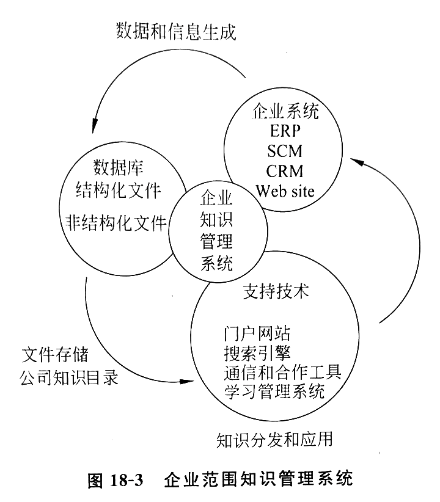
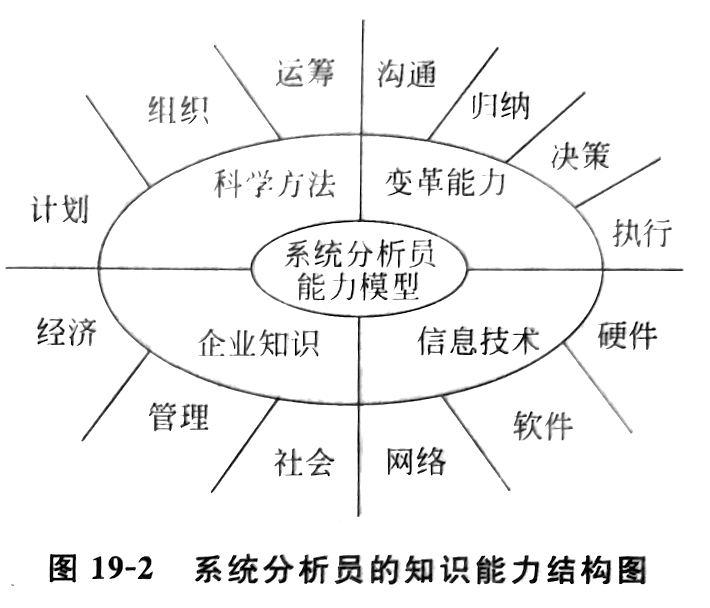

# 第十八章 企业信息管理

## 第一节 企业信息管理的内涵

信息管理的两方面：信息内容管理、信息技术管理

战略规划问题：🎯

1. IS 战略规划问题
2. IS 的架构问题
3. 项目管理问题
4. IT 运行的计划和控制问题
5. IT 部门的经营策略问题

### 一、IS 战略规划问题

制定企业的 IS 战略规划重要的三原则：🎯

1. 主要领导的亲自参加
2. 有系统性的执行团队
3. 遵循系统管理的步骤

企业的战略规划要考虑 IS 的潜能，IS 的规划要符合企业的目标

### 二、IS 的架构问题

架构：为分配计算资源的模式

企业内 IS 架构发展趋势是朝着四层架构发展

四层构架：🎯

1. 网站：未来的企业都是网络企业
2. 应用程序：各种应用程序的集合
3. 数据仓库
4. IT 基础设施：是企业应用的计算机硬件和系统软件的总和

### 三、项目管理问题 🎯

规划、架构以后，进行开发、管理

最合理的项目管理方式应顺应项目的特点

最值关注的项目：关键项目、启动项目

### 四、IT 运行的计划和控制问题 🎯

计划：合理地调度资源去实现规划的任务

控制：保证实现进行于规划的轨道中

- 用户和 IT 部门的费用和责任如何平衡？
- IT 部门是作为企业的利润中心，还是成本中心？
- 工的预算是项目驱动的，还是总量驱动的？
- IT 性能指标的确定和监控问题

### 五、IT 部门的经营策略问题 🎯

- 最早，作为一个研发部门
- 后来，变成一个后勤服务部门
- 现在，创造新产品和获取竞争优势

如何对利用 IT 提高企业效率、效益和获得竞争优势的活动进行管理

## 第二节 企业知识管理

### 一、知识管理

知识管理包括：🎯

1. 知识创新管理：机制、环境、文化
2. 知识转移管理：传播、培训、交换
3. 知识应用管理：制度、费用
4. 知识组织管理
5. 知识人员管理
6. 知识资产管理
7. 知识技术管理
8. 知识战略管理

分类：

- 结构化知识（数据库）、非结构化知识（文件、邮件）
- 显性知识（文件形式）、隐性知识（头脑中的：一般非结构化）

知识管理包括：知识获取、存储、传播、加工、更新和使用的管理

知识管理更像建造组织和管理资本，而不像技术

### 二、企业范围的知识管理系统 🎯

包括：

- 储存结构化和非结构化文件的能力
- 在公司中发现雇员知识的工具
- 由主要业务系统：企业应用系统和网站，获得数据和信息的能力
- 支持技术：门户网站、搜素引擎和合作工具

分类：

| 知识的类型 | 知识的内容 | 企业知识管理系统 |
| -- | -- | -- |
结构化知识 | 正式文件 | 结构化知识系统
半结构化知识 | 邮件、备忘录、照片 | 半结构化知识系统
网络（隐性）知识 | 个人知识 | 知识网络系统

知识仓库：在某一个位置的能被公司有效利用和管理的内部和外部知识的集合

### 三、结构化知识系统 🎯

### 四、半结构化知识系统 🎯

### 五、组织知识：分类和编目 🎯

### 六、知识网络系统 🎯

### 七、学习管理系统 🎯

4. 企业信息策略管理
领会：信息经营的几个策略—信息投资策略、信息定价策略、标准化策略、锁定策略、外源化策略；
IT行业的特点—发展速度快、技术复杂、需求增长无止境、初始投资大、竞争激烈；
 IT企业类比分析—IT市场组合、IT顾客、成本、推销；
IT企业的领导形式。
5. 企业信息系统建设管理
领会： 企业信息系统成功建设的影响因素。

## 复习与思考

1. 信息管理主要内涵应包括哪些方面？各方面管理有哪些问题和挑战？
2. 信息内容的管理应包括哪些方面？当前发展的水平如何？讨论理想的信息内容管理的远景。
3. 什么是知识、知识经济、知识管理？知识管理对当前企业发展的重要性如何？
4. 当前知识管理的主要模式是什么？理想的和识管理环境应当怎样？
5. 当前企业最值得注意的信息策略有哪些？讨论一种策略问题，例如外源化策略，闻述该策略的内容、长处和短处、问题和桃战以及如何使用好该策略。
6. 企业 IT/IS 职能的组织架构的发展趋势是什么？为什么？
7. 如果你是个企业的一把手，你如何领导企业的信息系统走出一条成功之路？如果你作为一位高级系统分析员，你如何做才能达到让信息系统沿着成功之路达到成功？

---

# 第十九章 信息道德与信息系统分析员修养

## 第一节 道德、伦理和法律

道德：关于事物或行为的对或错的信念习惯，是历史的习俗，它有一系列规则

伦理：指引信念、标准、理想的框架，渗透到个人、群组或社会，可能因不同地区或国家而有很大的差异

法律：引导行为的至高无上的正式规则，也可以说是道德的底线，由政府强行实施

## 第二节 信息道德的主要内容

信息道德的主要内容：🎯

1. 隐私问题：个人或单位的信息保留和发布
  - 公平信息实践 FIP：一组管理私人信息收集和使用的原理
    - 1 通知/知道原则（核心）
    - 2 选择/同意原则（核心）
    - 3 权利/参与原则
    - 4 安全原则
    - 5 增强原则

2. 产权问题：信息的产权
  - 主要：知识产权
    - 1 作业秘密：商业用途的指示工作
    - 2 复制权：作者过世 70 年，公司 95 年
    - 3 专利权：排他性的对发明背后的思想的垄断 20 年

3. 正确性问题：防止虚假，软件避免瑕疵和失效

4. 存取权问题

信息道德的四项原则：🎯

1. 匀称原则：新技术利大于弊
2. 获取原则：新技术的影响需要事先知道并能接受
3. 公正原则：公平分配技术的利弊
4. 风险最小原则：上述三项以外，仍应尽可能避免不必要的风险

建立企业道德文化的过程：

1. 建立公司信条：反映价值观的简明语言
2. 建立道德活动程序：道德精神教育
3. 建立公司道德法典：道德标准规定

## 第三节 信息系统分析员的修养 🎯

1. 要有远大的理想和正确的信念
2. 要有不断进取和勇于奉献的精神
3. 要有顾全大局和团结协作的精神
4. 要有助人为乐和乐观热情的精神

## 第四节 信息系统分析员的能力和知识结构

能力：🎯

1. 抓住目标的能力：估计和收集资源
2. 动员能力：造势
3. 计划和控制的能力：安排资源，推进进程

知识结构：🎯

1. 企业基础知识
2. IS 基础知识
3. IS 理论
4. 信息技术

具体行为基本功：看、听、说、写

## 第五节 妨碍成长的一些道德窘境 🎯

1. 高估自己
2. 疏视环境
3. 不敢担当
4. 抓不住重点
5. 不自觉的采用了不正当的手段

## 复习与思考

1. 发展信息系统为什么要建设信息道德文化？
2. 道德、伦理和法律有什么区别？
3. 信息道德的主要内容是什么？试分析目前信息道德方面所存在的问题。
4. 如何建设我国的信息道德文化？
5. 系统分析员为什么需要很高的修养？
6. 系统分析员应注意哪些方面的修养？
7. 系统分析员的能力为什么那么重要？主要应具有哪些方面的能力？
8. 你如何锻炼自己，使自己成为一个好的系统分析员？能否制订一个五年计划？
