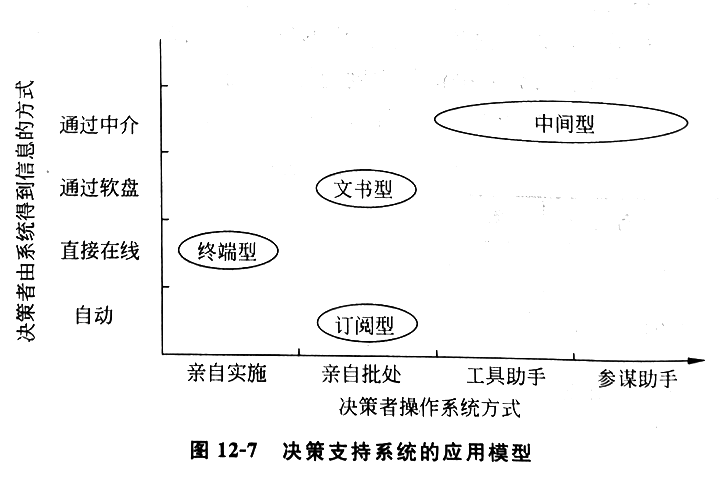

# 第一章 绪论

## 第一节 什么是管理信息系统

管理信息系统：🎯

- 用于管理的处理信息的系统
- 将旧的经济形式转化为新的经济形式的工具，将旧的社会模式建设成新的社会形态的工具
- 是一种先进的生产力，是科学发展观的一个重要的组成部分

组成：

- 管理
- 信息：经过加工后，能够对决策者的行为产生影响的数据 🎯
- 系统

## 第二节 当代经济和社会发展趋势

经济发展经过了农业经济、工业经济和后工业经济，向着信息经济和知识经济的方向发展

新的信息规则：🎯

1. 信息（知识）产品的研发成本很高，边际成本或销售成本接近于零
2. 信息（知识）产品的产量无限制
3. 追求第一，产品无限细化，最终导致个人化
4. 产品的价值不是取决于生产的成本，而是基于顾客的期望
5. 同样的产品可有不同的价格，极端至一人一价
6. 信息产品是经验产品，只有在消费后才知其价值，要想办法让顾客在未消费前了解它
7. 信息产品是知识产品，只有学会了才会用
8. 信息经济是注意力经济
9. 广告是购买顾客的注意力，为了节省顾客的精力，“一对一”的方式是未来的需求

信息在在当代社会中的价值：🎯

1. 微观上能帮助企业提高效率和效益
2. 宏观上信息和知识更是未来社会的产品

发展趋势：人们的需求从物质转向精神，世界的经济将由物质经济转向精神经济 🎯

## 第三节 管理信息系统的重要性及其对企业管理的影响

重要性：管理信息系统能帮助企业提高效益和效率，能帮助企业获得战略优势，从而使国家**经济**繁荣，**社会**稳定 🎯

### 一、管理信息系统对运营管理的影响

影响是自下向上发展的：🎯

1. 生产管理或者运营管理：提高效率
2. MIS 管理：提高效益

### 二、对管理者行为的影响 🎯

1. 主要方向：管理科学化（规范、标准）
2. 另一方面：管理者的决策习惯的改变（科学、系统）

### 三、对组织的影响

对组织形式的影响：🎯

1. 扁平化：减少管理的层次，扩大管理的幅度，从而简化管理
2. 虚拟化

### 四、对企业战略的影响 🎯

影响是关键性的，管理信息系统可以说是企业的战略资源，战略目标的决定性影响因素

---

# 第二章 管理信息系统的定义和概念

## 第一节 管理信息系统的定义

管理信息系统的概念：🎯

- 用系统的方式，通过信息媒介控制，达到服务于管理目的的系统
- 是一个以人为主导，利用计算机进行信息处理，以企业提高 效率 和 效益 为目的，支持高层决策、中层控制、基层运作的集成化的 人机 系统 🎯🎯🎯

## 第二节 管理信息系统的性质

性质：技术系统、人机系统、管理系统、社会系统 🎯

管理信息系统是个 社会-技术 系统： 🎯

- 它也就是属于社会系统，因为它是由人组成，而且有经济和政治活动的系统
- 一方面涉及人和人的群体、组织；另一方面又涉及计算机系统

## 第三节 管理信息系统的概念

管理信息系统是一个 人-机 系统

管理信息系统成熟的重要标志：具有集中统一规划的数据库

- 它象征：管理信息系统是经过周密设计而建立的
- 它标志：信息已集中成为资源，为各种用户所共享

### 一、管理信息系统的概念结构 🎯

1. 信息源
2. 信息处理器
3. 信息用户
4. 信息管理者

### 二、管理信息系统的功能结构 🎯

1. 市场子系统
2. 财会子系统
3. 人事子系统
4. 生产子系统
5. 供应子系统

### 三、管理信息系统的软件结构 🎯

1. 销售市场子系统
2. 生产子系统
3. 后勤子系统
4. 人事子系统
5. 财务和会计子系统
6. 信息处理子系统
7. 高层管理子系统

### 四、管理信息系统的硬件结构 🎯

广义：包括硬件的物理位置安排

微机网结构：星型、环型、母线型

## 第四节 管理信息系统的开发 🎯

系统工程成功三要素：

1. 合理确定系统目标
2. 组织系统性队伍
3. 遵循系统工程的开发步骤

领导推动管理信息系统步骤：

1. 建立信息系统委员会
2. 建立系统规划组或系统分析组
3. 系统规划
4. 项目开发：
  - 生命周期：🎯
    - 系统分析
    - 系统设计
    - 系统实现
    - 系统评价

系统开发应注意的问题：🎯

1. 高度重视系统分析
2. 根据系统分析决定机器的购买
3. 在系统分析与系统设计完成之后才着手于程序编写
4. 管理信息系统的开发要尽可能与与企业变革同时进行

## 第五节 管理信息系统的学科内容及与其他学科的关系 🎯

管理信息系统学科：介于管理学科、数学和计算机学科之间的一个 边缘性、综合性、系统性 的交叉学科 🎯

---

# 第三章 管理信息系统的三个理论来源

管理、信息、系统

## 第一节 管理理论的回顾

### 一、管理的定义

管理：为了某种目标，应用一切方法去安排他人，调度各种资源，以求以最小的投入去获得最好或最大的产出目标 🎯

### 二、管理的性质 🎯

既是艺术又是科学，艺术范畴定性，科学范畴定量，是一门综合学科

### 三、主要管理科学家的论点 🎯

1. 泰勒：
  - 1911《科学管理原则》
  - 理论不系统
  - 实际具备“蛋糕做大”思想
  - 不仅是生产力的革命，也是生产关系的一场革命

2. 法约尔
  - 1916《一般工业管理》
  - 现代经营管理理论的创始人

3. 迈约
  - 行为科学学派的主要代表人物
  - 霍桑试验：照明加强或减弱，生产率均在提高
  - 工人参加管理

4. 康托纳维奇
  - 1940《生产组织与计划中的数学方法》
  - 利用数学和计算机来进行管理

5. 卡斯特
  - 1970《组织与管理一从系统出发的研究》
  - 系统理论用于工程

6. BPR(Business Process Reengineering): 企业过程再工程
  - 20 世纪 80 年代对管理影响最大的实用技术
  - 使用的方法是工程方法，不是管理艺术法，或管理科学法
  - 最大特点：精确性、可重复性
  - 哈默教授

## 第二节 信息理论的回顾

### 一、管理信息的定义和性质

#### 1.管理信息的定义 🎯

信息：信息是经过加工后的数据，它对接收者的行为能产生影响，它对接收者的决策具有价值 🎯

数据：是一组表示数量、行动和目标的非随机的可鉴别的符号 🎯

辩证关系：数据是原料，而信息是产品，一个系统的产品可能是另一个系统的原料，一个系统的信息可能成为另一个系统的数据 🎯

信息的价值有两种衡量方法：🎯

1. 按所花的社会必要劳动量来计算
2. 按照使用效果来衡量

全情报价值：获得全部情报，对客观环境完全了解，得到最优决策，与不收集情报所得最好收益之差 🎯

#### 2.信息的性质 🎯

1. 事实性
2. 等级性
3. 可压缩性
4. 扩散性
5. 传输性
6. 分享性
7. 增值性
8. 转换性

### 二、信息生命周期的各阶段

阶段：🎯

1. 要求
2. 获得
3. 服务
4. 退出

信息传输的一般模型：🎯

```
信源 → 编码器 → 信道 → 译码器 → 接收器
               ↑
              噪声
```

## 第三节 系统理论的回顾

### 一、系统的定义

系统：一些部件为了某种目标而有机地结合的一个整体 🎯

系统五要素：🎯

1. 主量集合
2. 活动性
3. 系统的行为
4. 论域
5. 程序结构

系统特征：🎯

1. 整体集合性
2. 功能结构性
3. 适应性
4. 层次性
5. 目的性
6. 动态性

### 二、系统的分类 🎯

1. 按系统的复杂程度分类：三类九等
  - 1 物理：框架、钟表、控制机械
  - 2 生物：细胞、植物、动物
  - 3 高级群体：人类、社会、宇宙

2. 按系统的抽象程度分类
  - 1 概念系统：最抽象
  - 2 逻辑系统：在概念的基础上构造出可通行的原理
  - 3 实在系统：物理系统

3. 按系统的功能分类
  - 1 社会系统
  - 2 经济系统
  - 3 军事系统
  - 4 企业管理系统

4. 按系统的功能分类
  - 1 封闭系统
  - 2 开放系统

5. 按系统内部结构分类
  - 1 开环系统
  - 2 闭环系统

### 三、系统性能的评价 🎯

1. 目标明确
2. 结构合理
3. 接口清楚
4. 能观能控

### 四、系统的计划与控制 🎯

计划：一个预定的行动路线，它表示出目标和为达到这些目标所必需的行动

控制：测量实际和计划的偏差，并采取校正行动

计划的层次：🎯

1. 战略计划（5 年及以上）
2. 策略计划（1~5 年）
3. 运行计划（1~12 月）
4. 调度和发放（现时）

控制系统的性能的方法：

1. 分解
2. 归并
3. 解耦

### 五、系统的集成

#### 1.系统集成的概念

系统集成：为了达到系统目标将可利用的资源有效地组织起来的过程和结果 🎯

#### 2.系统集成的分类

1. 按优化程度分类 🎯
  - 1 连通集成：设备互相联通
  - 2 共享集成：所有用户所共享
  - 3 最优集成：最高水平，理想且困难

2. 按范围分类
  - 1 技术集成
  - 2 信息集成
  - 3 组织人员集成
  - 4 形象集成

3. 按具体程度分类
  - 1 概念集成
  - 2 逻辑集成
  - 3 物理集成

### 六、系统理论的发展

系统理论的学科研究三个层次：

1. 系统思想
2. 系统科学
3. 系统工程

理论发展：🎯

- 20 世纪 80 年代：老三论（系统论、信息论、控制论）
- 20 世纪末：新三论（耗散结构论、突变论、协同论）

---

# 第四章 计算机系统和硬件

## 第一节 计算机的发展

### 一、计算机的创始与发展

1. 从原始计数法到机械计算机
  - 1833 年：英国数学家查尔斯·巴贝奇微分分析机设计方案 5 个独立部分：🎯
    - 1 输入部分
    - 2 存储库
    - 3 运算室
    - 4 控制器
    - 5 输出部分

2. 电子计算机时代 🎯（划分）
  - 第一代（1951~1958）：真空电子管
  - 第二代（1959~1963）：晶体管
  - 第三代（1964~1979）：集成电路
  - 第四代（1979 至今）：大规模集成电路

### 二、计算机的分类及应用

1. 计算机的分类 🎯
  - 根据用户的需求及技术特征：微型计算机、小型计算机、主干计算机
  - 根据应用的分类：主计算机、网络服务器、工作站

2. 计算机及其应用
  - 1 微型计算机及其应用：
    - ① 个人计算机：字处理、决策支持、数据库管理、绘图、通信、应用开发、工程、个人与家庭使用 🎯
    - ② 移动式计算机
    - ③ 网络计算机
    - ④ 超级计算机
  - 2 小型计算机机及其应用：科学研究、建设系统、工程分析和工业过程监控领域
  - 3 主干计算机及其应用：处理大型企业集团的组织信息需求

### 三、计算机的发展趋势 🎯

主体是向着体积更小、速度更快、性能更强更可靠、购买与维护成本更低的方向发展

## 第二节 计算机的运算基础

### 一、计算机系统原理

1. 冯·诺依曼计算机结构的基本思想 🎯
  - 1 存储程序
  - 2 二进制

2. 计算机系统的基本结构 🎯
  - 1 输入：键盘、触摸式大屏落、光笔等
  - 2 数据处理与控制：CPU
  - 3 输出：显示器、各类打印机
  - 4 主存储：一级存储单元（主存储器）、二级存储单元（外存储器或辅助存储器）🎯
  - 5 通信接口：通信网络连接

### 二、计算机中数据表示方法

二进制优越性：🎯

1. 现实中很容易找到有两种对立且稳定物理状态的物理器件来表达
2. 二进制运算法则简单，只有加法法则
3. 二进制可使算术运算和逻辑运算共享一个运算器

#### 1.数值型数据的表示 🎯

位（bit）：最小数据单位，存放一个二进制的 0 或 1

字节（byte）：长度固定为 8b 的集合，一般一个字节可以存放一个字符

计算机字（word）：在计算机中作为一个整体被传送和运算的一串二进制数码，它所含有的二进制位数等于宇长

数的最高位表示数字的符号，0 正数，1 负数

进制转换：🎯

- 十转二：除二取余，逆序排列，直除到零
- 二转十：逆乘二幂，累加结果，幂从零始

#### 2.字符型数据的表示 🎯

二进制编码：二进制数码代表是为制数或一个字符

1. ASCII 码：使用最多
2. BCD 码：二进码十进数
3. EBCDIC 码：8b 表示任何字符

#### 3.汉字的表示 🎯

1. 汉字交换码（国标码）：
  - GB2312-80，6763 个常用汉字，共 7K+ 符号
  - 每个字符由一个 2 字节代码串组成

2. 汉字机内码：通常将汉字国标码的最高位置 1 来标识机内的某个码值是代表汉字

3. 汉字输入码：通过键盘管理程序的转换，存入计算机中的总是它的机内码，与输入法无关

4. 汉字字形码：显示/打印文字时还要用汉字字形码，因此汉字库占用空间更大

#### 4.所有文字的通用表示 🎯

Unicode 是一种试图容纳全世界所有语言文字的编码方案

给每个字符提供了一个唯一的编码

设计目标：用 16b(2B) 表现全部的文字，但最多只能表现 65536 个字符

现在的 Unicode 是用 4B 来表示的

UTF 规范是将 Unicode 编码方案和计算机的实际编码对应起来的一个规则

#### 5.音频和视频信息在计算机中的表示 🎯

声卡、显卡进行模拟信号/二进制转换交给 CPU 处理

### 三、计算机运行方式

1. 计算机指令的执行 🎯
  - 计算机指令的格式由程序设计语言和计算机的类型决定
  - 指令基本格式：
    - 1 操作码
    - 2 一个或几个操作数
  - 执行阶段：
    - 1 指令周期：从主存取指令、控制单元解释指令
    - 2 执行周期：执行经解释后的指令指定的操作

2. 计算机指令系统 🎯
  - 各种指令的总和，几十到几百条
  - 基本指令：
    - 1 数据传送指令
    - 2 算术运算指令
    - 3 逻辑运算指令
    - 4 程序控制指令
    - 5 输入/输出指令
    - 6 其它指令

3. 计算机程序的执行 🎯
  - 重复指令周期和执行周期，直到一个程序的指令全部执行完毕
  - 通常顺序执行，有时引入分支指令

## 第三节 网络计算的模式 🎯

1. C/S 结构
2. B/S 结构

3. 网格计算
  - 综合利用分散在网络各处的大量独立的计算资源，组成一种分布式系统，共同完成某个计算任务
  - 规模可大可小
  - 一种充分利用分散资源的模式
  - 类型：计算网格、设备网格、数据网格、信息网格、知识网格、服务网格

4. 云计算
  - 通过计算机网络按需提供计算资源的模式
  - Web 浏览器即可
  - 服务层次：
    - 1 基础设施级服务 IaaS
    - 2 平台级服务 PaaS
    - 3 软件级服务 SaaS
  - 公有云：向一般企业提供（中小型企业）
  - 私有云：独立构建（大型企业）
  - 社区云：面向一个行业或一个企业联盟提供服务的云计算（中小型企业）

## 第四节 计算机硬件
 
硬件：计算机物理设备的总称

主要组成：CPU、主存储器、IO 设备、总线

反映计算机能力的两个主要指标：时间（CPU）、容量（主存储器）🎯

### 一、中央处理器：运算器、控制器 🎯

1. 运算器：
  - 1 逻辑单元
  - 2 累加器
  - 3 状态寄存器
  - 4 寄存器阵列

2. 控制器：是计算机的神经中枢，按照主频的节拍产生各种控制信息，以指挥整个计算机工作

3. CPU 的发展
  - 影响运行速度的因素：
    - 1 与总线的一些技术指标：并行处理的计算机字长
    - 2 决定机器时序周期长短的晶片振荡频率
    - 3 数据总线宽度
  - 多处理机多 CPU 特点：
    - 1 辅助处理器
    - 2 对偶处理器
    - 3 并行处理设计
    - 4 双核处理器和多核处理器

### 二、存储系统

1. 计算机存储系统及发展
  - 分类：一级存储器、二级存储器 🎯（分级结构）
  - 发展：超大规模集成电路技术，海量存储 🎯

2. 主存储器：一级
  - 存放当前运行的程序及执行程序所需的资料
  - 主要是由半导体存储器组成
  - 分类：🎯
    - 1 只读存储器 ROM
    - 2 随机存取存储器 RAM

3. 辅助存储器：二级
  - 位于 CPU 与主存储器之外
  - 不需要电力维持的、可长期储存海量资料的记忆部件
  - 分类：🎯
    - 1 磁介质存储：磁带（顺序）、磁盘（随机）
    - 2 光存储：各种光盘
    - 3 闪存：非易失性存储器（NVM）的一种，可擦除

### 三、输入/输出设备 🎯

通过各种 I/O 接口与计算机系统的中央处理机连接并通信，因此外围设备皆属联机设备

1. 计算机键盘与显示终端
2. 点触式设备
3. 计算机笔
4. 视频输入/输出
5. 打印输出
6. 声音识别
7. 体感设备（物联网）
8. 光和磁识别（物联网）
9. 无线射频识别（物联网）

---

# 第五章 计算机软件

## 第一节 软件的概念

###  一、软件分类 🎯

1. 系统软件：管理与支持计算机系统资源及操作的程序
2. 应用软件：处理特定应用的程序称为应用软件

### 二、软件技术发展趋势

由于计算机硬件的模块化和标准化促进了硬件的飞速发展，现在计算机软件也越来越希望组件化、模块化，强调可复用、可共享，形成了一种从面向对象编程、构件技术，到 Web Service 体系的软件发展趋势 🎯

- 面向对象编程：强调软件的模块化
- 构件技术：强调软件的复用
- Web Service：软件的共享与复用甚至跨越企业，扩展到了整个万维网上

## 第二节 系统软件

### 一、系统软件的分类

1. 系统管理程序
2. 系统支持程序
3. 系统开发程序

### 二、操作系统 OS 🎯

操作系统：一台计算机最基本、最重要的软件包
  - 管理 CPU 的操作，控制计算机系统的输入/输出，存储资源的分配及一切活动
  - 是用户和计算机硬件之间软件层面中最重要的一部分

操作系统的功能：

1. 用户界面：🎯
  - 帮助用户实现与计算机系统的交流
  - 分类：命令、菜单、图形用户界面

2. 资源管理：🎯
  - 管理计算机系统的所有硬件资源
  - CPU、主存储器、二级存储设备以及其他输入/输出设备

3. 文件管理：🎯
  - 控制数据和程序文件的生成、删除和存取

4. 任务管理：🎯
  - 保证终端用户计算任务的完成
  - 给每个任务分配一个时间片，并能对每个任务进行中断，以便转交给另一个任务

5. 实用服务程序管理

### 三、其他系统管理程序 🎯

1. 数据库管理系统
2. 通信管理器
3. 系统支持程序

## 第三节 程序设计语言

### 一、机器语言 🎯

机器语言程序特点：

1. 采用二进制代码
2. 指令随机器而异

优点：执行速度快

缺点：易于出错、不够直观、编程繁琐

### 二、汇编语言 🎯

用符号（助记符）代替机器语言中的二进制代码的方法，符号语言

仍是一种面向机器的程序设计语言，不能在各种机器上通用，机器语言缺点程度较轻

汇编程序：将汇编语言翻译成机器语言

### 三、高级语言 🎯

三大优点：

1. 更接近于自然语言，一般采用英语表达
2. 语句与机器指令并不一一对应，一对多，编写短小，易于查找错误和修改
3. 与具体计算机无关，通用性强

无法直接执行，需要翻译成机器指令

两种翻译方式：

1. 解释：解释器，边翻译边执行，灵活，内存占用少，机器时间占用多
2. 编译：编译器，先翻译再执行，执行速度快，内存占用多，不灵活

### 四、第四代语言与软件工具 🎯

更加 非过程化 并且更易于 对话

让用户和程序员使用 非过程化 的语言说明他们的要求，而由计算机决定实现这个要求的指令序列，简化程序设计过程

分类：

1. 查询语言：DBMS、Excel、SQL
2. 报表生成器
3. 图形化语言：SAS、Systat
4. 应用程序生成器：FOCUS、Power Builder
5. 非常高阶程式语言：APL、Nomad 2
6. 套装软件
7. 个人计算机工具：Office、浏览器、群组软件

### 五、互联网环境下的编程语言 🎯

1. 超文本标记语言和扩展标记语言：HTML、XML
2. Java 及其开发平台：EE、JSP

## 第四节 软件开发方法和工具

### 一、面向对象程序设计 🎯

将数据与程序封装在一个对象内，作为一个独立的个体

程序设计的基础依赖于 类 和 继承 的概念

### 二、UML(unified modeling language) 🎯

突破了以往编程语言在编辑器中逐行写代码的模式，提出了面向接口设计、图形化开发界面的新方法

OOSE 方法：面向用例

UML 内容：

1. 用例图
2. 静态图
3. 行为图
4. 交互图

### 四、MVC 设计模式 🎯

把一个应用的输入、处理、输出流程按照 model、view、controller 的方式进行分层

1. 视图：代表用户交互界面
2. 模型：业务流程/状态的处理以及业务规则的制定，对其他层来说是黑箱
3. 控制：从用户接受请求，将模型与视图匹配在一起，共同完成用户的请求，一个分发器

层的分离使得一个模型可以具有多个显示视图

用户通过某个视图的控制器改变了模型的数据，所有其他依赖于这些数据的视图都应反映这些变化

无论何时发生了何种数据变化，控制器都会将变化通知所有的视图，更新显示

---

# 第六章 数据库和数据仓库技术

## 第二节 文件组织

### 一、文件一数据库的基础 🎯

按存储介质分：光盘文件、磁盘文件、磁带文件、打印文件

按功能分：主文件、事务文件、报告文件、工作文件、程序文件

### 二、数据的物理组织和逻辑组织

物理组织：面向机器、存储设备 🎯

逻辑组织：面向用户的应用需求 🎯

使数据的 物理存储 与 逻辑处理 分离是进行数据处理的关键

### 三、文件组织方式 🎯

文件是数据库组织的基础，任何对数据库的操作最终要转化为对对数据文件的操作

1. 顺序文件组织
2. 索引文件
3. 链表文件
4. 倒排文件

## 第三节 数据库系统

组成：数据库 DB、数据库管理系统 DBMS

### 一、数据库处理

1. 数据库存储 🎯
  - 在数据库管理方式中要开发共享数据库，首先要有数据字典
  - 数据字典描述数据定义、格式、内容以及数据库的相互关系，以确保所建立的数据库的完整性、一致性和可行性
  - 使组织中各种应用所需的数据连接起来并集中存入一些共享数据库，从而代替存入许多各自独立的数据文件中

2. 数据库处理方式 🎯
  - 主要是通过更新和使用独立的数据文件
  - 三种基本活动：
    - 通过更新和维护共享数据库，对组织的记录，映射新的事务、传送变化的事件
    - 使用能共享公共数据库数据的应用程序，为用户提供所需信息
    - 通过 DBMS 提供的查询/响应及报告功能，使用户能直接地快速访问数据库，得到响应，并产生报告

### 二、数据库管理系统

是一组计算机程序，控制组织和用户数据库的生成、维护和使用 🎯

1. 数据库开发 🎯
  - 数据库管理软件允许用户很方便地开发自己的数据库
  - 数据字典：🎯
    - 使用数据定义语言 DDL
    - 关于数据的数据

2. 数据库查询 🎯
  - 使用查询语言或报告发生器，询问数据库中的数据
    - 结构化查询语言 SQL
    - 范例查询 QBE

3. 数据库维护 🎯
  - 更新数据以适应新的状况

4. 应用与开发 🎯
  - 不像通常程序设计，通过编程开发数据处理过程
  - 使用应用数据操纵语言 DML 执行数据处理活动
  - 使用 DBMS 软件包提供的内部程序设计语言或内置应用生成器

### 三、数据库模型与数据库组织结构

1. 数据库模型 🎯
  - 三种：🎯
    - 1 网络模型
    - 2 层次模型
    - 3 关系模型：以数学中的关系理论为基础，用熟悉的表格形式描述记录数据记录之间的联系

2. 数据库组织结构 🎯
  - 三级结构：
    - 外模式：外层，与用户相联系的一层
    - 模式：中间层，概念，逻辑模型
    - 内模式：内层，物理存储模式，真正存储数据
  - 两种映射：
    - 模式-外模式：联系概念数据库与用户级数据库
    - 模式-内模式：联系概念数据库与物理数据库

### 四、数据库设计

2. 数据库设计步骤 🎯
  - 1 对现实世界进行需求分析
  - 2 建立信息世界中 E-R(概念)模型
  - 3 以 E-R 图导出计算机世界的关系数据模型 🎯
    - 图中每个实体，都相应地转换为一个关系，包括实体的全部属性
    - 图中联系，根据不同的联系方式，或将联系反映在关系中，或将联系转换成一个关系

### 五、数据库技术发展的趋势

趋势：数据管理方式开始从集中式到分布式，数据模型也从关系数据库扩展到多媒体数据库、面向对象数据库 🎯

## 第四节 数据仓库和商业智能

### 一、数据仓库 🎯

数据仓库：是一个面向主题的、集成的、非易失的、随时间变化的数据集合，用于支持管理决策

抽取、转换、清洗、装载

数据仓库的数据几乎没有 update 操作，数据可以冗余，所以数据仓库中的数据都会分层综合

一般包括：

- 原始数据
- 初步综合数据
- 中度综合数据
- 高度综合数据

### 二、联机分析处理 OLAP 🎯

对大量多维数据的动态综合、分析和归纳

多维分析：OLAP 的主要操作
  - 对多维视图的操作：🎯
    - 1 切片和切块
    - 2 钻取
    - 3 旋转/转轴

### 三、数据挖掘 🎯

从大量数据中自动发现隐藏的有用信息的过程

OLAP 是展现数据，启发数据分析人员找出规律，而数据挖掘是不用人工参与，主要依靠计算机

挖掘方式：🎯

1. 分类
2. 聚类
3. 关联规则发现
4. 时序模式发现

### 四、商业智能 🎯

通过对数据的收集、管理、分析、转化，使数据成为可用的信息，并在企业中共享传递，帮助洞察理解，支持决策

---

# 第七章 通信与网络

## 第一节 计算机通信网络系统

### 一、计算机通信网络系统的定义

定义：利用通信设备和线路将多个计算机系统互联，以功能完善的网络软件，实现网络中资源共享和信息传递的系统 🎯

### 二、计算机通信网络的演变和发展 🎯

1. 第一代：实际上是以单个计算机为中心的远程联机系统，面向终端
2. 第二代：以通信子网为中心，多个主计算机通过通信线路互连起来，提供服务（阿帕网）
3. 第三代：国际标准化的网络，参考模型 OSI，Internet，国际互联网

计算机网络正朝着无线、移动网络的方向发展 🎯

## 第二节 计算机通信网络的概念与实现技术

五类基本元素：🎯（远程通信的基本组成）

1. 终端
2. 远程通信处理器
3. 远程通信通道和介质
4. 计算机
5. 网络通信控制软件

### 一、计算机通信网络的类型 🎯

1. 按地理覆盖距离
  - 广域网 WAN：省级以上
  - 城域网 MAN
  - 局域网 LAN

2. 按物理拓扑结构
  - 点到点式
    - 星型：简单、线长
    - 环形：单向、公用、单点故障
    - 树形：复杂、中心故障
  - 广播式：只有一个由所有结点共享的通信线路
    - 总线式：瞬间只有一台机器是主机
    - 卫星和无线电式：每个结点收发，适用于地理广阔时的通信

### 二、通信介质

定义：通信网络中发送方和接收方之间的路径和物理通路 🎯

分类：

1. 有线：较短路径
  - 双绞线
  - 同轴电缆
  - 光纤

2. 无线：空间传输，需要视线通路
  - 红外通信
  - 激光通信
  - 微波通信

### 三、网络通信处理器

定义：连接整个网络中各种通信介质、计算机和通信线路的硬件设备 🎯

1. 调制解调器
2. 多路复用器
3. 前端处理机
4. 交换机
5. 网络互连单元：
  - 1 中继器
  - 2 桥接器
  - 3 路由器
  - 4 网关或网间连接器

### 四、网络通信的标准、协议与软件

1. OSI 网络通信协议
  - 协议：两台计算机之间进行通信必须遵循的一组规则
  - OSI 七层模型：是一种理想概念 🎯
    - 1 物理层
    - 2 数据链路层
    - 3 网络层
    - 4 传输层
    - 5 会话层
    - 6 表示层
    - 7 应用层

2. 局域网的主要标准与协议
  - 1 以太网和令牌环型网
  - 2 FDDI：光纤分布式数据接口
  - 3 802.11：无线局域网
  - 4 蓝牙
  - 5 近场通信：NFC

3. X.25公用网

4. 互联网与 TCP/IP 🎯
  - 传输控制协议、网际协议
  - Internet 入网设备都分配一个 IP 地址

5. 光纤接入网 FTTx：主要用于接入网络光纤化

6. 移动电话通信网络：1~5G

7. SDN 软件定义网络

8. 通信软件
  - 广域网：通信管理器、远程处理管理器
  - 局域网：网络操作系统
  - 功能：存取、传送控制、网络管理、出错控制、安全管理

## 第三节 通信网络的应用

### 一、通信网络在管理中的应用 🎯

声音通信、数据通信、文本和消息通信、信息查询、影像传送、监控和控制

### 三、通信网络的应用策略

1. 通信网络发展的趋向：🎯
  - 1 行业：通信、计算机分立到相互渗透融合
  - 2 技术：从模拟向数字网络技术转化，传输介质的速度、质量、容量大大提高
  - 3 应用：增加企业的生产、管理、实现战略目标上可行性

## 第四节 电子商务用的网络技术

### 一、电子商务用通信网络 🎯

1. 公用网
2. 专用网
3. 增值网
4. 虚拟专用网

### 二、电子商务安全技术 🎯

电子商务的安全策略必须考虑信息的保密性、完整性、即需性和知识产权

1. 秘钥技术：对称加密
2. 公钥和私钥系统：非对称加密，RSA
3. 散列编码和消息摘要
4. 数字签名：发送者要用自己的私钥对消息摘要加密，加密后的消息摘要，保证完整性
5. 数字证书：WWW 商务服务器对访问者的身份认证、访问内容和时间控制的主要手段
6. 电子商务安全交易标准：S-HTTP、SLL、S-MIME、SET

### 三、电子结算技术

1. 电子现金
2. 电子信用卡
3. 智能卡
4. 电子支票

---

# 第八章 职能信息系统

企业中四大职能：市场、财务、生产、人力

## 第一节 市场信息系统

市场信息系统层面：战略层、策略层、控制层、业务处理层 🎯（系统及其功能）

### 一、销售预测

分类：

1. 短期预测（一天至一年）
2. 中长期预测（两年到十几年）

预测方法：🎯（预测处理）

1. 经验综合法
2. 内因直接预测法
3. 外因间接预测法

预测子系统的基本功能：🎯

1. 收集和整理数据，滤除不合理的历史数据
2. 选择好的预测模型，以准确表达需求行为，从而改善预测精度
3. 用产品的寿命曲线修正长期预测，增加长期预测和新产品预测的精度
4. 管理人员可以根据预先知道的外界影响，调整模型
5. 使用模型维护技术，减少历史数据的存储量
6. 使用监控手段，保证现行预测模型延续使用，减少人工干预
7. 根据企业外部的经济因素不断发展预测模型

### 二、广告和促销 🎯

信息系统帮助广告和促销的方面：

1. 选择好的媒体和促销方法
2. 分配财务资源
3. 评价和控制各种广告和促销手段的结果

广告是一种投资，它把资金转化为无形资产，以后又把无形资产转化为价值

### 三、产品管理

产品的生命周期阶段：引入、成长、成熟、衰退 🎯

### 四、定价子系統 🎯

定价子系统和促销子系统有密切的关系

定价子系统要协助决策者确定定价策略：

1. 以成本为基础的定价策略
2. 以需求为基础的定价策略

### 五、销售渠道管理 🎯

销售渠道：指产品由生产厂家到用户的路径

```
            ← 资金流
供应者 > 制造者 > 批发者 > 零售者 > 顾客
              物质流 →
            ← 信息流 →
```

### 六、市场情报和市场研究子系统

1. 市场情报子系统：🎯
  - 公司和环境（顾客和竞争者）的接口
  - 要收集竞争者行为的信息，甚至不择手段
  - 主要活动：
    - 1 收集数据：一次数据、二次数据
    - 2 评价数据
    - 3 分析数据
    - 4 存储情报
    - 5 分发情报

2. 市场研究子系统：🎯
  - 利用市场情报子系统收集的数据进行研究
  - 调查方式：抽查、访谈、观察、控制实验

市场信息系统各子系统集成：🎯

1. 输入子系统：
  - 市场 预测 子系统
  - 市场 情报 子系统
  - 市场 研究 子系统

2. 输出子系统（用户）：
  - 产品 子系统
  - 广告促销 子系统
  - 分销渠道 子系统
  - 价格 子系统

3. 输出子系统（市场经理）：
  - 市场决策 子系统

市场主要职能 4P：产品、促销、渠道、价格

## 第二节 财务信息系统

两大部分：会计、财务

### 一、会计信息系统

会计系统：🎯

- 记账部分：最成熟、最固定的部分
- 子系统：🎯
  - 1 订货处理
  - 2 会计应收应支系统
  - 3 库存系统
  - 4 总账系统

### 二、财务信息系统

总目标：最好地利用资金和剩余资金的最优投资

财务信息系统：为协助主管达到以上目标的计算机系统

财务信息系统概念模式：🎯

输入子系统：

1. 会计信息系统
2. 内部审计子系统
3. 财务情报子系统

财务输出子系统：

1. 财务预测子系统
2. 财务资金管理子系统
3. 财务控制系统：
  - 控制一些企业性能的参数：🎯
    - 1 `现金比例 = 当前资产 / 当前负债`
    - 2 `库存周转率 = 售货总费用 / 平均库存值 * 100%`

## 第三节 生产信息系统

制造信息系统两大类：

1. 通过技术实现产品生产的系统：CAD/CAM/CNC/robot
2. 通过管理实现生产的系统：MRP/MRP II/CAQ

### 一、材料需求计划 MRP 系统 🎯

现代化的大生产给机械制造业带来的困难：

1. 生产上所需的原材料不能准时供应或供应不足
2. 零部件生产不配套，且积压严重
3. 产品生产周期过长，劳动生产率下降
4. 资金积压严重，周转期长
5. 市场和客户要求多变和快速，使企业的经营计划系统难以适应

长期以来的研究方法：

1. 订货点法
2. 材料需求计划 MRP
3. 准时法 JIT
4. 最优化法 OPT

MRP 发展三个阶段：

1. 20 世纪 60 年代：传统物料需求计划，主生产调度 MPS + 物料用量清单 BOM + 库存等
2. 20 世纪 70 年代：闭环式 MRP，能适应主生产计划的改变，又能适应现场情况的变化
3. 20 世纪 80 年代：MRP II，制造资源计划，设备和时间也被看成企业资源，并加以控制

### 二、主生产计划子系统

包括两部分：

1. 总量计划子系统：宏观
  - 总量计划方法：🎯
    - 1 经验图表法
    - 2 管理系数法
    - 3 最优化法

2. 主生产计划子系统：微观

### 三、库存控制子系统：物料需求计划（MRP）子系统

主要功能：🎯

1. 计算各种原材料和零部件的需求时间、需求数量和需求地区
2. 配合作业控制，使仓库和车间管理人员对物料运送、设备和工具需求等事宜及早安排淮备
3. 及时采购原材料，避免库存积压
4. 计划和控制产品加工全过程，使其准时交货

库存控制两种基本方法： 🎯

1. 订货点技术法：前提是消耗平稳，每次消耗量小，而且适用于独立需求
2. 物料需求计划法：要求处理大量数据，一般制造厂大约需要几万个记录，只有借助计算机才能解快

限定需求：即某项的需求可通过计算机搜索，追溯到需要它的上一级需求项 🎯

### 四、成本计划与控制子系统

1. 直接劳动成本的计划与控制
  - 1 计划直接劳动成本：
    - 一个项的计划直接劳动成本：🎯
      - ① 估算
      - ② 从直接劳动标准推导
  - 2 标准直接劳动成本：累加、复核、分析成本偏差
  - 实际直接劳动成本：基本来自工厂监控子系统
  - 成本控制：系统分析**实际直接劳动成本**与**标准劳动成本**之间的偏差，通知有关成本中心，督促管理人员调整不合理偏差 🎯

2. 材料成本计划与控制
  - 标准材料成本：按标准材料消耗和标准材料单价来计算的
  - 实际材料成本偏差：来自采购价格波动、工艺过程变更、加工废品和额外消耗等方面 🎯
  - 材料使用的情况：来自仓库控制系统

3. 管理费的处理
4. 计划和控制资产消耗

## 第四节 人力资源信息系统

人事部门职能：🎯

1. 招聘、选拔和雇佣
2. 岗位设置
3. 绩效评价
4. 薪酬管理
5. 人才培养和发展
6. 健康、保安和保密

人力资源信息系统 HRIS：支持人力资源管理的系统 🎯

1. 输入子系统 🎯
  - 1 记账 子系统
  - 2 人力资源研究 子系统
  - 3 人力资源情报 子系统

2. 输出子系统 🎯
  - 1 人力计划 子系统
  - 2 招聘 子系统
  - 3 人力管理 子系统
  - 4 薪酬 子系统
  - 6 环境报告 子系统

---

# 第九章 层次信息系统

## 第一节 基层信息系统

业务处理周期：

1. 数据输入 🎯
  - 从拿到数据，记录、编码和编辑，到转换成实用的形式的整个过程
  - 是数据处理的一个瓶颈，如何快速准确地输入
  - 输入方法：传统手工、源数据自动化

2. 业务处理
  - 1 批处理：🎯
    - 定期地、周期性收集源文件，然后进行成批的处理
    - 活动包括：🎯
      - ① 收集源文件
      - ② 把源文件录入到输入媒体
      - ③ 关键词排序
      - ④ 合并源文件和主文件，建立一个新主文件
      - ⑤ 定期将业务文件异地中央计算机保存处理
    - 主文件：永久存储的文件
    - 业务文件：中间存储文件，暂存性质，合并到主文件后消失
    - 优点：🎯
      - ① 适合处理大量的数据
      - ② 可以错开时间
      - ③ 对机器速度要求不高
    - 缺点：🎯
      - ① 主文件经常过时
      - ② 及时性不足
  - 2 实时处理：🎯
    - 及时处理业务后，主文件已更新，数据反映真实
    - 亦称联机处理或在线处理
    - 只要一输入，记录、转换、更新主文件一气呵成，响应顾客的查询也是即时的
    - 也需要保留副本，不过它是在每笔业务后及时留副本
    - 优点：及时处理、及时更新和及时响应
    - 缺点：由于联机、直接存取，必须采取特殊的措施保护数据库以及防止病毒和闯入者

3. 数据库维护 🎯
  - 维护数据库保证它能准确地反映企业现状

4. 文件和报告生成
  - 业务文件：数据处理系统所产生
  - 业务文件分类：🎯
    - 1 行动文件
    - 2 信息文件
    - 3 周转文件

5. 查询处理 🎯
  - 批处理、实时处理均可提供查询功能
  - 现在越来越多使用实时、远距离查询

业务处理系统粗框图：🎯


## 第二节 中层信息系统

具有一台完整的终端机，该机可以和一个企业的中央计算机联网，自己也有一个小的数据库以及一些软件工具 🎯

终端用户得到的服务：🎯

1. 帮助控制实现网络连接
2. 分享软件包和数据库
3. 执行分时处理服务

终端用户系统优缺点：🎯

- 优点：可以节约大量时间和成本
- 缺点：没有集中的指导，终端用户系统的发展可能失去控制，导致重复建设、质量标准不一，造成混乱以及投资的失控

## 第三节 高层信息系统

主管信息系统 EIS：利用信息系统支持主管高效率的工作 🎯

EIS 与 ESS 的对比：🎯

1. 经理信息系统 EIS
  - 1 是对经理个人的剪裁
  - 2 抽取、过滤、压缩和跟踪关键数据
  - 3 提供在线状态存取、趋势分析、例外报告和深入挖掘数据的能力
  - 4 取存和集成广泛的内源和外源数据
  - 5 用户友好
  - 6 主管经理直接使用，不要中间人

2. 经理支持系统 ESS：是加入附加能力的 EIS
  - 1 支持电子通信：电子邮件、传真
  - 2 提供数据分析能力：电子报表
  - 3 包括提高个人工作效率的工具：日历、备忘录

EIS 功能：🎯

1. 取软件
2. 存取内部运行库、外部数据库以及特殊管理库中的数据
3. 根据现实的状态预测未来的趋势

---

# 第十章 流程信息系统

分级式供产销管理系统：🎯

- 上游：供应链管理系统 SCM
- 中游：企业资源管理计划 ERP
- 下游：客户关系管理系统 CRM

## 第一节 上游——供应链系统 SCM 🎯

为企业提供物料的工作一直是企业提高效率和效益的瓶颈，严重制约着企业产品的成本降低、加工周期的缩短

目的均是在不影响生产的前提下，尽量减少库存，也就减少了仓库面积，直至零库存、零面积，即无仓库方式

## 第二节 中游——企业管理系统 ERP 🎯

以生产为核心的企业管理系统

ERP 模块：🎯（模式）

- 生产计划
- 采购管理
- 销售管理
- 财务系统
- 人事管理

## 第三节 下游——顾客关系管理系统 CRM 🎯

专注于协调所有的围绕着企业和客户联系的企业过程，以期达到最佳收益、顾客最满意和留住顾客的目的

要求：🎯

- 好的 CRM 系统：提供数据和分析工具，更能符合企业之所需，并给重要的顾客不断提供新的价值
- 最简单的 CRM 系统：主要是了解顾客和分析顾客

CRM 的一般功能：🎯

1. 来电显示
2. 拨号
3. 日期提醒
4. 客户历史记录
5. 结合 OutLook 邮件群发

## 综述

SCM/ERP/CRM 三者之间存在交叉关系：购买三套会出现冗余 🎯

```
( SCM [ ) ERP { ] CRM }
```

企业应用集成 EAI，集成三者，单个系统将成为过去

---

# 第十一章 行业信息系统

## 第一节 制造业——企业信息系统 EIS

ERP：制造业已不满足于 MRP II，逐渐扩充市场、财务及企业全面管理的功能

ERP II 或 EIS：将 ERP、SCM、CRM 集成到一个软件中 🎯（概念模型）

## 第二节 商业——行业信息系统

### 一、电子商务

1. 电子商务的定义
  - 狭义：采用电子手段进行买卖活动，简称电子贸易或电子商业
  - 广义：采用互联网等相关信息技术进行商务活动，这些商务活动包括商品的交易、客户的服务、企业间的合作等
  - 与管理信息系统的关系：实际上是一回事 🎯
    - 电子商务是管理信息系统向内向外、向前向后的延伸，将涉及范围大大扩展
    - 但理论、方法、模型是同根的

2. 电子商务发展过程 🎯
  - 1 电子目录
  - 2 电子交易
  - 3 电子商业
  - 4 电子企业
  - 未来：自组织的、网络式的、放权的、扁平化的、自繁殖的、动态的

3. 电子企务模式 🎯
  - 分类：
    - 概念模式、逻辑模式、物理模式
    - 外模式、内模式
    - 层次上的：战略经营模式、管理运作模式、业务执行模式
  - 描述内容：
    - 描述企业、消费者、供应商、协作者之间的关系模式，说明各自的角色、地位、关系
    - 描述企业的行商之道，企业的使命、愿景、目标、战略、价值观、理念、习惯
    - 描述企业的战略管理机制、运作流程以及控制方式
    - 描述企业的物流、资金流和信息流的流动方式，以及赢利方式

4. 电子商务分类 🎯
  - 按商务主体分：门户、中介、原发等
  - 按互动方式分：B2C/B2B/B2BC
  - 按互动深度分：单向静态、双向互动、单向插入、双向插入、融合集成等
  - 按商品形式分：实物商品、信息商品
  - 按价值形成分：原创、增值等

电子商务特点：🎯

- 门户网站
- 原发网站
- 中介网站
- 虚拟店面
- 商品集市
- 网上拍卖

## 第三节 交通运输行业信息系统 🎯

介于生产行业和销售行业之间的行业：铁路公司、公路公司以及航空公司

机场：

- 有供飞机起停、旅客登落的传统主业
- 又发展起物流、商品销售、旅游交通服务等综合辅业

完善的机场管理信息系统四层架构：

1. 基础设施层
2. 数据资源层
3. 应用程序层
4. 共用接口层

## 第四节 金融行业信息系统 🎯

金融行业是个胖信息、瘦物质的行业，信息系统可以说是它的生命线

## 第五节 政府部门信息系统

电子政务分系统：🎯

1. 综合办公
2. 计划
3. 统计
4. 工业
5. 交通
6. 城市建设管理

教育子系统模型：🎯

1. 信息服务层
2. 应用系统层
3. 数据资源层
4. 网络服务和基础设施层

---

# 第十二章 决策支持系统

## 第一节 决策与决策支持系统

决策是管理的最重要的内容（核心），但不是管理的全部

分类：

1. 按支持的决策者的数量：单体决策支持系统、群体决策支持系统
2. 按支持的管理层次：中层决策支持系统、高层决策支持系统
3. 按系统的智慧或聪明程度：专家系统 ES、传统决策支持系统 DSS、智能决策支持系统 IDSS
 
## 第二节 专家系统 ES

一个含有知识型程序的系统，它利用捕捉人们在有限范围的知识或经验去解決一个有限范围的问题 🎯

特点：🎯

1. 进行某些人们求解的工作
2. 以规则或框架的形式表示知识
3. 可以和人进行相互对话
4. 能同时考虑多个假设

不足：

1. 面窄、浅显和脆弱的，它缺少人们的知识宽度和对基本原理的理解
2. 专家系统不能由第一原理推理，不能抓住相似，缺乏普通的感知
3. 只能解决很有限的任务

### 二、专家系统的开发 🎯

1. 开发队伍
2. 工具外壳
3. 用户

专家系统中最使人感兴趣的：推理机制

1. 前向推理
2. 反向推理

专家系统的问题：

1. 只是人的经验的汇集，因而它存在先天的缺陷，其解也可能未必正确
2. 对于复杂系统，专家系统这种表达知识的方法也很难表达，解就更难
3. 专家系统维护也很不容易

## 第三节 传统的决策支持系统 DSS

决策支持系统特征描述：🎯

1. 目的在于解决非结构化或半结构化的问题
2. 综合应用数据、模型和分析技术
3. 交互式的友好的接口，非计算机人员容易使用
4. 具有很高的灵活性和适应性
5. 是支持而不是代替人的决策过程
6. 是跟踪和适应人的决策过程，而不是要求人去适应系统

使用决策支持系统四种方式：🎯

1. 订阅型
2. 终端型
3. 文书型
4. 中间型

决策支持系统的应用模型：🎯



次策支持系统的一般结构：🎯

- 信息可来自内源和外源
- 本身包含有一些库
- 信息处理器
- 输入、输出两个接口

决策支持系统逻辑概念模式：🎯

数据库管理系统 DBMS、模型库管理系统 MBMS、会话部件管理系统 DGMS

决策支持系统三个主要部件：数据库、模型库、会话部件 🎯

### 一、数据库

DSS 对数据库的要求：🎯

1. 支持记忆
2. 支持数据的压缩
3. 变化细度，变化精度
4. 宽的时问范围
5. 多源
6. 公用或私有库
7. 集合运算能力
8. 随机存取能力
9. 响应时间
10. 支持各种关系和视图
11. 和 DSS 其他部件有好的接口，和终端用户有好的接口

关系数据库的五大优点：🎯

1. 容易了解，和人们常用的表格相似
2. 支持集合运算
3. 增加数据和程序的独立性
4. 有严密的运算理论基础
5. 数据库和字典结合紧密，运算性能也比别的库好

数据仓库：🎯

- 是集成数据的存储中心，由数据库、DSS 数据库逐渐发展起来的
- 实际上是 DSS 数据库的扩充
- 不仅能够进行一般加工、汇总，还能深度加工和数据挖掘
- 是理想的决策支持系统数据库

数据挖掘：🎯

- 源数据 → 集成 → 数据
- 数据 → 选择 → 目标数据
- 目标数据 → 处理后 → 处理后数据（后数据）
- 后数据 → 挖掘 → 各种模式的数据
- 各种模式的数据 → 解释 → 知识

### 二、模型库

模型库给决策提供分析能力

优点：快而准地提供信息 🎯

缺陷：🎯

1. 需要的数据和参数常不合用，或难以产生
2. 模型的输出难以使用
3. 对复杂问题的大的模型难建且难维护
4. 大的模型难懂，难以相信
5. 决策者和模型的交互很少

组成部分：

1. 一个模型库和管理它的一组软件
2. 集成模型库和数据库的部件
  - 连接要求：🎯
    - 1 每个模型均可从数据库中提取输入数据
    - 2 所有模型由一个数据库中取数
    - 3 模型把所有的输出数据存回数据库中
    - 4 模型自己作为数据存到数据库中
3. 集成模型库和会话部件的部件

### 三、会话部件

人和决策支持系统联系的接口，目前主要是屏幕和键盘

决策支持系统对会话部件的要求：🎯

1. 能产生输出表达
2. 用户能启动运行，并输入参数
3. 用户能启动存储，并接收参数
4. 用户能把输入和输出综合进控制过程

## 第四节 智能决策支持系统 IDSS

智能决策支持系统框架：🎯

四块设想的 IDSS 部件：加到传统的 DSS 上就形成一个完全的 IDSS 🎯

1. 基本决策和信息价值的深度知识库
2. 学习和知识获取的深度知识库
3. OR/MS 分析技术的深度知识库
4. 多域的专业深度知识库

```
IDSS = DSS + AI
```

智能决策支持系统基本方法： 🎯

1. 援例支持系统
2. 自适应决策支持系统
3. 群体决策支持系统

---

# 第十三章 信息系统规划

## 第一节 什么是战略规划

它是一种“安排未来”性质的工作，描述企业领导者关于企业发展的一些概念的集合 🎯

### 一、企业的使命和愿景

使命：说明该企业存在的缘由

愿景：是企业对未来的期望的描绘

### 二、战略规划的目的和目标 🎯

目的：指向未来的目的地
目标：在不久的将来可以达到的可测量的东西

区分方面：🎯

1. 时间区段：目的是持久的，目标是有时限的
2. 特殊性：目的较为广泛，目标较专
3. 聚焦点：目的根据外部环境叙述，目标是内向的
4. 度量：都可以量化，目的是相关叙述项，目标是可以绝对叙述的

### 三、战路规划的特点 🎯

1. 方向目标明确
2. 可执行性良好
3. 组织人事落实
4. 灵活性好

### 四、战略规划的内容 🎯

1. 方向和目标
2. 约束和政策
3. 计划与指标

### 五、战略规划的实现

战略规划实现和操作的两个先天性困难：🎯（信息系统规划中应注意的问题）

1. 这种规划一般均是一次性的决策过程，它是不能预先进行实验的
2. 参加规划的专家多为企业人员，他们对以后实现规划负有责任，规划的结果和他们的自身利益有关

执行好战略规划的要求：

1. 做好思想动员
2. 激励新战略思想：🎯
  - 1 明确战略思想的重要性
  - 2 要奖励创造性的战略思想
3. 采用科学的步骤
4. 把规划活动当成一个连续的过程
  - 战略管理：🎯
    - 1 建立运营原则
    - 2 确定企业定位
    - 3 设立战略目标
    - 4 进行评价和控制

## 第二节 什么是管理信息系统的战略规划

关于管理信息系统的长远发展的计划，是企业战略规划的一个重要部分 🎯

内容：🎯

1. 组织的战略目标、政策和约束、计划和指标的分析
2. 管理信息系统的目标、约束以及计划指标的分析
3. 应用系统或系统的功能结构、信息系统的组织、人员、管理和运行的分析
4. 信息系统的效益分析和实施计划

管理信息系统战略规划步骤：🎯

1. 规划基本问题的确定
2. 收集初始信息
3. 现存状态的评价和识别计划约束
4. 设置目标
5. 准备性能评价矩阵
6. 提出解决方案
7. 对每一个方案做出较详细的说明
8. 选择最好的方案
9. 写出规划报告
10. 总经理批准

说明企业规划和 IS/IT 规划关系：三明治法 🎯

- 将规划分为：三者紧密联系，相互交互
  - 1 企业规划 BP：
  - 2 信息系统规划 ISP：
  - 3 信息技术规划 ITP：

完整的信息系统规划还包括：🎯

1. IT 应用构架
2. IT 数据构架
3. IT 基础实施
4. IT 管理制度和组织结构

## 第三节 早期管理信息系统规划的主要方法

管理信息系统主要规划方法：🎯

1. 关键成功因素法 CSF
2. 战略目标转移化法 SST
3. 企业系统计划法 BSP 

### 一、关键成功因素法 CSF

实施步骤：🎯

1. 定位企业目标
2. 识别关键成功因素
3. 识别性能的指标和标准
4. 识别测量性能的数据

关键成功因素识别工具：树枝因果图 🎯

### 二、战略目标集转化法 SST

把组织的战略目标转变为 MIS 战略目标的过程：

1. 识别组织的战略集
  - 战略集识别步骤：🎯
    - 1 描绘出组织各类人员结构
    - 2 识别每类人员的目标
    - 3 对于每类人员识别其使命及战略

2. 将组织战略集转化成 MIS 战略
  - MIS 战略包括：系统目标、约束以及设计原则等 🎯

### 三、企业系统计划法 BSP

基于信息支持企业运行的思想，强调有系统角度的思考 🎯

企业系统计划法 BSP 方法步骤：🎯

- 先自下而上识别系统目标、识别企业过程、识别数据
- 然后自下而上设计系统以支持目标

```
企业目标          企业目标
   ↘              ↗
  企业过程      企业过程
     ↘          ↗
    数据分析  信息结构
       ↘     ↗
         数据
```

企业系统计划法 BSP 主要活动：🎯

1. 开始的动员会：说清工作的期望和期望输出，简介企业的现状
2. 定义企业过程（核心活动）：资源生命周期法、通用模型法 🎯（识别企业过程的方法）
3. 定义数据类：企业实体法、企业过程法 🎯（识别企业数据的方法）
4. 分析企业和系统的关系：主要用几个矩阵来表示
5. 确定经理的想法：就是确定企业领导对企业长远前途的看法
6. 评价企业问题：对采访数据进行总结、分类、关联
7. 定义信息结构：划分子系统，U/C 图

U/C 矩阵图：🎯

- 矩阵元写法：Use/Create
  - U：如果某过程使用某数据
  - C：如果某过程产生某数据

分析企业和系统关系中的矩阵包括：🎯

1. 组织/过程矩阵
2. 组织/系统矩阵
3. 系统/过程矩阵
4. 系统/数据矩阵

局限性：BSP 方法虽然也首先强调目标，但它没有明显的目标引出过程 🎯

三者结合使用 CSB：弥补各自不足，但过于复杂，不够灵活

- 先用 CSF 方法确定企业目标
- 然后用 SST 方法补充完善企业目标，并将这些日标转化为信息系统目标
- 用 BSP 方法校核两个目标，并确定信息系统结构

## 第四节 信息系统规划方法的演进

演进的四个阶段：从企业规划 BP 和信息系统规划 ISP 的关系上来分 🎯

1. 孤立规划阶段
2. 顺序规划阶段：BP 指导 ISP 方向，ISP 跟随 BP
3. 交互规划阶段：ISP 如何为 BP 作出贡献，相互影响
4. 整体规划阶段：结合共同应对外部的影响和提升内部的核心能力

## 第五节 基于 BPR 的信息系统规划

企业过程再工程 BPR：对企业过程进行**根本性的**再思考和**彻底的**再设计，以求企业关键的性能指标获得**巨大的**提高（成本、质量、速度）🎯

BPR 实现手段两个使能器：信息技术、组织 🎯

BPR 简化原则：🎯

1. 横向集成：跨部门按流程的压缩
2. 纵向集成：权力下放，压缩层次
3. 减少检查、校对和控制等的事后过程
4. 单点对外
5. 单库提供信息
6. 一条路径到达输出
7. 并行工程
8. 灵活选择，过程连接

BPR 的目标：实现管理现代化 🎯

- 扁平化
- 大团队
- 高协调
- 领导教练化
- 面向客户

BPR 的优点：在于 RE 的内涵，如果没有 RE 的内涵也就失去了 BPR 的本质 🎯

BPR 的缺点：实施困难 🎯

## 第六节 信息系统规划和企业形象系统 CIS

企业的形象系统 CIS：企业精神和物质的表现，它不仅有神，也有形，达到形神的统一 🎯

企业文化样式：🎯

1. 进取型：冒险
2. 稳健型：保守

## 第六节 目标优先权和项目优先序

### 一、目标优先权的设置

目标优先权的设置方法：目标树 🎯

### 二、项目优先序的选择

项目优先序的选择：基于两方面 🎯

1. 关键因素：财务、技术、组织、环境、人员
2. 风险评价：项目规模、结构的稳定性和技术

---

# 第十四章 信息系统开发方法

## 第一节 开发方法发展的回顾

1. 20 世纪 70 年代：
  - 生命周期法：在开发前，完全定义好需求，然后经过分析、设计、编程和实施，从而一次全面完成目标
  - 模型依据：🎯
    - 1 瀑布模型：结构化
    - 2 蛛网模型：循环

2. 20 世纪 80 年代：
  - 开发方法：🎯
    - 1 原型法：在未定义好全局前，抓住局部设计实现，不断修改，达到全面满足要求
    - 2 面向对象方法：计算机辅助软件工程、面向对象

面向对象的方法的特点：🎯

1. 把数据和操作绑定在一起作为一个对象，数据是主动的，操作跟随数据
2. 很容易做到程序重用，重用也较规范
3. 使新系统开发和维护系统很相似

## 第二节 系统开发过程中的认知方法

### 二、认知方法论

认知体系：人类认识和了解客观事物的规律和方法 🎯

### 三、分析事物的认知方法体系 🎯

1. 系统分析法
2. 功能分析法
3. 数据流程法
4. 信息模拟法
5. 抽象对象法
6. 模拟渐进法

### 四、开发方法及其认知基础

开发方法按照系统的分析要素分类：🎯

1. 面向处理方法
2. 面向数据方法
3. 面向对象方法

三维分类：

1. 时间阶段特点 🎯（时间过程分）
  - 1 生命周期法
  - 2 原型法

2. 进入系统的抓手
  - 1 面向数据
  - 2 面向处理
  - 3 面向对象

3. 实现程序方法
  - 1 手工编程
  - 2 计算机辅助开发
  - 3 产品选择

完整认知体系基础的信息系统开发方法：🎯

1. 结构化系统开发方法
  - 迄今最传统，应用最广泛的系统开发方法
  - 基本思想：用系统工程的思想和工程化的方法，按用户至上的原则，结构化、模块化、自顶向下地对系统进行分析与设计 🎯
  - 开发过程：系统开发生命周期 🎯
    - 1 系统 规划 阶段：需求调查
    - 2 系统 分析 阶段：流程分析
    - 3 系统 设计 阶段：结构设计
    - 4 系统 实施 阶段：开发培训
    - 5 系统 运行 阶段：管理、评价、审计
  - 认知体系：系统分析 + 功能分析法 + 流程分析法 🎯

2. 原型化系统开发方法
  - 扬弃了细致的调查分析
  - 基本思想：一开始就凭借着系统开发人员对用户要求的理解，在强有力的软件环境支持下，给出一个实实在在的系统原型，再与用户调整，最终形成系统 🎯
  - 开发过程：🎯
    - 1 用户提出系统开发要求
    - 2 开发人员识别归纳要求
    - 3 根据结果构造原型
    - 4 一起评价原型
  - 认知体系：系统分析 + 模拟渐进法 🎯
  - 局限性：
    - 1 很难模拟大型系统
    - 2 很难构造大量运算、逻辑性较强的程序模块
    - 3 原基础管理不善、信息处理过程泥乱的问题使用困难
    - 4 批处理系统的内部处理过程使用困难

3. 面向对象的系统开发方法
  - 基本思想：客观世界是由许多对象组成的，都有各自的内部状态和运动规律，不同对象之间相互作用和联系就构成了各种不同的系统 🎯
  - 开发过程：🎯
    - 1 系统调查和需求分析
    - 2 分析问题的性质和求解：面向对象分析 OOA
    - 3 整理问题：面向对象设计 OOD
    - 4 程序实现：面向对象编程 OOP
  - 认知体系：信息模拟法 + 抽象对象法 🎯

三种开发方法的需求分析过程比较：🎯

- 结构化系统开发方法：是先对问题进行调查，然后从功能和流程的角度来分析、了解和优化问题，最后规划和实现系统
- 原型化系统开发方法：先请用户介绍问题，然后利用软件工具迅速地模拟出一个问题原型，再与用户一道运行和评价这个原型，如不满意则立刻修改，反反复复，直到用户满意为止，最后优化和整理系统
- 面向对象的系统开发方法：先对问题进行调查，然后从抽象对象和信息模拟的角度来分析问题，将问题按其性质和属性划分成各种不同的对象和类，弄清它们之间的信息联系，最后用面向对象的软件工具实现系统

## 第三节 对象/需求调查 🎯

对象/需求调查：在整个系统开发工作展开之前，弄清楚对象生产、经营和管理过程的所有细节

### 一、系统调查的原则 🎯

1. 自顶向下全面展开
2. 先分析问题和原因，再设想有无改进可能
3. 遵循科学的步骤
4. 全面铺开与重点调查结合
5. 发扬团队精神，主动沟通，亲善合作

### 二、初步调查与可行性研究

初步调查范围（一般由用户提出要求开始的）： 🎯

1. 用户需求分析
2. 现有企业的运行状况
3. 管理方式和基础数据管理情况
4. 现有信息系统运行状况

新建系统方案设想：🎯

1. 根据用户要求，新系统应考虑是以覆盖整个组织的信息系统（MIS）还是以某几个重点环节为主的局部环节信息支持系统（OA）
2. 新系统大致可按什么规模来开发
3. 新系统拟覆盖的范围，多少个子系统
4. 新系统拟解决的主要问题
5. 新系统顶计的投入产出比

系统开发的可行性分析：🎯

1. 技术层面：是否能实现
2. 经济层面：成本和效益
3. 社会层面：人员和制度

### 三、系统详细调查

1. 详细调查范围 🎯
2. 问卷调查方法 🎯
3. 问卷调查结果整理 🎯
4. 业务流程调查方式 🎯
5. 数据/文件调查表设计 🎯

---

# 第十五章 系统分析

系统分析过程：

- 总体：
  - 首先应将业务或数据流程弄清楚
  - 然后研究分析抓住主要问题，提出解决问题的思路，提出新系统拟采用的方案
- 具体：
  - 1 系统调查
  - 2 组织功能分析 🎯
  - 3 业务流程分析 🎯
  - 4 数据流程分析 🎯
  - 5 功能/数据分析 🎯
  - 6 新系统方案提出

## 第二节 组织结构与功能分析

1. 组织结构分析
  - 组织结构图：🎯
    - 是一张反映组织内部之间隶属关系的树状结构图

2. 业务过程与组织结构之间的联系分析
  - 组织/业务关系图：🎯
    - 反映了组织内部和上下级关系

3. 业务功能一览表：🎯
  - 一个完全以业务功能为主体的树型表，描述组织内部各部分的业务和功能

## 第三节 业务流程分析

业务流程图 TFD：用一些规定的符号和连线来表示某个具体业务处理过程 🎯

业务流程图的基本符号：🎯


## 第四节 数据与数据流程分析

### 一、调查数据的汇总分析

调查得到的数据分类：🎯

1. 本系统输入数据类
2. 本系统主要储存数据类
3. 本系统产生的数据类

数据的三项分析：🎯

1. 汇总并检查数据有无遗漏
2. 分析数据，检查数据的匹配情况
3. 建立统一的数据字典

数据汇总的步骤：🎯

1. 数据资料，按业务过程进行分类编码，按处理过程的顺序排放在一起
2. 按业务过程自顶向下地对数据项进行整理
3. 将所有原始数据和最终输出数据分类整理出来
4. 确定数据的字长和精度

数据分析：

1. 数据分析方法：U/C 矩阵 🎯
  - 本质是一种聚类方法，通过一个普通的二维表来分析汇总数据

2. 数据正确性分析
  - 基本原则——数据守恒原理：数据必定有一个产生的源，且必定有一个或多个用途
  - 三条检验规则：完备性、一致性、无冗余性 🎯

3. 数据项特征分析 🎯
  - 数据的类型以及精度和字长
  - 合理取值范围
  - 数据量
  - 所涉及业务

### 二、数据流程分析

内容：对信息的流动、传递、处理、存储等的分析 🎯

目的：发现和解决数据流通中的问题 🎯

做法：分层数据流程图 DFD 🎯

数据流程基本图例符号：🎯


方框图图例符号：🎯

1. 外部实体：在小方框中用文字注明外部实体的编码属性和名称
2. 数据流动：数据流动用直线、箭头加文字说明组成
3. 数据处理：数据处理用小方框来表示
4. 数据存储：即是对数据记录文件的读写处理

## 第五节 功能/数据分析

### 一、U/C 矩阵及其建立 🎯

- 首先要进行系统化，自顶向下地划分
- 其次逐个确定其具体的功能和数据
- 最后填上功能/数据之间的关系

### 二、正确性检验 🎯

1. 完备性检验：
  - 数据项/类必须有一个产生者 C，至少一个使用者 U
  - 功能则必须有产生或使用发生
2. 一致性检验：数据项/类必有且仅有一个产生者 C
3. 无冗余性检验：不允许有空行空列

### 三、U/C 矩阵的求解

具体做法：使表中的“C”元素尽量地靠近 U/C 矩阵的对角线，然后再以“C”元素为标准，划分子系统 🎯

### 四、系统功能划分与数据资源分布

U/C 矩阵的四点主要功能：🎯

1. 通过正确性检验，及时发现前段分析和调查工作的疏漏和错误
2. 通过正确性检验来分析数据的正确性和完整性
3. 通过求解过程最终得到子系统的划分
4. 通过子系统之间的联系“U”可以确定子系统之间的共享数据

主要是后两点：

1. 系统逻辑功能的划分
  - 划分小方块注意：🎯（步骤和方法）
    - 1 沿对角线一个接一个地画，既不能重叠，又不能漏掉任何一个数据和功能
    - 2 小方块的划分是任意的，但必须将所有的“C”元素都包含在小方块之内

2. 数据资源分布 🎯
  - 小方块以内所产生和使用的数据：今后主要放在本子系统的计算机设备上处理
  - 小方块以外的数据联系：各子系统之间的数据联系，这些数据资源今后应考虑放在网络服务器上供各子系统共享或通过网络来相互传递数据

## 第六节 新系统逻辑方案的建立

新系统逻辑方案：经分析和优化后，新系统拟采取的管理模型和信息处理方法 🎯

新系统逻辑方案包括：🎯

1. 对业务流程分析整理的结果
2. 对数据及数据流程分析整理的结果
3. 子系统划分的结果
4. 各个具体的业务处理过程
5. 根据实际情况应建立的管理模型和管理方法

新系统信息处理方案的内容：🎯

1. 确定合理的业务处理流程
2. 确定合理的数据和数据流程
3. 确定新系统的逻辑结构和数据分布

新系统可能涉及的管理模型：🎯

1. 综合计划模型
2. 生产计划管理模型
3. 库存管理模型
4. 财会管理模型
5. 成本管理模型
6. 经营管理决策模型
7. 统计分析模型
8. 预测模型

系统分析报告的内容：不但能够充分展示前段调查的结果，而且还要反映系统分析结果 🎯

1. 组织情况简述
2. 系统目标和开发的可行性
3. 现行系统运行状况
4. 新系统的逻辑方案

---

# 第十六章 系统设计

## 第一节 系统总体结构设计

### 一、子系统划分

子系统划分的原则：🎯

1. 要具有相对独立性
2. 之间数据的依赖性尽量小
3. 划分结果应使数据的冗余度较小
4. 应考虑今后的管理发展的需要
5. 应便于系统分阶段实现
6. 应考虑到各类资源的充分利用

系统划分方法的分类：🎯

| 分类 | 划分方式 | 连接形式 | 可修改性 | 可读性 | 紧凑性 |
| -- | -- | -- | -- | -- | -- |
功能划分 | 业务处理功能 | 好 | 好 | 好 | 非常好
顺序划分 | 业务先后顺序 | 好 | 好 | 好 | 非常好
数据拟合 | 数据拟合程度 | 好 | 好 | 较好 | 较好
过程划分 | 业务处理过程 | 中 | 中 | 较差 | 一般
时间划分 | 业务过程时间 | 较差 | 较差 | 较差 | 一般
环境划分 | 实际环境和网络分布 | 较差 | 较差 | 较差 | 较差

### 二、网络设计

网络设计：根据实际业务的需要去考虑如何配置和选用一个网络产品 🎯

拓扑结构：总线型、环型、星型、树型、网型

### 三、设备和网络的配詈

设备选配的依据：🎯

1. 业务需要
2. 业务性质
3. 办公室物理位置分
4. 估算的数据容量
5. 用户对软件工具的掌握程度

网络选择指标：🎯

1. 网络的基本属性指标：数据通信频带、传输范围、用途
2. 传输介质和速率指标：同轴电缆、光纤、普通电线（双绞线）
3. 网络的拓扑结构
4. 网络协议
5. 网络管理软件：分布式数据库系统、网络运行管理系统、文件管理系统
6. 网络的访问规则：轮询、令牌、载波侦听多路访问
7. 通信方式：广播、点对点、通过服务器数据交流
8. 网络配件：接口、Modem、中继器、网桥、网关、集线器、路由器

设备选择的指标：🎯

1. 技术上是否可靠
2. 维修是否很方便
3. 新老系统能否兼容，本系统外系统能否兼容
4. 非标准的系列不宜选取
5. 选用用户对软件、硬件都熟悉的产品
6. 使用是否方便
7. 可扩充性，今后扩充系统或升级是否方便
8. 对工作环境的要求（如温度，湿度、防尘度等）是否很高
9. 性能价格比越大越好

## 第二节 代码设计

### 一、编码的目的

代码设计的目的：🎯

1. 唯一化：编码区分
2. 规范化：编码规范
3. 系统化：编码分类

### 二、分类问题 

代码分类原则：🎯

1. 必须保证有足够的容量
2. 按属性系统化
3. 分类要有一定的柔性
4. 注意本分类系统与外系统、已有系统的协调

代码分类方法：🎯

1. 线分类方法：
  - 用得最多，手工处理时的唯一方法
  - 两个原则：唯一性、不交叉性
  - 特点：
    - 1 结构清晰，容易识别和记忆，容易进行有规律的查找
    - 2 与传统方法相似，对手工系统有较好的适应性
    - 3 主要缺点是结构不灵活，柔性较差

2. 面分类方法
  - 主要从面的角度考虑
  - 特点：
    - 1 柔性好，面的增、删、修改都很容易
    - 2 可实现按任意组配面的信息检索，对机器处理有良好的适应性
    - 3 缺点是不易直观识别，不便于记忆

### 三、编码

编码的形式：🎯

1. 顺序码：行政区号
2. 数字码：身份证
3. 字符码：字段名
4. 混合码：标准号

### 四、代码的应用 🎯

1. 图书情报检索：外部特征字段检索
2. 项目经济效益的统计：不同效益类型编码

## 第三节 数据结构和数据库设计

### 一、规范化地重组数据结构

规范化理论：🎯

- 将一组相互关联的数据称为一个关系，关系下的每个数据指标项则被称为数据元素
- 关系落实到具体数据库上就是基本表（库文件），数据元素就是基本表中的一个字段
- 规定在每一个基本表中必须定义一个数据元素为关键字，即唯一标识

数据结构规范化定义：向上兼容 🎯

1. 第一范式：同一表中没有重复项出现，如果有，则应将重复项去掉
2. 第二范式：每个表有且仅有一个数据元素为主关键字，其他数据元素与主关键字一一对应
3. 第三范式：表中的所有数据元素不但要能够唯一地被主关键字所标识，而且它们之间还必须相互独立，不存在其他的函数关系
4. BC 范式
5. 第四范式

### 二、关系数据结构的建立

建立关系数据库的内容：🎯

1. 确定关联的关键指标项并建立关联表
2. 确定单一的父系记录结构：消除多对多，增加关系表
3. 建立整个数据库的关系结构

### 三、确定数据资源的分布和安全保密属性

数据资源分布：🎯

- 针对网络数据库
- 考虑数据资源在网络各节点上的分配问题
- 原则：同一子系统的数据尽量放在本子系统所使用的机器上，只有需要公用的数据和最后统计汇总类数据才放在服务器上

数据的安全保密定义：🎯

- 针对某些特殊信息
- 一般 DBMS 都提供给我们自己定义数据安全保密性的功能，8 个等级，4 种方式（只读、只写、删除、修改）

## 第四节 输入输出设计

### 一、输入设计

输入方式设计：🎯

1. 键盘输入：联机、脱机
2. 数模/模数转换方式（光电设备）：条码、扫描仪、传感器
3. 网络传送数据：数字网络、电话网络
4. 数据存储器传送数据：硬盘、U 盘、光盘

输入格式：应尽量改变统计报表或数据库关系表二者之一的结构，并使其一致，以减少输入格式设计的难度 🎯

校对方式：🎯

1. 人工校对：效率太低
2. 二次键入校对：工作量加倍
3. 数据平衡校对：财务数字小计累加

### 二、用户界面设计

用户界面设计的内容：🎯

1. 菜单方式：最常用，下拉、弹出、按钮，邻近功能颜色对比
2. 会话管理方式：方便灵活
3. 操作提示方式与权限管理

### 三、输出方式

输出方式：报表、图形 🎯

## 第五节 模块功能与处理过程设计

### 一、HIPO 图

HIPO 图：描述系统结构和模块内部处理功能的工具，由层次结构图、IPO 图两部分构成 🎯

层次结构图：描述了整个系统的设计结构以及各类模块之间的关系

IPO 图：描述了某个特定模块内部的处理过程和输入/输出关系

### 二、层次模块结构图

主要关心：模块的外部属性，而并不关心模块的内部

设计原则：🎯

1. 所划分的模块其内部的凝聚性要好：模块独立，模块间联系少
2. 模块之间的连接只能存在上下级之间的调用关系，不能有同组之间的横向联系
3. 整个系统呈树状结构，不允许有网状结构或交叉调用关系出现
4. 所有模块(包括后继 IPO 图)都必须严格地分类编码并建立归档文件

模块连接方式：🎯

1. 模块连接
2. 特征连接
3. 控制连接
4. 公共连接
5. 内容连接

### 三、IPO 图

配合层次化模块结构图详细说明每个模块的内部功能

IPO 图的优缺点：🎯

- 其他部分的设计和处理都是很容易的
- 处理部分描述困难，且容易产生二义性问题

### 四、决策树方法 🎯


### 五、判断表方法 🎯

相比决策树：能够把所有的条件组合充分地表达出来


### 六、结构化英语方法 🎯

专门用来描述一个功能单元逻辑要求的

特点：受结构化程序设计思想的影响，由三种基本结构构成，顺序结构、判断结构、循环结构

关键词：IF THEN ELSE SO AND OR NOT

### 七、算法描述语言方法 🎯

是一种具体描述算法细节的工具，它只面向读者，不能直接用于计算机

语法形式：符号与表达式、赋值语句、控制转移语句、循环语句、其他语句

## 第六节 系统设计报告 🎯

1. 系统总体结构图
2. 系统设备配置图
3. 系统分类编码方案
4. 数据库结构图
5. I/O 设计方案
6. HIFO 图、IPO 图
7. 系统详细设计方案说明书

## 第七节 企业营销网站的创建与运作

### 一、网站创建的一般过程 🎯

1. 企业商务网站的定位及分类 🎯
  - 1 公司网站
  - 2 行业门户网站
  - 3 购物网站
  - 4 营销网站

### 二、域名资产的注册与保护

域名创建的原则 🎯
  - 1 域名要尽可能地继承和保护企业原有的产品资产
  - 2 域名一定要短，而且有利于公众记忆
  - 3 域名可用多种形式：英文、拼音

### 三、营销网站设计

1. 营销导向的商务网站创建过程 🎯
  - 1 网站定位
  - 2 深入了解企业文化、经营理念、产品和市场特点
  - 3 按产品、市场、客户等因素细分市场
  - 4 明确营销网站的主题以及吸引客户、展开持续互动的切入点
  - 5 抓住客户：从消费者的需求和关注的热点入手展开服务
  - 6 组织内容：从客户需求和营销策略展示两方面综合考虑
  - 7 设计脚本
  - 8 综合网络环境应用

2. 细分市场和网站定位方法
  - 1 市场变量的确定方法
  - 2 市场细分
  - 3 定位目标市场

3. 脚本设计
  - 脚本：用文字和图形来表达网站的主题、展现形式和要表达的内容
  - 脚本内容：设计者希望网站所展示的全部内容
  - 脚本设计过程：🎯
    - 1 确定主题
    - 2 确定对象
    - 3 设计角色
    - 4 安排情节
    - 5 设计结构
    - 6 确定处理过程

4. 客户需求和营销展示构成营销网站内容
  - 客户需求：要从市场和客户的角度来考虑问题
  - 营销展示：当企业的营销人员在面对市场和客户时的表达

---

# 第十七章 系统实施、评价与运行管理

MIS 实施方法：

1. 自编软件
2. 购买成品

## 第一节 系统实施

系统实施：新系统开发工作的最后一个阶段

系统实施阶段的主要任务：🎯

1. 按总体设计方案购置和安装计算机网络系统
2. 建立数据库系统
3. 程序设计与调试
4. 整理基础数据并培训操作人员
5. 投入切换和试运行

### 一、程序设计与调试

程序设计方法：🎯

1. 结构化程序设计方法
2. 速成原型式的程序开发方法
3. 面向对象程序设计方法

衡量编程工作的指标：🎯

1. 可靠性
2. 规范性
3. 可读性
4. 可维护性

常用的编程工具：🎯

1. 常用编程语言类
2. 数据库类
3. 程序生成工具类
4. 系统开发工具类
5. 客户/服务器工具类
6. 面向对象编程工具

程序调试的方法：🎯

1. 黑箱测试
2. 数据测试
3. 穷举测试
4. 操作测试
5. 模拟测试

程序调试的主要步骤：得益于结构化系统设计和程序设计的基本思想 🎯

1. 模块调试：全面的调试
2. 分调：子系统各模块
3. 联调：系统联调

### 三、试运行和系统转换

系统试运行阶段的主要工作：🎯

1. 对系统进行初始化
2. 输入各原始数据记录
3. 记录系统运行的数据和状况
4. 核对新系统输出和旧系统输出的结果
5. 对实际系统的输入方式进行考察
6. 对系统实际运行和响应速度进行实际测试

系统切换的三种方式：🎯

1. 直接切换：停旧开新，简单、风险大
2. 并行切换：新旧并行一段时间，较好、费用大
3. 分段切换：以上两种方式的结合，系统较大时使用

## 第二节 选择管理软件产品导入

### 一、现行 ERP 产品

1. 用友 ERP/U8 企业标准套件 🎯
2. 金蝶 K/3 V10 🎯
3. ERP 产品的一般功能 🎯
  - 1 超越 MRP Ⅱ 范围的集成功能
  - 2 支持混合方式的制造环境
  - 3 支持动态的监控能力
  - 4 提高业务绩效
  - 5 支持开放的客户机/服务器计算环境

### 二、本地化二次开发的要点 🎯

1. 实施规则
  - 1 思想重视
  - 2 预留投入
  - 3 综合规划

2. 产品选择
  - 1 综合选择
  - 2 匹配选择
  - 3 可行性选择
  - 4 开放性、兼容性、可扩展性

3. 实施中的误区
  - 1 忽视基础管理和原始数据管理
  - 2 忽视系统调查和业务流程重组的重要性
  - 3 贪大求洋
  - 4 忽视了客户化、本地化二次开发的重要性
  - 5 没有考虑到本单位的实际情况
  - 6 资金投入少

### 三、二次开发或系统运行成功的标志 🎯

1. 系统的实用性
2. 系统运行集成化
3. 业务流程合理化
4. 绩效监控动态化
5. 管理改善持续化

### 四、系统初始化 🎯

1. 处理模型 初始化
2. 原始财务数据 初始化
3. 系统控制变量 初始化

## 第三节 系统运行管理制度 🎯

1. 系统运行管理的组织机构
2. 基础数据的管理
3. 运行管理制度
4. 系统运行结果分析

## 第四节 信息系统的评价体系

信息系统质量评价的特征和指标：🎯

1. 系统对用户和业务需求的相对满意程度
2. 系统的开发过程是否规范
3. 系统功能的先进性、有效性、完备性
4. 系统的性能、成本、效益综合比
5. 系统运行结果的有效性或可行性
6. 结果是否完整
7. 信息资源的利用率
8. 提供信息的质量如何
9. 系统的实用性

系统运行评价指标：🎯

1. 预定的系统开发目标的完成情况
2. 系统运行实用性评价
3. 设备运行效率的评价

---

# 第十八章 企业信息管理

## 第一节 企业信息管理的内涵

战略规划问题：🎯

1. IS 战略规划问题
2. IS 的架构问题
3. 项目管理问题
4. IT 运行的计划和控制问题
5. IT 部门的经营策略问题

### 一、IS 战略规划问题

制定企业的 IS 战略规划重要的三原则：🎯

1. 主要领导的亲自参加
2. 有系统性的执行团队
3. 遵循系统管理的步骤

### 二、IS 的架构问题

企业内 IS 架构发展趋势是朝着四层架构发展

四层构架：🎯

1. 网站
2. 应用程序
3. 数据仓库
4. IT 基础设施

### 三、项目管理问题 🎯

规划、架构以后，进行开发、管理

最合理的项目管理方式应顺应项目的特点

最值关注的项目：关键项目、启动项目

### 四、IT 运行的计划和控制问题 🎯

- 用户和 IT 部门的费用和责任如何平衡？
- IT 部门是作为企业的利润中心，还是成本中心？
- IT 的预算是项目驱动的，还是总量驱动的？
- IT 性能指标的确定和监控问题

### 五、IT 部门的经营策略问题 🎯

- 最早，研发部门
- 后来，后勤服务部门
- 现在，创造新产品和获取竞争优势

如何对利用 IT 提高企业效率、效益和获得竞争优势的活动进行管理

## 第二节 企业知识管理

### 一、知识管理

知识管理包括：🎯

1. 知识 创新 管理
2. 知识 转移 管理
3. 知识 应用 管理
4. 知识 组织 管理
5. 知识 人员 管理
6. 知识 资产 管理
7. 知识 技术 管理
8. 知识 战略 管理

分类：

- 结构化知识（数据库）、非结构化知识（文件、邮件）
- 显性知识（文件形式）、隐性知识（头脑中的：一般非结构化）

### 二、企业范围的知识管理系统 🎯

包括：

- 储存结构化和非结构化文件的能力
- 在公司中发现雇员知识的工具
- 由主要业务系统：企业应用系统和网站，获得数据和信息的能力
- 支持技术：门户网站、搜素引擎和合作工具

分类：

| 知识的类型 | 知识的内容 | 企业知识管理系统 |
| -- | -- | -- |
结构化知识 | 正式文件 | 结构化知识系统
半结构化知识 | 邮件、备忘录、照片 | 半结构化知识系统
网络（隐性）知识 | 个人知识 | 知识网络系统

### 三、结构化知识系统 🎯

结构化知识：显性知识

结构化知识的本质问题：创建一个合适的数据库模式，收集和组织信息进入有意义的分类中

### 四、半结构化知识系统 🎯

半结构化的信息：所有未存放于正式文件中或指明作者所写的正式报告中的信息

半结构化的文件持续复制和再创造，知识永远流失，成本持续攀高

### 五、组织知识：分类和编目 🎯

建立任何类型数据仓库时，第一个挑战是将应用文件进行正确识别与分类

使用一个内部开发的分类和搜素引擎的组合

分类：使存取简单化

### 六、知识网络系统 🎯

适用于当合适的知识不是以数字文件的形式，而是驻留在公司中专家个人头脑中的问题

- 一个工程师有一个问题，可以启动一个键盘查找存取相关文件、网络链接和以前相关问题的解答
- 如果这个答案找不到，他可以放一个通用问题在分类的网页上，以便其他工程师取到时进行回答
- 或者，该人可以查阅公司所有有相关知识的工程师的简介，然后发一个电子邮件给他
- 所有的问题和解答将自动地组合进知识库

### 八、学习管理系统 🎯

公司需要方法记录管理雇员学习的踪迹，将它集成入知识管理和其他公司系统

管理、递送、跟踪和评估各种类型的雇员学习和培训

## 第三节 企业信息策略管理

### 一、信息产品的策略问题

信息经营的几个策略：🎯

1. 信息投资策略：以信息作为资本，投资赚钱
2. 信息定价策略：个人化定价、成组定价
3. 标准化策略：树立标淮，抢占市场主导
4. 锁定策略：把顾客锁定在自己的产品或服务上，以求未来的资金回收流最大化
5. 外源化策略：最快、最大范围地联合集成优势资源去完成企业的目标

### 二、企业 IT 部门的管理问题

IT 行业的特点：🎯

1. 发展速度快
2. 技术复杂
3. 需求增长无止境
4. 初始投资大
5. 竞争激烈

IT 部门管理三种模式：

1. 职能部门
2. 服务部门
3. 独立核算单位

IT 企业类比分析：🎯

1. IT 市场组合
  - IT 部门供应的产品包括：硬件软件的购买和开发、计算能力和数据的提供、设备的维护等

2. IT 顾客
  - 是企业中 IT 技术的使用者，包括职工和干部

3. 成本
  - 成本爆炸的关键成分和维护费用的稳定增加相联系
  - 识别潜在的或实际的总成本，对某个具体产品是困难的

4. 推销
  - 历史上，制造和运送 IT 产品的主要通道是 IT 部门自身

IT 企业的领导形式：🎯

- 1 有一个信息委员会，它是决定大政方针的机构
- 2 负责日常工作的信息主管

## 第五节 企业信息系统建设管理

### 一、管理信息系统是个什么系统

是利用信息进行管理的系统，是由人和计算机组成的人机系统

### 三、管理信息系统的成功之路

企业信息系统成功建设的影响因素：🎯

1. 正确地认识自己的环境
2. 选择了合适的道路

---

# 第十九章 信息道德与信息系统分析员修养

## 第一节 道德、伦理和法律

道德：关于事物或行为的对或错的信念习惯，是历史的习俗，它有一系列规则

伦理：指引信念、标准、理想的框架，渗透到个人、群组或社会，可能因不同地区或国家而有很大的差异

法律：引导行为的至高无上的正式规则，也可以说是道德的底线，由政府强行实施

## 第二节 信息道德的主要内容

信息道德的主要内容：🎯

1. 隐私问题
2. 产权问题
3. 正确性问题
4. 存取权问题

信息道德的四项原则：🎯

1. 匀称原则
2. 获取原则
3. 公正原则
4. 风险最小原则

## 第三节 信息系统分析员的修养 🎯

1. 要有远大的理想和正确的信念
2. 要有不断进取和勇于奉献的精神
3. 要有顾全大局和团结协作的精神
4. 要有助人为乐和乐观热情的精神

## 第四节 信息系统分析员的能力和知识结构

能力：🎯

1. 抓住目标的能力
2. 动员能力
3. 计划和控制的能力

知识结构：🎯

1. 企业基础知识
2. IS 基础知识
3. IS 理论
4. 信息技术

## 第五节 妨碍成长的一些道德窘境 🎯

1. 高估自己
2. 疏视环境
3. 不敢担当
4. 抓不住重点
5. 不自觉的采用了不正当的手段
