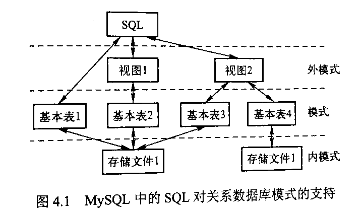

# 第四章 SQL 与关系数据库基本操作

## 第一节 SQL 概述

### 一、SQL 的发展

1974 年由 Boyce 和 Chamberlin 提出，在 IBM System R 上实现

1986 年 10 月由美国国家标准局颁布 SQL 标准，次年被 ISO 采纳，完整特性的 SQL-89，不断丰富的 SQL-92，SQL-99

目前没有一个数据库能完整实现 SQL 所有特性，各有差别

### 二、SQL 的特点

1. 是一种标准，不独属于任何单独数据库
2. 简单易学
3. 强有力
4. 虽不区分大小写，但大写关键字、小写名称有助于提高可读性

### 三、SQL 的组成

四大功能：数据查询（Query）、数据定义（Definition）、数据操纵（Manipulation）、数据控制（Control）

核心部分：

1. 数据定义语言 DDL
  - 用于：创建、删除、修改
  - 数据库主要对象：表、默认约束、规则、视图、触发器、存储过程
  - 主要定义语句：CREATE、ALTER、DROP

2. 数据操纵语言 DML
  - 主要操纵语句：SELECT、INSERT、UPDATE、DELETE

3. 数据控制语言 DCL
  - 主要控制语句：GRANT、REVOKE

4. 嵌入式和动态 SOL 规则：规范、方法
5. SQL 调用和会话规则：多连

## 第二节 MySQL 预备知识

最早由瑞典 MySQL AB 公司开发

### 一、MySQL 使用基础

主要的两种架构方式：

1. LAMP：Linux + Apache + MySQL + PHP/Perl/Python
2. WAMP: Windows

### 二、MySQL 中的 SQL

- 基本表是独立存在的表
- 一个关系对应一个基本表
- 一个或多个基本表对应一个存储文件
- 一个表可以有若干索引，索引也存放在存储文件中
- 存储文件的逻辑结构组成了 MySQL 的内模式
- 存储文件的物理结构对最終用户隐蔽
- 视图则是从一个或几个基本表导出的表，尽管它也是关系，但不独立存储在数据库中
- 数据库中只存储视图的定义，而不存储视图对应的数据
- 这些数据仍存储在导出视图的基本表中，因此视图是一个虚表，用户可以在视图上再定义视图



MySQL 在 SQL 标准的基础上增加了部分扩展的语言要素：

1. 常量
  - 字符串常量：单、双引号包裹，ASCII/Unicode
  - 数值常量：整数、浮点数
  - 十六进制字符串常量
  - 日期常量
  - 位字段：BIT 列
  - 布尔值：TRUE 数字值是 1，FALSE 数字值是 0
  - NULL

2. 变量：用户变量前缀 @，系统变量前缀 @@

3. 运算符
  - 算术运算符：+ - * / %
  - 位运算符：& | ^ ~ >> <<
  - 比较运算符：= > < >= <= <> != <=>
  - 逻辑运算符：NOT ! AND && OR || XOR

4. 表达式
  - 常量、变量、列名、复杂计算、运算符和函数的组合
  - 通常可以得一个值
  - 类型：字符型、数值型、日期

5. 内置函数：100+
  - 数学：ABS() SORT()
  - 聚合：COUNT()
  - 字符串：CHAR()
  - 日期时间：NOW() YEAR()
  - 加密：ENCODE() ENCRYPT()
  - 控制流程：IF() IFNULL()
  - 格式化：FORMAT()
  - 类型转换：CAST()
  - 系统：USER() VERSION()

## 第三节 数据定义

### 一、数据库模式定义

1. 创建数据库

```sql
CREATE {DATABASE | SCHEMA} [IF NOT EXISTS] db_name
[DEFAULT] CHARACTER SET [=] charset_name
| [DEFAULT] COLLATE [=] collation_name
```

2. 选择数据库

```sql
USE db_name
```

3. 修改数据库

```sql
ALTER {DATABASE | SCHEMA} [db_name]
DEFAULT CHARACTER SET gb2312
```

4. 删除数据库

```sql
DROP {DATABASE | SCHEMA} [IF EXISTS] db_name
```

5. 查看数据库

```sql
SHOW {DATABASES | SCHEMAS}
[LIKE 'pattern' | WHERE expr]
```

### 二、表定义

数据表被定义为字段的集合，数据在表中是按照行和列的格式来存储的，每一行代表条记录，每一列代表记录中一个字段的取值

1. 创建表

```sql
CREATE [TEMPORARY] TABLE table_name (
  id INT NOT NULL AUTO_INCREMENT,
  name CHAR(50) NOT NULL,
  sex CHAR(1) NOT NULL DEFAULT 0,
  PRIMARY KEY(id)
);
```

（1）临时表与持久表

临时表的使用与持久表一致，只对创建者可见，断开连接时自动删除，命名不会冲突

（2）数据类型

在 MySQL中，主要的数据类型包括：

- 数值类型（整型 int、浮点型 double、布尔型bool)
- 日期和时间类型（日期型 date、时间戳 timestamp、时间型 time)
- 字符串类型（定长字符类型 char、可变长字符类型 varchar）
- 空问数据类型等

（3）关键字 AUTO_INCREMENT

为整型设置为自增，每个表只能有一个，且必须被索引

（4）指定默认值 DEFAULT

自动分配：

- NULL
- 数字：0
- TIMESTAMP：0
- 其它日期：当前日期

（5）NULL 值

缺值，MySQL 中非 NULL 即 NOT NULL

（6） 主键 PRIMARY KEY

必须 NOT NULL，且唯一

2. 更新表

（1）添加列

```sql
ALTER TABLE table_name
ADD COLUMN col_2 char(10) NOT NULL DEFAULT 'col' AFTER col_1;

ADD PRIMARY KEY
ADD FOREIGN KEY
ADD INDEX
```

（2）修改列名称或数据类型

```sql
ALTER TABLE table_name
CHANGE COLUMN col_1 char(1) NULL DEFAULT 'c';
```

（3）修改列默认值

```sql
ALTER TABLE table_name
ALTER COLUMN col_1 char(1) SET DEFAULT 'col';
```

（4）修改列位置

```sql
ALTER TABLE table_name
MODIFY COLUMN col_1 char(20) FIRST;
```

（5）删除列

```sql
ALTER TABLE table_name
DROP COLUMN col_1;

DROP PRIMARY KEY
DROP FOREIGN KEY
DROP INDEX
```

（6）修改表名

```sql
ALTER TABLE table_name
RENAME TO db_name.table_name2;
```

3. 重命名表

```sql
RENAME table_name TO table_name2, table_name3 TO table_name4;
```

4. 删除表

```sql
DROP [TEMPORARY] TABLE [IF EXISTS]
tbl_name [, tbl_name] ••
[RESTRICT | CASCADE]
```

5. 查看表

（1）表名称

```sql
SHOW [FULL] TABLES [{FROM | IN} db_name]
[LIKE 'pattern' | WHERE expr]
```

（2）表结构

```sql
SHOW [FULL] COLUMNS [{FROM | IN} table_name] [{FROM | IN} db_name]
[LIKE 'pattern' | WHERE expr]

-- MySQL shortcut
{DESCRIBE | DESC} table_name [col_name | wild]
```

### 三、索引定义

DBMS 根据表中的一列或若干列按照一定顺序建立的列值与记录行之间的对应关系表

实质上是一张描述索引列的列值与原表中记录行之间一一对应关系的有序表

优点：加快访问

缺点：文件形式存储占用空间、提高查询速度时降低了更新速度

逻辑分类：

1. 普通索引 INDEX：没有任何限制
2. 唯一性索引 UNIQUE：索引中的值只能出现一次且唯一
3. 主键 PRIMARY KEY：指定主键且不能为空，每个表只能有一个主键

使用分类：

1. 单列索引
2. 组合索引

#### 1.索引的创建

1. CREATE INDEX

```sql
CREATE [UNIQUE] INDEX index_name
ON table_name (index_col_name, ...)
```

2. CREATE TABLE

```sql
CREATE TABLE seller (
  seller_id NOT NULL AUTO_INCREMENT,
  seller_name char(50) NOT NULL,
  product_type int(5) NULL,
  PRIMARY KEY(seller_id, product_type),
  INDEX index_seller(sales)
);
```

3. ALTER TABLE

```sql
ALTER TABLE seller
ADD INDEX index_seller_name(seller_name);
```

#### 2.索引的查看

```sql
SHOW {INDEX | INDEXS | KEYS}
{FROM | IN} table_name
[{FROM | IN} db_Name]
[WHERE expr]
```

#### 3.索引的删除

1. DROP INDEX

```sql
DROP INDEX index_name ON table_name;
```

2. ALTER TABLE

```sql
ALTER TABLE table_name
DROP PRIMARY KEY,
DROP INDEX index_name;
```

## 第四节 数据更新
