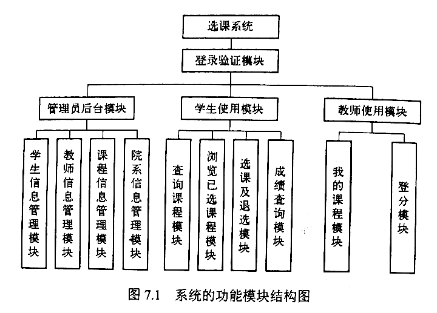

# 第七章 数据库应用设计与开发实例

## 第一节 需求描述与分析

### 一、功能性需求

用户类型：教务管理员、学生、教师

1. 管理员后台模块
  - 学生信息管理
  - 教师信息管理
  - 课程信息管理
  - 班级信息管理

2. 学生使用模块
  - 查询课程
  - 浏览所选课程
  - 查询成绩

3. 教师使用模块
  - 我的课程
  - 登分

### 二、非功能性需求

B/S 结构，软、硬件设施

选课系统质量需求表

```
质量需求名称   详细要求
可靠性        非选课期间最多出现一次外界因素造成的系统故障；选课期间，除特殊情况，保证正常使用
正确性        需要保证数据库中的数据正确和系统各个功能模块的业务逻辑正确
兼容性        多浏览器
健壮性        经常进行健壮性测试，不断加强对非格式化操作的应变能力
```

## 第二节 系统设计

### 一、功能模块设计



### 二、数据库设计

1. 根据功能模块设计确定数据库范围
2. 使用 E-R 图座位数据库概念描述工具建立局部信息结构
3. 将局部信息结构合并为优化的全局结构
4. 最终将全局 E-R 图转换为关系模型

#### 1.确定实体

#### 2.局部信息结构

#### 3.全局信息结构

#### 4.逻辑结构与规范化设计


