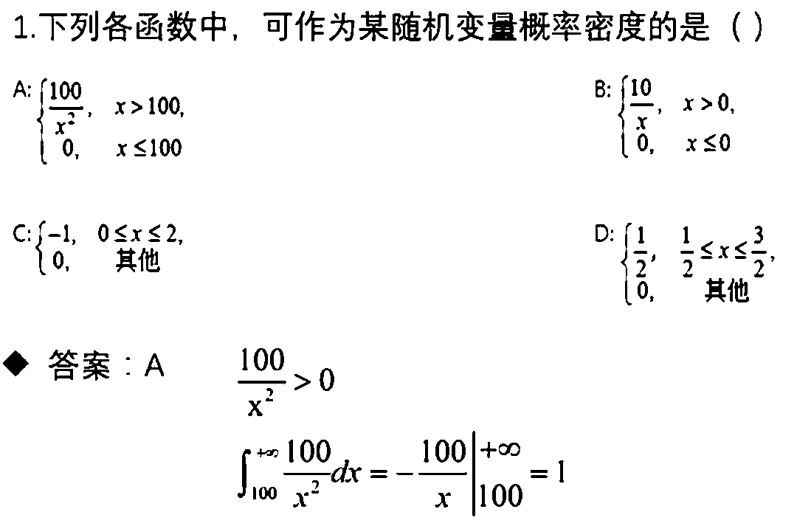
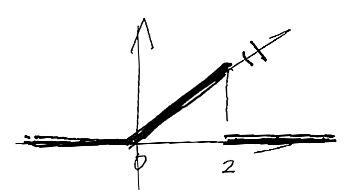
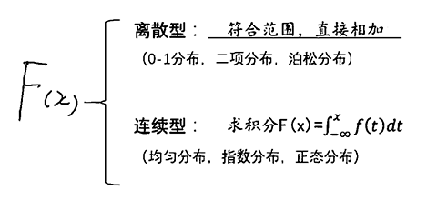
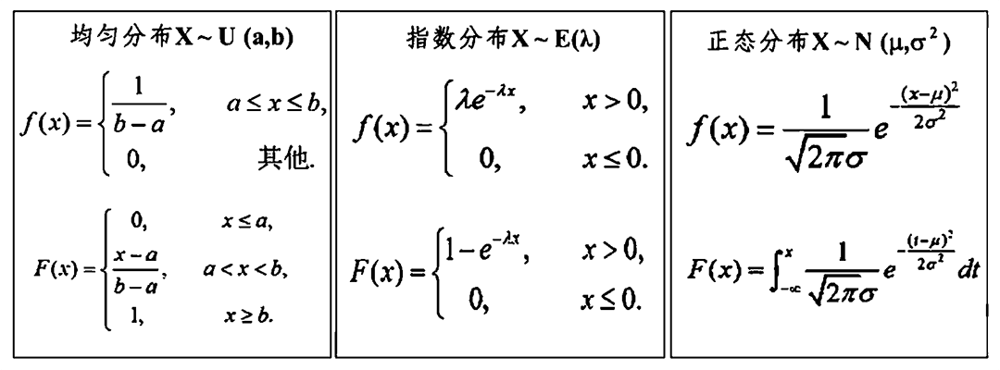
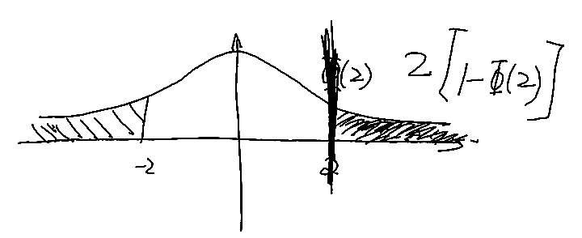
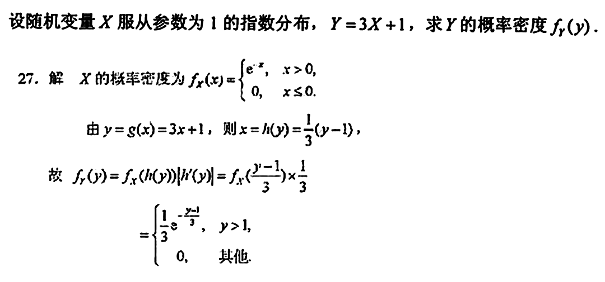

# 第二章 随机变量及其概率分布

## 第一节 离散型 r.v.

### 1.r.v. 的概念

随机变量 r.v.：X 由实验结果的不同而取不同的值

### 2.离散型 r.v. 及其分布规律

离散型 r.v. ： r.v. X 只能取有限多个或可列无限多个值


分布规律：分布律、分布列、概率分布

| X | 男 | 女 |
| :--: | :--: | :--: |
| P | 1/2 | 1/2 |

分布律性质：必须发生，且和为 1

```
1. Pₖ ≥ 0, k = 1,2,...
2. ΣPₖ = 1
```

#### 例题 1：1~5 号球同时取出 3 个，记 X 为最大编号，求 X 的分布律

X 的取值为 `3,4,5`

根据古典概型的概率计算得

```
P{X = 3} = C₃³ / C₅³ = 1/10
P{X = 4} = C₃² / C₅³ = 3/10
P{X = 5} = C₄² / C₅³ = 6/10
```

则 X 的分布律为

| X | 3 | 4 | 5 |
| :--: | :--: | :--: | :--: |
| P | 0.1 | 0.3 | 0.6 |

#### 例题 2：10 个零件，其中 3 个不合格，现取任一使用，取到不合格则丢弃继续取，求取到合格零件之前取到不合格零件个数 X 的分布律

X 的取值为 `0,1,2,3`

```
P{X = 0} = 7/10
P{X = 1} = 3/10 × 7/9
P{X = 2} = 3/10 × 2/9 × 7/8
P{X = 3} = 3/10 × 2/9 × 1/8 × 7/7
```

则 X 的分布律为

| X | 0 | 1 | 2 | 3 |
| :--: | :--: | :--: | :--: | :--: |
| P | 7/10 | 7/30 | 7/120 | 1/120 |

### 3. 0-1 分布与二项分布

#### 0-1 分布

1. r.v. X 只有 0, 1 两个取值
2. `P{X = 1} = p`，`P{X = 0} = q`，`0 < p < 1, q = 1 - p`

#### 例题：射击命中率 0.7，命中 0，不命中 1

| X | 0 | 1 |
| :--: |  :--: |  :--: |
| P | 0.7 | 0.3 |

#### 二项分布

1. r.v. X 取值为 `0,1,2,...,n`
2. X 的分布律为


其中 `0 < p < 1, q = 1 - p`

称 X 服从参数为 `n`，`p` 的二项分布，简记为 `X~B(n,p)`

> X 服从于 打靶（10 次，概率 0.8）

#### 例题 1：某药有效率 0.95，现 10 人服用，求至少 8 人治愈的概率

```
X~B(10,0.95)

P{X = 8}=C₁₀⁸ × 0.95⁸ × 0.05²
P{X = 9}=C₁₀⁹ × 0.95⁹ × 0.05¹
P{X = 10}=C₁₀¹⁰ × 0.95¹⁰ × 0.05⁰

P = P{X = 8} + P{X = 9} + P{X = 10}
```

#### 例题 2：X~B(2,p), Y~B(3,p), P{X ≥ 1} = 5/9，求 P{Y ≥ 1}

```
X 可取 0,1,2

由 P{X ≥ 1} = P{X = 1} + P{X = 2} = 5/9
得 C₂¹ × p¹ × (1-p)¹ + C₂² × p² × (1-p)⁰ = 5/9

2p(1-p) + p² = 5/9
2p - p² = 5/9
18p - 9p² = 5
9p² - 18p + 5 = 0
```

```
// 或
P{X = 0} = 4/9
C₂⁰ × p⁰ × (1-p)² = 4/9
```

```
p = 1/3 或 5/3，取 1/3
得 Y~B(3,1/3)

P{Y ≥ 1} = 1 - P{Y = 0} = 1 - C₃⁰ × (1/3)⁰ × (1-1/3)³ = 19/27
```

### 4.泊松分布

二项分布计算繁琐时比较困难，需要近似计算方法

> 设 `λ > 0` 为常数，`n` 为任意正整数
>
> 
>
> 


X 服从参数为 `λ` 的泊松分布，简记为 `X~P(λ)`

`k` 为发生次数，`λ` 为 `> 0` 数值，`e` 为自然数

#### 例题：X 服从 λ 的泊松分布，P{X = 1} = 2/3 P{X = 3}，求 λ

```
λ¹ / 1! × e^{-λ} = 2/3 × (λ³ / 3!) × e^{-λ}
λ = 2/3 × (λ³ / 6)
λ = 1/9 × λ³
9λ = λ³
λ² = 9
λ = 3
```

## 第二节 r.v. 的分布函数

### 1.分布函数的概念（离散）

设 X 为 r.v.，称函数


为 X 的分布函数，其结果为概率

#### 例题 1：r.v. X 的分布律为

| X | -1 | 0 | 1 | 2 |
| :--: | :--: | :--: | :--: | :--: |
| P | 0.1 | 0.2 | 0.3 | 0.4 |

`F(x)` 为 X 的分布函数，求 `F(0.5)`

```
F(0.5)
= P{X ≤ 0.5}
= P{x = -1} + P{x = 0}
= 0.1 + 0.2
= 0.3
```

#### 例题 2：设离散型 r.v. X 的分布律为

| X | -1 | 0 | 1 | 2 |
| :--: | :--: | :--: | :--: | :--: |
| P | 0.2 | 0.1 | 0.3 | 0.4 |

求 X 的分布函数

```
当 x < -1, P{X < x} = 0
当 -1 ≤ x < 0, P{X < x} = 0.2
当 0 ≤ x < 1, P{X < x} = 0.2 + 0.1 = 0.3
当 1 ≤ x < 2, P{X < x} = 0.2 + 0.1 + 0.3 = 0.6
当 2 ≤ x, P{X < x} = 0.2 + 0.1 + 0.3 + 0.4 = 1

则 F(x) = {
  0, x < -1,
  0.2, -1 ≤ x < 0,
  0.3, 0 ≤ x < 1,
  0.6, 1 ≤ x < 2,
  1, x ≥ 2.
```

### 2.分布函数的性质

1. `0 ≤ F(x) ≤ 1`
2. `F(x)` 是不减函数，任意 `x₁ < x₂`，有 `F(x₁) ≤ F(x₂)`
3. `F(-∞) = 0`，`F(+∞) = 1`
4. `F(x)` 是**右连续**(右侧能取到实心点，左侧不能)，即 

#### 公式

1. `P{X ≤ b} = F(b)`
2. `P{a < X ≤ b} = F(b) - F(a)`
3. `P{X > b} = 1 - F(b)`

#### 例题：r.v. X 的分布函数为

```
F(x) = {
  0, x < 0,
  x/3, 0 ≤ x < 1,
  x/2, 1 ≤ x < 2,
  1, x ≥ 2.
```

求

1. `P{1/2 < x ≤ 3/2}`

```
公式 2：
= F(3/2) - F(1/2) = 3/4 - 1/6 = 7/12
```

2. `P{x > 1/2}`

```
公式 3：
= 1 - F(1/2) = 1 - 1/6 = 5/6
```

3. `P{x > 3/2}`

```
公式 3：
= 1 - F(3/2) = 1 - 3/4 = 1/4
```

## 第三节 连续型 r.v. 及其概率密度

### 1.连续型 r.v. 及其概率密度

连续概率分布函数：


其中 `f(t)` 为**概率密度函数**

密度函数性质：

1. `f(x) ≥ 0`

2. 

3. 

4. 设 `x` 为 `f(x)` 连续点，则 `F'(x)` 存在，且 `F'(x) = f(x)`

**概率(F) = 对密度函数(f)进行积分 = 求原函数、求投影面积**

#### 例题 1：
>
> 
>
> B、D 概率不等于 1，C f(x) 小于 0

#### 例题 2：r.v. X 的概率密度为

```
f(x) = {
  λx, 0 ≤ x ≤ 2,
  0, 其它.
```

求 λ



```
投影三角面积：底 2，高 2λ

1 = 2 × 2λ / 2
λ = 1/2
```

#### 例题 3：某电子元器件寿命 X（小时）具有如下概率密度

```
f(x)={
  1000/x², x ≥ 1000,
  0, 其它.
```

1. 任取 1 个，寿命大于 1500 小时概率


2. 任取 4 个，4 个中恰有 2 个寿命大于 1500 小时的概率

其中一次的概率为 `2/3`，则有


3. 任取 4 个，4 个中至少 1 个寿命大于 1500 小时的概率

反面：一件也没有


### 2.均匀分布与指数分布




#### 均匀分布 X~U(a, b)

`X~U(a,b)`：`X` 服从区间 `[a,b]` 上的均匀分布

`1/(b-a)`： 区间长度的倒数

#### 指数分布 X~E(λ)

`λ > 0` 为常数，`X` 服从参数为 `λ` 的指数分布

#### 例题：电子原件寿命 X 年，服从参数为 3 的指数分布

1. 求寿命超过 2 年的概率

```
解：f(x)={
  3e⁻³ˣ, x > 0,
  0, 其它.
```


2. 已经使用 1.5 年，求还能使用 2 年的概率


### 3.正态分布 X~N(μ,σ^2)

`μ, σ²` 为常数，`-∞ < μ < +∞, σ > 0`，`X` 服从参数 `μ, σ²` 的正态分布

- `μ` 为平均数、位置
- `σ` 为方差

正态分布曲线性质：

1. 曲线（贴底倒 U 型）关于直线 `x = μ` 对称；`h > 0` 有：`P{μ - h < X ≤ μ} = P{μ < X ≤ μ + h}`

2. 当 `x = μ` 时取得最大值： 

标准正态分布：

- `μ = 0, σ = 1` 时呈标准正态分布
- `φ(x)` 在 `x = 0` 处取得最大值 `1/√(2π)`
- `Φ(-x) + Φ(x) = 1`
- `Φ(0) = 1/2`

一般正态分布函数 `F(x)` 与标准正态分布函数 `Φ(x)` 的关系：


关系推导：


#### 例题 1：r.v. X~N(0,1), X 的分布函数为 Φ(x)，求 P(|x| > 2) 的值

```
|x| > a => x > a + x < -a
|x| < a => -a < x < a
```

公式法：

```
P(|x| > 2)
= P{x > 2} + P{x < -2}
= 1 - P{x < 2} + P{x < -2}
// = 1 - Φ((2-0)/1) + Φ((-2-0)/1)
= 1 - Φ(2) + Φ(-2)
= 1 - Φ(2) + 1 - Φ(2)
= 2 - 2Φ(2)
```

面积法：



#### 例题 2：X~N(2, 4)，F(x) 为 X 的分布函数，Φ(x) 为标准正态分布，求 F(3)

```
μ = 2, σ = 2
F(3) = Φ((3-2)/2) = Φ(1)
```

## 第四节 r.v. 函数的概率分布

### 1.离散型 r.v. 函数的概率分布

#### 例题 1：r.v. X 的分布律为

| X | -1 | 0 | 1 | 2 |
| :--: | :--: | :--: | :--: | :--: |
| P | 0.2 | 0.1 | 0.3 | 0.4 |

1. 求 `Y = X³` 的分布律

```
当 x = -1 时，x³ = -1
当 x = 0 时，x³ = 0
当 x = 1 时，x³ = 1
当 x = 2 时，x³ = 8
```

| X | -1 | 0 | 1 | 8 |
| :--: | :--: | :--: | :--: | :--: |
| P | 0.2 | 0.1 | 0.3 | 0.4 |

2. 求 `Y = X²` 的分布律

```
当 x = -1 时，x² = 1
当 x = 0 时，x² = 0
当 x = 1 时，x² = 1
当 x = 2 时，x² = 4
```

| X | 0 | 1 | 4 |
| :--: | :--: | :--: | :--: |
| P | 0.1 | 0.5 | 0.4 |

#### 例题 2：X~B(3,0.4)，令 Y = (X(3-x)) / 2，求 P{Y = 1}

```
P{Y = 1}
= P{(x(3-x)/2) = 1}
= P{3x - x² = 2}
= P{x² - 3x + 2 = 0}
= P{x = 2} + P{x = 1}
= C₃¹0.4¹0.6² + C₃²0.4²0.6¹
= ...
```

### 2.连续型 r.v. 函数的概率分布

设 X 为连续型 r.v.，概率密度函数为 `fₓ(x)`，

设 `g(x)` 是一个严格单调可导函数，值域为 `[α,β]`，且 `g'(x) ≠ 0`

`x = h(y)` 为 `y = g(x)` 的反函数，则 `Y = g(X)` 的概率密度为

```
fᵧ(y)={
  fᵪ(h(y))|h'(Y)|, α < y < β,
  0, 其它.
```

特别地，当 `α = -∞, β = +∞` 时，`fᵧ(y) = fᵪ(h(y))|h'(Y)|`


#### 例题 1：


#### 例题 2：


