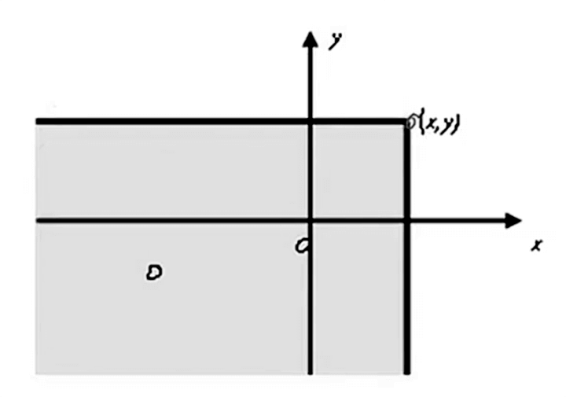
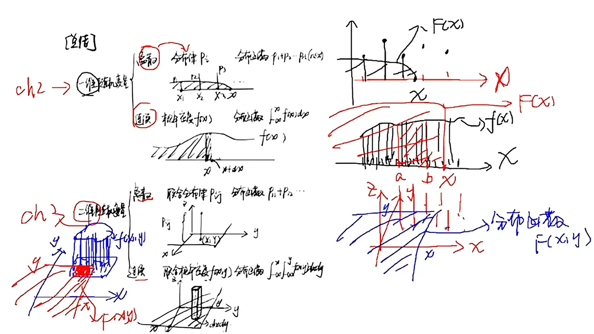

# 第三章 多维随机变量及其分布概率

## 第一节 多维 r.v. 的概念

### 1.二维 r.v. 及其分布函数

#### 1）二维 r.v.

设 `X = X(ω), Y = Y(ω)` 是定义在空间 `Ω = {ω}` 的两个 r.v.，则称 `(X,Y)` 为二维 r.v.

#### 2）分布函数

设 `(X,Y)` 为一个二维 r.v.

```
F(x,y) = P{X ≤ x, Y ≤ y}

(-∞ < x < +∞, -∞ < y < +∞)
```

称二元函数 `F(x,y)` 为 `(X,Y)` 的分布函数，或 `X` 与 `Y` 的联合分布函数（本质就是概率）

- 一维连续型 r.v. `X` 的可能取值为某个或某些区间，甚至整个数轴
- 二维 r.v. `(X,Y)` 的可能取值范围则为 `X0Y` 平面上的某个或某些区域，甚至为某个平面



> [例题 1~2](./03.第三章例题.md#例题-1)

#### 3）边缘分布函数

`(X,Y)` 的两个分量与各自的分布函数分别称为二维 r.v. `(X,Y)` 关于 `X` 与关于 `Y` 的边缘分布函数 `Fₓ(x)` 和 `Fᵧ(y)`

边缘分布函数可由联合分布函数确定：

```
// X 边缘：Y 取所有
Fₓ(x) = P{X ≤ x} = P{X ≤ x, Y < +∞} = F(x, +∞)

// Y 边缘：X 取所有
Fᵧ(y) = P{Y ≤ y} = P{X < +∞, Y ≤ y} = F(+∞, y)
```

> [例题 3](./03.第三章例题.md#例题-3)

### 2.二维离散型 r.v. 的分布律和边缘分布律

#### 1）二维离散型 r.v.

`(X,Y)` 的取值为有限对或无穷可列对，称 `(X,Y)` 为二维离散型 r.v.

#### 2）分布律

`(X,Y)` 的分布律性质：

1. `0 ≤ Pᵢⱼ ≤ 1 (i,j = 1, 2, ...)`
2. `ΣᵢΣⱼPᵢⱼ = 1`

若数集 `{pᵢⱼ} (i,j = 1, 2, ...)` 具有以上两条性质，则它必可作为某二维离散型 r.v. 的分布律

> X,Y 二维表之和为 1

#### 3）边缘分布律

对于二维离散型 r.v. `(X,Y)`，其分量 `X` 与 `Y` 各自的分布律分别称为 `(X,Y)` 关于 `X` 与关于 `Y` 的边缘分布律，记为 `pᵢ,i=1,2,...` 和 `pⱼ,j=1,2,...`

> [例题 4](./03.第三章例题.md#例题-4)

### 3.二维连续型 r.v. 的概率密度和边缘概率密度

#### 1）二维连续型 r.v.

`(X,Y)` 的取值为无限多个，称 `(X,Y)` 为二维连续型 r.v.

#### 2）概率密度

概率密度函数 `f(x,y)` 的性质：

1. `f(x,y) ≥ 0`

2.  （双重积分 1 为体积）

若 `f(x,y)` 在 `(x,y)` 处连续，则有：


> [例题 5~6](./03.第三章例题.md#例题-5)

#### 3）边缘概率密度

对于二维连续型 r.v. `(X,Y)`，其分量 `X`（或`Y`）的概率密度称为 `(X,Y)` 关于`X`（或`Y`）的边缘概率密度（边缘密度），计为 `fₓ(x)`（或`fᵧ(y)`）

边缘密度 可由 概率密度 求出：


> [例题 7~8](./03.第三章例题.md#例题-7)

##### 二维均匀分布

设 `D` 为平面上有界区域，其面积为 `S > 0`，如果二维 r.v. `(X,Y)` 的概率密度为：

```
f(x,y) = {
  1/S, (x,y) ∈ D,
  0, 其它.
```

- S: 面积
- D: 形状

则称 `(X,Y)` 服从区域 `D` 上的均匀分布 `(X,Y)~U_D`

##### 二维正态分布


`ρ = 0` 则 `X` 和 `Y` 独立

## 第二节 r.v. 的独立性

### 1.两个 r.v. 的独立性

对任意实数 `x,y` 都有 `F(x,y) = Fₓ(x)·Fᵧ(y)`，则称 r.v. `X,Y` 独立

> 独立条件下：联合 = 边缘 × 边缘

```
P{X ≤ x, Y ≤ y} = P{X ≤ x}·P{Y ≤ y}
```

### 2.二维离散型 r.v. 的独立性

```
P{X = xᵢ,Y = yⱼ} = P{X = xᵢ}·P{Y = yⱼ}
```

> [例题 9~12](./03.第三章例题.md#例题-9)

### 3.二维连续型 r.v. 的独立性

```
X,Y 独立：F(x,y) = Fₓ(x)·Fᵧ(y)
X,Y 相互独立：f(x,y) = fₓ(x)·fᵧ(y)
```

## 第三节 两个 r.v. 的函数的分布

### 1.两个离散型 r.v. 的函数的分布

> [例题 13](./03.第三章例题.md#例题-13)

### 2.两个独立连续型 r.v. 之和的概率分布

> [例题 14](./03.第三章例题.md#例题-14)

## 总结



| 类型 | 取值范围 | 概率值 | 描述方法 | 分布函数 |
| -- | -- | -- | -- | -- |
| 一维离散 | X 轴点 | Y 轴点 | 分布律 `Pᵢ` | `P₁ + .. + Pᵢ` |
| 一维连续 | X 轴区间 | 定积分求面积 | 概率密度 `f(x)` | `∫f(x)dx` |
| 二维离散 | (X,Y)  | Z 轴点 | 联合分布律 | `P₁₁ + ... + Pᵢⱼ` |
| 二维连续 | 底部投影 D | 二重积分求体积 | 联合概率密度 `f(x,y)` | `∫∫f(x,y)dxdy` |
