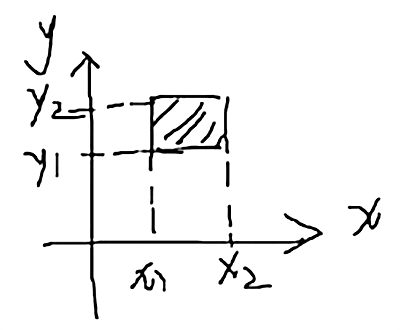

# 第三章例题

## 例题 1：二维 r.v. (X,Y) 的分布函数为 F(x,y)，则 F(+∞,+∞) = ?

全覆盖面，等于 1

## 例题 2：二维 r.v. (X,Y) 的分布函数为 F(x,y)，则 P{X ≤0, Y ≤ 0} 表示为？

F(0, 0)

## 例题 3：已知二维 r.v. (X,Y) 的分布函数 F(x,y)，求 P{x₁ < X ≤ x₂, y₁ < Y ≤ y₂}



```
F(x₂y₂) - F(x₁y₂) - F(x₂y₁) + F(x₁y₁)
```

## 例题 4：根据二维 r.v. 分布律

| X\Y | 0 | 1 | 2 |
| :--: | :--: | :--: | :--: |
| 1 | 0.1 | 0.2 | 0.25 |
| 2 | 0 | 0.15 | A |

1. `A` 值 = 1 - 其它之和 = 0.3
2. `P{X = Y}` = 0.2 + 0.3 = 0.5
3. `P{X + Y ≤ 2}` = 0.1 + 0.2 + 0 = 0.3
4. `P{X = 1}` = 0.1 + 0.2 + 0.25 = 0.55

5. 求 `X,Y` 的边缘分布

补全表格可得：

| X | 1 | 2 |
| :--: | :--: | :--: |
| P | 0.55 | 0.45 |

| Y | 0 | 1 | 2 |
| :--: | :--: | :--: | :--: |
| P | 0.1 | 0.35 | 0.55 |

## 例题 5：根据二维 r.v. (X,Y) 的概率密度，求 P{0 ≤ X ≤ 1, 0 ≤ Y ≤ 1}

```
f(x,y) = {
  1/4, -1 ≤ x ≤ 1, -1 ≤ y ≤ 1,
  0, 其它.
```

```
一个底面积为 2*2，高为 1/4 的正方体（体积 1）
现在缩小到原有 1/4
1 * 1/4 = 1/4
```

## 例题 6：设二维 r.v. (X,Y) 服从区域 D: 1- ≤ x ≤ 2, 0 ≤ y ≤ 2 上的均匀分布，则 (X,Y) 的概率密度函数 f(x,y)

1. 在 `D` 上的表达式

1/6

2. 密度函数表达式

```
f(x,y) = {
  1/6, -1 ≤ x ≤ 2, 0 ≤ y ≤ 2,
  0, 其它.
```

## 例题 7：二维 r.v. X,Y 相互独立，且服从参数为 1 的泊松分布，求 P{X = 1,Y = 2}

```
= P{X = 1} · P{Y = 2}
= (1¹e⁻¹/1)(1²e⁻¹/2)
= e⁻¹ × e⁻¹ / 2
= e⁻²/2
```

## 例题 8：X,Y 相互独立，根据分布律求 a,b

| X\Y | 1 | 2 |
| :--: | :--: | :--: |
| 1 | 1/9 | a |
| 2 | 1/6 | 1/3 |
| 3 | 1/18 | b |

```
补全表格边缘
```

| X\Y | 1 | 2 | |
| :--: | :--: | :--: | :--: |
| 1 | 1/9 | a | 1/9 + a |
| 2 | 1/6 | 1/3 | |
| 3 | 1/18 | b | 1/18 + b |
| | 1/3 | | |

```
因为独立，则有 P{X = 1, Y = 1} = P{X = 1}·P{Y = 1}
1/9 = (1/9 + a)(1/3)
a = 1/9

1/18 = (1/18 + b)(1/3)
// 或
b = 1 - 其它之和
```

## 例题 9：r.v. X,Y 独立同分布，X 的分布律如下，求 P{X = Y}

| X | 0 | 1 |
| :--: | :--: | :--: |
| P | 0.4 | 0.6 |

```
同分布：取值、概率相同
```

| Y | 0 | 1 |
| :--: | :--: | :--: |
| P | 0.4 | 0.6 |

```
P{X = Y}
= P{X = 0}·P{Y = 0} + P{X = 1}·P{Y = 1}
= 0.4² + 0.6²
= 0.52
```

## 例题 10：根据一下联合概率分布求 F(0,1)

| X\Y | 0 | 1 | 2 |
| :--: | :--: | :--: | :--: |
| -1 | 0.2 | 0.1 | 0.1 |
| 0 | 0 | 0.3 | 0 |
| 2 | 0.1 | 0 | 0.2 |

```
F(0,1)
= P{X ≤ 0, Y ≤ 1}
= P{X ≤ 0}·P{Y ≤ 1}
= 0.2 + 0.1 + 0 + 0.3
= 0.6
```
