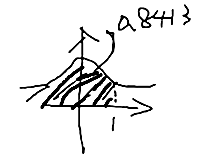

# 第五章例题

## 例题 1

设 r.v. `X` 的 `E(X),D(X)` 都存在，`E(X) = 10`，`E(X²) = 109`，求 `P{|X -10| ≥ 6} ≤ ?`

```
D(X) = E(X²) - [E(X)]² = 109 - 100 = 9

? = D(X)/ε² = 9/6² = 1/4
```

## 例题 2

投币 1000 次，`X` 表示正面朝上的次数，假设正反面概率相同，求切比雪夫不等式 `P{400 < X < 600} ≥ ？`

```
X~B(1000, 1/2)
E(X) = np = 500
D(X) = np(1 - p) = 250

P{400 < x < 600}
= P{400 - 500 < x -500 < 600 - 500}
= P{-100 < x - 500 < 100}
= P{|x - 500| < 100}

P{|x - 500| < 100} ≥ 1 - D(X)/ε²
? = 1 - 250 /100² = 39/40
```

## 例题 3

设 r.v. `X~B(100,0.2)`，应用中心极限定理计算 `P{16 ≤ x ≤ 24}`，其中 `Φ(1) = 0.8413`

```
X~B(100,0.2)

E(X) = np = 100 × 0.2 = 20
D(X) = np(1-p) = 20 × (1 - 0.2) = 16

X~N(μ,σ²) = X~N(E(X),D(X)) = X~N(20,16)

μ = 20, σ = 4

Z = (x - μ)/σ

P{16 ≤ x ≤ 24}
= P{(16 - 20)/√16 ≤ (x -20)/√16 ≤ (24 - 20)/√16}
= P{-1 ≤ (x -20)/√16 ≤ 1}
```

`Φ(1) = 0.8413`：



```
0~1 的面积 = 0.8413 - 0.5 = 0.3413

则 -1~1 的面积 = 0.3413 × 2 = 0.6826

P = Φ(1) - Φ(-1) = 2Φ(1) - 1 = 0.6826
```
