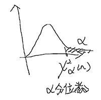
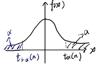
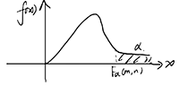

# 第六章 统计量及其抽样分布

## 一、统计量与抽样分布

统计量：

`E(X) = μ, D(X) = σ²`，`Xₙ` 是一个来自于总体的简单随机样本，由样本构成的、不含有未知数的函数称为统计量

## 二、常见统计量：

### 1.样本均值


### 2.样本方差


```
E(S²) = σ²
```

### 3.样本标准差 S

```
S = √S²
```

## 三、三大分布

### 1. χ² 分布

`n` 个 r.v. `Xₙ` 独立同分布于标准正态分布 `N(0,1)`，则 `χ² = X₁² + .. + Xₙ²` 的分布称为自由度为 `n` 的 `χ²` 分布，记为 `χ²~χ²(n)`

概率为 `α` 对应的分位点：`χₐ²(n)`：



### 2. t 分布

`X₁,X₂` 相互独立，且 `X₁~N(0,1), X₂~χ²(n)`，`t` 分布记为 `t~t(n)`




### 3. F 分布

`X₁,X₂` 相互独立，且 `X₁~χ²(m),X₂~χ²(n)`，记为 `F~F(m,n)`




## 四、一个正态总体下的抽样分布


样本均值 和 样本方差独立：


