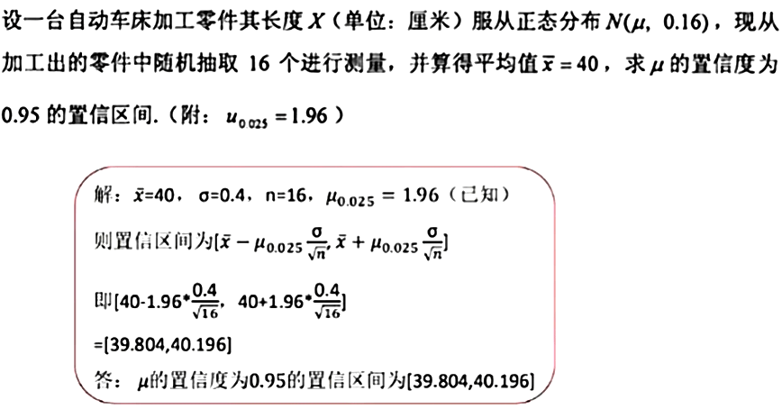

# 第七章例题

## 例题 1

设 `X₁₋ₙ` 是来自服从区间 `(0,θ)` 上的均匀分布 `U(0,θ)` 的样本，`θ > 0` 为未知参数。求 `θ` 的矩估计 `\hat θ`

```
E(X) = (a + b)/2 = (0 + θ)/2 = θ/2
\bar X = (X₁ + ... + Xₙ)/n

令 EX = \bar X

θ/2 = (X₁ + ... + Xₙ)/n
θ = 2(X₁ + ... + Xₙ)/n

\hat θ = 2(x₁ + ... + xₙ)/n
```

## 例题 2

设总体 `X` 的概率密度如下，其中 `θ` 为未知参数，`X₁₋ₙ` 为来自 `X` 的样本，求 `\hat θ`

```
f(x,θ) = {
  1/θ, 0 ≤ x ≤ θ,
  0, 其它.
```


```
θ = 2E(X) = 2\bar X

\hat θ = 2\bar x
```

## 例题 3


