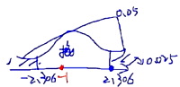

# 第八章例题

## 例题 1

工厂罐头，规格净重 250g，根据以往检验，标准差为 3g。现随机抽取 100 罐检验，平均净重 251g。问该批罐头是否合乎规格净重？设 `α = 0.1`，`Z₀.₀₅=1.96`

```
μ = 250
σ = 3, σ² = 9
\bar x = 251
```

1. 建立假设

- 原假设 H₀：μ = 250
- 备择假设 H₁：μ ≠ 250

2. 确定显著性水平 α 和拒绝域


3. 确定检验统计量

样本容量 n > 30，由中心极限定理


代入 `\bar X, n` 得 `Z ≈ 3.3`，大于 1.96，小概率发生，故拒绝原假设

所以有 `1 - α = 90%` 可信度下这批罐头不合格

## 例题 2

每袋水泥重量服从正态分布，包装机正常工作时，每袋水泥平均重量 50kg。某日随机抽取 9 袋，测得样本均值 `\bar x` = 49.9kg，样本标准差 `S` = 0.3kg。问当日包装机工作是否正常？(显著性水平 `α = 0.05`，`t₀.₀₂₅(8)=2.306`)

1. 设 H₀：μ = 50kg, H₁：μ ≠ 50kg

已知 n = 9, \bar x = 49.9

2. H₀ 成立时，有 `μ = 50`




3. `|t| < (t₀.₀₂₅(8)=2.306)`，故接受 `H₀`

4. 当日水泥包装机工作正常
